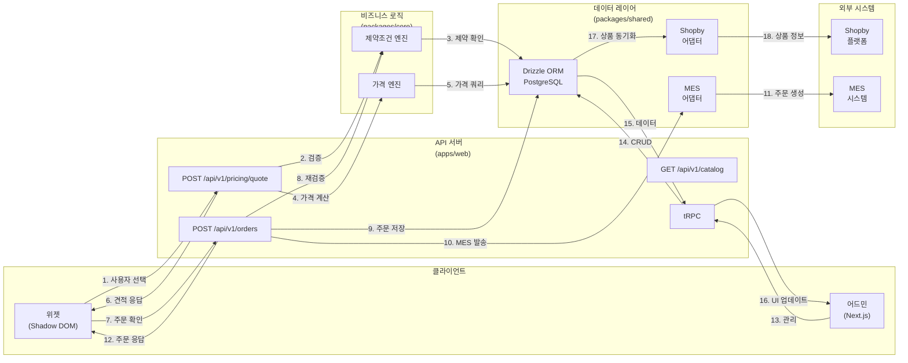

# Widget Creator - Data Flow and System Processes

**Last Updated:** 2026-02-27

## 데이터 흐름 다이어그램



---

## 핵심 데이터 흐름 5가지

### 1️⃣ 통합 견적 흐름 (Unified Quote Pipeline)

**시간**: 사용자 옵션 선택 → 300ms 이내 응답

**목표**: 제약조건 검증 + 실시간 가격 계산

```
┌─────────────────────────────────────────────────────┐
│ 클라이언트 (packages/widget)                         │
│                                                      │
│ 1. 사용자 옵션 선택                                  │
│    ├─ json-rules-engine로 로컬 제약 평가 (즉시)   │
│    └─ 불가능한 옵션 비활성화 (UX 개선)           │
│                                                      │
│ 2. 선택 완료 → POST /api/v1/pricing/quote         │
└──────────────────┬──────────────────────────────────┘
                   │ { productId, selections, quantity }
                   ▼
┌─────────────────────────────────────────────────────┐
│ 서버 (apps/web)                                    │
│                                                      │
│ 3. 미들웨어 검증                                    │
│    ├─ Rate limit 확인                              │
│    ├─ 인증 (공개 엔드포인트)                       │
│    └─ 입력값 유효성 검사                           │
│                                                      │
│ 4. 제약 평가 (packages/core/constraints)           │
│    ├─ Constraint 객체들 로드                       │
│    ├─ 각 제약조건 평가 (상호 의존성 확인)        │
│    ├─ 위반 항목 수집                               │
│    └─ 유효한 옵션 제안 반환                        │
│                                                      │
│ 5. 가격 계산 (packages/core/pricing)               │
│    ├─ 7가지 모델 중 선택                          │
│    ├─ 각 비용 요소 계산                            │
│    │   ├─ 기본 가격                                │
│    │   ├─ 옵션 추가료                              │
│    │   ├─ 수량 할인/인상                           │
│    │   └─ 특수료금                                 │
│    └─ 최종 가격 = 단가 × 수량                     │
│                                                      │
│ 6. Redis 캐싱 (동일 선택의 재요청 < 1ms)         │
│                                                      │
│ 7. 응답 반환                                        │
│    {                                                │
│      quoteId, expiresAt (24h),                     │
│      pricing: { baseCost, unitPrice, totalPrice }, │
│      applicableConstraints,                         │
│      validSelections                                │
│    }                                                │
└──────────────────┬──────────────────────────────────┘
                   │
                   ▼
┌─────────────────────────────────────────────────────┐
│ 클라이언트                                          │
│                                                      │
│ 8. 견적 디스플레이 업데이트                         │
│    ├─ 총 가격 표시                                 │
│    ├─ 불가능한 옵션 비활성화 제안                 │
│    └─ "주문하기" 버튼 활성화                       │
└─────────────────────────────────────────────────────┘

시간 분석:
├─ 클라이언트 평가 (json-rules): 10-50ms (즉시)
├─ 네트워크 왕복: 50-150ms
├─ 서버 처리: 50-100ms
│  ├─ 제약 평가: 20-40ms
│  ├─ 가격 계산: 20-50ms
│  └─ 캐시 저장: 10ms
└─ 총: 100-300ms ✓
```

**데이터 스키마**:

```typescript
// 요청
interface QuoteRequest {
  productId: string;
  widgetId: string;
  selections: {
    [optionId: string]: string | string[]; // 옵션ID → 선택 값
  };
  quantity: number;
}

// 응답
interface QuoteResponse {
  quoteId: string;
  expiresAt: Date; // 24시간 후
  pricing: {
    baseCost: number;        // 기본 가격
    unitPrice: number;       // 단가
    totalPrice: number;      // 총액 = 단가 × 수량
    breakdown: {             // 비용 분해
      [component: string]: number;
    };
  };
  applicableConstraints: Constraint[];
  validSelections: {
    [optionId: string]: string[]; // 이 옵션에서 선택 가능한 값들
  };
}
```

---

### 2️⃣ 주문 생성 흐름 (Order Creation Pipeline)

**시간**: 사용자 "주문" 버튼 클릭 → 2-5초

**목표**: 주문 저장 + MES 발송 + 가격 스냅샷

```
┌──────────────────────────────────────────────────────┐
│ 클라이언트                                           │
│                                                       │
│ 1. "주문하기" 버튼 클릭                              │
│    ├─ 마지막 견적 검증                              │
│    └─ POST /api/v1/orders                          │
└────────────────────┬─────────────────────────────────┘
                     │ { quoteId, selections, customerInfo }
                     ▼
┌──────────────────────────────────────────────────────┐
│ 서버 (apps/web)                                     │
│                                                       │
│ 2. 주문 유효성 검증                                  │
│    ├─ quoteId 존재 여부 확인                        │
│    ├─ 견적 만료 여부 확인 (> 24h ?)                │
│    ├─ 동일 선택지 검증 (변조 방지)                 │
│    └─ 재고 확인                                     │
│                                                       │
│ 3. 주문 엔티티 생성                                  │
│    ├─ huni_orders 테이블에 행 삽입                  │
│    │  ├─ orderId (UUID)                             │
│    │  ├─ orderCode (MES 추적용)                     │
│    │  ├─ status = 'pending'                         │
│    │  └─ createdAt = now()                          │
│    │                                                 │
│    ├─ huni_order_items 테이블 (주문 항목)          │
│    │  ├─ productId                                  │
│    │  ├─ quantity                                   │
│    │  └─ unitPrice (스냅샷)                         │
│    │                                                 │
│    └─ 가격 스냅샷 저장 (불변)                      │
│       ├─ appliedConstraints[]                       │
│       ├─ priceBreakdown {}                          │
│       └─ finalPrice                                 │
│                                                       │
│ 4. MES 발송 트리거                                   │
│    ├─ packages/shared/integration/mes/adapter.ts  │
│    ├─ huni_orders → MES 형식 변환 (mapper)        │
│    └─ MES API 호출                                 │
│       POST https://mes.api/orders                 │
│       {                                             │
│         orderCode, productCode, qty,               │
│         specs: {...}                               │
│       }                                             │
│                                                       │
│ 5. Shopby 동기화 (웹훅)                             │
│    ├─ Shopby에 주문 상태 전달                       │
│    └─ Shopby 주문과 연결                            │
│                                                       │
│ 6. 응답 반환                                        │
│    {                                                │
│      orderId, orderCode,                           │
│      status: 'dispatched',                         │
│      priceSnapshot,                                │
│      estimatedDelivery                             │
│    }                                                │
└────────────────────┬─────────────────────────────────┘
                     │
                     ▼
┌──────────────────────────────────────────────────────┐
│ 클라이언트                                           │
│                                                       │
│ 7. 주문 확인 페이지                                  │
│    ├─ orderCode 표시                                │
│    ├─ 예상 배송일 표시                              │
│    └─ 추적 링크 제공                                │
└──────────────────────────────────────────────────────┘

시간 분석:
├─ DB 저장: 50-100ms
├─ MES 발송: 500-1000ms
├─ Shopby 동기화: 200-500ms
└─ 총: 750ms-1.6s (평균 1s)
```

**데이터 저장**:

```typescript
// huni_orders 테이블
{
  id: number;           // 자동 증가
  orderId: string;      // UUID (외부용)
  orderCode: string;    // MES 추적용 (예: "ORD-2025-001234")
  productId: string;    // 상품 ID
  status: 'pending' | 'confirmed' | 'dispatched' | 'completed' | 'cancelled';
  quantity: number;
  selections: JSON;     // 선택지 스냅샷
  priceSnapshot: {      // 가격 스냅샷 (불변)
    unitPrice: number;
    totalPrice: number;
    appliedConstraints: Constraint[];
    breakdown: Record<string, number>;
  };
  customerInfo: {       // 고객 정보
    name: string;
    email: string;
    phone: string;
  };
  shippingAddress?: JSON;
  mesOrderId?: string;  // MES 연결
  shopbyOrderId?: string; // Shopby 연결
  designUrl?: string;
  createdAt: Date;
  updatedAt: Date;
}
```

---

### 3️⃣ 위젯 초기화 흐름 (Widget Init Pipeline)

**시간**: HTML 로드 → 위젯 렌더링 2-3초

**목표**: 위젯 로드, 기본 견적 표시, 사용자 상호작용 대기

```
┌────────────────────────────────────────────────────────┐
│ Shopby Aurora Skin                                    │
│                                                        │
│ 1. HTML 로드                                          │
│    <script src="...embed.iife.js"></script>          │
│    <div id="huni-widget"></div>                      │
│                                                        │
│ 2. embed.iife.js 다운로드 (CDN)                      │
│    ├─ packages/widget/dist/embed.iife.js            │
│    └─ 크기: ~50KB (gzip)                             │
│                                                        │
│ 3. window.WidgetCreator 전역 객체 생성              │
│    ├─ init() 함수 공개                              │
│    └─ 내부 상태 초기화                               │
│                                                        │
│ 4. JavaScript 초기화 호출                            │
│    window.WidgetCreator.init({                       │
│      widgetId: 'widget-123',                         │
│      containerId: 'huni-widget',                     │
│      productId: 'prod-456'                           │
│    })                                                │
└────────────────────┬─────────────────────────────────┘
                     │
                     ▼
┌────────────────────────────────────────────────────────┐
│ Widget (packages/widget)                              │
│                                                        │
│ 5. 위젯 초기화 (src/index.tsx)                       │
│    ├─ Shadow DOM 생성 (격리)                        │
│    ├─ 상태 초기화 (Preact signals)                  │
│    └─ 이벤트 리스너 등록                             │
│                                                        │
│ 6. 위젯 설정 로드                                    │
│    ├─ GET /api/widget/config/widget-123            │
│    └─ 테마, 옵션, 통화 정보 로드                    │
│                                                        │
│ 7. 기본 견적 요청                                    │
│    ├─ POST /api/v1/pricing/quote                   │
│    ├─ { productId, selections: {}, quantity: 1 }  │
│    └─ 기본 가격 표시 (옵션 선택 전)                │
│                                                        │
│ 8. 위젯 렌더링                                       │
│    ├─ src/screens/ScreenRenderer.tsx               │
│    ├─ 첫 번째 화면: 옵션 선택                      │
│    │  ├─ ColorChipGroup (색상)                     │
│    │  ├─ SizeSelector (크기)                       │
│    │  ├─ QuantitySlider (수량)                     │
│    │  └─ PricesSummary (가격 요약)                 │
│    │                                                 │
│    ├─ 다음 화면: 추가 옵션 (마무리)                │
│    │  ├─ FinishSection                             │
│    │  ├─ PrintOption                               │
│    │  ├─ StickerOption                             │
│    │  └─ UploadActions (디자인 업로드)             │
│    │                                                 │
│    └─ 마지막 화면: 확인                             │
│       ├─ 최종 가격                                 │
│       ├─ "주문하기" 버튼 활성화                    │
│       └─ 스크린 네비게이션 (이전/다음)            │
│                                                        │
│ 9. 사용자 상호작용 대기                              │
│    └─ 이벤트 리스너 활성 상태                       │
└────────────────────────────────────────────────────────┘

시간 분석:
├─ embed.js 다운로드: 500-1000ms
├─ 위젯 초기화: 100-200ms
├─ 설정 로드 (GET /config): 50-100ms
├─ 기본 견적 (POST /quote): 100-300ms
└─ 렌더링: 50-100ms
→ 총: 800ms-1.7s (대부분 네트워크)
```

---

### 4️⃣ 어드민 데이터 흐름 (Admin Dashboard)

**시간**: 페이지 로드 → 데이터 표시 1-2초

**목표**: 상품/가격/제약조건 관리, CRUD 작업

```
┌──────────────────────────────────────────────────────┐
│ 어드민 (apps/admin)                                 │
│                                                       │
│ 1. 페이지 로드 (예: /products)                      │
│    ├─ NextAuth 인증 확인                            │
│    ├─ 로그인 상태 검증                              │
│    └─ 권한 확인 (Admin only)                        │
│                                                       │
│ 2. tRPC 쿼리 호출                                   │
│    await trpc.product.list.useQuery({               │
│      limit: 20,                                      │
│      offset: 0                                       │
│    })                                                │
└────────────────────┬─────────────────────────────────┘
                     │
                     ▼
┌──────────────────────────────────────────────────────┐
│ 서버 (apps/web)                                     │
│                                                       │
│ 3. tRPC 라우터 (productRouter.ts)                  │
│    ├─ 인증 미들웨어 검증                            │
│    └─ list() 프로시저 실행                          │
│                                                       │
│ 4. DB 쿼리                                          │
│    const products = await db                         │
│      .select()                                       │
│      .from(huniProducts)                            │
│      .limit(20)                                     │
│      .offset(0)                                     │
│      .orderBy(desc(huniProducts.createdAt))        │
│                                                       │
│ 5. 타입 자동 변환 (tRPC)                           │
│    ├─ TypeScript 타입 동기화                        │
│    └─ Zod 검증 자동 수행                            │
└────────────────────┬─────────────────────────────────┘
                     │
                     ▼
┌──────────────────────────────────────────────────────┐
│ 어드민 클라이언트                                     │
│                                                       │
│ 6. 데이터 수신 및 렌더링                            │
│    ├─ React 상태 업데이트                           │
│    ├─ Shadcn/ui 테이블 컴포넌트 렌더링            │
│    └─ 각 행에 CRUD 버튼 표시                       │
│       ├─ 수정 (Edit)                                │
│       └─ 삭제 (Delete)                              │
│                                                       │
│ 7. 사용자 작업 대기                                 │
│    ├─ "새로운 상품 추가" → POST /trpc/product.create│
│    ├─ "수정" 클릭 → 폼 열기                         │
│    │  ├─ 현재 데이터 로드                           │
│    │  └─ PATCH /trpc/product.update                │
│    └─ "삭제" → DELETE /trpc/product.delete         │
└──────────────────────────────────────────────────────┘

CRUD 작업 예: 종이 종류 추가
1. "새 종이 추가" 클릭
2. PaperForm 열기 (폼 컴포넌트)
   ├─ 명칭 입력
   ├─ 무게 선택
   ├─ 색상 선택
   └─ 특성 선택
3. "저장" 클릭
4. POST /trpc/paper.create
5. DB에 저장 (huni_papers 테이블)
6. 테이블 자동 새로고침
7. 성공 토스트 메시지
```

---

### 5️⃣ 데이터 동기화 흐름 (Synchronization Pipeline)

**시간**: 비정기적 배치 작업 또는 webhook 트리거

**목표**: 외부 시스템과 DB 동기화

```
┌─────────────────────────────────────────────────────┐
│ Shopby 통합                                        │
│                                                     │
│ 1. 트리거                                          │
│    ├─ 스케줄: 매일 자정                           │
│    ├─ 웹훅: 상품 변경 시                          │
│    └─ 어드민: "동기화" 버튼                       │
│                                                     │
│ 2. 카테고리 동기화                                 │
│    ├─ Shopby API: /categories 호출                │
│    ├─ 응답: [{ id, name, ... }]                  │
│    └─ huni_categories에 업데이트                 │
│                                                     │
│ 3. 상품 동기화                                     │
│    ├─ Shopby에서 상품 목록 로드                   │
│    ├─ huni_products와 비교                        │
│    ├─ 신규/삭제/수정 항목 식별                   │
│    └─ DB 업데이트                                 │
│                                                     │
│ 4. 가격 검증                                       │
│    ├─ Shopby 가격 vs huni 가격 비교               │
│    ├─ ±10% 이내: OK                               │
│    └─ 범위 외: 경고 로그 (수동 검토)             │
└─────────────────────────────────────────────────────┘

┌─────────────────────────────────────────────────────┐
│ MES 통합                                           │
│                                                     │
│ 1. 주문 발송 (Order → MES)                        │
│    ├─ 트리거: 주문 생성                           │
│    ├─ 변환: huni_orders → MES 포맷               │
│    └─ API: POST /orders (MES)                    │
│                                                     │
│ 2. 상태 웹훅 (MES → huni)                         │
│    ├─ MES에서 상태 변경 시                        │
│    ├─ Webhook: PUT /api/v1/integration/mes/...  │
│    ├─ Status: pending → processing → completed   │
│    └─ huni_order_timeline에 기록                 │
│                                                     │
│ 3. 아이템 목록 조회                                 │
│    ├─ 트리거: 어드민에서 "MES 동기화" 클릭      │
│    ├─ GET /api/v1/integration/mes/items         │
│    ├─ 응답: 가능한 제품 목록                      │
│    └─ huni_mes_items에 캐싱                      │
└─────────────────────────────────────────────────────┘

┌─────────────────────────────────────────────────────┐
│ Edicus 통합                                        │
│                                                     │
│ 1. 디자인 렌더링                                   │
│    ├─ 트리거: 주문에 디자인 파일 있음            │
│    ├─ 호출: Edicus API (동기)                    │
│    ├─ 응답: 썸네일 PNG                            │
│    └─ 저장: S3 → orders 테이블 참조             │
└─────────────────────────────────────────────────────┘
```

---

## 데이터베이스 구조 (Drizzle ORM)

### 핵심 테이블 관계

```
huni_products (상품)
    │
    ├─→ huni_categories (카테고리)
    │   └─ product_categories (다대다)
    │
    ├─→ huni_options (옵션 정의: 색상, 크기 등)
    │   └─→ huni_option_choices (선택지: 빨강, 파랑)
    │
    ├─→ huni_materials (재질: 종이, 직물)
    │   └─→ huni_papers (개별 종이 규격)
    │
    ├─→ huni_constraints (제약조건)
    │   └─ 상호 의존성 정의
    │
    └─→ huni_pricing_models (가격 모델)
        ├─ huni_price_tiers (수량대별)
        ├─ huni_fixed_prices (고정 가격)
        ├─ huni_price_tables (가격 매트릭스)
        └─ huni_processes (인쇄, 마무리 비용)

huni_orders (주문)
    ├─→ huni_order_items (주문 항목)
    ├─→ huni_order_constraints (적용된 제약)
    └─→ huni_order_timeline (상태 변화)

huni_widgets (위젯 설정)
    └─→ huni_widget_options (위젯별 활성 옵션)

huni_integration_* (통합 매핑)
    ├─ huni_integration_mappings (상품 ↔ 외부)
    ├─ huni_integration_logs (연동 로그)
    └─ huni_integration_config (설정)
```

---

## 캐싱 전략

### Redis 캐시 (packages/shared)

```typescript
// 견적 캐시 (300ms SLA 충족)
cache_key = `quote:${productId}:${JSON.stringify(selections)}`;
ttl = 1 hour;

// 위젯 설정 캐시
cache_key = `widget:config:${widgetId}`;
ttl = 24 hours;

// 상품 목록 캐시
cache_key = `products:list:${categoryId}`;
ttl = 1 hour;

// 제약조건 캐시
cache_key = `constraints:${productId}`;
ttl = 1 hour;
```

### 캐시 무효화

```typescript
// 어드민이 상품 수정할 때
await invalidateCache([
  `products:list:*`,
  `constraints:*`,
  `quote:*`
]);
```

---

## 오류 처리 및 재시도

### API 오류 흐름

```
요청 실패
    ↓
오류 타입 판정
    ├─ 네트워크 오류 → 지수 백오프 재시도 (3회)
    ├─ 4xx 클라이언트 오류 → 즉시 실패
    ├─ 5xx 서버 오류 → 지수 백오프 재시도
    └─ 타임아웃 → 재시도 (기본 5초)
    ↓
모든 재시도 실패
    ↓
사용자에게 오류 메시지 표시
```

### Circuit Breaker (외부 API)

```typescript
// Shopby API 클라이언트
├─ 실패 임계값: 5회 연속 실패
├─ 대기 시간: 30초
├─ 절반 열림 상태: 1회 요청으로 상태 테스트
└─ 성공 시: 정상 상태로 복구
```

---

## 데이터 검증 계층

```
요청 도착
    ↓
┌─ 미들웨어 검증
│  ├─ 입력값 타입 확인
│  ├─ 필수 필드 확인
│  └─ 길이/범위 확인
│
├─ 비즈니스 로직 검증 (packages/core)
│  ├─ 제약조건 평가
│  ├─ 옵션 유효성
│  └─ 가격 계산 재검증
│
└─ 데이터베이스 검증
   ├─ FK 무결성
   ├─ Unique 제약
   └─ CHECK 제약
   ↓
   성공 또는 상세 오류 메시지
```

---

## 요약

| 흐름 | 주요 액터 | 시간 | 목적 |
|------|----------|------|------|
| 견적 | Widget ↔ API | 300ms | 실시간 가격 |
| 주문 | API ↔ MES | 1-2s | 생산 발송 |
| 위젯 | Shopby ↔ Widget | 2-3s | UI 렌더링 |
| 어드민 | Admin ↔ tRPC | 1-2s | CRUD |
| 동기화 | Shopby/MES ↔ DB | 수초~분 | DB 동기화 |
