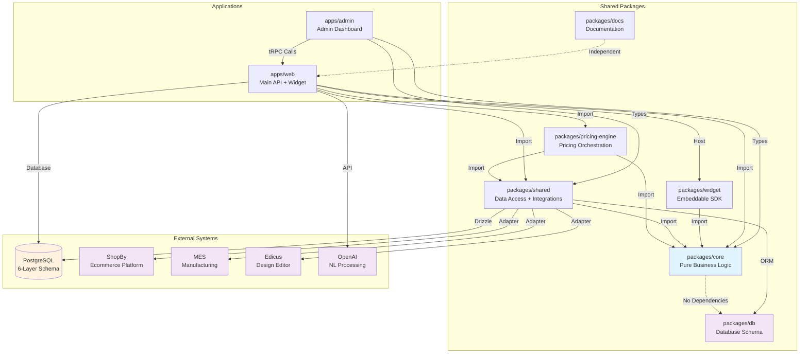

# Widget Creator - Dependency Graph and Architecture

**Last Updated:** 2026-02-27

## Module Dependency Diagram



## Dependency Layers

### Layer 0: Pure Business Logic (Zero External Dependencies)

**packages/core**
- **Dependencies:** None (TypeScript compiler only)
- **Provides:** 45+ business functions, 30+ types
- **Characteristics:**
  - Portable to Node.js, Browser, Workers
  - Pure functions, no side effects
  - Testable without mocking
  - 85%+ test coverage

### Layer 1: Data Access and Integration Layer

**packages/db**
- **Dependencies:** drizzle-orm
- **Provides:** 6-layer schema (26 tables), migrations
- **Characteristics:**
  - Schema-first, SQL generation
  - Drizzle relations
  - Type-safe queries

**packages/shared**
- **Dependencies:** core, drizzle-orm, postgres, zod
- **Provides:** Adapter registry, data mappers, API clients
- **Characteristics:**
  - MES, ShopBy, Edicus adapters
  - Circuit breaker pattern
  - Retry logic with exponential backoff
  - Request/response transformation

**packages/pricing-engine**
- **Dependencies:** core, shared
- **Provides:** Widget-specific pricing orchestration
- **Characteristics:**
  - Constraint evaluation
  - Real-time calculation
  - Delivery cost estimation

### Layer 2: Applications (API Server + Admin)

**apps/web**
- **Dependencies:** core, shared, pricing-engine, widget, next, @trpc/server, next-auth
- **Provides:** REST API, tRPC routers, widget hosting
- **Characteristics:**
  - 32 tRPC routers
  - Rate limiting middleware
  - NextAuth authentication
  - 9 REST endpoints

**apps/admin**
- **Dependencies:** core, shared, next, @trpc/react-query, react, shadcn-ui
- **Provides:** Admin dashboard UI
- **Characteristics:**
  - 15+ page routes
  - CRUD forms with Zod validation
  - Real-time data binding

### Layer 3: Widget SDK

**packages/widget**
- **Dependencies:** core, preact, @preact/signals
- **Provides:** Embeddable cross-origin widget
- **Characteristics:**
  - IIFE bundle (~50KB gzip)
  - Shadow DOM isolation
  - Reactive state (@preact/signals)
  - 10 UI components

### Layer 4: Documentation

**packages/docs**
- **Dependencies:** nextra, next
- **Provides:** Static documentation site

## Detailed Dependency Analysis

### Core Package Dependencies

**packages/core**
- Input: None
- Output: Business logic functions + types
- Role: Foundation for all other packages
- No side effects: Safe to import anywhere

**packages/shared**
- Input: @widget-creator/core
- Imports:
  - drizzle-orm (database ORM)
  - postgres (PostgreSQL driver)
  - zod (schema validation)
- Output: Adapter registry + type exports
- Circuit breaker: Shopby, MES adapters

**packages/pricing-engine**
- Input: @widget-creator/core, @widget-creator/shared
- Output: Pricing calculation + real-time updates
- Depends on: Constraint evaluation from core

### Application Package Dependencies

**apps/web**
- Imports:
  - @widget-creator/core (business logic)
  - @widget-creator/shared (database + adapters)
  - @widget-creator/pricing-engine (quote calculation)
  - @widget-creator/widget (widget hosting)
  - next (framework)
  - @trpc/server (RPC framework)
  - next-auth (authentication)
  - openai (LLM for NL rule builder)
- Exports: REST API + tRPC routes
- Ports: 3000 (default)

**apps/admin**
- Imports:
  - @widget-creator/core (types)
  - @widget-creator/shared (types + tRPC client)
  - next (framework)
  - @trpc/react-query (client-side RPC)
  - react (UI framework)
  - shadcn-ui (component library)
- Exports: Admin dashboard
- Ports: 3001

### Widget Package Dependencies

**packages/widget**
- Imports:
  - @widget-creator/core (pricing + constraint engines)
  - preact (UI framework)
  - @preact/signals (reactive state)
- Exports: IIFE bundle + initialization function
- Browser compatible: Yes
- CDN deliverable: Yes

## External System Integrations

### Shopby Integration
- **Purpose:** Product catalog, order synchronization
- **Location:** packages/shared/integration/shopby/
- **Authentication:** OAuth 2.0
- **Adapter:** ShopbyAdapter (circuit breaker enabled)
- **Retry Strategy:** Exponential backoff (3 attempts)
- **Timeout:** 30 seconds

### MES Integration
- **Purpose:** Production order dispatch, status tracking
- **Location:** packages/shared/integration/mes/
- **Authentication:** API Key
- **Adapter:** MESAdapter
- **Order Flow:** huni_orders → MES format → API call
- **Webhook:** Status updates → huni_order_timeline

### Edicus Integration
- **Purpose:** Design thumbnail rendering
- **Location:** packages/shared/integration/edicus/
- **Synchronous Call:** Direct HTTP request
- **Timeout:** 5 seconds

### OpenAI Integration (SPEC-WB-007)
- **Purpose:** Natural language rule conversion
- **Location:** apps/web/app/api/trpc/routers/glm.router.ts
- **Models:** GPT-4, GPT-3.5-turbo
- **Use Case:** Admin UI → NL rules → Structured JSON → Database

## Dependency Versions

### TypeScript
- **Version:** 5.7+
- **Configuration:** strict mode enabled
- **All packages:** TypeScript required

### Node.js
- **Version:** 22 LTS (recommended)
- **Runtimes:** Node.js, Bun, Deno all supported

### Next.js
- **Version:** 15.x
- **Apps:** apps/web, apps/admin
- **Features:** App Router, Server Components

### React / Preact
- **React:** 19.x (apps/admin)
- **Preact:** 10.x (packages/widget)
- **Note:** Can coexist (different bundles)

### Database
- **Drizzle ORM:** 0.45+
- **PostgreSQL:** 12+
- **Driver:** postgres npm package

### RPC Framework
- **tRPC:** 11.x
- **Server:** @trpc/server
- **Client:** @trpc/react-query

### Authentication
- **NextAuth.js:** v5
- **Providers:** Credentials, OAuth 2.0
- **Configuration:** apps/web/app/auth.ts

## Circular Dependency Prevention

### Allowed Dependencies (Acyclic)
- apps/* → packages/* (unidirectional)
- packages/shared → packages/core (unidirectional)
- packages/pricing-engine → packages/core, packages/shared
- packages/widget → packages/core (unidirectional)

### Prohibited Dependencies (Circular)
- packages/* → apps/* (reverse direction forbidden)
- packages/core → packages/shared (circular would break portability)
- packages/widget → packages/shared (breaks isolation)

### Validation
```bash
# Check for circular dependencies
turbo prune --scope=@widget-creator/shared
```

## Module Import Rules

### Within packages/core
- Import only from: packages/core
- Export: Types + functions
- Avoid: Database, HTTP, filesystem

### Within packages/shared
- Import from: packages/core
- Import from: drizzle-orm, zod
- Export: Adapters + mappers
- Avoid: React, Next.js

### Within apps/web
- Import from: All packages/*
- Import from: next, @trpc/server, next-auth
- No import from: apps/admin

### Within apps/admin
- Import from: packages/core, packages/shared
- Cannot import from: apps/web directly (use tRPC instead)

## Dependency Optimization

### Bundle Size (packages/widget)
- Preact: 3KB (vs React 40KB)
- Tree-shaking: Removes unused code
- IIFE format: Single file delivery
- Gzipped size: ~50KB

### Build Performance (Turbo)
```bash
# Only builds changed packages
turbo run build --filter=@widget-creator/shared
```

### Type Safety
- Shared types in packages/core
- No type duplication across packages
- tRPC auto-sync from server to client

## Dependency Security

### Regular Updates
```bash
pnpm outdated          # Check for updates
pnpm audit             # Scan for vulnerabilities
```

### Critical Dependencies
- next (framework security)
- postgres (database driver)
- next-auth (authentication)
- @trpc/server (RPC security)

## Error Resolution

### Circular Dependency Detection
Error: "Circular dependency detected"
- Solution: Extract shared types to packages/core
- Move imports up the hierarchy
- Use interfaces instead of implementations

### Type Conflicts
Error: "Duplicate identifier"
- Solution: Consolidate types in packages/core
- Remove duplicate definitions
- Use type-only imports

### Build Failures
Error: "Cannot find module @widget-creator/shared"
- Solution: Check pnpm-workspace.yaml
- Verify package.json dependencies
- Run pnpm install

## Dependency Graph Summary

| Layer | Packages | Depends On | Role |
|-------|----------|-----------|------|
| 0 | core | None | Pure logic |
| 1 | shared, db, pricing-engine | core + DB | Data access |
| 2 | web, admin | L1 + frameworks | Applications |
| 3 | widget | core | Embeddable |
| 4 | docs | nextra | Documentation |

---

**See Also:** [modules.md](modules.md), [entry-points.md](entry-points.md), [data-flow.md](data-flow.md)
