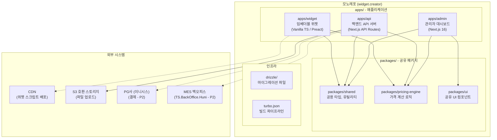
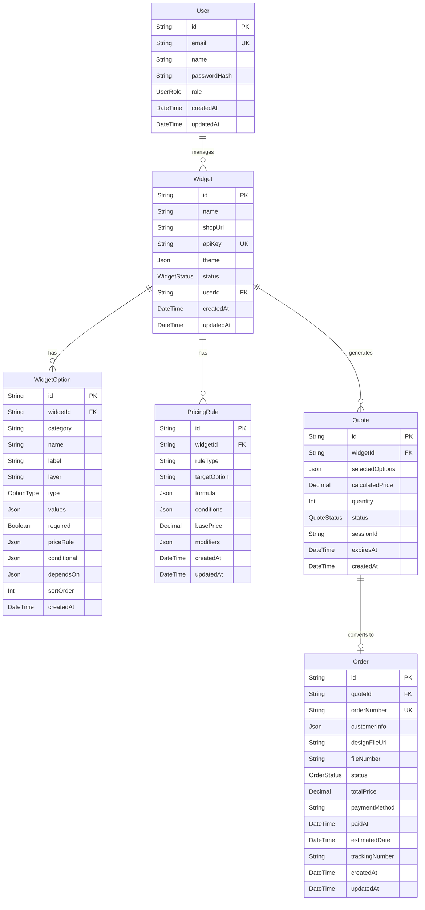

# Widget Creator - 프로젝트 구조

## 모노레포 아키텍처 개요

Widget Creator는 Turborepo 기반 모노레포로 구성된다. 세 개의 애플리케이션(admin, api, widget)과 세 개의 공유 패키지(shared, pricing-engine, ui)로 모듈을 분리한다.



---

## 디렉토리 구조

```
widget.creator/
├── .claude/                    # Claude Code 설정
│   ├── agents/moai/            # MoAI 에이전트 정의
│   ├── commands/moai/          # MoAI 슬래시 커맨드
│   ├── rules/moai/             # MoAI 규칙 (코딩 표준, 워크플로우)
│   └── skills/                 # MoAI 스킬 정의
├── .moai/                      # MoAI 프로젝트 메타데이터
│   ├── config/sections/        # 프로젝트 설정 (quality, user, language)
│   ├── plans/                  # SPEC 계획 문서
│   └── project/                # 프로젝트 문서 (본 문서)
├── apps/                       # 애플리케이션 모듈
│   ├── admin/                  # 관리자 대시보드 (Next.js 16)
│   ├── api/                    # 백엔드 API 서버
│   └── widget/                 # 임베더블 위젯
├── packages/                   # 공유 패키지
│   ├── shared/                 # 공용 타입, 상수, 유틸리티
│   ├── pricing-engine/         # 가격 계산 엔진
│   └── ui/                     # 공유 UI 컴포넌트 (shadcn/ui 기반)
├── drizzle/                    # Drizzle ORM 마이그레이션 파일 (SPEC-INFRA-001)
│   ├── meta/                   # 마이그레이션 메타데이터
│   ├── 0000_silky_sentry.sql   # 초기 스키마 (26개 테이블 CREATE, 48개 인덱스)
│   └── 0001_drop_wowpress.sql  # WowPress 10개 테이블 DROP (수동 SQL)
├── drizzle.config.ts           # Drizzle Kit 루트 설정
├── scripts/                    # 유틸리티 스크립트
│   └── seed.ts                 # Drizzle API 기반 시드 스크립트
├── ref/                        # 참조 자료 (기존 문서, 코드)
│   ├── TS.BackOffice.Huni/     # 기존 백오피스 참조 프로젝트
│   ├── prisma/                 # 아카이브: 기존 Prisma 스키마 및 시드 (삭제 금지)
│   ├── hooni-unified-validator.jsx  # 옵션 검증 참조 코드
│   ├── 후니프린팅_주문프로세스_20251001.pdf  # 주문 프로세스 문서
│   └── *.xlsx                  # 상품마스터, 가격표 엑셀
├── .env.example                # 환경변수 템플릿
├── .gitignore                  # Git 제외 패턴
├── .mcp.json                   # MCP 서버 설정 (Context7, Sequential Thinking)
├── CLAUDE.md                   # MoAI 실행 지시서
├── package.json                # 루트 패키지 설정
├── turbo.json                  # Turborepo 빌드 설정
└── tsconfig.json               # TypeScript 루트 설정
```

---

## 모듈별 상세 구조

### apps/admin/ - 관리자 대시보드

Next.js 16 App Router 기반의 풀스택 관리자 웹 애플리케이션이다. 위젯 설정, 옵션 관리, 가격 규칙, 주문 관리 등 모든 관리 기능을 제공한다.

```
apps/admin/
├── src/
│   ├── app/                    # Next.js App Router 페이지
│   │   ├── (auth)/             # 인증 관련 페이지 (로그인, 회원가입)
│   │   ├── (dashboard)/        # 대시보드 레이아웃 그룹
│   │   │   ├── widgets/        # 위젯 CRUD 페이지
│   │   │   ├── options/        # 옵션 관리 페이지
│   │   │   ├── pricing/        # 가격 규칙 관리 페이지
│   │   │   ├── orders/         # 주문 관리 페이지
│   │   │   └── settings/       # 시스템 설정 페이지
│   │   ├── layout.tsx          # 루트 레이아웃
│   │   └── page.tsx            # 메인 대시보드 페이지
│   ├── components/             # 관리자 전용 컴포넌트
│   │   ├── widgets/            # 위젯 관련 컴포넌트
│   │   ├── options/            # 옵션 편집 컴포넌트
│   │   ├── pricing/            # 가격 규칙 컴포넌트
│   │   ├── orders/             # 주문 관리 컴포넌트
│   │   └── common/             # 공통 UI 컴포넌트
│   ├── hooks/                  # 커스텀 React 훅
│   ├── lib/                    # 유틸리티 및 라이브러리 설정
│   │   ├── api.ts              # API 클라이언트
│   │   ├── auth.ts             # 인증 설정
│   │   └── utils.ts            # 공통 유틸리티
│   └── styles/                 # 스타일 파일
│       └── globals.css         # Tailwind CSS 글로벌 스타일
├── public/                     # 정적 자산
├── next.config.ts              # Next.js 설정
├── tailwind.config.ts          # Tailwind CSS 설정
├── tsconfig.json               # TypeScript 설정
└── package.json                # 의존성 관리
```

### apps/api/ - 백엔드 API 서버

REST API 서버로, 위젯 설정, 가격 계산, 주문 처리, 파일 업로드 등 모든 비즈니스 로직을 처리한다. Next.js API Routes 또는 Hono 프레임워크를 사용한다.

```
apps/api/
├── src/
│   ├── routes/                 # API 라우트 정의
│   │   ├── auth/               # 인증 API (/api/auth/*)
│   │   ├── widgets/            # 위젯 API (/api/widgets/*)
│   │   ├── options/            # 옵션 API (/api/options/*)
│   │   ├── pricing/            # 가격 API (/api/pricing/*)
│   │   ├── quotes/             # 견적 API (/api/quotes/*)
│   │   ├── orders/             # 주문 API (/api/orders/*)
│   │   └── uploads/            # 파일 업로드 API (/api/uploads/*)
│   ├── services/               # 비즈니스 로직 서비스
│   │   ├── widget.service.ts   # 위젯 비즈니스 로직
│   │   ├── pricing.service.ts  # 가격 계산 서비스 (pricing-engine 활용)
│   │   ├── order.service.ts    # 주문 처리 서비스
│   │   ├── upload.service.ts   # 파일 업로드 서비스
│   │   └── notification.service.ts  # 알림 서비스 (메일, 알림톡)
│   ├── middleware/              # 미들웨어
│   │   ├── auth.ts             # 인증 미들웨어
│   │   ├── cors.ts             # CORS 설정 (위젯 임베드 허용)
│   │   ├── rateLimit.ts        # 요청 제한
│   │   └── validation.ts       # 입력 검증
│   ├── lib/                    # 라이브러리 설정
│   │   ├── db.ts               # Prisma 클라이언트 인스턴스
│   │   ├── s3.ts               # S3 스토리지 클라이언트
│   │   └── logger.ts           # 로깅 설정
│   └── types/                  # API 전용 타입 정의
├── tsconfig.json
└── package.json
```

### packages/widget/ - 임베더블 위젯 SDK (SPEC-WIDGET-SDK-001, 2026-02-23)

쇼핑몰 페이지에 삽입되는 경량 위젯 SDK이다. Preact 10.x + Preact Signals + Shadow DOM으로 구현하여 번들 사이즈 15.47 KB gzipped (한도 50 KB)를 달성하였다. 468 테스트, ~97-98% 커버리지.

```
packages/widget/
├── src/
│   ├── index.ts                    # Entry: bootstrap, Shadow DOM mount
│   ├── embed.ts                    # Script tag parser, container creation
│   ├── app.tsx                     # Root Preact component (WidgetShell)
│   ├── primitives/                 # 7 Primitive Components (모두 구현 완료)
│   │   ├── ToggleGroup.tsx
│   │   ├── Select.tsx
│   │   ├── RadioGroup.tsx
│   │   ├── Collapsible.tsx
│   │   ├── Input.tsx
│   │   ├── Slider.tsx
│   │   ├── Button.tsx
│   │   └── index.ts
│   ├── components/                 # 10 Domain Components (모두 구현 완료)
│   │   ├── SizeSelector.tsx
│   │   ├── PaperSelect.tsx
│   │   ├── NumberInput.tsx
│   │   ├── ColorChipGroup.tsx
│   │   ├── ImageChipGroup.tsx
│   │   ├── FinishSection.tsx
│   │   ├── DualInput.tsx
│   │   ├── QuantitySlider.tsx
│   │   ├── PriceSummary.tsx
│   │   ├── UploadActions.tsx
│   │   └── index.ts
│   ├── screens/                    # Screen Configurations (3/11 구현)
│   │   ├── PrintOption.tsx         # Screen 01 (구현 완료)
│   │   ├── StickerOption.tsx       # Screen 02 (구현 완료)
│   │   ├── AccessoryOption.tsx     # Screen 11 (구현 완료)
│   │   ├── ScreenRenderer.tsx      # Screen router
│   │   └── index.ts
│   ├── state/                      # Preact Signals 상태 관리
│   │   ├── widget.state.ts         # widgetState, status machine
│   │   ├── selections.state.ts     # 사용자 선택 상태
│   │   ├── price.state.ts          # 가격 계산 상태
│   │   └── index.ts
│   ├── engine/                     # Client-side engines
│   │   ├── option-engine.ts        # Constraint resolver (제약조건 평가)
│   │   ├── price-engine.ts         # Price calculator (가격 계산기)
│   │   └── index.ts
│   ├── styles/                     # CSS (Shadow DOM 내 인라인)
│   │   ├── tokens.css              # CSS Custom Properties (디자인 토큰)
│   │   ├── primitives.css          # Primitive 컴포넌트 스타일
│   │   ├── components.css          # Domain 컴포넌트 스타일
│   │   └── base.css                # Shadow DOM 리셋 + 베이스 스타일
│   ├── utils/                      # 유틸리티
│   │   ├── events.ts               # CustomEvent dispatch helpers
│   │   ├── shadow-dom.ts           # Shadow DOM helpers
│   │   ├── formatting.ts           # 가격/숫자 포맷팅 (KRW)
│   │   └── index.ts
│   └── types/                      # 위젯 전용 타입
│       ├── widget.types.ts
│       ├── option.types.ts
│       ├── price.types.ts
│       ├── screen.types.ts
│       └── index.ts
├── __tests__/                      # 468 테스트 파일 (20 test files)
│   ├── primitives/                 # 7 Primitive 컴포넌트 테스트
│   ├── components/                 # 10 Domain 컴포넌트 테스트
│   ├── engine/                     # Engine 로직 테스트
│   ├── state/                      # 상태 관리 테스트
│   └── integration/                # 통합 테스트
├── README.md                       # Widget SDK 사용 가이드
├── vite.config.ts                  # Vite Library Mode 설정 (IIFE)
├── tsconfig.json                   # TypeScript strict 설정
└── package.json
```

**위젯 삽입 코드 예시**:
```html
<script
  src="https://widget.huni.co.kr/embed.js"
  data-widget-id="wgt_xxxxx"
  data-product-id="42"
  async
></script>
```

### packages/shared/ - 공유 타입 및 유틸리티

모든 애플리케이션에서 공유하는 TypeScript 타입 정의, 상수, 유틸리티 함수를 포함한다.

```
packages/shared/
├── src/
│   ├── db/                     # 데이터베이스 스키마 및 연결 (SPEC-INFRA-001)
│   │   ├── index.ts            # postgres.js 기반 drizzle 인스턴스 및 export
│   │   └── schema/             # 도메인별 Drizzle 스키마 정의 (6 파일)
│   │       ├── index.ts        # 모든 스키마 re-export
│   │       ├── relations.ts    # 30+ Drizzle 관계 정의 (전체 도메인 통합)
│   │       ├── huni-catalog.schema.ts     # HuniCategory, HuniProduct, HuniProductSize
│   │       ├── huni-materials.schema.ts   # HuniPaper, HuniMaterial, HuniPaperProductMapping
│   │       ├── huni-processes.schema.ts   # HuniPrintMode, HuniPostProcess, HuniBinding, HuniImpositionRule
│   │       ├── huni-pricing.schema.ts     # HuniPriceTable, HuniPriceTier, HuniFixedPrice, HuniPackagePrice, HuniFoilPrice, HuniLossQuantityConfig
│   │       ├── huni-options.schema.ts     # HuniOptionDefinition, HuniProductOption, HuniOptionChoice, HuniOptionConstraint, HuniOptionDependency
│   │       └── huni-integration.schema.ts # HuniMesItem, HuniMesItemOption, HuniProductMesMapping, HuniProductEditorMapping, HuniOptionChoiceMesMapping
│   ├── types/                  # 공유 타입 정의
│   │   ├── widget.ts           # Widget, WidgetConfig 타입
│   │   ├── option.ts           # WidgetOption, OptionLayer, OptionValue 타입
│   │   ├── pricing.ts          # PricingRule, PriceModifier 타입
│   │   ├── quote.ts            # Quote, QuoteItem 타입
│   │   ├── order.ts            # Order, OrderStatus 타입
│   │   ├── user.ts             # User, UserRole 타입
│   │   └── index.ts            # 타입 re-export
│   ├── constants/              # 공유 상수
│   │   ├── products.ts         # 상품 카테고리 상수
│   │   ├── options.ts          # 기본 옵션 템플릿
│   │   ├── status.ts           # 주문 상태 enum
│   │   └── colors.ts           # 후니프린팅 디자인 시스템 컬러
│   ├── utils/                  # 공유 유틸리티
│   │   ├── validation.ts       # 입력 검증 함수
│   │   ├── formatting.ts       # 가격 포맷, 날짜 포맷
│   │   └── filename.ts         # 파일명 생성 규칙 유틸리티
│   └── index.ts                # 패키지 엔트리 포인트
├── tsconfig.json
└── package.json
```

### packages/pricing-engine/ - 가격 계산 엔진

인쇄 상품의 복잡한 가격 체계를 계산하는 독립 엔진이다. Admin 대시보드(관리자 미리보기), API(서버 사이드 검증), Widget(클라이언트 사이드 실시간 표시) 세 곳에서 모두 사용한다.

```
packages/pricing-engine/
├── src/
│   ├── engine.ts               # 가격 계산 메인 엔진
│   ├── rules/                  # 가격 규칙 타입별 구현
│   │   ├── per-sheet.ts        # 용지 장당 가격 (perSheet)
│   │   ├── fixed.ts            # 고정 단가 (fixed)
│   │   ├── tiered.ts           # 수량별 단계 가격 (tiered)
│   │   ├── size-dependent.ts   # 크기 의존 가격 (sizeDependent)
│   │   ├── multiplier.ts       # 배수 연산 (multiplier)
│   │   └── per-unit.ts         # 단위당 가격 (perUnit)
│   ├── constraints/            # 옵션 제약 조건 검증
│   │   ├── dependency.ts       # 의존성 제약 (박가공 -> 박칼라)
│   │   ├── range.ts            # 범위 제약 (페이지수 24~300)
│   │   └── validator.ts        # 제약 조건 통합 검증기
│   ├── calculator.ts           # 최종 견적 계산기
│   └── index.ts                # 패키지 엔트리 포인트
├── __tests__/                  # 가격 계산 테스트
│   ├── engine.test.ts          # 엔진 통합 테스트
│   ├── rules/                  # 규칙별 단위 테스트
│   └── fixtures/               # 테스트 데이터 (가격표 기반)
├── tsconfig.json
└── package.json
```

### packages/ui/ - 공유 UI 컴포넌트

shadcn/ui 기반의 공유 UI 컴포넌트 라이브러리이다. 후니프린팅 디자인 시스템의 컬러 팔레트와 스타일 가이드를 적용한다.

```
packages/ui/
├── src/
│   ├── components/             # shadcn/ui 기반 컴포넌트
│   │   ├── button.tsx
│   │   ├── input.tsx
│   │   ├── select.tsx
│   │   ├── card.tsx
│   │   ├── dialog.tsx
│   │   ├── table.tsx
│   │   ├── badge.tsx
│   │   └── ...                 # 추가 shadcn/ui 컴포넌트
│   ├── theme/                  # 후니프린팅 테마
│   │   ├── colors.ts           # 컬러 팔레트 (#5538b6 Primary)
│   │   └── tokens.ts           # 디자인 토큰
│   └── index.ts                # 패키지 엔트리 포인트
├── tsconfig.json
└── package.json
```

---

## 데이터베이스 스키마 개요

PostgreSQL + Drizzle ORM 기반의 데이터 모델이다. Huni 도메인 26개 모델은 `packages/shared/src/db/schema/`에 정의된다 (SPEC-INFRA-001, 2026-02-22).



### 핵심 도메인 모델 설명

**User**: 관리자 계정. email 기반 인증, role로 권한 구분 (ADMIN, MANAGER, VIEWER).

**Widget**: 위젯 인스턴스. 각 위젯은 특정 쇼핑몰(shopUrl)에 연결되고 고유 API 키로 식별된다. theme은 JSON으로 커스텀 스타일을 저장한다.

**WidgetOption**: 위젯의 인쇄 옵션. layer 필드로 레이어(기본/내지/표지/제본/후가공) 구분. conditional과 dependsOn으로 옵션 간 의존성을 표현한다.

**PricingRule**: 가격 규칙. ruleType으로 가격 계산 방식(perSheet, fixed, tiered, sizeDependent, multiplier, perUnit)을 결정한다.

**Quote**: 견적. 고객이 선택한 옵션과 계산된 가격을 저장한다. sessionId로 비회원 견적을 추적한다.

**Order**: 주문. Quote에서 전환된 실제 주문이다. 주문프로세스 문서의 상태 흐름(미입금->결제완료->제작대기->제작중->제작완료->출고완료->주문취소)을 status로 관리한다.

### Enum 정의

```
UserRole: ADMIN, MANAGER, VIEWER
WidgetStatus: ACTIVE, INACTIVE, DRAFT
OptionType: SELECT, RANGE, TOGGLE, TEXT
QuoteStatus: PENDING, CONFIRMED, EXPIRED, CANCELLED
OrderStatus: UNPAID, PAID, PRODUCTION_WAITING, PRODUCING,
             PRODUCTION_DONE, SHIPPED, CANCELLED
```

---

## 주요 파일 위치 참조

| 용도 | 위치 |
|------|------|
| 프로젝트 문서 | `.moai/project/` |
| SPEC 문서 | `.moai/specs/SPEC-XXX/` |
| 프로젝트 설정 | `.moai/config/sections/*.yaml` |
| 빌드 설정 | `turbo.json` |
| DB 스키마 (Drizzle) | `packages/shared/src/db/schema/` |
| DB 마이그레이션 | `drizzle/` |
| Drizzle 설정 | `drizzle.config.ts` |
| 시드 스크립트 | `scripts/seed.ts` |
| Prisma 아카이브 | `ref/prisma/` |
| 환경변수 | `.env.example` |
| API 라우트 | `apps/api/src/routes/` |
| 가격 엔진 | `packages/pricing-engine/src/` |
| 위젯 엔트리 | `apps/widget/src/index.ts` |
| 공유 타입 | `packages/shared/src/types/` |
| 디자인 토큰 | `packages/ui/src/theme/` |
| 참조 코드 | `ref/hooni-unified-validator.jsx` |
| 참조 문서 | `ref/후니프린팅_주문프로세스_20251001.pdf` |

---

문서 버전: 1.1.0
작성일: 2026-02-22
최종 수정: 2026-02-22 (SPEC-INFRA-001 Drizzle ORM 마이그레이션 반영)
