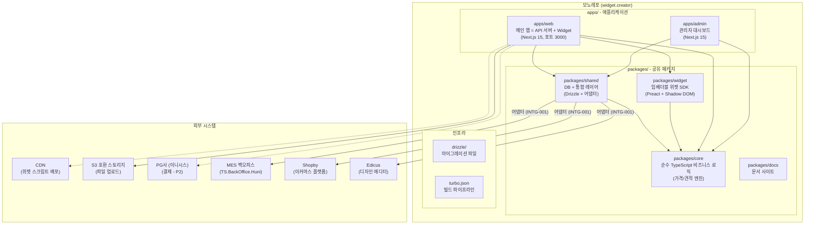
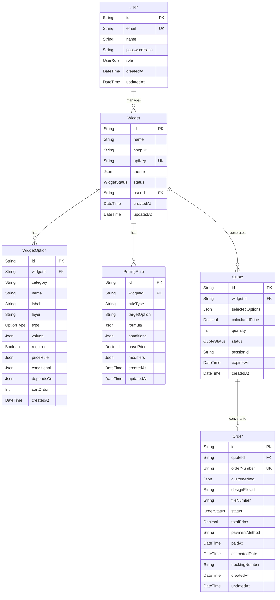

# Widget Creator - 프로젝트 구조

## 모노레포 아키텍처 개요

Widget Creator는 Turborepo 기반 모노레포로 구성된다. 두 개의 애플리케이션(admin, web), 하나의 패키지 관리자(widget SDK), 네 개의 공유 패키지(core, shared, widget, docs)로 모듈을 분리한다.



---

## 디렉토리 구조

```
widget.creator/
├── .claude/                    # Claude Code 설정
│   ├── agents/moai/            # MoAI 에이전트 정의
│   ├── commands/moai/          # MoAI 슬래시 커맨드
│   ├── rules/moai/             # MoAI 규칙 (코딩 표준, 워크플로우)
│   └── skills/                 # MoAI 스킬 정의
├── .moai/                      # MoAI 프로젝트 메타데이터
│   ├── config/sections/        # 프로젝트 설정 (quality, user, language)
│   ├── specs/                  # SPEC 문서 (SPEC-WB-001~006)
│   └── project/                # 프로젝트 문서 (본 문서)
├── apps/                       # 애플리케이션 모듈
│   ├── admin/                  # 관리자 대시보드 (Next.js 15, 포트 3001)
│   └── web/                    # 메인 앱 = API 서버 + Widget (Next.js 15, 포트 3000)
│       ├── app/                # Next.js 15 App Router
│       │   ├── api/            # REST API 라우트
│       │   │   ├── v1/pricing/quote/     # 통합 견적 API
│       │   │   ├── v1/orders/           # 주문 API
│       │   │   ├── v1/catalog/          # 상품 카탈로그
│       │   │   ├── v1/integration/      # 외부 시스템 통합
│       │   │   └── trpc/               # tRPC 라우터
│       │   ├── auth.ts                  # NextAuth.js v5 설정
│       │   └── middleware.ts            # 인증/검증 미들웨어
│       ├── components/         # Next.js 컴포넌트
│       └── tsconfig.json       # TypeScript 설정
├── packages/                   # 공유 패키지
│   ├── core/                   # NEW: 순수 TypeScript 비즈니스 로직
│   │   └── src/
│   │       ├── errors.ts, crypto.ts, validation.ts
│   │       ├── constraints/
│   │       ├── options/
│   │       ├── pricing/        # 가격 엔진 (formula-cutting, fixed-unit, component 등 7가지)
│   │       └── quote/          # 견적 계산 및 만료 관리
│   ├── db/                     # NEW: Drizzle ORM 스키마 패키지 (SPEC-WB-001)
│   │   ├── src/
│   │   │   ├── index.ts        # 메인 익스포트
│   │   │   ├── schema/
│   │   │   │   ├── widget/
│   │   │   │   │   ├── 01-element-types.ts       # option_element_types 스키마
│   │   │   │   │   ├── 02-element-choices.ts     # option_element_choices 스키마
│   │   │   │   │   └── index.ts
│   │   │   │   └── index.ts
│   │   │   └── seed/
│   │   │       ├── widget-types.ts   # 12개 표준 옵션 타입
│   │   │       └── index.ts
│   │   ├── __tests__/          # 79개 테스트 (86% 커버리지)
│   │   │   ├── schema/
│   │   │   │   ├── element-types.test.ts
│   │   │   │   └── element-choices.test.ts
│   │   │   ├── seed/
│   │   │   │   └── widget-types.test.ts
│   │   │   ├── index.test.ts
│   │   │   └── setup.ts
│   │   ├── package.json
│   │   ├── README.md
│   │   └── tsconfig.json
│   ├── shared/                 # DB + 통합 레이어 (SPEC-INFRA-001)
│   │   └── src/
│   │       ├── db/             # Drizzle ORM (26 huni_ 테이블)
│   │       │   └── schema/
│   │       │       ├── huni-catalog.schema.ts
│   │       │       ├── huni-materials.schema.ts
│   │       │       ├── huni-options.schema.ts
│   │       │       ├── huni-pricing.schema.ts
│   │       │       ├── huni-options.schema.ts
│   │       │       └── huni-integration.schema.ts
│   │       ├── integration/    # 외부 시스템 어댑터 (SPEC-WIDGET-INTG-001)
│   │       │   ├── shopby/     # NEW: Shopby 통합 (OAuth, 상품 등록, 가격 전략)
│   │       │   ├── mes/        # MES 어댑터
│   │       │   └── edicus/     # Edicus 어댑터
│   │       ├── events/         # 도메인 이벤트 버스
│   │       ├── types/          # 공유 타입
│   │       └── constants/      # 상수 및 열거형
│   ├── widget/                 # 임베더블 위젯 SDK (SPEC-WIDGET-SDK-001)
│   │   └── src/
│   │       ├── components/     # 10개 Domain 컴포넌트
│   │       ├── primitives/     # 7개 Primitive 컴포넌트
│   │       ├── screens/        # 3개 Screen (PrintOption, StickerOption, AccessoryOption)
│   │       ├── state/          # Preact Signals 상태 관리
│   │       ├── engine/         # option-engine, price-engine
│   │       ├── upload/         # NEW: 파일 업로드 (6개 형식, Magic Bytes, 300DPI)
│   │       ├── shopby/         # NEW: Shopby 브릿지 (Aurora Skin 통합)
│   │       ├── api/            # API 클라이언트
│   │       └── types/, utils/, styles/
│   └── docs/                   # NEW: 문서 사이트 (Nextra)
├── drizzle/                    # Drizzle ORM 마이그레이션 파일 (SPEC-INFRA-001)
│   ├── meta/                   # 마이그레이션 메타데이터
│   ├── 0000_silky_sentry.sql   # 초기 스키마 (26개 테이블, 48개 인덱스)
│   └── _journal.json           # 마이그레이션 추적
├── scripts/                    # 유틸리티 스크립트
│   ├── seed.ts                 # 데이터 시드 스크립트 (14 phases)
│   └── lib/
│       ├── data-paths.ts       # 날짜 기반 데이터 경로
│       └── schemas.ts          # Zod 검증 스키마 (SPEC-SEED-002)
├── ref/                        # 참조 자료 (기존 문서, 코드)
│   ├── TS.BackOffice.Huni/     # 기존 백오피스 참조
│   ├── hooni-unified-validator.jsx  # 옵션 검증 참조 코드
│   ├── 후니프린팅_주문프로세스.pdf  # 주문 프로세스 문서
│   └── *.xlsx                  # 상품마스터, 가격표 엑셀
├── .env.example                # 환경변수 템플릿
├── .gitignore                  # Git 제외 패턴
├── .mcp.json                   # MCP 서버 설정
├── CLAUDE.md                   # MoAI 실행 지시서
├── package.json                # 루트 패키지 설정
├── turbo.json                  # Turborepo 빌드 설정
├── vitest.config.ts            # Vitest 설정
├── pyrightconfig.json          # Pyright 설정
└── tsconfig.base.json          # TypeScript 루트 설정
```

---

## 모듈별 상세 구조

### apps/admin/ - 관리자 대시보드 (포트 3001)

Next.js 15 App Router 기반의 풀스택 관리자 웹 애플리케이션이다. 위젯 설정, 옵션 관리, 가격 규칙, 주문 관리 등 모든 관리 기능을 제공한다.

```
apps/admin/
├── src/
│   ├── app/                    # Next.js 15 App Router
│   │   ├── (auth)/             # 인증 페이지
│   │   ├── (dashboard)/        # 대시보드 레이아웃
│   │   │   ├── widgets/        # 위젯 CRUD
│   │   │   ├── materials/papers/  # Paper Form 편집
│   │   │   ├── options/        # 옵션 관리
│   │   │   ├── pricing/        # 가격 규칙
│   │   │   ├── orders/         # 주문 관리
│   │   │   └── settings/       # 시스템 설정
│   │   ├── layout.tsx
│   │   └── page.tsx
│   ├── components/forms/       # Paper Form 컴포넌트
│   │   └── paper-form.tsx
│   ├── components/
│   ├── lib/trpc/routers/       # tRPC 라우터
│   │   └── papers.ts
│   ├── lib/
│   │   ├── api.ts
│   │   ├── auth.ts
│   │   └── utils.ts
│   └── styles/
├── __tests__/                  # 727개 테스트
│   ├── lib/paper-form-schema.test.ts
│   ├── setup.ts
│   └── ...
├── next.config.ts
├── tailwind.config.ts
├── tsconfig.json
└── package.json
```

### apps/web/ - 메인 앱 (포트 3000) = API 서버 + Widget 사용자 인터페이스

Next.js 15 App Router 기반의 통합 애플리케이션이다. REST API 서버, tRPC 라우터, 사용자 위젯 초기화, 파일 업로드 등을 담당한다.

```
apps/web/
├── app/                        # Next.js 15 App Router
│   ├── api/                    # REST + tRPC API 라우트
│   │   ├── v1/pricing/quote/route.ts      # 통합 견적 (300ms SLA, Redis 캐시)
│   │   ├── v1/orders/route.ts             # 주문 생성 + MES 발주
│   │   ├── v1/catalog/route.ts            # 상품 카탈로그
│   │   ├── v1/integration/                # 외부 시스템
│   │   │   ├── shopby/
│   │   │   ├── mes/
│   │   │   └── edicus/
│   │   └── trpc/[trpc]/route.ts           # tRPC 라우터
│   ├── middleware.ts           # 인증/검증 미들웨어 (Rate Limiting, Validation)
│   ├── auth.ts                 # NextAuth.js v5 설정 (providers 대기)
│   ├── layout.tsx
│   └── page.tsx
├── components/                 # 사용자 인터페이스 컴포넌트
├── lib/
│   ├── middleware/
│   │   ├── rate-limit.ts       # Token Bucket Rate Limiting
│   │   ├── with-middleware.ts  # 미들웨어 조합
│   │   ├── auth.test.ts
│   │   └── validation.test.ts
│   └── trpc/
│       ├── routers/order.router.ts
│       ├── utils/create-crud-router.ts
│       └── context.ts
├── __tests__/                  # 테스트
│   ├── middleware/
│   ├── pricing/
│   └── setup.ts
├── next.config.ts
├── tailwind.config.ts
├── tsconfig.json
└── package.json
```

### packages/widget/ - 임베더블 위젯 SDK (SPEC-WIDGET-SDK-001, 2026-02-23)

쇼핑몰 페이지에 삽입되는 경량 위젯 SDK이다. Preact 10.x + Preact Signals + Shadow DOM으로 구현하여 번들 사이즈 15.47 KB gzipped (한도 50 KB)를 달성하였다. 468 테스트, ~97-98% 커버리지.

```
packages/widget/
├── src/
│   ├── index.ts                    # Entry: bootstrap, Shadow DOM mount
│   ├── embed.ts                    # Script tag parser, container creation
│   ├── app.tsx                     # Root Preact component (WidgetShell)
│   ├── primitives/                 # 7 Primitive Components (모두 구현 완료)
│   │   ├── ToggleGroup.tsx
│   │   ├── Select.tsx
│   │   ├── RadioGroup.tsx
│   │   ├── Collapsible.tsx
│   │   ├── Input.tsx
│   │   ├── Slider.tsx
│   │   ├── Button.tsx
│   │   └── index.ts
│   ├── components/                 # 10 Domain Components (모두 구현 완료)
│   │   ├── SizeSelector.tsx
│   │   ├── PaperSelect.tsx
│   │   ├── NumberInput.tsx
│   │   ├── ColorChipGroup.tsx
│   │   ├── ImageChipGroup.tsx
│   │   ├── FinishSection.tsx
│   │   ├── DualInput.tsx
│   │   ├── QuantitySlider.tsx
│   │   ├── PriceSummary.tsx
│   │   ├── UploadActions.tsx
│   │   └── index.ts
│   ├── screens/                    # Screen Configurations (3/11 구현)
│   │   ├── PrintOption.tsx         # Screen 01 (구현 완료)
│   │   ├── StickerOption.tsx       # Screen 02 (구현 완료)
│   │   ├── AccessoryOption.tsx     # Screen 11 (구현 완료)
│   │   ├── ScreenRenderer.tsx      # Screen router
│   │   └── index.ts
│   ├── state/                      # Preact Signals 상태 관리
│   │   ├── widget.state.ts         # widgetState, status machine
│   │   ├── selections.state.ts     # 사용자 선택 상태
│   │   ├── price.state.ts          # 가격 계산 상태
│   │   └── index.ts
│   ├── engine/                     # Client-side engines
│   │   ├── option-engine.ts        # Constraint resolver (제약조건 평가)
│   │   ├── price-engine.ts         # Price calculator (가격 계산기)
│   │   └── index.ts
│   ├── styles/                     # CSS (Shadow DOM 내 인라인)
│   │   ├── tokens.css              # CSS Custom Properties (디자인 토큰)
│   │   ├── primitives.css          # Primitive 컴포넌트 스타일
│   │   ├── components.css          # Domain 컴포넌트 스타일
│   │   └── base.css                # Shadow DOM 리셋 + 베이스 스타일
│   ├── utils/                      # 유틸리티
│   │   ├── events.ts               # CustomEvent dispatch helpers
│   │   ├── shadow-dom.ts           # Shadow DOM helpers
│   │   ├── formatting.ts           # 가격/숫자 포맷팅 (KRW)
│   │   └── index.ts
│   └── types/                      # 위젯 전용 타입
│       ├── widget.types.ts
│       ├── option.types.ts
│       ├── price.types.ts
│       ├── screen.types.ts
│       └── index.ts
├── __tests__/                      # 468 테스트 파일 (20 test files)
│   ├── primitives/                 # 7 Primitive 컴포넌트 테스트
│   ├── components/                 # 10 Domain 컴포넌트 테스트
│   ├── engine/                     # Engine 로직 테스트
│   ├── state/                      # 상태 관리 테스트
│   └── integration/                # 통합 테스트
├── README.md                       # Widget SDK 사용 가이드
├── vite.config.ts                  # Vite Library Mode 설정 (IIFE)
├── tsconfig.json                   # TypeScript strict 설정
└── package.json
```

**위젯 삽입 코드 예시**:
```html
<script
  src="https://widget.huni.co.kr/embed.js"
  data-widget-id="wgt_xxxxx"
  data-product-id="42"
  async
></script>
```

### packages/db/ - Drizzle ORM 스키마 패키지 (NEW, SPEC-WB-001)

Drizzle ORM 기반의 DB 스키마 정의 패키지로, Widget Builder의 옵션 타입 및 선택지 라이브러리를 관리한다.

```
packages/db/
├── src/
│   ├── index.ts                    # 메인 익스포트
│   ├── schema/
│   │   ├── widget/
│   │   │   ├── 01-element-types.ts # option_element_types 스키마 (12개 표준 타입)
│   │   │   ├── 02-element-choices.ts # option_element_choices 스키마 (선택지 라이브러리)
│   │   │   └── index.ts
│   │   └── index.ts
│   └── seed/
│       ├── widget-types.ts        # 12개 표준 옵션 타입 시드 데이터
│       └── index.ts
├── __tests__/                      # 79개 테스트 (86% 커버리지)
│   ├── schema/
│   │   ├── element-types.test.ts   # 타입 시스템 검증 (22 tests)
│   │   └── element-choices.test.ts # 선택지 검증 (31 tests)
│   ├── seed/
│   │   └── widget-types.test.ts    # 시드 데이터 검증 (12 tests)
│   ├── index.test.ts               # 익스포트 검증 (14 tests)
│   └── setup.ts
├── README.md                       # 패키지 사용 가이드
├── tsconfig.json
└── package.json
```

**주요 특징:**
- 옵션 타입 (SIZE, PAPER, PRINT_TYPE 등) 정의
- 선택지 라이브러리 (각 타입의 구체적 선택지)
- 외부 시스템 독립성 (MES 코드 optional)
- 메타데이터 JSONB로 확장 가능
- 소프트 삭제 (is_active) 지원

### packages/core/ - 순수 TypeScript 비즈니스 로직 (NEW)

도메인 로직이 독립적인 순수 TypeScript 라이브러리로 구성된다. pricing-engine과 quote 계산을 통합했다.

```
packages/core/
├── src/
│   ├── errors.ts               # 커스텀 에러 정의
│   ├── crypto.ts               # 암호화 유틸리티
│   ├── validation.ts           # 유효성 검증
│   ├── constraints/            # 제약조건 평가 (ECA 패턴)
│   ├── options/                # 옵션 관리
│   ├── pricing/                # 가격 계산 엔진
│   │   ├── formula-cutting/    # Formula Cutting 계산
│   │   ├── fixed-unit/         # Fixed Unit 계산
│   │   ├── component/          # Component 계산
│   │   ├── formula/            # Formula 계산
│   │   ├── fixed-size/         # Fixed Size 계산
│   │   ├── fixed-per-unit/     # Fixed Per Unit 계산
│   │   ├── package/            # Package 계산
│   │   ├── engine.ts           # 통합 엔진
│   │   ├── types.ts
│   │   ├── lookup.ts           # 가격표 조회
│   │   ├── loss.ts             # 손실률 계산
│   │   ├── utils.ts
│   │   └── registry.ts         # 가격 규칙 레지스트리
│   ├── quote/                  # 견적 계산
│   │   ├── types.ts            # Quote, QuoteSnapshot 타입
│   │   ├── snapshot.ts         # 불변 스냅샷
│   │   ├── calculator.ts       # 견적 계산기 (300ms SLA)
│   │   └── expiry.ts           # 견적 만료 관리
│   └── index.ts
├── __tests__/                  # 테스트
├── tsconfig.json
└── package.json
```

### packages/shared/ - DB + 통합 레이어 (SPEC-INFRA-001)

데이터베이스 스키마, 외부 시스템 어댑터, 도메인 이벤트 버스를 포함한다.

```
packages/shared/
├── src/
│   ├── db/                     # Drizzle ORM + 스키마 (26 huni_ 테이블)
│   │   ├── index.ts            # postgres.js 드라이버 + Drizzle 인스턴스
│   │   └── schema/
│   │       ├── index.ts
│   │       ├── relations.ts    # 30+ 관계 정의
│   │       ├── huni-catalog.schema.ts
│   │       ├── huni-materials.schema.ts
│   │       ├── huni-options.schema.ts
│   │       ├── huni-orders.schema.ts
│   │       ├── huni-pricing.schema.ts
│   │       └── huni-integration.schema.ts
│   ├── events/                 # 도메인 이벤트 버스 (SPEC-WIDGET-INTG-001)
│   │   ├── types.ts            # DomainEvent union (12타입)
│   │   ├── bus.ts              # InProcessEventBus
│   │   ├── dead-letter.ts      # DLQ (InMemory + Database)
│   │   └── index.ts
│   ├── integration/            # 외부 시스템 어댑터 (SPEC-WIDGET-INTG-001)
│   │   ├── types.ts            # IntegrationAdapter, AdapterRegistry
│   │   ├── adapter-registry.ts
│   │   ├── circuit-breaker.ts  # Circuit Breaker (CLOSED/OPEN/HALF_OPEN)
│   │   ├── retry.ts            # Exponential Backoff
│   │   ├── shopby/             # Shopby 통합 (NEW)
│   │   │   ├── __tests__/      # 9개 테스트 파일
│   │   │   ├── admin-client.ts # Circuit Breaker + Rate Limiting
│   │   │   ├── auth.ts         # OAuth 2.0 토큰 관리
│   │   │   ├── api-config.ts   # Prod + Sandbox 엔드포인트
│   │   │   ├── category-service.ts  # 카테고리 계층
│   │   │   ├── option-generator.ts  # 500-조합 행렬
│   │   │   ├── price-mapper.ts      # 이중 가격 전략
│   │   │   ├── product-registration.ts
│   │   │   └── schemas.ts      # Zod 검증
│   │   ├── mes/                # MES 어댑터
│   │   └── edicus/             # Edicus 어댑터
│   ├── types/                  # 공유 타입
│   ├── constants/              # 상수
│   ├── utils/                  # 유틸리티
│   └── index.ts
├── __tests__/                  # 통합 테스트 (184개)
│   ├── integration/
│   ├── shopby/
│   └── ...
├── coverage/                   # 커버리지 리포트
├── tsconfig.json
└── package.json
```

### packages/widget/ - 임베더블 위젯 SDK (SPEC-WIDGET-SDK-001)

쇼핑몰 페이지에 삽입되는 경량 위젯 SDK이다. Preact 10.x + Preact Signals + Shadow DOM으로 구현하여 번들 사이즈 15.47 KB gzipped를 달성했다.

```
packages/widget/
├── src/
│   ├── index.tsx               # Entry: Bootstrap + Shadow DOM Mount
│   ├── embed.ts                # Script Tag Parser + Container Creation
│   ├── app.tsx                 # Root Preact Component
│   ├── primitives/             # 7개 Primitive 컴포넌트 (완성)
│   │   ├── ToggleGroup.tsx, Select.tsx, RadioGroup.tsx
│   │   ├── Collapsible.tsx, Input.tsx, Slider.tsx, Button.tsx
│   │   └── index.ts
│   ├── components/             # 10개 Domain 컴포넌트 (완성)
│   │   ├── SizeSelector.tsx, PaperSelect.tsx, NumberInput.tsx
│   │   ├── ColorChipGroup.tsx, ImageChipGroup.tsx, FinishSection.tsx
│   │   ├── DualInput.tsx, QuantitySlider.tsx, PriceSummary.tsx
│   │   ├── UploadActions.tsx
│   │   └── index.ts
│   ├── screens/                # Screen 렌더러 (3/11 구현)
│   │   ├── PrintOption.tsx     # 인쇄 옵션
│   │   ├── StickerOption.tsx   # 스티커 옵션
│   │   ├── AccessoryOption.tsx # 액세서리 옵션
│   │   ├── ScreenRenderer.tsx
│   │   └── index.ts
│   ├── state/                  # Preact Signals 상태 관리
│   │   ├── widget.state.ts     # Widget 상태 + 상태 머신
│   │   ├── selections.state.ts # 사용자 선택
│   │   ├── price.state.ts      # 가격 계산
│   │   └── index.ts
│   ├── engine/                 # 클라이언트 사이드 엔진
│   │   ├── option-engine.ts    # 제약조건 평가 (Dual-evaluation)
│   │   ├── price-engine.ts     # 가격 계산기 (Dual-pricing validation)
│   │   └── index.ts
│   ├── upload/                 # NEW: 파일 업로드 (SPEC-WB-006)
│   │   # 6개 형식, Magic Bytes, 300DPI, 진행률 추적
│   │   # S3 (500MB) + Shopby Storage (12MB)
│   ├── shopby/                 # NEW: Shopby 브릿지
│   │   # Aurora Skin 통합, 위젯 라이프사이클, 결제 콜백
│   ├── api/                    # API 클라이언트
│   ├── types/, utils/, styles/
│   └── index.ts
├── __tests__/                  # 468개 테스트 (97-98% 커버리지)
│   ├── primitives/, components/, engine/, state/
│   ├── utils/
│   │   ├── mock-factories.ts
│   │   ├── shadow-dom.test.ts
│   │   ├── test-utils.tsx
│   │   └── events.test.ts
│   └── integration/
├── coverage/                   # 커버리지 리포트 (97-98%)
├── vite.config.ts              # Vite Library Mode (IIFE)
├── tsconfig.json
└── package.json
```

### packages/docs/ - 문서 사이트 (NEW)

Nextra 기반의 프로젝트 문서 사이트이다.

```
packages/docs/
├── pages/                      # Nextra 페이지 (MDX)
│   ├── index.mdx               # 홈페이지
│   ├── getting-started.mdx     # 시작 가이드
│   ├── widget-integration.mdx  # 위젯 통합
│   └── api/                    # API 문서
│       ├── pricing.mdx         # 견적 API
│       ├── orders.mdx          # 주문 API
│       └── ...
├── theme.config.tsx            # Nextra 설정
├── next.config.js              # Next.js 설정
└── package.json
```

---

## 데이터베이스 스키마 개요

PostgreSQL + Drizzle ORM 기반의 데이터 모델이다. Huni 도메인 26개 모델은 `packages/shared/src/db/schema/`에 정의된다 (SPEC-INFRA-001, 2026-02-22).



### 핵심 도메인 모델 설명

**User**: 관리자 계정. email 기반 인증, role로 권한 구분 (ADMIN, MANAGER, VIEWER).

**Widget**: 위젯 인스턴스. 각 위젯은 특정 쇼핑몰(shopUrl)에 연결되고 고유 API 키로 식별된다. theme은 JSON으로 커스텀 스타일을 저장한다.

**WidgetOption**: 위젯의 인쇄 옵션. layer 필드로 레이어(기본/내지/표지/제본/후가공) 구분. conditional과 dependsOn으로 옵션 간 의존성을 표현한다.

**PricingRule**: 가격 규칙. ruleType으로 가격 계산 방식(perSheet, fixed, tiered, sizeDependent, multiplier, perUnit)을 결정한다.

**Quote**: 견적. 고객이 선택한 옵션과 계산된 가격을 저장한다. sessionId로 비회원 견적을 추적한다.

**Order**: 주문. Quote에서 전환된 실제 주문이다. 주문프로세스 문서의 상태 흐름(미입금->결제완료->제작대기->제작중->제작완료->출고완료->주문취소)을 status로 관리한다.

### Enum 정의

```
UserRole: ADMIN, MANAGER, VIEWER
WidgetStatus: ACTIVE, INACTIVE, DRAFT
OptionType: SELECT, RANGE, TOGGLE, TEXT
QuoteStatus: PENDING, CONFIRMED, EXPIRED, CANCELLED
OrderStatus: UNPAID, PAID, PRODUCTION_WAITING, PRODUCING,
             PRODUCTION_DONE, SHIPPED, CANCELLED
```

---

## 주요 파일 위치 참조

| 용도 | 위치 |
|------|------|
| 프로젝트 문서 | `.moai/project/` |
| SPEC 문서 | `.moai/specs/SPEC-WB-001~006/` |
| 프로젝트 설정 | `.moai/config/sections/*.yaml` |
| 빌드 설정 | `turbo.json` |
| DB 스키마 패키지 (Drizzle) | `packages/db/src/schema/` |
| DB 시드 데이터 | `packages/db/src/seed/` |
| 비즈니스 로직 (순수 TS) | `packages/core/src/` |
| DB 마이그레이션 (레거시) | `packages/shared/src/db/schema/` |
| 도메인 이벤트 버스 | `packages/shared/src/events/` |
| Shopby 통합 | `packages/shared/src/integration/shopby/` |
| MES 어댑터 | `packages/shared/src/integration/mes/` |
| Edicus 어댑터 | `packages/shared/src/integration/edicus/` |
| DB 마이그레이션 | `drizzle/` |
| Drizzle 설정 | `drizzle.config.ts` |
| 시드 스크립트 | `scripts/seed.ts` |
| 시드 Zod 스키마 | `scripts/lib/schemas.ts` |
| 환경변수 | `.env.example` |
| Admin Dashboard API | `apps/admin/src/lib/trpc/routers/` |
| 메인 앱 API | `apps/web/app/api/` |
| 견적 API (300ms SLA) | `apps/web/app/api/v1/pricing/quote/` |
| 주문 API + MES 발주 | `apps/web/app/api/v1/orders/` |
| NextAuth 설정 | `apps/web/auth.ts` |
| Rate Limiting 미들웨어 | `apps/web/app/api/_lib/middleware/rate-limit.ts` |
| 위젯 SDK 엔트리 | `packages/widget/src/index.tsx` |
| 위젯 파일 업로드 | `packages/widget/src/upload/` |
| 위젯 Shopby 브릿지 | `packages/widget/src/shopby/` |
| 문서 사이트 | `packages/docs/` |
| 참조 코드 | `ref/hooni-unified-validator.jsx` |
| 참조 문서 | `ref/후니프린팅_주문프로세스.pdf` |

---

# Widget Creator - Project Structure (English)

## Monorepo Architecture Overview

Widget Creator is organized as a TypeScript monorepo using pnpm workspaces and Turborepo. The project separates concerns into two applications (admin, web) and multiple shared packages (core, db, shared, widget, docs) to maximize code reuse and modularity.

## Complete Directory Tree

```
widget.creator/
├── .claude/                      # Claude Code configuration
│   ├── agents/moai/              # MoAI agent definitions
│   ├── commands/moai/            # MoAI slash commands
│   ├── rules/moai/               # MoAI rules (coding standards, workflows)
│   ├── skills/                   # MoAI skill definitions
│   ├── agent-memory/             # Persistent agent memory
│   └── hooks/                    # Git and lifecycle hooks
│
├── .moai/                        # MoAI project metadata
│   ├── config/sections/          # Project configuration
│   │   ├── quality.yaml          # TRUST 5 framework settings
│   │   ├── user.yaml             # User preferences
│   │   ├── language.yaml         # Language configuration (ko)
│   │   ├── mx.yaml               # @MX tag configuration
│   │   ├── workflow.yaml         # Workflow settings
│   │   └── ...
│   ├── specs/                    # SPEC documents
│   │   ├── SPEC-WB-001/          # Option Element Type Library
│   │   ├── SPEC-WB-002/          # Product Category & Recipe System
│   │   ├── SPEC-WB-003/          # Constraint System - ECA Pattern
│   │   ├── SPEC-WB-004/          # Pricing Rules & Calculation Engine
│   │   ├── SPEC-WB-005/          # Simulation Engine & Publish Workflow
│   │   ├── SPEC-WB-006/          # Runtime Auto-Quote Engine
│   │   ├── SPEC-WB-007/          # GLM Natural Language Rule Builder
│   │   ├── SPEC-WA-001/          # Widget Admin Features
│   │   └── ...
│   ├── project/                  # Project documentation
│   │   ├── product.md            # Product overview
│   │   ├── structure.md          # This file
│   │   ├── tech.md               # Technology stack
│   │   └── codemaps/             # Code relationship maps
│   ├── analysis/                 # Project analysis artifacts
│   ├── memory/                   # Checkpoint and memory storage
│   └── cache/                    # Build and analysis cache
│
├── apps/                         # Application modules
│   ├── admin/                    # Admin dashboard (Next.js 15, port 3001)
│   │   ├── src/
│   │   │   ├── app/              # Next.js 15 App Router
│   │   │   │   ├── (auth)/       # Authentication pages
│   │   │   │   ├── (dashboard)/  # Dashboard layout
│   │   │   │   │   ├── page.tsx  # Dashboard home with stats
│   │   │   │   │   ├── products/ # Product CRUD
│   │   │   │   │   ├── materials/papers/ # Paper form editor
│   │   │   │   │   ├── options/  # Option management
│   │   │   │   │   ├── pricing/  # Pricing rules
│   │   │   │   │   ├── widget-admin/ # Widget Admin console (SPEC-WA-001)
│   │   │   │   │   │   ├── options/  # Options editor (Step 2)
│   │   │   │   │   │   ├── constraints/ # Constraint builder (Step 4)
│   │   │   │   │   │   ├── pricing-rules/ # Pricing editor (Step 3)
│   │   │   │   │   │   ├── simulation/ # Multi-case simulation (Step 5)
│   │   │   │   │   │   └── publish/   # Publish workflow
│   │   │   │   │   ├── integration/ # External system management
│   │   │   │   │   └── settings/  # System settings
│   │   │   │   ├── api/          # Admin API routes (if any)
│   │   │   │   ├── layout.tsx    # App shell layout
│   │   │   │   └── page.tsx      # Root page
│   │   │   ├── components/
│   │   │   │   ├── widget-admin/ # Widget Admin UI components
│   │   │   │   ├── glm/          # GLM NL rule builder UI (SPEC-WB-007)
│   │   │   │   ├── ui/           # Radix-based design system (shadcn/ui)
│   │   │   │   └── layout/       # App shell components
│   │   │   ├── lib/
│   │   │   │   ├── trpc/
│   │   │   │   │   ├── routers/  # tRPC routers (26 CRUD routers)
│   │   │   │   │   │   └── papers.ts # Paper form schema router
│   │   │   │   │   ├── context.ts # tRPC context setup
│   │   │   │   │   └── index.ts  # tRPC setup
│   │   │   │   ├── api.ts        # API client helpers
│   │   │   │   ├── auth.ts       # Auth helpers
│   │   │   │   └── utils.ts      # Utility functions
│   │   │   ├── styles/           # Global styles
│   │   │   └── types/            # Type definitions
│   │   ├── __tests__/            # Test files (727 tests)
│   │   │   ├── lib/paper-form-schema.test.ts
│   │   │   ├── setup.ts          # Test setup
│   │   │   └── ...
│   │   ├── next.config.ts
│   │   ├── tailwind.config.ts
│   │   ├── tsconfig.json
│   │   ├── postcss.config.mjs
│   │   └── package.json
│   │
│   └── web/                      # Main app (Next.js 15, port 3000) = API Server + Widget UI
│       ├── app/                  # Next.js 15 App Router
│       │   ├── api/              # REST API + tRPC routes
│       │   │   ├── v1/           # REST API v1
│       │   │   │   ├── pricing/
│       │   │   │   │   └── quote/route.ts   # Integrated quote API (300ms SLA, Redis cache)
│       │   │   │   ├── orders/route.ts      # Order creation + MES dispatch
│       │   │   │   ├── catalog/             # Product catalog
│       │   │   │   ├── integration/         # External system integration
│       │   │   │   │   ├── shopby/          # Shopby adapter
│       │   │   │   │   ├── mes/             # MES adapter
│       │   │   │   │   └── edicus/          # Edicus adapter
│       │   │   │   └── ...
│       │   │   └── trpc/[trpc]/route.ts     # tRPC unified handler
│       │   ├── _lib/             # App-level libraries
│       │   │   └── middleware/   # Middleware utilities
│       │   │       ├── rate-limit.ts     # Token Bucket Rate Limiting
│       │   │       ├── with-middleware.ts # Middleware composition
│       │   │       ├── auth.test.ts
│       │   │       └── validation.test.ts
│       │   ├── auth.ts           # NextAuth.js v5 configuration
│       │   ├── middleware.ts     # Global middleware (auth, validation)
│       │   ├── layout.tsx        # Root layout
│       │   └── page.tsx          # Home page
│       ├── components/           # User-facing components
│       ├── lib/
│       │   ├── middleware/       # Middleware implementations
│       │   │   ├── rate-limit.ts
│       │   │   ├── with-middleware.ts
│       │   │   ├── auth.ts
│       │   │   └── validation.ts
│       │   ├── trpc/
│       │   │   ├── routers/      # tRPC routers (20 routers)
│       │   │   │   ├── order.router.ts
│       │   │   │   └── ...
│       │   │   ├── utils/
│       │   │   │   └── create-crud-router.ts
│       │   │   └── context.ts
│       │   └── ...
│       ├── __tests__/            # Integration tests
│       │   ├── middleware/
│       │   ├── pricing/
│       │   ├── widget/
│       │   └── setup.ts
│       ├── next.config.ts
│       ├── tailwind.config.ts
│       ├── tsconfig.json
│       └── package.json
│
├── packages/                     # Shared packages
│   ├── core/                     # Pure TypeScript business logic
│   │   └── src/
│   │       ├── errors.ts         # Custom error definitions
│   │       ├── crypto.ts         # Encryption utilities
│   │       ├── validation.ts     # Validation helpers
│   │       ├── constraints/      # ECA pattern evaluator
│   │       ├── options/          # Option state machine
│   │       ├── pricing/          # Pricing calculation engines
│   │       │   ├── formula-cutting/
│   │       │   ├── fixed-unit/
│   │       │   ├── component/
│   │       │   ├── formula/
│   │       │   ├── fixed-size/
│   │       │   ├── fixed-per-unit/
│   │       │   ├── package/
│   │       │   ├── engine.ts     # Integrated engine
│   │       │   ├── types.ts
│   │       │   ├── lookup.ts     # Price table lookup
│   │       │   ├── loss.ts       # Loss rate calculation
│   │       │   ├── utils.ts
│   │       │   └── registry.ts   # Pricing rule registry
│   │       ├── quote/            # Quote calculation
│   │       │   ├── types.ts
│   │       │   ├── snapshot.ts   # Immutable snapshots
│   │       │   ├── calculator.ts # Quote calculator (300ms SLA)
│   │       │   └── expiry.ts     # Expiry management
│   │       └── index.ts
│   │   ├── __tests__/            # Unit tests
│   │   ├── tsconfig.json
│   │   └── package.json
│   │
│   ├── db/                       # Drizzle ORM schemas (NEW - SPEC-WB-001)
│   │   └── src/
│   │       ├── index.ts          # Main export
│   │       ├── schema/
│   │       │   ├── widget/       # Widget-specific schemas
│   │       │   │   ├── 01-element-types.ts # option_element_types (12 standard types)
│   │       │   │   ├── 02-element-choices.ts # option_element_choices (values library)
│   │       │   │   ├── 02-product-categories.ts
│   │       │   │   ├── 02-product-recipes.ts
│   │       │   │   ├── 02-products.ts
│   │       │   │   ├── 02-recipe-choice-restrictions.ts
│   │       │   │   ├── 02-recipe-option-bindings.ts
│   │       │   │   ├── 03-addon-group-items.ts
│   │       │   │   ├── 03-addon-groups.ts
│   │       │   │   ├── 03-constraint-nl-history.ts
│   │       │   │   ├── 03-constraint-templates.ts
│   │       │   │   ├── 03-recipe-constraints.ts
│   │       │   │   ├── 04-print-cost-base.ts
│   │       │   │   ├── 04-product-price-configs.ts
│   │       │   │   ├── 05-publish-history.ts
│   │       │   │   ├── 05-simulation-runs.ts
│   │       │   │   ├── 06-...ts
│   │       │   │   └── index.ts
│   │       │   └── index.ts
│   │       └── seed/
│   │           ├── widget-types.ts # 12 standard option types seed data
│   │           └── index.ts
│   │   ├── __tests__/            # Tests (79 tests, 86% coverage)
│   │   │   ├── schema/
│   │   │   │   ├── element-types.test.ts
│   │   │   │   └── element-choices.test.ts
│   │   │   ├── seed/
│   │   │   │   └── widget-types.test.ts
│   │   │   ├── index.test.ts
│   │   │   └── setup.ts
│   │   ├── README.md
│   │   ├── tsconfig.json
│   │   └── package.json
│   │
│   ├── shared/                   # DB + Integration layer (SPEC-INFRA-001)
│   │   └── src/
│   │       ├── db/               # Drizzle ORM (26 huni_ tables)
│   │       │   ├── index.ts      # postgres.js driver + Drizzle instance
│   │       │   └── schema/
│   │       │       ├── index.ts
│   │       │       ├── relations.ts # 30+ relationships
│   │       │       ├── huni-catalog.schema.ts
│   │       │       ├── huni-materials.schema.ts
│   │       │       ├── huni-options.schema.ts
│   │       │       ├── huni-orders.schema.ts
│   │       │       ├── huni-pricing.schema.ts
│   │       │       └── huni-integration.schema.ts
│   │       ├── events/           # Domain event bus (SPEC-WIDGET-INTG-001)
│   │       │   ├── types.ts      # DomainEvent union (12 types)
│   │       │   ├── bus.ts        # InProcessEventBus
│   │       │   ├── dead-letter.ts # DLQ (InMemory + Database)
│   │       │   └── index.ts
│   │       ├── integration/      # External system adapters (SPEC-WIDGET-INTG-001)
│   │       │   ├── types.ts      # IntegrationAdapter, AdapterRegistry
│   │       │   ├── adapter-registry.ts
│   │       │   ├── circuit-breaker.ts # Circuit Breaker (CLOSED/OPEN/HALF_OPEN)
│   │       │   ├── retry.ts      # Exponential Backoff
│   │       │   ├── shopby/       # Shopby integration (NEW)
│   │       │   │   ├── __tests__/ # 9 test files
│   │       │   │   ├── admin-client.ts # Circuit Breaker + Rate Limiting
│   │       │   │   ├── auth.ts   # OAuth 2.0 token management
│   │       │   │   ├── api-config.ts # Prod + Sandbox endpoints
│   │       │   │   ├── category-service.ts # Category hierarchy
│   │       │   │   ├── option-generator.ts # 500-combination matrix
│   │       │   │   ├── price-mapper.ts # Dual pricing strategy
│   │       │   │   ├── product-registration.ts
│   │       │   │   └── schemas.ts # Zod validation
│   │       │   ├── mes/          # MES adapter
│   │       │   └── edicus/       # Edicus adapter
│   │       ├── types/            # Shared types
│   │       ├── constants/        # Constants and enums
│   │       ├── utils/            # Utility functions
│   │       └── index.ts
│   │   ├── __tests__/            # Integration tests (184 tests)
│   │   │   ├── integration/
│   │       ├── shopby/
│   │       └── ...
│   │   ├── coverage/             # Coverage reports
│   │   ├── tsconfig.json
│   │   └── package.json
│   │
│   ├── widget/                   # Embeddable SDK (SPEC-WIDGET-SDK-001, 2026-02-23)
│   │   └── src/
│   │       ├── index.tsx         # Entry: Bootstrap + Shadow DOM Mount
│   │       ├── embed.ts          # Script tag parser, container creation
│   │       ├── app.tsx           # Root Preact component (WidgetShell)
│   │       ├── primitives/       # 7 Primitive Components (all complete)
│   │       │   ├── ToggleGroup.tsx
│   │       │   ├── Select.tsx
│   │       │   ├── RadioGroup.tsx
│   │       │   ├── Collapsible.tsx
│   │       │   ├── Input.tsx
│   │       │   ├── Slider.tsx
│   │       │   ├── Button.tsx
│   │       │   └── index.ts
│   │       ├── components/       # 10 Domain Components (all complete)
│   │       │   ├── SizeSelector.tsx
│   │       │   ├── PaperSelect.tsx
│   │       │   ├── NumberInput.tsx
│   │       │   ├── ColorChipGroup.tsx
│   │       │   ├── ImageChipGroup.tsx
│   │       │   ├── FinishSection.tsx
│   │       │   ├── DualInput.tsx
│   │       │   ├── QuantitySlider.tsx
│   │       │   ├── PriceSummary.tsx
│   │       │   ├── UploadActions.tsx
│   │       │   └── index.ts
│   │       ├── screens/          # Screen Renderers (3/11 complete)
│   │       │   ├── PrintOption.tsx # Screen 01 (complete)
│   │       │   ├── StickerOption.tsx # Screen 02 (complete)
│   │       │   ├── AccessoryOption.tsx # Screen 11 (complete)
│   │       │   ├── ScreenRenderer.tsx
│   │       │   └── index.ts
│   │       ├── state/            # Preact Signals state management
│   │       │   ├── widget.state.ts # Widget state + status machine
│   │       │   ├── selections.state.ts # User selections
│   │       │   ├── price.state.ts # Price calculation
│   │       │   └── index.ts
│   │       ├── engine/           # Client-side engines
│   │       │   ├── option-engine.ts # Constraint resolver
│   │       │   ├── price-engine.ts # Price calculator
│   │       │   └── index.ts
│   │       ├── upload/           # NEW: File upload system (SPEC-WB-006)
│   │       │   # 6 formats, Magic Bytes, 300DPI, progress tracking
│   │       │   # S3 (500MB) + Shopby Storage (12MB)
│   │       ├── shopby/           # NEW: Shopby bridge
│   │       │   # Aurora Skin integration, widget lifecycle, payment callbacks
│   │       ├── api/              # API client
│   │       ├── styles/           # CSS (Shadow DOM inline)
│   │       │   ├── tokens.css    # CSS Custom Properties
│   │       │   ├── primitives.css
│   │       │   ├── components.css
│   │       │   └── base.css
│   │       ├── utils/            # Utilities
│   │       │   ├── events.ts
│   │       │   ├── shadow-dom.ts
│   │       │   ├── formatting.ts
│   │       │   └── index.ts
│   │       ├── types/            # Widget types
│   │       │   ├── widget.types.ts
│   │       │   ├── option.types.ts
│   │       │   ├── price.types.ts
│   │       │   ├── screen.types.ts
│   │       │   └── index.ts
│   │   ├── __tests__/            # Tests (468 tests, 97-98% coverage)
│   │   │   ├── primitives/
│   │   │   ├── components/
│   │   │   ├── engine/
│   │   │   ├── state/
│   │   │   ├── utils/
│   │   │   └── integration/
│   │   ├── coverage/             # Coverage reports
│   │   ├── README.md
│   │   ├── vite.config.ts        # Vite Library Mode (IIFE)
│   │   ├── tsconfig.json
│   │   └── package.json
│   │
│   ├── pricing-engine/           # NEW: Standalone quote pricing
│   │   └── src/
│   │       ├── wb-pricing-engine.ts # Widget builder pricing
│   │       ├── calculator.ts     # Price computation
│   │       ├── constraints/      # Pricing constraints
│   │       └── ...
│   │
│   └── docs/                     # NEW: Documentation site (Nextra)
│       ├── content/              # Documentation pages (English + Korean)
│       │   ├── en/               # English documentation
│       │   │   ├── index.mdx
│       │   │   ├── getting-started/
│       │   │   ├── api-reference/
│       │   │   ├── widget-guide/
│       │   │   ├── integration/
│       │   │   ├── design-system/
│       │   │   └── ...
│       │   └── ko/               # Korean documentation
│       │       └── ...
│       ├── src/
│       │   └── pages/
│       ├── mdx-components.tsx    # MDX component overrides
│       ├── next.config.mjs       # Next.js config
│       ├── theme.config.tsx      # Nextra theme config
│       ├── vercel.json           # Vercel deployment config
│       ├── tsconfig.json
│       └── package.json
│
├── drizzle/                      # Drizzle ORM migrations
│   ├── meta/                     # Migration metadata
│   │   └── _journal.json
│   ├── 0000_silky_sentry.sql     # Initial schema (26 tables, 48 indexes)
│   ├── 0001_drop_wowpress.sql
│   ├── 0002_create_missing_huni.sql
│   ├── 0003_add_korean_comments.sql
│   └── shared/                   # Shared migration utilities
│
├── scripts/                      # Utility scripts
│   ├── seed.ts                   # Data seed script (14 phases)
│   ├── import/                   # Data import utilities
│   │   ├── index.ts              # Main import orchestrator
│   │   ├── import-papers.ts      # Paper data import
│   │   ├── import-mes-items.ts   # MES item import
│   │   └── ...
│   ├── analyze-*.ts              # Analysis scripts
│   ├── excel-*.ts                # Excel processing utilities
│   └── lib/
│       ├── schemas.ts            # Zod validation (SPEC-SEED-002)
│       ├── data-paths.ts         # Date-based data paths
│       └── ...
│
├── ref/                          # Reference materials
│   ├── TS.BackOffice.Huni/       # Legacy back office reference
│   ├── hooni-unified-validator.jsx # Option validation reference code
│   ├── 후니프린팅_주문프로세스.pdf # Order process document
│   └── *.xlsx                    # Product master, pricing tables
│
├── .env.example                  # Environment variables template
├── .gitignore                    # Git exclusion patterns
├── .mcp.json                     # MCP server configuration
├── CLAUDE.md                     # MoAI execution directives
├── CHANGELOG.md                  # Version history
├── package.json                  # Root package configuration
├── pnpm-workspace.yaml           # pnpm workspace configuration
├── turbo.json                    # Turborepo build settings
├── vitest.config.ts              # Vitest configuration
├── playwright.config.ts          # Playwright E2E configuration
├── pyrightconfig.json            # Pyright type checking
├── tsconfig.base.json            # TypeScript root configuration
├── tsconfig.json                 # TypeScript configuration
└── README.md                     # Project README
```

## Package Dependencies & Architecture

```
packages/widget (Preact SDK)
    ↓
packages/core (business logic) + packages/db (schemas)
    ↓
packages/shared (DB + integrations)
    ↓
apps/admin (Next.js dashboard) + apps/web (API server)
    ↓
packages/docs (Nextra documentation)
```

## Database Schema Layers (6-Layer Architecture)

**Layer 01**: Element types (12 standard option types)
**Layer 02**: Products, categories, recipes, relationships
**Layer 03**: Constraints, addon groups, constraint history
**Layer 04**: Pricing configs, print costs, postprocess costs
**Layer 05**: Simulation runs, publish history
**Layer 06**: Orders, order items, order files

## Key File Locations Reference

| Purpose | Location |
|---------|----------|
| Project documentation | `.moai/project/` |
| SPEC documents | `.moai/specs/SPEC-WB-001~008/` |
| Project configuration | `.moai/config/sections/*.yaml` |
| Build configuration | `turbo.json` |
| DB schemas (Drizzle) | `packages/db/src/schema/` |
| DB seed data | `packages/db/src/seed/` |
| Business logic (pure TS) | `packages/core/src/` |
| DB migrations (legacy) | `packages/shared/src/db/schema/` |
| Domain event bus | `packages/shared/src/events/` |
| Shopby integration | `packages/shared/src/integration/shopby/` |
| MES adapter | `packages/shared/src/integration/mes/` |
| Edicus adapter | `packages/shared/src/integration/edicus/` |
| DB migrations | `drizzle/` |
| Drizzle configuration | `drizzle.config.ts` |
| Data seed script | `scripts/seed.ts` |
| Seed schemas | `scripts/lib/schemas.ts` |
| Environment variables | `.env.example` |
| Admin Dashboard API | `apps/admin/src/lib/trpc/routers/` |
| Main app API | `apps/web/app/api/` |
| Quote API (300ms SLA) | `apps/web/app/api/v1/pricing/quote/` |
| Order API + MES dispatch | `apps/web/app/api/v1/orders/` |
| NextAuth configuration | `apps/web/auth.ts` |
| Rate limiting middleware | `apps/web/app/api/_lib/middleware/rate-limit.ts` |
| Widget SDK entry | `packages/widget/src/index.tsx` |
| Widget file upload | `packages/widget/src/upload/` |
| Widget Shopby bridge | `packages/widget/src/shopby/` |
| Documentation site | `packages/docs/` |
| Reference code | `ref/hooni-unified-validator.jsx` |
| Reference documents | `ref/후니프린팅_주문프로세스.pdf` |

---

Document Version: 1.6.0
Created: 2026-02-22
Last Updated: 2026-02-27
Based on: Current monorepo structure, SPEC documents, and implementation status
