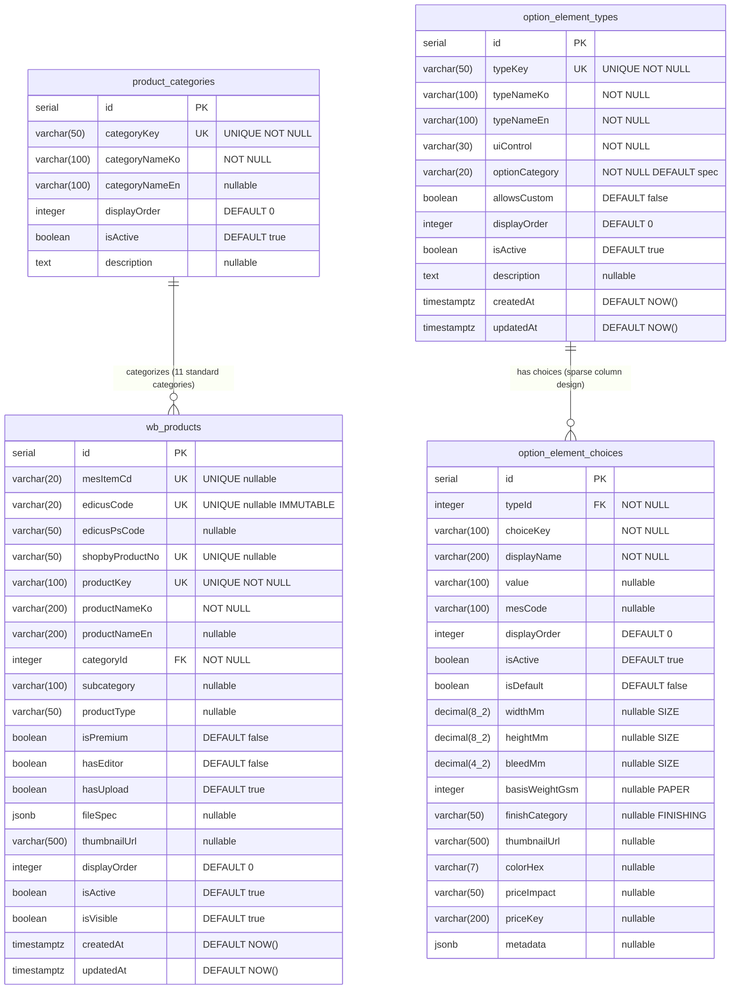

## HISTORY

| Version | Date       | Author | Description                                    |
| ------- | ---------- | ------ | ---------------------------------------------- |
| 1.0.0   | 2026-02-26 | MoAI   | 초기 작성 -- 상품 도메인 핵심 스키마 문서화     |

---

## 1. Context (범위)

### 1.1 목적

Widget Builder/Admin 시스템의 상품 도메인 핵심 데이터베이스 스키마를 문서화한다. 이 SPEC은 옵션 유형 정의, 옵션 선택지, 상품 카테고리, 상품 마스터 4개 테이블의 구조, 관계, 비즈니스 규칙을 포괄적으로 기술한다.

### 1.2 범위

- **포함**: `option_element_types`, `option_element_choices`, `product_categories`, `wb_products` 4개 테이블
- **제외**: 레시피/제약조건 (SPEC-DB-002), 가격 산정 (SPEC-DB-003), 운영/주문 (SPEC-DB-004)

### 1.3 SPEC-WA-001 연결

SPEC-WA-001 (Widget Admin Console)의 Step 1 (기본 정보)과 Step 2 (옵션 설정) 화면이 이 스키마에 직접 의존한다. Admin Console에서 상품 등록, 옵션 유형/선택지 관리, 카테고리 관리가 이 4개 테이블을 통해 수행된다.

### 1.4 의존성

- **상위 의존**: 없음 (최상위 도메인 테이블)
- **하위 의존**: SPEC-DB-002 (product_recipes, recipe_option_bindings가 이 테이블을 참조)
- **하위 의존**: SPEC-DB-003 (product_price_configs, print_cost_base 등이 wb_products를 참조)
- **하위 의존**: SPEC-DB-004 (orders, simulation_runs 등이 wb_products를 참조)

### 1.5 소스 파일 참조

| 테이블               | Drizzle ORM 파일                                                 |
| -------------------- | ---------------------------------------------------------------- |
| option_element_types | `packages/db/src/schema/widget/01-element-types.ts`              |
| option_element_choices | `packages/db/src/schema/widget/02-element-choices.ts`          |
| product_categories   | `packages/db/src/schema/widget/02-product-categories.ts`         |
| wb_products          | `packages/db/src/schema/widget/02-products.ts`                   |

### 1.6 SPEC-WB 구현 기원 (Origin Mapping)

> **주의**: 이 SPEC은 이미 구현된 DB 스키마의 소급적(retroactive) 문서화이다. 아래 모든 테이블은 SPEC-WB-* 구현 과정에서 이미 생성/적용 완료되었다. 신규 구현이 아니라 기존 스키마의 정식 문서화이다.

| 테이블                 | 원본 SPEC   | 요구사항 참조                                          | 구현 완료 |
| ---------------------- | ----------- | ------------------------------------------------------ | --------- |
| option_element_types   | SPEC-WB-001 | Section 4.1 (옵션 유형 정의, uiControl, optionCategory) | ✅ 완료 |
| option_element_choices | SPEC-WB-001 | Section 4.2 (선택지 정의, Sparse Column Design)         | ✅ 완료 |
| product_categories     | SPEC-WB-002 | FR-WB002-01 (카테고리 관리, Figma 기준 11개)            | ✅ 완료 |
| wb_products            | SPEC-WB-002 | FR-WB002-02 (상품 마스터), FR-WB002-07 (edicusCode 불변성), FR-WB002-08 (isVisible 토글) | ✅ 완료 |

**SPEC-WB 완료 현황 (이 SPEC 관련):**

| SPEC-WB ID  | 완료 상태 | 이 SPEC-DB-001에 기여한 테이블 |
| ----------- | --------- | ------------------------------ |
| SPEC-WB-001 | ✅ 완료   | option_element_types, option_element_choices |
| SPEC-WB-002 | ✅ 완료   | product_categories, wb_products (레시피 제외 — SPEC-DB-002 참조) |

---

## 2. ERD (Entity Relationship Diagram)



---

## 3. 테이블 상세 스펙

### 3.1 option_element_types

**목적**: 위젯에서 사용 가능한 모든 옵션 유형(사이즈, 용지, 후가공 등)을 정의하는 마스터 테이블.

| 필드명          | 타입            | 제약조건                        | 설명                                              |
| --------------- | --------------- | ------------------------------- | ------------------------------------------------- |
| id              | serial          | PK                              | 자동 증가 기본키                                  |
| typeKey         | varchar(50)     | UNIQUE NOT NULL                 | 옵션 유형 고유 식별자 (예: SIZE, PAPER, FINISH)   |
| typeNameKo      | varchar(100)    | NOT NULL                        | 한국어 표시명                                     |
| typeNameEn      | varchar(100)    | NOT NULL                        | 영어 표시명                                       |
| uiControl       | varchar(30)     | NOT NULL                        | UI 컨트롤 타입 (아래 허용값 참조)                 |
| optionCategory  | varchar(20)     | NOT NULL DEFAULT 'spec'         | 옵션 카테고리 분류                                |
| allowsCustom    | boolean         | DEFAULT false                   | 사용자 커스텀 입력 허용 여부                      |
| displayOrder    | integer         | DEFAULT 0                       | 표시 순서                                         |
| isActive        | boolean         | DEFAULT true                    | 활성 상태                                         |
| description     | text            | nullable                        | 옵션 유형 설명                                    |
| createdAt       | timestamptz     | DEFAULT NOW()                   | 생성 시각                                         |
| updatedAt       | timestamptz     | DEFAULT NOW()                   | 수정 시각                                         |

**uiControl 허용값**:
`toggle-group` | `toggle-multi` | `select` | `number-stepper` | `slider` | `checkbox` | `collapsible` | `color-swatch` | `image-toggle` | `text-input`

**optionCategory 허용값**:
`material` | `process` | `spec` | `quantity` | `group`

**인덱스**:

| 인덱스명           | 컬럼/조건                       | 유형    |
| ------------------- | ------------------------------- | ------- |
| idx_oet_type_key    | typeKey                         | UNIQUE  |
| idx_oet_active      | isActive (WHERE isActive=true)  | Partial |
| idx_oet_category    | optionCategory                  | B-tree  |

**@MX 주석**: `@MX:ANCHOR` -- fan_in >= 3 (option_element_choices FK, recipe_option_bindings FK, option management API)

---

### 3.2 option_element_choices

**목적**: 각 옵션 유형에 속하는 구체적인 선택지를 정의. SIZE/PAPER/FINISHING 타입은 전용 컬럼, 나머지는 metadata jsonb를 사용하는 희소 컬럼(sparse column) 설계.

| 필드명          | 타입            | 제약조건                        | 설명                                              |
| --------------- | --------------- | ------------------------------- | ------------------------------------------------- |
| id              | serial          | PK                              | 자동 증가 기본키                                  |
| typeId          | integer         | NOT NULL FK -> option_element_types.id ON DELETE CASCADE | 소속 옵션 유형          |
| choiceKey       | varchar(100)    | NOT NULL                        | 선택지 고유 키 (유형 내 유일)                     |
| displayName     | varchar(200)    | NOT NULL                        | 표시명                                            |
| value           | varchar(100)    | nullable                        | 값 (비표시용 내부 값)                             |
| mesCode         | varchar(100)    | nullable                        | MES 연동 코드 (참조 전용)                         |
| displayOrder    | integer         | DEFAULT 0                       | 표시 순서                                         |
| isActive        | boolean         | DEFAULT true                    | 활성 상태                                         |
| isDefault       | boolean         | DEFAULT false                   | 기본 선택 여부                                    |
| widthMm         | decimal(8,2)    | nullable                        | SIZE 타입: 너비(mm)                               |
| heightMm        | decimal(8,2)    | nullable                        | SIZE 타입: 높이(mm)                               |
| bleedMm         | decimal(4,2)    | nullable                        | SIZE 타입: 도련(mm)                               |
| basisWeightGsm  | integer         | nullable                        | PAPER 타입: 평량(g/m2)                            |
| finishCategory  | varchar(50)     | nullable                        | FINISHING 타입: 후가공 분류                        |
| thumbnailUrl    | varchar(500)    | nullable                        | 시각 UI: 썸네일 URL                               |
| colorHex        | varchar(7)      | nullable                        | 시각 UI: 색상 HEX 코드                            |
| priceImpact     | varchar(50)     | nullable                        | 가격 영향 표시 (예: '+1,000원')                   |
| priceKey        | varchar(200)    | nullable                        | 가격 연동 키 (SPEC-WB-005 참조)                   |
| metadata        | jsonb           | nullable                        | 비표준 타입용 추가 데이터                         |

**복합 UNIQUE 제약**: `(typeId, choiceKey)` -- 동일 유형 내에서 choiceKey는 고유해야 한다.

**인덱스**:

| 인덱스명             | 컬럼/조건                                | 유형    |
| --------------------- | ---------------------------------------- | ------- |
| idx_oec_type_id       | typeId                                   | B-tree  |
| idx_oec_mes_code      | mesCode (WHERE mesCode IS NOT NULL)      | Partial |
| idx_oec_active        | isActive (WHERE isActive=true)           | Partial |

**비즈니스 규칙**:
- SIZE/PAPER/FINISHING 타입은 전용 컬럼(widthMm, heightMm, basisWeightGsm, finishCategory)을 사용한다
- 기타 타입은 `metadata` jsonb 컬럼으로 확장 데이터를 저장한다
- `mesCode`는 참조 전용이며 내부 로직이 이에 의존해서는 안 된다

---

### 3.3 product_categories

**목적**: 상품 카테고리 마스터. Figma 디자인에서 정의된 11개 표준 카테고리를 관리한다.

| 필드명          | 타입            | 제약조건                        | 설명                                              |
| --------------- | --------------- | ------------------------------- | ------------------------------------------------- |
| id              | serial          | PK                              | 자동 증가 기본키                                  |
| categoryKey     | varchar(50)     | UNIQUE NOT NULL                 | 카테고리 고유 키                                  |
| categoryNameKo  | varchar(100)    | NOT NULL                        | 한국어 카테고리명                                 |
| categoryNameEn  | varchar(100)    | nullable                        | 영어 카테고리명                                   |
| displayOrder    | integer         | DEFAULT 0                       | 표시 순서                                         |
| isActive        | boolean         | DEFAULT true                    | 활성 상태                                         |
| description     | text            | nullable                        | 카테고리 설명                                     |

**인덱스**:

| 인덱스명         | 컬럼/조건                       | 유형    |
| ----------------- | ------------------------------- | ------- |
| idx_pc_active     | isActive (WHERE isActive=true)  | Partial |

**@MX 주석**: `@MX:ANCHOR` -- fan_in >= 3 (wb_products FK, seedProductCategories, widget category API)

**HARD RULE**: 정확히 11개의 표준 카테고리가 Figma 디자인에 의해 정의되어 있다. catalog.json은 더 이상 사용되지 않는 Excel Map 구조를 사용하므로 카테고리 정의의 기준이 아니다.

---

### 3.4 wb_products

**목적**: 위젯 빌더 상품 마스터 테이블. 내부 상품 정보와 외부 시스템(MES, Edicus, Shopby) 연동 코드를 통합 관리한다.

| 필드명          | 타입            | 제약조건                        | 설명                                              |
| --------------- | --------------- | ------------------------------- | ------------------------------------------------- |
| id              | serial          | PK                              | 자동 증가 기본키 (내부용)                         |
| mesItemCd       | varchar(20)     | UNIQUE nullable                 | MES 아이템 코드                                   |
| edicusCode      | varchar(20)     | UNIQUE nullable IMMUTABLE       | Edicus 상품 코드 (설정 후 변경 불가)              |
| edicusPsCode    | varchar(50)     | nullable                        | Edicus 페이지 스펙 코드                           |
| shopbyProductNo | varchar(50)     | UNIQUE nullable                 | Shopby 상품 번호                                  |
| productKey      | varchar(100)    | UNIQUE NOT NULL                 | 내부 비즈니스 식별자 (huni_code 개념)             |
| productNameKo   | varchar(200)    | NOT NULL                        | 한국어 상품명                                     |
| productNameEn   | varchar(200)    | nullable                        | 영어 상품명                                       |
| categoryId      | integer         | NOT NULL FK -> product_categories.id | 소속 카테고리                               |
| subcategory     | varchar(100)    | nullable                        | 하위 카테고리                                     |
| productType     | varchar(50)     | nullable                        | 상품 유형                                         |
| isPremium       | boolean         | DEFAULT false                   | 프리미엄 상품 여부                                |
| hasEditor       | boolean         | DEFAULT false                   | 에디터 기능 지원 여부                             |
| hasUpload       | boolean         | DEFAULT true                    | 파일 업로드 지원 여부                             |
| fileSpec        | jsonb           | nullable                        | 파일 업로드 사양                                  |
| thumbnailUrl    | varchar(500)    | nullable                        | 썸네일 이미지 URL                                 |
| displayOrder    | integer         | DEFAULT 0                       | 표시 순서                                         |
| isActive        | boolean         | DEFAULT true                    | 내부 운영 활성화 여부                             |
| isVisible       | boolean         | DEFAULT true                    | 고객 노출 여부 (Step 6 publish)                   |
| createdAt       | timestamptz     | DEFAULT NOW()                   | 생성 시각                                         |
| updatedAt       | timestamptz     | DEFAULT NOW()                   | 수정 시각                                         |

**인덱스**:

| 인덱스명              | 컬럼/조건                              | 유형      |
| ---------------------- | -------------------------------------- | --------- |
| idx_prod_category      | categoryId                             | B-tree    |
| idx_prod_mes_item      | mesItemCd                              | UNIQUE    |
| idx_prod_edicus        | edicusCode                             | UNIQUE    |
| idx_prod_edicus_ps     | edicusPsCode                           | B-tree    |
| idx_prod_shopby        | shopbyProductNo                        | UNIQUE    |
| idx_prod_subcategory   | (categoryId, subcategory)              | Composite |
| idx_prod_active        | isActive (WHERE isActive=true)         | Partial   |

**@MX 주석**: `@MX:ANCHOR` -- fan_in >= 3 (productRecipes FK, Edicus integration, Shopby integration, MES integration)

---

## 4. 관계 정의

| 관계                                          | 타입   | FK 컬럼                           | 참조 대상                    | ON DELETE   |
| --------------------------------------------- | ------ | --------------------------------- | ---------------------------- | ----------- |
| product_categories -> wb_products             | 1:N    | wb_products.categoryId            | product_categories.id        | (미지정)    |
| option_element_types -> option_element_choices | 1:N    | option_element_choices.typeId     | option_element_types.id      | CASCADE     |

**카디널리티 설명**:
- 하나의 카테고리에 여러 상품이 속할 수 있다 (1:N)
- 하나의 옵션 유형에 여러 선택지가 존재할 수 있다 (1:N)
- 옵션 유형이 삭제되면 해당 선택지도 함께 삭제된다 (CASCADE)

---

## 5. HARD RULES (불변 비즈니스 규칙)

1. **edicusCode IMMUTABLE**: `wb_products.edicusCode`는 한번 설정되면 변경할 수 없다. 현재 애플리케이션 레이어에서 보호 중이며, DB 트리거는 미구현 상태이다.

2. **productKey 내부 전용**: `wb_products.productKey`는 내부 huni_code 개념의 비즈니스 식별자이다. `id` (serial)를 외부 식별자로 사용하지 않는다. Edicus/Shopby/MES에는 절대 productKey를 노출하지 않는다.

3. **11개 표준 카테고리**: `product_categories`는 정확히 Figma 디자인에서 정의된 11개 카테고리를 기준으로 한다. catalog.json은 deprecated Excel Map 구조이므로 카테고리 정의 기준이 아니다.

4. **isVisible vs isActive 구분**:
   - `isActive`: 내부 운영 활성화 여부 (어드민이 상품 자체를 비활성화)
   - `isVisible`: 고객 노출 여부 (Step 6 publish에서 토글, 고객에게 보이는지 여부)

5. **외부 코드 nullable**: `mesItemCd`, `edicusCode`, `shopbyProductNo`는 모두 nullable이다. 외부 시스템 연동 전에 상품을 먼저 등록할 수 있어야 한다.

6. **Sparse Column Design**: `option_element_choices`에서 SIZE/PAPER/FINISHING 타입은 전용 컬럼을 사용하고, 기타 타입은 `metadata` jsonb를 사용한다. mesCode는 참조 전용이며 내부 로직의 의존 대상이 아니다.

---

## 6. 인덱스 전략

### 6.1 Partial Index 전략

활성 상태 필터링이 빈번한 테이블에 `WHERE isActive=true` 조건의 Partial Index를 적용한다.

- `idx_oet_active`: 활성 옵션 유형만 빠르게 조회
- `idx_oec_active`: 활성 선택지만 빠르게 조회
- `idx_pc_active`: 활성 카테고리만 빠르게 조회
- `idx_prod_active`: 활성 상품만 빠르게 조회

**이유**: 비활성 데이터는 전체 데이터의 소수이므로, Partial Index가 인덱스 크기를 줄이고 조회 성능을 향상시킨다.

### 6.2 UNIQUE Index 전략

- `typeKey`, `categoryKey`, `productKey`: 비즈니스 키 유일성 보장
- `mesItemCd`, `edicusCode`, `shopbyProductNo`: 외부 시스템 코드 유일성 보장 (nullable UNIQUE 허용)
- `(typeId, choiceKey)`: 동일 유형 내 선택지 키 유일성 보장

### 6.3 Composite Index

- `idx_prod_subcategory (categoryId, subcategory)`: 카테고리 + 하위 카테고리 복합 조회 최적화

### 6.4 쿼리 패턴별 인덱스 매핑

| 쿼리 패턴                            | 사용 인덱스          |
| ------------------------------------- | -------------------- |
| 활성 옵션 유형 목록 조회             | idx_oet_active       |
| 카테고리별 옵션 유형 필터링          | idx_oet_category     |
| 특정 유형의 활성 선택지 조회         | idx_oec_type_id + idx_oec_active |
| MES 코드로 선택지 검색               | idx_oec_mes_code     |
| 카테고리별 활성 상품 조회            | idx_prod_category + idx_prod_active |
| 외부 코드로 상품 검색                | idx_prod_mes_item / idx_prod_edicus / idx_prod_shopby |
| 카테고리 + 하위 카테고리 조합 조회   | idx_prod_subcategory |

---

## 7. JSONB 필드 스키마 정의

### 7.1 option_element_choices.metadata

비표준 옵션 유형의 추가 데이터를 저장하는 유연한 구조.

```typescript
// option_element_choices.metadata -- 타입별 다형적 구조
interface ChoiceMetadata {
  // 공통 (모든 타입에 사용 가능)
  tooltip?: string;
  helpText?: string;

  // 커스텀 타입용 확장 필드 (예시)
  [key: string]: unknown;
}
```

**설계 원칙**: SIZE, PAPER, FINISHING은 전용 컬럼으로 처리하므로 metadata에 중복 저장하지 않는다. metadata는 향후 추가되는 새로운 옵션 유형의 특수 데이터를 위한 확장점이다.

### 7.2 wb_products.fileSpec

파일 업로드 사양 정의.

```typescript
interface FileSpec {
  maxSizeMb?: number;          // 최대 파일 크기 (MB)
  allowedFormats?: string[];   // 허용 포맷 (예: ["pdf", "ai", "psd"])
  minDpi?: number;             // 최소 해상도 (DPI)
  maxFiles?: number;           // 최대 파일 수
  requireBleed?: boolean;      // 도련 포함 필수 여부
}
```

---

## 8. 데이터 무결성 규칙

### 8.1 참조 무결성

- `option_element_choices.typeId` -> `option_element_types.id`: ON DELETE CASCADE
  - 옵션 유형 삭제 시 모든 선택지도 함께 삭제
- `wb_products.categoryId` -> `product_categories.id`: ON DELETE 미지정 (RESTRICT 권장)
  - 상품이 속한 카테고리는 삭제 불가

### 8.2 UNIQUE 제약

- `option_element_types.typeKey`: 전역 유일
- `option_element_choices.(typeId, choiceKey)`: 유형 내 유일
- `product_categories.categoryKey`: 전역 유일
- `wb_products.productKey`: 전역 유일
- `wb_products.mesItemCd`: 전역 유일 (nullable)
- `wb_products.edicusCode`: 전역 유일 (nullable)
- `wb_products.shopbyProductNo`: 전역 유일 (nullable)

### 8.3 NOT NULL 제약

- 모든 표시명 (`typeNameKo`, `displayName`, `categoryNameKo`, `productNameKo`)은 NOT NULL
- 모든 비즈니스 키 (`typeKey`, `choiceKey`, `categoryKey`, `productKey`)는 NOT NULL
- `option_element_choices.typeId`: 선택지는 반드시 옵션 유형에 속해야 한다
- `wb_products.categoryId`: 상품은 반드시 카테고리에 속해야 한다

### 8.4 CHECK 제약 (미구현, 마이그레이션 SQL로 추가 필요)

- `uiControl` IN ('toggle-group', 'toggle-multi', 'select', 'number-stepper', 'slider', 'checkbox', 'collapsible', 'color-swatch', 'image-toggle', 'text-input')
- `optionCategory` IN ('material', 'process', 'spec', 'quantity', 'group')

**참고**: Drizzle ORM 스키마 레이어는 CHECK 제약을 지원하지 않으므로, 마이그레이션 SQL을 통해 추가해야 한다.
