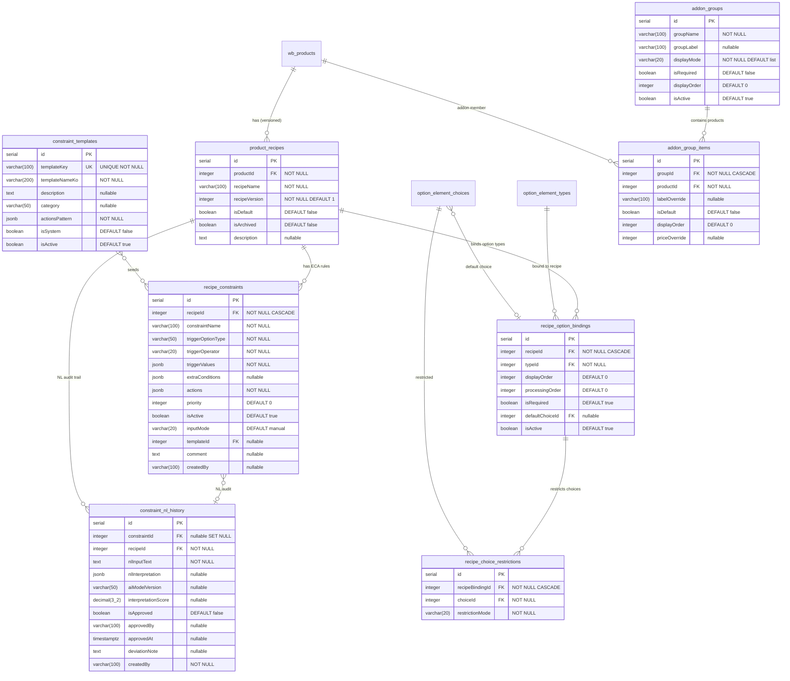

## HISTORY

| Version | Date       | Author | Description                                     |
| ------- | ---------- | ------ | ----------------------------------------------- |
| 1.0.0   | 2026-02-26 | MoAI   | 초기 작성 -- 레시피 & 제약조건 스키마 문서화     |

---

## 1. Context (범위)

### 1.1 목적

Widget Builder/Admin 시스템의 레시피(Recipe) 및 ECA(Event-Condition-Action) 제약조건 스키마를 문서화한다. 상품별 옵션 조합 규칙, 레시피 버전 관리, 자연어 제약조건 이력을 포함하는 8개 테이블을 다룬다.

### 1.2 범위

- **포함**: `product_recipes`, `recipe_option_bindings`, `recipe_choice_restrictions`, `constraint_templates`, `addon_groups`, `recipe_constraints`, `addon_group_items`, `constraint_nl_history`
- **제외**: 상품 도메인 핵심 (SPEC-DB-001), 가격 산정 (SPEC-DB-003), 운영/주문 (SPEC-DB-004)

### 1.3 SPEC-WA-001 연결

- Step 2 (옵션 설정): `recipe_option_bindings`, `recipe_choice_restrictions`
- Step 4 (제약조건): `recipe_constraints`, `constraint_templates`, `constraint_nl_history`
- Step 3 (가격 설정)과 Step 5 (시뮬레이션)에서 제약조건 평가에 의존

### 1.4 의존성

- **상위 의존**: SPEC-DB-001 (`wb_products`, `option_element_types`, `option_element_choices`)
- **하위 의존**: SPEC-DB-004 (orders 테이블이 `product_recipes`를 참조)

### 1.5 소스 파일 참조

| 테이블                     | Drizzle ORM 파일                                                      |
| -------------------------- | --------------------------------------------------------------------- |
| product_recipes            | `packages/db/src/schema/widget/02-product-recipes.ts`                 |
| recipe_option_bindings     | `packages/db/src/schema/widget/02-recipe-option-bindings.ts`          |
| recipe_choice_restrictions | `packages/db/src/schema/widget/02-recipe-choice-restrictions.ts`      |
| constraint_templates       | `packages/db/src/schema/widget/03-constraint-templates.ts`            |
| addon_groups               | `packages/db/src/schema/widget/03-addon-groups.ts`                    |
| recipe_constraints         | `packages/db/src/schema/widget/03-recipe-constraints.ts`              |
| addon_group_items          | `packages/db/src/schema/widget/03-addon-group-items.ts`               |
| constraint_nl_history      | `packages/db/src/schema/widget/03-constraint-nl-history.ts`           |

### 1.6 SPEC-WB 구현 기원 (Origin Mapping)

> **주의**: 이 SPEC은 이미 구현된 DB 스키마의 소급적(retroactive) 문서화이다. 아래 모든 테이블은 SPEC-WB-* 구현 과정에서 이미 생성/적용 완료되었다. 신규 구현이 아니라 기존 스키마의 정식 문서화이다.

| 테이블                     | 원본 SPEC   | 요구사항 참조                                   | 구현 완료 |
| -------------------------- | ----------- | ----------------------------------------------- | --------- |
| product_recipes            | SPEC-WB-002 | FR-WB002-06 (레시피 버전 관리, archive 패턴)    | ✅ 완료 |
| recipe_option_bindings     | SPEC-WB-002 | FR-WB002-04 (옵션 바인딩, displayOrder != processingOrder) | ✅ 완료 |
| recipe_choice_restrictions | SPEC-WB-002 | FR-WB002-05 (선택지 제한, allow_only / exclude) | ✅ 완료 |
| constraint_templates       | SPEC-WB-003 | FR-WB003-09 (ECA 템플릿, Quick Pick 시드)       | ✅ 완료 |
| addon_groups               | SPEC-WB-003 | FR-WB003-08 (부가 그룹, list/grid/carousel)     | ✅ 완료 |
| addon_group_items          | SPEC-WB-003 | FR-WB003-08 (부가 그룹 아이템)                  | ✅ 완료 |
| recipe_constraints         | SPEC-WB-003 | FR-WB003-01~09 (ECA 제약조건 엔진, triggerValues/actions JSONB) | ✅ 완료 |
| constraint_nl_history      | SPEC-WB-003 | FR-WB003-10 (자연어 → 제약조건 AI 이력)         | ✅ 완료 |

**SPEC-WB 완료 현황 (이 SPEC 관련):**

| SPEC-WB ID  | 완료 상태 | 이 SPEC-DB-002에 기여한 테이블 |
| ----------- | --------- | ------------------------------ |
| SPEC-WB-002 | ✅ 완료   | product_recipes, recipe_option_bindings, recipe_choice_restrictions |
| SPEC-WB-003 | ✅ 완료   | constraint_templates, addon_groups, addon_group_items, recipe_constraints, constraint_nl_history |

---

## 2. ERD (Entity Relationship Diagram)



---

## 3. 테이블 상세 스펙

### 3.1 product_recipes

**목적**: 상품별 레시피(옵션 조합 구성) 버전을 관리. 레시피 변경 시 기존 버전을 아카이브하고 새 버전을 생성하여 주문 이력 무결성을 보장한다.

| 필드명        | 타입          | 제약조건                        | 설명                                    |
| ------------- | ------------- | ------------------------------- | --------------------------------------- |
| id            | serial        | PK                              | 자동 증가 기본키                        |
| productId     | integer       | NOT NULL FK -> wb_products.id   | 소속 상품                               |
| recipeName    | varchar(100)  | NOT NULL                        | 레시피 이름                             |
| recipeVersion | integer       | NOT NULL DEFAULT 1              | 레시피 버전 번호                        |
| isDefault     | boolean       | DEFAULT false                   | 기본 레시피 여부                        |
| isArchived    | boolean       | DEFAULT false                   | 아카이브 여부                           |
| description   | text          | nullable                        | 레시피 설명                             |

**복합 UNIQUE 제약**: `(productId, recipeVersion)` -- 상품당 버전 번호 유일

**인덱스**:

| 인덱스명        | 컬럼/조건                         | 유형      |
| ---------------- | --------------------------------- | --------- |
| idx_pr_product   | productId                         | B-tree    |
| idx_pr_default   | (productId, isDefault)            | Composite |

**HARD RULE -- 레시피 버전 관리 패턴**:
- 레시피 수정 = 기존 레시피 아카이브(isArchived=true) + 새 레시피 생성(version+1)
- 기존 주문은 불변 레시피 버전을 참조하므로 주문 이력 무결성이 보장됨
- 절대 기존 레시피를 직접 UPDATE하지 않는다

---

### 3.2 recipe_option_bindings

**목적**: 레시피에 바인딩된 옵션 유형 목록과 순서를 관리. 표시 순서(displayOrder)와 처리 순서(processingOrder)가 독립적이다.

| 필드명           | 타입      | 제약조건                                          | 설명                          |
| ---------------- | --------- | ------------------------------------------------- | ----------------------------- |
| id               | serial    | PK                                                | 자동 증가 기본키              |
| recipeId         | integer   | NOT NULL FK -> product_recipes.id ON DELETE CASCADE | 소속 레시피                  |
| typeId           | integer   | NOT NULL FK -> option_element_types.id             | 바인딩된 옵션 유형            |
| displayOrder     | integer   | DEFAULT 0                                          | 고객 UI 표시 순서             |
| processingOrder  | integer   | DEFAULT 0                                          | 가격/MES 처리 순서            |
| isRequired       | boolean   | DEFAULT true                                       | 필수 옵션 여부                |
| defaultChoiceId  | integer   | FK -> option_element_choices.id (nullable)          | 기본 선택지                   |
| isActive         | boolean   | DEFAULT true                                       | 활성 상태                     |

**복합 UNIQUE 제약**: `(recipeId, typeId)` -- 레시피당 옵션 유형 바인딩 유일

**인덱스**:

| 인덱스명            | 컬럼/조건                         | 유형      |
| -------------------- | --------------------------------- | --------- |
| idx_rob_recipe       | recipeId                          | B-tree    |
| idx_rob_display      | (recipeId, displayOrder)          | Composite |
| idx_rob_processing   | (recipeId, processingOrder)       | Composite |

**HARD RULE**: `displayOrder` (고객 UI 시퀀스) != `processingOrder` (가격/MES 로직 시퀀스). 서로 다른 소비자(위젯 UI vs 가격 엔진)를 위한 독립적 정렬이다.

---

### 3.3 recipe_choice_restrictions

**목적**: 레시피 바인딩에서 사용 가능한 선택지를 제한. allow_only(허용 목록) 또는 exclude(차단 목록) 모드로 동작한다.

| 필드명           | 타입      | 제약조건                                                  | 설명                      |
| ---------------- | --------- | --------------------------------------------------------- | ------------------------- |
| id               | serial    | PK                                                        | 자동 증가 기본키          |
| recipeBindingId  | integer   | NOT NULL FK -> recipe_option_bindings.id ON DELETE CASCADE | 소속 바인딩               |
| choiceId         | integer   | NOT NULL FK -> option_element_choices.id                   | 제한 대상 선택지          |
| restrictionMode  | varchar(20) | NOT NULL                                                 | 'allow_only' 또는 'exclude' |

**복합 UNIQUE 제약**: `(recipeBindingId, choiceId)` -- 바인딩당 선택지 제한 유일

**인덱스**:

| 인덱스명       | 컬럼       | 유형   |
| --------------- | ---------- | ------ |
| idx_rcr_binding | recipeBindingId | B-tree |

**CHECK 제약 (마이그레이션 SQL 필요)**:
```sql
ALTER TABLE recipe_choice_restrictions
ADD CONSTRAINT chk_rcr_restriction_mode
CHECK (restriction_mode IN ('allow_only', 'exclude'));
```

---

### 3.4 constraint_templates

**목적**: ECA 제약조건의 Quick Pick 시딩을 위한 템플릿. 반복적으로 사용되는 제약 패턴을 미리 정의한다.

| 필드명                | 타입          | 제약조건              | 설명                              |
| --------------------- | ------------- | --------------------- | --------------------------------- |
| id                    | serial        | PK                    | 자동 증가 기본키                  |
| templateKey           | varchar(100)  | UNIQUE NOT NULL       | 템플릿 고유 키                    |
| templateNameKo        | varchar(200)  | NOT NULL              | 한국어 템플릿명                   |
| description           | text          | nullable              | 설명                              |
| category              | varchar(50)   | nullable              | 템플릿 분류                       |
| triggerOptionType     | varchar(50)   | nullable              | 트리거 옵션 유형 템플릿           |
| triggerOperator       | varchar(20)   | nullable              | 트리거 연산자 템플릿              |
| triggerValuesPattern  | jsonb         | nullable              | 트리거 값 패턴 템플릿             |
| extraConditionsPattern| jsonb         | nullable              | 추가 조건 패턴 템플릿             |
| actionsPattern        | jsonb         | NOT NULL              | ECA 액션 배열 템플릿 (최소 1개)   |
| isSystem              | boolean       | DEFAULT false         | 시스템 기본 템플릿 여부           |
| isActive              | boolean       | DEFAULT true          | 활성 상태                         |

---

### 3.5 addon_groups

**목적**: 부가 상품 그룹을 정의. ECA 제약조건의 `show_addon_list` 액션에서 참조된다.

| 필드명       | 타입          | 제약조건              | 설명                              |
| ------------ | ------------- | --------------------- | --------------------------------- |
| id           | serial        | PK                    | 자동 증가 기본키                  |
| groupName    | varchar(100)  | NOT NULL              | 그룹명                            |
| groupLabel   | varchar(100)  | nullable              | 표시 라벨                         |
| displayMode  | varchar(20)   | NOT NULL DEFAULT 'list' | 표시 모드 (list/grid/carousel)  |
| isRequired   | boolean       | DEFAULT false         | 필수 선택 여부                    |
| displayOrder | integer       | DEFAULT 0             | 표시 순서                         |
| description  | text          | nullable              | 그룹 설명                         |
| isActive     | boolean       | DEFAULT true          | 활성 상태                         |

**CHECK 제약 (마이그레이션 SQL 필요)**:
```sql
ALTER TABLE addon_groups
ADD CONSTRAINT chk_ag_display_mode
CHECK (display_mode IN ('list', 'grid', 'carousel'));
```

---

### 3.6 recipe_constraints (핵심 ECA 테이블)

**목적**: 레시피별 ECA(Event-Condition-Action) 제약조건 규칙을 저장. 위젯에서 옵션 선택 시 동적 UI 변경, 가격 추가, 선택지 필터링 등을 수행한다.

| 필드명            | 타입          | 제약조건                                          | 설명                              |
| ----------------- | ------------- | ------------------------------------------------- | --------------------------------- |
| id                | serial        | PK                                                | 자동 증가 기본키                  |
| recipeId          | integer       | NOT NULL FK -> product_recipes.id ON DELETE CASCADE | 소속 레시피                      |
| constraintName    | varchar(100)  | NOT NULL                                          | 제약조건명                        |
| triggerOptionType | varchar(50)   | NOT NULL                                          | 트리거 옵션 유형                  |
| triggerOperator   | varchar(20)   | NOT NULL                                          | 비교 연산자 (in, equals, not_in 등) |
| triggerValues     | jsonb         | NOT NULL                                          | 트리거 매칭 값 배열               |
| extraConditions   | jsonb         | nullable                                          | 추가 AND 조건                     |
| actions           | jsonb         | NOT NULL                                          | ECA 액션 배열 (최소 1개 필수)     |
| priority          | integer       | DEFAULT 0                                         | 우선순위 (높을수록 먼저 평가)     |
| isActive          | boolean       | DEFAULT true                                      | 활성 상태                         |
| inputMode         | varchar(20)   | DEFAULT 'manual'                                  | 입력 방식 (manual/template/nl)    |
| templateId        | integer       | FK -> constraint_templates.id (nullable)           | 원본 템플릿 참조                  |
| comment           | text          | nullable                                          | 관리자 코멘트                     |
| createdBy         | varchar(100)  | nullable                                          | 생성자                            |

**인덱스**:

| 인덱스명          | 컬럼/조건                                   | 유형    |
| ------------------ | ------------------------------------------- | ------- |
| idx_rc_recipe      | recipeId                                    | B-tree  |
| idx_rc_trigger     | (recipeId, triggerOptionType)               | Composite |
| idx_rc_active      | isActive (WHERE isActive=true)              | Partial |
| idx_rc_priority    | (recipeId, priority)                        | Composite |

**@MX 주석**: `@MX:ANCHOR` -- fan_in >= 3 (constraint service, evaluate endpoint, admin routes, nl_history FK)

---

### 3.7 addon_group_items

**목적**: 부가 상품 그룹에 포함된 개별 상품 항목.

| 필드명        | 타입          | 제약조건                                          | 설명                      |
| ------------- | ------------- | ------------------------------------------------- | ------------------------- |
| id            | serial        | PK                                                | 자동 증가 기본키          |
| groupId       | integer       | NOT NULL FK -> addon_groups.id ON DELETE CASCADE   | 소속 그룹                 |
| productId     | integer       | NOT NULL FK -> wb_products.id                      | 대상 상품                 |
| labelOverride | varchar(100)  | nullable                                          | 표시명 오버라이드         |
| isDefault     | boolean       | DEFAULT false                                     | 기본 선택 여부            |
| displayOrder  | integer       | DEFAULT 0                                         | 표시 순서                 |
| priceOverride | integer       | nullable                                          | 가격 오버라이드           |

**복합 UNIQUE 제약**: `(groupId, productId)` -- 그룹당 상품 유일

---

### 3.8 constraint_nl_history

**목적**: 자연어 입력으로 생성된 ECA 제약조건의 감사 이력. AI 해석 결과와 사용자 승인 상태를 추적한다.

| 필드명              | 타입          | 제약조건                                                      | 설명                          |
| ------------------- | ------------- | ------------------------------------------------------------- | ----------------------------- |
| id                  | serial        | PK                                                            | 자동 증가 기본키              |
| constraintId        | integer       | FK -> recipe_constraints.id ON DELETE SET NULL (nullable)      | 원본 제약조건 (삭제 시 NULL)  |
| recipeId            | integer       | NOT NULL FK -> product_recipes.id                              | 소속 레시피                   |
| nlInputText         | text          | NOT NULL                                                      | 원본 자연어 입력              |
| nlInterpretation    | jsonb         | nullable                                                      | AI 파싱 결과 ECA 구조         |
| aiModelVersion      | varchar(50)   | nullable                                                      | 사용된 AI 모델 버전           |
| interpretationScore | decimal(3,2)  | nullable                                                      | 해석 신뢰도 점수 (0.00~1.00) |
| isApproved          | boolean       | DEFAULT false                                                 | 사용자 승인 여부              |
| approvedBy          | varchar(100)  | nullable                                                      | 승인자                        |
| approvedAt          | timestamptz   | nullable                                                      | 승인 시각                     |
| deviationNote       | text          | nullable                                                      | AI 해석 편차 메모             |
| createdBy           | varchar(100)  | NOT NULL                                                      | 생성자                        |

**FK 특수 동작**: `constraintId` ON DELETE SET NULL -- 제약조건이 삭제되더라도 NL 이력은 보존된다.

---

## 4. 관계 정의

| 관계                                               | 타입   | FK 컬럼                              | 참조 대상                    | ON DELETE  |
| -------------------------------------------------- | ------ | ------------------------------------ | ---------------------------- | ---------- |
| wb_products -> product_recipes                     | 1:N    | product_recipes.productId            | wb_products.id               | (미지정)   |
| product_recipes -> recipe_option_bindings          | 1:N    | recipe_option_bindings.recipeId      | product_recipes.id           | CASCADE    |
| option_element_types -> recipe_option_bindings     | 1:N    | recipe_option_bindings.typeId        | option_element_types.id      | (미지정)   |
| option_element_choices -> recipe_option_bindings   | N:1    | recipe_option_bindings.defaultChoiceId | option_element_choices.id  | (nullable) |
| recipe_option_bindings -> recipe_choice_restrictions | 1:N  | recipe_choice_restrictions.recipeBindingId | recipe_option_bindings.id | CASCADE   |
| option_element_choices -> recipe_choice_restrictions | 1:N  | recipe_choice_restrictions.choiceId  | option_element_choices.id    | (미지정)   |
| product_recipes -> recipe_constraints              | 1:N    | recipe_constraints.recipeId          | product_recipes.id           | CASCADE    |
| constraint_templates -> recipe_constraints         | 1:N    | recipe_constraints.templateId        | constraint_templates.id      | (nullable) |
| addon_groups -> addon_group_items                  | 1:N    | addon_group_items.groupId            | addon_groups.id              | CASCADE    |
| wb_products -> addon_group_items                   | 1:N    | addon_group_items.productId          | wb_products.id               | (미지정)   |
| recipe_constraints -> constraint_nl_history        | 1:N    | constraint_nl_history.constraintId   | recipe_constraints.id        | SET NULL   |
| product_recipes -> constraint_nl_history           | 1:N    | constraint_nl_history.recipeId       | product_recipes.id           | (미지정)   |

---

## 5. HARD RULES (불변 비즈니스 규칙)

1. **레시피 버전 관리 패턴**: 레시피 수정 = 기존 아카이브(isArchived=true) + 새 버전 생성(recipeVersion+1). 기존 레시피의 직접 UPDATE는 금지된다. 기존 주문이 불변 레시피 버전을 참조하므로 주문 이력 무결성이 보장된다.

2. **displayOrder vs processingOrder 독립성**: recipe_option_bindings에서 displayOrder(고객 UI 순서)와 processingOrder(가격/MES 처리 순서)는 서로 다른 값을 가질 수 있다. 각각 다른 소비자(위젯 UI vs 가격 엔진)를 위한 것이다.

3. **ECA actions 최소 1개 필수**: recipe_constraints.actions 배열은 최소 1개의 액션을 포함해야 한다. 빈 배열은 API 레벨에서 검증되어야 한다.

4. **restrictionMode 허용값**: recipe_choice_restrictions.restrictionMode는 'allow_only' 또는 'exclude'만 허용된다. CHECK 제약은 마이그레이션 SQL로 추가해야 한다.

5. **NL History 보존**: constraint_nl_history.constraintId는 ON DELETE SET NULL이다. 제약조건이 삭제되더라도 자연어 입력 이력은 감사 목적으로 보존된다.

6. **displayMode 허용값**: addon_groups.displayMode는 'list', 'grid', 'carousel'만 허용된다.

---

## 6. 인덱스 전략

### 6.1 레시피 조회 패턴

| 쿼리 패턴                          | 사용 인덱스                |
| ----------------------------------- | -------------------------- |
| 상품별 레시피 목록                  | idx_pr_product             |
| 상품의 기본 레시피 조회             | idx_pr_default             |
| 레시피별 옵션 바인딩 (UI 순서)      | idx_rob_display            |
| 레시피별 옵션 바인딩 (처리 순서)    | idx_rob_processing         |

### 6.2 제약조건 평가 패턴

| 쿼리 패턴                            | 사용 인덱스              |
| ------------------------------------- | ------------------------ |
| 레시피별 활성 제약조건                | idx_rc_recipe + idx_rc_active |
| 특정 옵션 유형의 제약조건             | idx_rc_trigger           |
| 우선순위 순서 제약조건 평가           | idx_rc_priority          |
| 바인딩별 선택지 제한                  | idx_rcr_binding          |

---

## 7. JSONB 필드 스키마 정의

### 7.1 recipe_constraints.triggerValues

```typescript
// 트리거 매칭 값 배열
type TriggerValues = string[];
// 예: ["투명PVC", "OPP"] -- triggerOperator='in'일 때 해당 값 중 하나와 매칭
```

### 7.2 recipe_constraints.extraConditions

```typescript
// 추가 AND 조건 (nullable)
interface ExtraCondition {
  optionType: string;        // 추가 조건 대상 옵션 유형
  operator: string;          // 비교 연산자
  values: string[];          // 매칭 값 배열
}
type ExtraConditions = ExtraCondition[];
```

### 7.3 recipe_constraints.actions (핵심 ECA 액션 스키마)

```typescript
type Action =
  | { type: 'disable_option'; targetOptionType: string }
  | { type: 'filter_choices'; targetOptionType: string; allowedChoices: string[] }
  | { type: 'set_default'; targetOptionType: string; defaultChoice: string }
  | { type: 'show_message'; message: string; level: 'info' | 'warning' | 'error' }
  | { type: 'add_cost'; costCode: string; amount: number; priceType: 'fixed' | 'per_unit' }
  | { type: 'show_addon_list'; addonGroupId: number }
  | { type: 'require_upload'; uploadSpec: object }
  | { type: 'redirect_product'; targetProductId: number }

// actions 배열은 최소 1개 액션을 포함해야 한다
type Actions = [Action, ...Action[]];
```

### 7.4 constraint_templates.actionsPattern

```typescript
// 템플릿 액션 패턴 -- actions와 동일한 구조이나, 값에 플레이스홀더 포함 가능
// 예: { type: 'filter_choices', targetOptionType: '{{target}}', allowedChoices: ['{{choice1}}'] }
type ActionsPattern = Action[];
```

### 7.5 constraint_nl_history.nlInterpretation

```typescript
// AI가 자연어 입력을 파싱한 ECA 구조
interface NlInterpretation {
  triggerOptionType: string;
  triggerOperator: string;
  triggerValues: string[];
  extraConditions?: ExtraCondition[];
  actions: Action[];
  confidence: number;        // 0.0 ~ 1.0
  reasoning?: string;        // AI 추론 과정 설명
}
```

---

## 8. 데이터 무결성 규칙

### 8.1 CASCADE 삭제 체인

레시피 삭제 시 다음 순서로 CASCADE 삭제가 발생한다:
1. `product_recipes` 삭제
2. -> `recipe_option_bindings` CASCADE 삭제
3.   -> `recipe_choice_restrictions` CASCADE 삭제
4. -> `recipe_constraints` CASCADE 삭제
5. -> `constraint_nl_history.constraintId` SET NULL (이력 보존)

### 8.2 참조 무결성 주의사항

- `recipe_option_bindings.defaultChoiceId`: nullable FK -- 기본 선택지가 없을 수 있음
- `recipe_constraints.templateId`: nullable FK -- 수동 생성 제약조건은 템플릿 없음
- `constraint_nl_history.constraintId`: nullable FK + SET NULL -- 삭제 시에도 이력 보존

### 8.3 UNIQUE 복합 제약

- `(productId, recipeVersion)`: 상품당 레시피 버전 유일성
- `(recipeId, typeId)`: 레시피당 옵션 유형 바인딩 유일성
- `(recipeBindingId, choiceId)`: 바인딩당 선택지 제한 유일성
- `(groupId, productId)`: 그룹당 부가 상품 유일성
