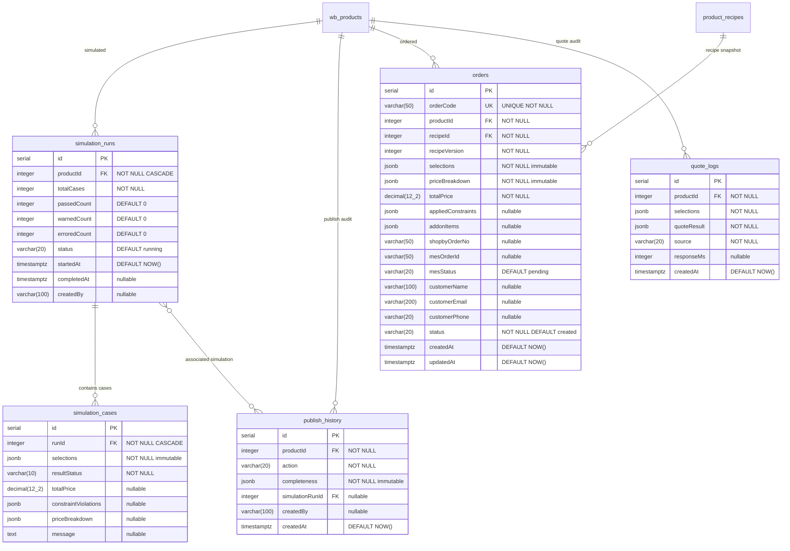

## HISTORY

| Version | Date       | Author | Description                                    |
| ------- | ---------- | ------ | ---------------------------------------------- |
| 1.0.0   | 2026-02-26 | MoAI   | 초기 작성 -- 운영 & 주문 스키마 문서화          |

---

## 1. Context (범위)

### 1.1 목적

Widget Builder/Admin 시스템의 운영(시뮬레이션, 퍼블리시) 및 주문(주문, 견적 로그) 데이터베이스 스키마를 문서화한다. 상품 출시 전 시뮬레이션 검증, 퍼블리시 감사 이력, 주문 생명주기, 견적 성능 로그 5개 테이블을 다룬다.

### 1.2 범위

- **포함**: `simulation_runs`, `simulation_cases`, `publish_history`, `orders` (wbOrders), `quote_logs` (wbQuoteLogs)
- **제외**: 상품 도메인 핵심 (SPEC-DB-001), 레시피/제약조건 (SPEC-DB-002), 가격 산정 (SPEC-DB-003)

### 1.3 SPEC-WA-001 연결

- Step 5 (시뮬레이션): `simulation_runs`, `simulation_cases`
- Step 6 (퍼블리시): `publish_history`, `wb_products.isVisible` 토글

### 1.4 의존성

- **상위 의존**: SPEC-DB-001 (`wb_products`), SPEC-DB-002 (`product_recipes`), SPEC-DB-003 (가격 산출 결과)
- **하위 의존**: 없음 (최하위 도메인 테이블)

### 1.5 소스 파일 참조

| 테이블            | Drizzle ORM 파일                                                 |
| ----------------- | ---------------------------------------------------------------- |
| simulation_runs   | `packages/db/src/schema/widget/05-simulation-runs.ts`            |
| simulation_cases  | `packages/db/src/schema/widget/05-simulation-runs.ts` (동일 파일) |
| publish_history   | `packages/db/src/schema/widget/05-publish-history.ts`            |
| orders (wbOrders) | `packages/db/src/schema/widget/06-orders.ts`                     |
| quote_logs (wbQuoteLogs) | `packages/db/src/schema/widget/06-orders.ts` (동일 파일)  |

### 1.6 SPEC-WB 구현 기원 (Origin Mapping)

> **주의**: 이 SPEC은 이미 구현된 DB 스키마의 소급적(retroactive) 문서화이다. 아래 모든 테이블은 SPEC-WB-* 구현 과정에서 이미 생성/적용 완료되었다. 신규 구현이 아니라 기존 스키마의 정식 문서화이다.

| 테이블                   | 원본 SPEC   | 요구사항 참조                                          | 구현 완료 |
| ------------------------ | ----------- | ------------------------------------------------------ | --------- |
| simulation_runs          | SPEC-WB-005 | FR-WB005-03 (시뮬레이션 실행, status 상태머신)         | ✅ 완료 |
| simulation_cases         | SPEC-WB-005 | FR-WB005-04 (시뮬레이션 케이스, pass/warn/error)       | ✅ 완료 |
| publish_history          | SPEC-WB-005 | FR-WB005-05 (퍼블리시 이력), FR-WB005-06 (완전성 스냅샷 불변성) | ✅ 완료 |
| orders (wbOrders)        | SPEC-WB-006 | FR-WB006-05 (주문 생명주기 상태머신), FR-WB006-06 (MES 연동 mesStatus) | ✅ 완료 |
| quote_logs (wbQuoteLogs) | SPEC-WB-006 | FR-WB006-04 (견적 성능 로그, Auto-Quote Engine 감사)   | ✅ 완료 |

**SPEC-WB 완료 현황 (이 SPEC 관련):**

| SPEC-WB ID  | 완료 상태 | 이 SPEC-DB-004에 기여한 테이블 |
| ----------- | --------- | ------------------------------ |
| SPEC-WB-005 | ✅ 완료   | simulation_runs, simulation_cases, publish_history |
| SPEC-WB-006 | ✅ 완료   | orders (wbOrders), quote_logs (wbQuoteLogs) |

---

## 2. ERD (Entity Relationship Diagram)



---

## 3. 테이블 상세 스펙

### 3.1 simulation_runs

**목적**: 상품 출시 전 시뮬레이션 실행 이력을 관리. 모든 옵션 조합에 대해 가격 산출과 제약조건 평가를 수행하고 결과를 기록한다.

| 필드명       | 타입          | 제약조건                                    | 설명                                |
| ------------ | ------------- | ------------------------------------------- | ----------------------------------- |
| id           | serial        | PK                                          | 자동 증가 기본키                    |
| productId    | integer       | NOT NULL FK -> wb_products.id ON DELETE CASCADE | 대상 상품                       |
| totalCases   | integer       | NOT NULL                                    | 총 조합 수                          |
| passedCount  | integer       | DEFAULT 0                                   | 통과 케이스 수                      |
| warnedCount  | integer       | DEFAULT 0                                   | 경고 케이스 수                      |
| erroredCount | integer       | DEFAULT 0                                   | 에러 케이스 수                      |
| status       | varchar(20)   | DEFAULT 'running'                           | 상태 (running/completed/failed/cancelled) |
| startedAt    | timestamptz   | DEFAULT NOW()                               | 시작 시각                           |
| completedAt  | timestamptz   | nullable                                    | 완료 시각                           |
| createdBy    | varchar(100)  | nullable                                    | 실행자                              |

**인덱스**:

| 인덱스명      | 컬럼      | 유형   |
| -------------- | --------- | ------ |
| idx_sr_product | productId | B-tree |
| idx_sr_status  | status    | B-tree |

**@MX 주석**: `@MX:ANCHOR` -- fan_in >= 3 (simulation_cases FK, publish_history FK, widget-admin tRPC router, simulation status endpoint)

**상태 머신**:
```
running -> completed (모든 케이스 처리 완료)
running -> failed (처리 중 오류 발생)
running -> cancelled (사용자 취소)
```

---

### 3.2 simulation_cases

**목적**: 시뮬레이션 실행의 개별 테스트 케이스 결과를 저장.

| 필드명               | 타입          | 제약조건                                    | 설명                          |
| -------------------- | ------------- | ------------------------------------------- | ----------------------------- |
| id                   | serial        | PK                                          | 자동 증가 기본키              |
| runId                | integer       | NOT NULL FK -> simulation_runs.id ON DELETE CASCADE | 소속 시뮬레이션 실행    |
| selections           | jsonb         | NOT NULL                                    | 옵션 선택 스냅샷 (불변)      |
| resultStatus         | varchar(10)   | NOT NULL                                    | 결과 (pass/warn/error)        |
| totalPrice           | decimal(12,2) | nullable                                    | 산출 가격                     |
| constraintViolations | jsonb         | nullable                                    | 위반된 ECA 규칙               |
| priceBreakdown       | jsonb         | nullable                                    | 가격 산출 내역                |
| message              | text          | nullable                                    | 결과 메시지                   |

**인덱스**:

| 인덱스명       | 컬럼/조건                    | 유형      |
| --------------- | ---------------------------- | --------- |
| idx_sc_run      | runId                        | B-tree    |
| idx_sc_status   | (runId, resultStatus)        | Composite |

---

### 3.3 publish_history

**목적**: 상품 퍼블리시/언퍼블리시 감사 이력. completeness jsonb에 퍼블리시 시점의 완전성 상태를 불변 스냅샷으로 저장한다.

| 필드명            | 타입          | 제약조건                                    | 설명                                |
| ----------------- | ------------- | ------------------------------------------- | ----------------------------------- |
| id                | serial        | PK                                          | 자동 증가 기본키                    |
| productId         | integer       | NOT NULL FK -> wb_products.id               | 대상 상품                           |
| action            | varchar(20)   | NOT NULL                                    | 액션 (publish/unpublish)            |
| completeness      | jsonb         | NOT NULL                                    | 완전성 상태 스냅샷 (불변)           |
| simulationRunId   | integer       | FK -> simulation_runs.id (nullable)         | 연관 시뮬레이션 (없을 수 있음)      |
| createdBy         | varchar(100)  | nullable                                    | 실행자                              |
| createdAt         | timestamptz   | DEFAULT NOW()                               | 실행 시각                           |

**인덱스**:

| 인덱스명       | 컬럼      | 유형   |
| --------------- | --------- | ------ |
| idx_ph_product  | productId | B-tree |

**@MX 주석**: `@MX:NOTE` -- immutable audit log

**HARD RULE**: `completeness` jsonb는 퍼블리시 시점에 캡처된 불변 스냅샷이다. 기존 레코드를 절대 UPDATE하지 않는다.

---

### 3.4 orders (wbOrders)

**목적**: 위젯을 통한 주문을 저장. 주문 시점의 레시피 버전, 선택 항목, 가격 내역을 불변 스냅샷으로 보존한다. 주문 생명주기(status)와 MES 동기화 생명주기(mesStatus) 두 개의 상태 머신을 가진다.

| 필드명              | 타입          | 제약조건                               | 설명                                      |
| ------------------- | ------------- | -------------------------------------- | ----------------------------------------- |
| id                  | serial        | PK                                     | 자동 증가 기본키                          |
| orderCode           | varchar(50)   | UNIQUE NOT NULL                        | 사람이 읽을 수 있는 주문 코드             |
| productId           | integer       | NOT NULL FK -> wb_products.id          | 주문 상품                                 |
| recipeId            | integer       | NOT NULL FK -> product_recipes.id      | 주문 시 사용된 레시피                     |
| recipeVersion       | integer       | NOT NULL                               | 주문 시 레시피 버전 스냅샷                |
| selections          | jsonb         | NOT NULL                               | 고객 선택 항목 스냅샷 (불변)              |
| priceBreakdown      | jsonb         | NOT NULL                               | 가격 산출 내역 (불변)                     |
| totalPrice          | decimal(12,2) | NOT NULL                               | 최종 가격                                 |
| appliedConstraints  | jsonb         | nullable                               | 적용된 ECA 제약조건                       |
| addonItems          | jsonb         | nullable                               | 포함된 부가 상품                          |
| shopbyOrderNo       | varchar(50)   | nullable                               | Shopby 주문 번호                          |
| mesOrderId          | varchar(50)   | nullable                               | MES 주문 ID                               |
| mesStatus           | varchar(20)   | DEFAULT 'pending'                      | MES 동기화 상태                           |
| customerName        | varchar(100)  | nullable                               | 고객명                                    |
| customerEmail       | varchar(200)  | nullable                               | 고객 이메일                               |
| customerPhone       | varchar(20)   | nullable                               | 고객 전화번호                             |
| status              | varchar(20)   | NOT NULL DEFAULT 'created'             | 주문 생명주기 상태                        |
| createdAt           | timestamptz   | DEFAULT NOW()                          | 생성 시각                                 |
| updatedAt           | timestamptz   | DEFAULT NOW()                          | 수정 시각                                 |

**인덱스**:

| 인덱스명       | 컬럼           | 유형   |
| --------------- | -------------- | ------ |
| idx_ord_product | productId      | B-tree |
| idx_ord_status  | status         | B-tree |
| idx_ord_mes     | mesOrderId     | B-tree |
| idx_ord_shopby  | shopbyOrderNo  | B-tree |
| idx_ord_created | createdAt      | B-tree |

**@MX 주석**: `@MX:ANCHOR` -- fan_in >= 3 (OrderService create, status API, MES dispatch, Shopby sync)

**주문 상태 머신 (status)**:
```
created -> paid -> in_production -> shipped -> completed
created -> cancelled
paid -> cancelled
```

**MES 동기화 상태 머신 (mesStatus)**:
```
pending -> sent -> confirmed
pending -> sent -> failed
pending -> not_linked (mesItemCd가 없는 경우)
```

---

### 3.5 quote_logs (wbQuoteLogs)

**목적**: 견적 계산 요청 및 결과를 기록. 성능 모니터링과 가격 정확성 감사에 사용된다.

| 필드명       | 타입          | 제약조건                               | 설명                                    |
| ------------ | ------------- | -------------------------------------- | --------------------------------------- |
| id           | serial        | PK                                     | 자동 증가 기본키                        |
| productId    | integer       | NOT NULL FK -> wb_products.id          | 대상 상품                               |
| selections   | jsonb         | NOT NULL                               | 견적 요청 선택 항목                     |
| quoteResult  | jsonb         | NOT NULL                               | 견적 계산 결과                          |
| source       | varchar(20)   | NOT NULL                               | 견적 출처 (client/server/simulation)    |
| responseMs   | integer       | nullable                               | 응답 시간 (밀리초)                      |
| createdAt    | timestamptz   | DEFAULT NOW()                          | 생성 시각                               |

**인덱스**:

| 인덱스명       | 컬럼      | 유형   |
| --------------- | --------- | ------ |
| idx_ql_product  | productId | B-tree |
| idx_ql_created  | createdAt | B-tree |

---

## 4. 관계 정의

| 관계                                        | 타입   | FK 컬럼                           | 참조 대상              | ON DELETE  |
| ------------------------------------------- | ------ | --------------------------------- | ---------------------- | ---------- |
| wb_products -> simulation_runs              | 1:N    | simulation_runs.productId         | wb_products.id         | CASCADE    |
| simulation_runs -> simulation_cases         | 1:N    | simulation_cases.runId            | simulation_runs.id     | CASCADE    |
| wb_products -> publish_history              | 1:N    | publish_history.productId         | wb_products.id         | (미지정)   |
| simulation_runs -> publish_history          | 1:N    | publish_history.simulationRunId   | simulation_runs.id     | (nullable) |
| wb_products -> orders                       | 1:N    | orders.productId                  | wb_products.id         | (미지정)   |
| product_recipes -> orders                   | 1:N    | orders.recipeId                   | product_recipes.id     | (미지정)   |
| wb_products -> quote_logs                   | 1:N    | quote_logs.productId              | wb_products.id         | (미지정)   |

**카디널리티 설명**:
- 하나의 상품에 여러 시뮬레이션 실행이 존재할 수 있다
- 하나의 시뮬레이션 실행에 수백~수천 개의 케이스가 존재할 수 있다
- 상품 삭제 시 시뮬레이션 실행과 케이스가 CASCADE 삭제된다
- 주문(orders)은 상품이 삭제되어도 보존되어야 한다 (CASCADE가 아닌 RESTRICT 권장)

---

## 5. HARD RULES (불변 비즈니스 규칙)

1. **orders.selections 불변**: 주문의 `selections` jsonb는 주문 시점에 캡처된 불변 스냅샷이다. 주문 후 옵션/선택지가 변경되어도 기존 주문의 selections는 영향을 받지 않는다.

2. **orders.priceBreakdown 불변**: 주문의 `priceBreakdown` jsonb는 주문 시점의 가격 산출 내역이다. 가격표가 변경되어도 기존 주문의 priceBreakdown는 변경되지 않는다.

3. **orders.recipeVersion 스냅샷**: 주문 시 사용된 정확한 레시피 버전을 기록한다. 레시피가 새 버전으로 업데이트되어도 주문은 원래 버전을 참조한다.

4. **publish_history.completeness 불변**: 퍼블리시 시점의 완전성 상태 스냅샷이다. 기존 레코드를 절대 UPDATE하지 않는다.

5. **두 개의 독립 상태 머신**: orders 테이블은 `status` (주문 생명주기)와 `mesStatus` (MES 동기화 생명주기) 두 개의 독립적인 상태 머신을 가진다. 각각 별도로 전이된다.

6. **mesStatus 'not_linked'**: mesItemCd가 없는 상품의 주문은 mesStatus가 'not_linked'로 설정된다. MES 연동 대상이 아님을 나타낸다.

---

## 6. 인덱스 전략

### 6.1 시뮬레이션 조회 패턴

| 쿼리 패턴                          | 사용 인덱스              |
| ----------------------------------- | ------------------------ |
| 상품별 시뮬레이션 실행 목록         | idx_sr_product           |
| 실행 중 시뮬레이션 조회             | idx_sr_status            |
| 실행별 케이스 목록                  | idx_sc_run               |
| 실행별 에러 케이스 조회             | idx_sc_status            |

### 6.2 주문 조회 패턴

| 쿼리 패턴                          | 사용 인덱스              |
| ----------------------------------- | ------------------------ |
| 상품별 주문 목록                    | idx_ord_product          |
| 상태별 주문 조회                    | idx_ord_status           |
| MES 주문 ID로 검색                  | idx_ord_mes              |
| Shopby 주문 번호로 검색             | idx_ord_shopby           |
| 기간별 주문 조회                    | idx_ord_created          |

### 6.3 견적 로그 조회 패턴

| 쿼리 패턴                          | 사용 인덱스              |
| ----------------------------------- | ------------------------ |
| 상품별 견적 이력                    | idx_ql_product           |
| 기간별 견적 로그 조회               | idx_ql_created           |

---

## 7. JSONB 필드 스키마 정의

### 7.1 simulation_cases.selections / orders.selections

```typescript
// 옵션 선택 스냅샷: {typeKey: choiceKey}
type SelectionsSnapshot = Record<string, string>;
// 예: {"SIZE": "90x50mm", "PAPER": "아트지200g", "FINISH_FRONT": "무광PP"}
```

### 7.2 orders.priceBreakdown / simulation_cases.priceBreakdown

```typescript
interface PriceBreakdown {
  basePrice: number;                    // 기본 가격
  postprocessItems: Array<{
    code: string;                       // 후가공 코드
    name: string;                       // 후가공명
    amount: number;                     // 금액
  }>;
  qtyDiscount: {
    rate: number;                       // 할인율
    label: string;                      // 할인 라벨
    amount: number;                     // 할인 금액 (음수)
  } | null;
  totalPrice: number;                   // 최종 가격
}
```

### 7.3 publish_history.completeness

```typescript
interface CompletenessResult {
  completedCount: number;               // 완료된 항목 수
  totalCount: number;                   // 항상 4
  publishable: boolean;                 // 퍼블리시 가능 여부
  items: Array<{
    item: 'options' | 'pricing' | 'constraints' | 'mesMapping';
    completed: boolean;
    message: string;                    // 완료/미완료 사유
  }>;
}
```

### 7.4 simulation_cases.constraintViolations

```typescript
// 위반된 ECA 제약조건 목록
type ConstraintViolations = Array<{
  constraintId: number;
  constraintName: string;
  triggerOptionType: string;
  violationType: 'error' | 'warning';
  message: string;
}>;
```

### 7.5 orders.appliedConstraints

```typescript
// 주문 시 적용된 ECA 제약조건 스냅샷
type AppliedConstraints = Array<{
  constraintId: number;
  constraintName: string;
  actions: Array<{ type: string; [key: string]: unknown }>;
}>;
```

### 7.6 orders.addonItems

```typescript
// 주문에 포함된 부가 상품
type AddonItems = Array<{
  productId: number;
  productName: string;
  quantity: number;
  price: number;
}>;
```

### 7.7 quote_logs.quoteResult

```typescript
interface QuoteResult {
  success: boolean;
  priceBreakdown?: PriceBreakdown;      // 성공 시
  errorMessage?: string;                // 실패 시
  constraintWarnings?: string[];        // 경고 메시지
  calculationMode: 'LOOKUP' | 'AREA' | 'PAGE' | 'COMPOSITE';
}
```

---

## 8. 데이터 무결성 규칙

### 8.1 참조 무결성

- `simulation_runs.productId` -> `wb_products.id`: ON DELETE CASCADE
  - 상품 삭제 시 시뮬레이션 실행과 케이스 모두 삭제
- `simulation_cases.runId` -> `simulation_runs.id`: ON DELETE CASCADE
  - 시뮬레이션 실행 삭제 시 케이스도 삭제
- `publish_history.simulationRunId` -> `simulation_runs.id`: nullable FK
  - 모든 퍼블리시가 시뮬레이션을 포함하지는 않음
- `orders.productId` -> `wb_products.id`: FK (CASCADE가 아닌 RESTRICT 권장)
  - 주문이 있는 상품은 삭제 불가
- `orders.recipeId` -> `product_recipes.id`: FK
  - 주문이 참조하는 레시피는 삭제 불가 (아카이브만 가능)

### 8.2 UNIQUE 제약

- `orders.orderCode`: 전역 유일 -- 사람이 읽을 수 있는 주문 코드

### 8.3 NOT NULL 제약

- `simulation_runs.totalCases`: 시뮬레이션 생성 시 총 케이스 수 필수
- `simulation_cases.selections`: 케이스 선택 항목 필수
- `simulation_cases.resultStatus`: 결과 상태 필수
- `orders.orderCode`, `orders.selections`, `orders.priceBreakdown`, `orders.totalPrice`: 주문 필수 데이터
- `quote_logs.selections`, `quote_logs.quoteResult`, `quote_logs.source`: 견적 로그 필수 데이터

### 8.4 상태 전이 무결성

주문 상태 전이는 애플리케이션 레벨에서 관리된다:

- `status`: created -> paid -> in_production -> shipped -> completed / cancelled
- `mesStatus`: pending -> sent -> confirmed / failed / not_linked

잘못된 상태 전이 (예: completed -> created)는 애플리케이션에서 거부해야 한다.

### 8.5 CHECK 제약 (미구현, 마이그레이션 SQL로 추가 필요)

```sql
-- simulation_runs.status
ALTER TABLE simulation_runs
ADD CONSTRAINT chk_sr_status
CHECK (status IN ('running', 'completed', 'failed', 'cancelled'));

-- simulation_cases.resultStatus
ALTER TABLE simulation_cases
ADD CONSTRAINT chk_sc_result_status
CHECK (result_status IN ('pass', 'warn', 'error'));

-- publish_history.action
ALTER TABLE publish_history
ADD CONSTRAINT chk_ph_action
CHECK (action IN ('publish', 'unpublish'));

-- orders.status
ALTER TABLE orders
ADD CONSTRAINT chk_ord_status
CHECK (status IN ('created', 'paid', 'in_production', 'shipped', 'completed', 'cancelled'));

-- orders.mesStatus
ALTER TABLE orders
ADD CONSTRAINT chk_ord_mes_status
CHECK (mes_status IN ('pending', 'sent', 'confirmed', 'failed', 'not_linked'));

-- quote_logs.source
ALTER TABLE quote_logs
ADD CONSTRAINT chk_ql_source
CHECK (source IN ('client', 'server', 'simulation'));
```
