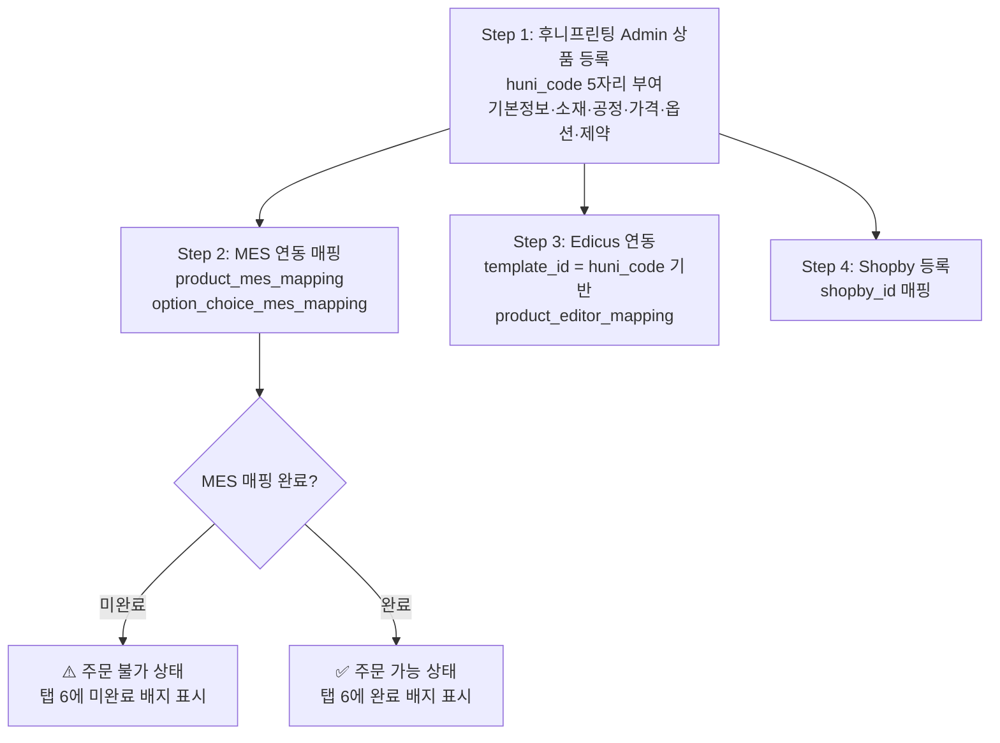

# SPEC-IM-001: 구현 계획

## 메타데이터

| 항목 | 내용 |
|------|------|
| SPEC ID | SPEC-IM-001 |
| 제목 | 상품 마스터 통합 관리 페이지 |
| 상태 | 초안 |
| 우선순위 | P1 |

---

## 0. 비즈니스 선행 요건

### 상품 등록 및 외부 연동 워크플로우

후니프린팅 상품 데이터는 Admin 등록 후 외부 시스템과 순차적으로 연동됩니다.

> ⚠️ **주의**: 아래 순서는 권장 순서이며, 비즈니스 요구에 따라 변경될 수 있습니다.



**핵심 원칙**: MES 연동 매핑(Step 2)은 주문 처리의 **전제 조건**입니다. Step 3(Edicus)와 Step 4(Shopby) 순서는 유동적으로 진행 가능하지만, MES 매핑 없이는 주문 발주가 불가합니다.

### huni_code 설계 원칙

`huni_code`는 외부 참조 키로, 특별한 설계 제약이 적용됩니다.

| 항목 | 내용 |
|------|------|
| 형식 | 5자리 숫자 (01001~99999, 선행 0 포함 가능) |
| DB 타입 | varchar(5) 권장 (현재 varchar(10) → 수정 필요) |
| 불변성 | **생성 후 절대 변경 불가** (외부 참조 키) |
| 외부 참조 대상 | 상품 페이지 URL, Edicus 템플릿 ID, 이미지 경로 |

> ⚠️ **중요**: huni_code는 상품 페이지, Edicus 에디터, 이미지 경로가 모두 이 값을 참조합니다. 최초 입력 정확성이 매우 중요하며, 오입력 시 상품 삭제 후 재등록이 필요합니다.

### MES 품목코드 ↔ 주문 옵션 매핑 구조

주문 처리를 위해서는 각 옵션 선택지가 MES 품목코드와 연결되어야 합니다:

```
상품
 ├── product_mes_mapping (상품 ↔ MES 품목코드)
 └── option_choice_mes_mapping
      ├── 자재 선택지 (option_class = material)  ↔ MES 품목코드
      ├── 공정 선택지 (option_class = process)   ↔ MES 품목코드
      └── 후가공 선택지 (option_class = post_process) ↔ MES 품목코드
```

---

## 1. 구현 전략

### 접근법: 탭별 점진적 구현

구현은 점진적 전략을 따릅니다. 먼저 3패널 쉘을 구축한 후 각 탭을 독립적으로 구현합니다. 각 탭은 격리된 상태에서 개발, 테스트, 검토가 가능합니다.

### 핵심 원칙

1. **기존 tRPC 라우터 재사용** — 기존 30개 라우터는 변경 없이 유지됩니다. 새 프로시저는 기존 라우터에 추가하거나 새로운 `catalog` 집계 라우터에 추가합니다.
2. **Shadcn/ui 컴포지션** — `apps/admin/src/components/ui/`의 기존 shadcn 컴포넌트(`Tabs`, `DataTable`, `Form`, `Select`, `Input`, `Switch`, `Badge`)를 사용합니다.
3. **낙관적 업데이트** — 모든 인라인 편집은 React Query 낙관적 뮤테이션 패턴을 사용합니다.
4. **지연 탭 로딩** — 탭 콘텐츠는 해당 탭이 활성화될 때만 가져옵니다 (React Query `enabled` 옵션).

---

## 2. 마일스톤

### 마일스톤 1: 쉘 & 네비게이션 (주요 목표)

**범위**: 3패널 레이아웃 쉘, 카테고리 트리, 상품 목록, 사이드바 업데이트

**생성/수정 파일**:
- `apps/admin/src/app/(dashboard)/catalog/page.tsx` (신규)
- `apps/admin/src/app/(dashboard)/catalog/layout.tsx` (신규)
- `apps/admin/src/app/(dashboard)/catalog/components/CategoryTree.tsx` (신규)
- `apps/admin/src/app/(dashboard)/catalog/components/ProductList.tsx` (신규)
- `apps/admin/src/app/(dashboard)/catalog/components/ProductDetailPanel.tsx` (신규 — 탭 쉘만)
- `apps/admin/src/components/layout/sidebar.tsx` (수정 — 카탈로그 관리 그룹 추가)
- `apps/admin/src/lib/trpc/routers/catalog.ts` (신규 — getCategoryTree, getProductsByCategory)
- `apps/admin/src/lib/trpc/routers/index.ts` (수정 — catalog 라우터 등록)

**커버 요구사항**: REQ-ARCH-001, REQ-ARCH-002, REQ-ARCH-003, REQ-TREE-001~REQ-TREE-004, REQ-LIST-001~REQ-LIST-004

**복잡도**: 중간
- 재귀 카운트가 있는 카테고리 트리는 서브쿼리 또는 CTE 필요
- 3패널 반응형 레이아웃은 세심한 CSS 작업 필요 (고정 너비 flexbox)

---

### 마일스톤 2: 탭 1 — 기본 정보 (주요 목표)

**범위**: 상품 상세 폼, 상품 사이즈 하위 섹션

**생성/수정 파일**:
- `apps/admin/src/app/(dashboard)/catalog/components/tabs/BasicInfoTab.tsx` (신규)
- `apps/admin/src/lib/trpc/routers/catalog.ts` (수정 — getProductDetail 추가)

**커버 요구사항**: REQ-TAB1-001~REQ-TAB1-003

**복잡도**: 낮음-중간
- shadcn 컴포넌트를 사용한 표준 폼
- 상품 사이즈 하위 섹션은 인라인 편집 가능한 미니 DataTable
- **huni_code 5자리 숫자 검증 로직 포함** (신규 등록 시 `^\d{5}$` 패턴 검사)

---

### 마일스톤 3: 탭 2 — 자재 & 공정 (보조 목표)

**범위**: 용지 배정 매트릭스, 인쇄 방식 토글, 후가공 그룹, 제본 옵션

**생성/수정 파일**:
- `apps/admin/src/app/(dashboard)/catalog/components/tabs/MaterialsProcessesTab.tsx` (신규)
- `apps/admin/src/lib/trpc/routers/paper-product-mappings.ts` (수정 — bulkToggle 추가)

**커버 요구사항**: REQ-TAB2-001~REQ-TAB2-005

**복잡도**: 중간-높음
- 체크박스 55개 + cover_type + 기본 라디오가 있는 용지 배정 매트릭스가 가장 복잡한 UI
- 제본 대 자재에 따른 product_type 기반 조건부 렌더링

---

### 마일스톤 4: 탭 3 — 가격 책정 (보조 목표)

**범위**: 가격 유형 선택기, 구간 편집기, 고정 가격 매트릭스, 패키지 그리드, 박 그리드, 손지 설정

**생성/수정 파일**:
- `apps/admin/src/app/(dashboard)/catalog/components/tabs/PricingTab.tsx` (신규)
- `apps/admin/src/app/(dashboard)/catalog/components/tabs/pricing/TierPricingEditor.tsx` (신규)
- `apps/admin/src/app/(dashboard)/catalog/components/tabs/pricing/FixedPriceMatrix.tsx` (신규)
- `apps/admin/src/app/(dashboard)/catalog/components/tabs/pricing/PackagePriceGrid.tsx` (신규)
- `apps/admin/src/app/(dashboard)/catalog/components/tabs/pricing/FoilPriceGrid.tsx` (신규)
- `apps/admin/src/app/(dashboard)/catalog/components/tabs/pricing/LossConfigSection.tsx` (신규)

**커버 요구사항**: REQ-TAB3-001~REQ-TAB3-005

**복잡도**: 높음
- 네 가지 다른 가격 편집기 변형
- 구간 유효성 검사 로직 (공백 없음, 중복 없음)
- 고정 가격 매트릭스는 2D 스프레드시트 형식 컴포넌트
- 패키지 가격 그리드는 4차원 (사이즈 × 인쇄 방식 × 페이지 수 × 수량)

---

### 마일스톤 5: 탭 4 — 옵션 & 선택지 (보조 목표)

**범위**: 옵션 정의 목록, 상품별 활성화, 선택지 표시, 플래그 편집

**생성/수정 파일**:
- `apps/admin/src/app/(dashboard)/catalog/components/tabs/OptionsChoicesTab.tsx` (신규)
- `apps/admin/src/lib/trpc/routers/product-options.ts` (수정 — bulkActivate 추가)

**커버 요구사항**: REQ-TAB4-001~REQ-TAB4-004

**복잡도**: 중간
- 토글이 있는 30개 옵션의 확장 가능 목록
- 각 확장된 옵션은 서브 테이블에 선택지 표시
- display_order를 위한 드래그 앤 드롭 재정렬

---

### 마일스톤 6: 탭 5 — 제약 & 의존성 (최종 목표)

**범위**: 유형별 그룹화된 제약 목록, 제약 편집기 폼, 의존성 목록, 의존성 편집기 폼

**생성/수정 파일**:
- `apps/admin/src/app/(dashboard)/catalog/components/tabs/ConstraintsDepsTab.tsx` (신규)

**커버 요구사항**: REQ-TAB5-001~REQ-TAB5-004

**복잡도**: 중간-높음
- 제약 편집기는 캐스케이딩 드롭다운이 있는 다중 필드 폼
- 의존성 편집기는 2단계 옵션 → 선택지 캐스케이딩 필요
- constraint_type별 그룹화 표시

---

### 마일스톤 7: 탭 6 — MES 연동 (최종 목표)

**범위**: 상품-MES 매핑, 에디터 매핑, 옵션-선택지 MES 매핑 테이블, 대기 배지

**생성/수정 파일**:
- `apps/admin/src/app/(dashboard)/catalog/components/tabs/MesIntegrationTab.tsx` (신규)
- `apps/admin/src/lib/trpc/routers/option-choice-mes-mappings.ts` (수정 — getByProduct 추가)

**커버 요구사항**: REQ-TAB6-001~REQ-TAB6-005

**복잡도**: 중간

**⚠️ 핵심 구현 사항 (MES 매핑 완료도 표시)**:
- 탭 레이블에 "전체 N / 완료 M" 형식 배지 표시 (탭 간 상태 공유 필요)
- 모든 매핑 완료 시: 초록색 ✅ 배지 ("주문 가능")
- 미완료 시: 주황색 숫자 배지 ("주문 불가", 미완료 개수 표시)
- `option_choice_mes_mapping` 테이블에 option_class 컬럼 (자재/공정/후가공) 별 분류 표시
- 256개 MES 품목 검색 가능 드롭다운
- 상태 배지 렌더링 (대기중/매핑됨/검증됨)

---

### 마일스톤 8: 지원 페이지 (최종 목표)

**범위**: 용지 페이지, 공정 페이지, 조판 규칙 페이지, MES 품목 페이지

**생성/수정 파일**:
- `apps/admin/src/app/(dashboard)/catalog/papers/page.tsx` (신규)
- `apps/admin/src/app/(dashboard)/catalog/processes/page.tsx` (신규)
- `apps/admin/src/app/(dashboard)/catalog/pricing/imposition/page.tsx` (신규)
- `apps/admin/src/app/(dashboard)/catalog/mes-items/page.tsx` (신규)

**커버 요구사항**: REQ-SUP-001~REQ-SUP-004

**복잡도**: 낮음-중간
- 기존 Admin 페이지와 유사한 표준 DataTable CRUD 페이지
- 기존 tRPC 라우터 재사용 (papers, print-modes, post-processes, bindings, imposition-rules, mes-items)

---

### 마일스톤 9: 가져오기 연동 & 공통 처리 (선택 목표)

**범위**: 가져오기 트리거 모달, 가져오기 상태 표시기, 미저장 변경사항 가드, 반응형 동작

**생성/수정 파일**:
- `apps/admin/src/app/(dashboard)/catalog/components/ImportModal.tsx` (신규)
- `apps/admin/src/app/(dashboard)/catalog/components/ImportStatusBadge.tsx` (신규)
- `apps/admin/src/lib/trpc/routers/catalog.ts` (수정 — getImportStatus 추가)

**커버 요구사항**: REQ-IMPORT-001~REQ-IMPORT-003, REQ-CROSS-001~REQ-CROSS-005

**복잡도**: 중간
- 가져오기 모달은 파일 업로드 처리 필요
- 미저장 변경사항 가드는 `beforeunload` 이벤트 + React Router 인식 필요
- < 1024px 뷰포트 반응형 CSS

---

## 3. 기술 접근법

### 3.1 복합 tRPC 쿼리 설계

`catalog.getProductDetail` 프로시저는 가장 중요한 새 프로시저입니다. 라운드트립을 최소화하기 위해 6개 이상의 테이블에서 데이터를 단일 응답으로 집계합니다:

```
입력: { productId: number }
출력: {
  product: Product
  sizes: ProductSize[]
  paperMappings: (PaperProductMapping & { paper: Paper })[]
  productOptions: (ProductOption & { definition: OptionDefinition, choices: OptionChoice[] })[]
  constraints: OptionConstraint[]
  dependencies: OptionDependency[]
  mesMappings: ProductMesMapping[]
  editorMapping: ProductEditorMapping | null
  choiceMesMappings: OptionChoiceMesMapping[]
  pendingMesCount: number
  totalMesCount: number
}
```

전략: 단일 tRPC 프로시저 호출 내에서 Drizzle 쿼리를 병렬로 실행 후 결과를 합칩니다. 독립적인 쿼리에는 `Promise.all` 사용.

### 3.2 상품 카운트가 있는 카테고리 트리

재귀 CTE 또는 2패스 쿼리 전략 사용:
1. 모든 카테고리 가져오기
2. `GROUP BY`를 사용하여 category_id별 상품 카운트 가져오기
3. 서버에서 트리 구조를 구축하고 자식 카운트를 부모에 합산

### 3.3 용지 배정 매트릭스 UI

55개 용지를 효율적으로 처리하기 위해 가상화된 목록 (테이블이 아님) 으로 렌더링:
- 각 행: 체크박스 + 용지 이름 + 중량 배지 + cover_type 선택기 + 기본 라디오
- 일괄 토글: "모두 선택" / "모두 해제" 버튼
- `paper-product-mappings.bulkToggle` 뮤테이션 사용

### 3.4 가격 편집기 아키텍처

올바른 가격 편집기를 렌더링하기 위해 전략 패턴 사용:

```
PricingTab
  |-- pricing_model === 'tiered'  → TierPricingEditor
  |-- pricing_model === 'fixed'   → FixedPriceMatrix
  |-- pricing_model === 'package' → PackagePriceGrid
  |-- pricing_model === 'foil'    → FoilPriceGrid
  |-- 항상: LossConfigSection
```

각 편집기 컴포넌트는 자체 tRPC 훅과 유효성 검사를 포함한 독립 구성입니다.

### 3.5 반응형 레이아웃 전략

- 데스크톱 (>= 1280px): 전체 3패널 레이아웃 (w-56 + flex-1 + w-[480px])
- 태블릿 (1024-1279px): 카테고리 트리 접기 가능, 상세 패널은 오버레이/드로어로
- 모바일 (< 1024px): 단일 패널 + 네비게이션 스택 (트리 → 목록 → 상세)

패널 수준 반응성을 위해 Tailwind 브레이크포인트와 `@container` 쿼리 사용.

### 3.6 huni_code 설계 원칙

`huni_code`는 외부 참조 키이므로 특별한 처리가 필요합니다:

1. **입력 단계**: Admin 상품 등록 폼에서 5자리 숫자 포맷 검증 (패턴: `^\d{5}$`)
2. **저장 후**: DB 컬럼은 varchar(5), tRPC mutation에서 huni_code 업데이트 금지
3. **UI 표시**: 모든 UI에서 readonly input으로 표시, 수정 버튼 없음
4. **Edicus 연동**: `product_editor_mapping.template_id` 기본값으로 huni_code 자동 세팅
5. **이미지 경로**: `/images/{huni_code}/` 패턴으로 이미지 참조 관리
6. **중복 검사**: 등록 전 기존 huni_code와 중복 여부 실시간 확인

---

## 4. 리스크 & 대응

### Risk 1: 대용량 가격 구간 데이터 (~10,000행) 성능

**영향**: 가격 책정 탭이 느리게 로드되고 렌더링될 수 있음
**대응**: 가격 구간에 서버 측 페이지네이션 사용 (100행/페이지). 고정 가격 매트릭스는 용지 그룹별로 페이지네이션.

### Risk 2: 복합 쿼리 지연

**영향**: 6개 이상의 테이블을 집계하는 `getProductDetail`이 느릴 수 있음
**대응**: `Promise.all`로 서브쿼리를 병렬 실행. 모든 FK 컬럼 인덱싱 (이미 인덱싱됨). 2개 쿼리로 분할 고려: 기본 데이터 + 가격 데이터 (탭별 지연 로딩).

### Risk 3: 55개 항목의 용지 배정 매트릭스 UX

**영향**: 55개 체크박스와 선택기가 혼잡하게 느껴질 수 있음
**대응**: 용지 목록에 검색/필터 추가. 중량 카테고리별 그룹화. 활성 배정을 먼저 표시.

### Risk 4: 6개 탭에 걸친 미저장 변경사항

**영향**: 탭 전환 시 데이터를 잃을 수 있음
**대응**: 탭별 더티 추적 구현. 더티 상태에서 탭 전환 시 확인 다이얼로그 표시. 로컬 초안 자동 저장 (선택적).

### Risk 5: 제약 편집기 복잡성

**영향**: 제약 폼에 10개 이상의 캐스케이딩 의존성 필드가 있음
**대응**: 제약 생성에 위저드/단계별 접근 방식 사용. 공통 제약 패턴을 템플릿으로 미리 채우기.

### Risk 6: huni_code 초기 입력 오류 (불변성 위험)

**영향**: huni_code는 생성 후 변경 불가이므로, 오입력 시 상품 페이지 URL, Edicus 템플릿, 이미지 경로가 모두 오작동. 유일한 복구 방법은 상품 삭제 후 재등록.

**대응**:
- Admin 등록 폼에서 5자리 숫자 유효성 검사 강제 (프론트엔드 + 백엔드 이중 검증)
- 저장 전 기존 huni_code와 중복 확인 필수 (API 레벨 unique 제약)
- 저장 후 즉시 readonly 처리 (DB 레벨 + UI 레벨 이중 보호)
- 등록 확인 다이얼로그에서 huni_code 최종 확인 단계 추가

---

## 5. 의존성

| 의존성 | 상태 | 지연 시 영향 |
|--------|------|-------------|
| 기존 30개 tRPC 라우터 | 완료 | 없음 — 이미 구현됨 |
| 26개 DB 스키마 테이블 | 완료 | 없음 — 이미 구현됨 |
| shadcn/ui 컴포넌트 | 완료 | 없음 — 이미 사용 가능 |
| 데이터 시드 (실제 데이터) | 부분 완료 | UI에 빈 상태 — 시드 데이터 추가 필요 |
| 가져오기 파이프라인 | 부분 완료 | 가져오기 모달에 플레이스홀더 표시 |

---

## 6. 파일 영향 요약

| 작업 | 수 | 설명 |
|------|-----|------|
| 신규 | ~25 | 카탈로그 페이지, 6개 탭, 4개 서브페이지, 공유 컴포넌트, catalog 라우터 |
| 수정 | ~5 | sidebar.tsx, routers/index.ts, 기존 라우터 3개 (확장) |
| 삭제 | 0 | 삭제 파일 없음 |

**예상 신규 코드 라인 수**: ~4,000~5,000줄 (테스트 제외)
**예상 테스트 코드 라인 수**: ~2,000~3,000줄

---

## 이력

| 버전 | 날짜 | 변경 내용 |
|------|------|-----------|
| v0.1 | 2026-02-01 | 영문 초안 |
| v1.0 | 2026-02-27 | 한글 전환 + Section 0 신설 (상품 등록 워크플로우, huni_code 설계 원칙) + Section 3.6 신설 + Risk 6 추가 |
