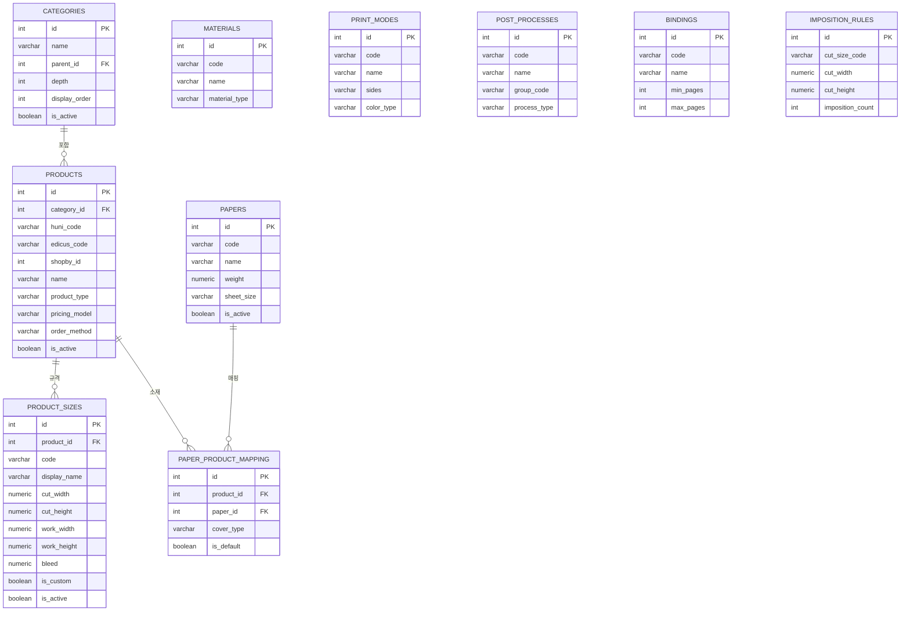

# SPEC-IM-001: 상품 마스터 통합 관리 페이지

## 메타데이터

| 필드          | 값                                                        |
| ------------- | --------------------------------------------------------- |
| SPEC ID       | SPEC-IM-001                                               |
| 제목          | 상품 마스터 통합 관리 페이지                               |
| 영문 제목     | HuniPrinting Integrated Product Data Management Page      |
| 상태          | Draft                                                     |
| 우선순위      | P1                                                        |
| 브랜치        | feature/SPEC-WIDGET-ADMIN-001                             |
| 관련 SPEC     | SPEC-DB-005 (엑셀 색상 의미론), SPEC-DATA-002 (DB), SPEC-IM-002 (상품 옵션 데이터 임포트 명세) |

---

## 1. 환경 및 기술 스택

### 1.1 애플리케이션 환경

- **App**: `apps/admin` — Next.js 14 App Router, tRPC, shadcn/ui, Tailwind v4
- **디자인 토큰**: `apps/admin/src/styles/globals.css` — 바이올렛 주색상 `#5538B6`, 회색-700 `#424242`, 4px 간격
- **디자인 스킬**: `innojini-widget-admin-design` — 3패널 레이아웃, 6개 상세 탭, Toss/SEED 원칙
- **기술 스택**: PostgreSQL 16 (Drizzle ORM), tRPC 라우터 (`apps/admin/src/lib/trpc/routers/`)

### 1.2 디자인 토큰 (globals.css)

#### 주색상 팔레트 (바이올렛 — Toss 신뢰 컬러)

| 토큰 변수             | 값        | 용도                        |
| --------------------- | --------- | --------------------------- |
| `--primary-dark`      | `#351D87` | 호버, 눌림 상태             |
| `--primary`           | `#5538B6` | 기본, 링, 사이드바 강조     |
| `--primary-medium`    | `#7B68C8` | 보조 액션                   |
| `--primary-light`     | `#9580D9` | 삼차 표현                   |
| `--primary-200`       | `#C9C2DF` | 연한 보라                   |
| `--primary-100`       | `#DED7F4` | 아주 연한 보라              |
| `--primary-50`        | `#EEEBF9` | 호버 서피스 (= --accent)    |
| `--primary-25`        | `#F4F0FF` | 가장 연한 틴트              |
| `--primary-foreground`| `#FFFFFF` | 주색상 위 텍스트            |

#### 시맨틱 컬러

| 토큰 변수        | 값        | 용도                     |
| ---------------- | --------- | ------------------------ |
| `--warning`      | `#E6B93F` | 경고 (전경: `#424242`)   |
| `--success`      | `#7AC8C4` | 성공 (전경: `#424242`)   |
| `--error`        | `#C7000B` | 오류 (전경: `#FFFFFF`)   |
| `--brand-accent` | `#DF7939` | 주황 강조                |

#### 회색조 (6단계)

| 토큰 변수    | 값        | 용도                              |
| ------------ | --------- | --------------------------------- |
| `--gray-50`  | `#F6F6F6` | 배경, 음소거, 사이드바 강조       |
| `--gray-100` | `#E9E9E9` | 연한 구분선                       |
| `--gray-200` | `#CACACA` | 테두리, 입력 필드                 |
| `--gray-400` | `#979797` | 음소거 전경, 플레이스홀더         |
| `--gray-600` | `#565656` | 중간 텍스트                       |
| `--gray-700` | `#424242` | 기본 전경 텍스트                  |

#### 간격 및 모서리 반경 (SEED 4px 기준)

| 토큰 변수        | 값     | 설명              |
| ---------------- | ------ | ----------------- |
| `--spacing`      | `4px`  | 기준 단위         |
| `--radius-sm`    | `3px`  | 소형 모서리       |
| `--radius`       | `4px`  | 기본 모서리       |
| `--radius-md`    | `5px`  | 중형 모서리       |
| `--radius-pill`  | `20px` | 알약 형태         |

#### 타이포그래피

| 속성         | 값                          |
| ------------ | --------------------------- |
| 글꼴         | `'Noto Sans', sans-serif`   |
| 기본 크기    | `14px`                      |
| 자간         | `-0.05em` (한국어 최적화)   |

### 1.3 데이터베이스 구성 (26개 테이블, 6개 도메인)

모든 테이블은 `packages/shared/src/db/schema/`에 위치합니다.

| 도메인                  | 테이블                                                                                                            | 스키마 파일                      | 레코드 규모                          |
| ----------------------- | ----------------------------------------------------------------------------------------------------------------- | -------------------------------- | ------------------------------------ |
| **D1: 상품 카탈로그**   | `categories`, `products`, `product_sizes`                                                                         | `huni-catalog.schema.ts`         | 카테고리 38개, 상품 221개, 규격 ~1200개 |
| **D2: 소재**            | `papers`, `materials`, `paper_product_mapping`                                                                    | `huni-materials.schema.ts`       | 종이 55종, 소재 ~20종, 매핑 ~2500개  |
| **D3: 공정**            | `print_modes`, `post_processes`, `bindings`, `imposition_rules`                                                   | `huni-processes.schema.ts`       | 인쇄방식 12종, 후공정 ~40종, 제본 4종, 규칙 ~30개 |
| **D4: 가격**            | `price_tables`, `price_tiers`, `fixed_prices`, `package_prices`, `foil_prices`, `loss_quantity_config`            | `huni-pricing.schema.ts`         | 가격표 15-20개, 구간 ~10K개, 고정 ~500개, 패키지 ~200개 |
| **D5: 옵션 및 UI**      | `option_definitions`, `option_choices`, `product_options`, `option_constraints`, `option_dependencies`             | `huni-options.schema.ts`         | 정의 30개, 선택지 1198개, 상품옵션 ~2K개, 제약 129개, 의존성 ~300개 |
| **D6: 연동**            | `mes_items`, `mes_item_options`, `product_mes_mapping`, `product_editor_mapping`, `option_choice_mes_mapping`      | `huni-integration.schema.ts`     | MES 항목 256개, 매핑 ~250개, 편집기 맵 111개 |
| **지원**                | `data_import_log`                                                                                                  | `huni-import-log.schema.ts`      | 추가 전용 감사 로그                  |

추가로 `packages/db/src/schema/widget/`에 19개의 위젯 빌더 스키마 파일(01-~06- 접두사)이 있습니다. 이 파일들은 카탈로그 관리자 관점에서 읽기 전용입니다.

### 1.4 기존 Admin 인프라

**기존 사이드바 내비게이션** (`apps/admin/src/components/layout/sidebar.tsx`):
- 8개 최상위 내비게이션 그룹: 대시보드, 상품 관리, 소재 관리, 공정 관리, 가격 관리, 옵션 관리, 시스템 연동, 위젯 관리
- `apps/admin/src/app/(dashboard)/` 하위 약 36개 기존 페이지

**기존 tRPC 라우터** (`apps/admin/src/lib/trpc/routers/`의 30개 라우터):
- 카탈로그: `categories`, `products`, `product-sizes`
- 소재: `papers`, `materials`, `paper-product-mappings`
- 공정: `print-modes`, `post-processes`, `bindings`, `imposition-rules`
- 가격: `price-tables`, `price-tiers`, `fixed-prices`, `package-prices`, `foil-prices`, `loss-quantity-configs`
- 옵션: `option-definitions`, `option-choices`, `product-options`, `option-constraints`, `option-dependencies`
- 연동: `mes-items`, `product-mes-mappings`, `product-editor-mappings`, `option-choice-mes-mappings`
- 위젯: `widgets`, `widget-admin`, `dashboard`, `settings`

---

## 2. 가정사항

### A-01: 카테고리 계층은 2단계
카테고리 트리는 정확히 2단계 깊이입니다. 최상위 카테고리 8개(마스터 스프레드시트의 시트명)와 약 30개의 하위 카테고리로 구성됩니다. `categories.depth` 컬럼은 최상위가 0, 하위가 1입니다. 3단계 카테고리는 없습니다.

### A-02: 기존 tRPC 라우터가 CRUD를 제공
26개 도메인 테이블 모두 이미 `list`, `getById`, `create`, `update`, `delete` 프로시저를 갖춘 tRPC 라우터가 있습니다. 새 카탈로그 페이지는 새로운 라우터를 생성하는 대신 이 기존 라우터를 **소비**합니다.

### A-03: 상품 중심 내비게이션이 주 사용 사례
관리자의 주요 워크플로우는 카테고리 선택 → 상품 선택 → 해당 상품의 6개 데이터 도메인 관리입니다. 이것은 도메인 중심 뷰(현재 사이드바가 이미 제공)가 아닌 상품 중심 뷰입니다.

### A-04: 오른쪽 패널은 상황별(Context-Sensitive)
6탭 상세 패널은 상품이 선택된 경우에만 나타납니다. 상품이 선택되지 않은 경우 오른쪽 패널은 안내 문구가 있는 플레이스홀더를 표시합니다.

### A-05: 새 데이터베이스 테이블 불필요
이 SPEC은 UI 페이지와 복합 tRPC 프로시저(기존 라우터 집계)만 생성합니다. 새 DB 스키마 변경은 필요하지 않습니다.

### A-06: 새 라우터보다 기존 라우터 재사용
코드 중복을 피하기 위해 완전히 새로운 tRPC 라우터를 생성하는 대신 기존 라우터 로직을 호출하는 복합/집계 프로시저를 생성합니다.

---

## 3. 데이터베이스 ERD

### 3.1 핵심 관계 ERD (상품·소재·공정)



### 3.2 가격·옵션·연동 ERD


---

## 4. 시스템 아키텍처

### 4.1 데이터 흐름 다이어그램


### 4.2 컴포넌트 계층 구조


### 4.3 가격 모델 선택 로직


### 4.4 MES 매핑 상태 전이


---

## 5. UI 화면 구성

### 5.1 메인 3패널 레이아웃

```
┌─────────────────────────────────────────────────────────────────────────────────────────┐
│ HEADER: 통합 카탈로그 관리  [마지막 가져오기: 2026-02-27]  [가져오기]  [설정]           │
│         border-b, bg-white, px-6 py-4                                                   │
├──────────────────────┬────────────────────────────────────┬───────────────────────────┤
│ 카테고리 트리  w-56  │  상품 목록  flex-1                  │  상세 패널  w-[480px]     │
│ border-r             │  overflow-auto                      │  border-l                 │
│                      │                                     │                           │
│ [전체 상품]    (221) │ [검색창: 상품명, 코드 검색...]  [필터]│ [상품 선택 안내]          │
│                      │                                     │                           │
│ + [디지털 인쇄] (89) │ 상품명         코드    유형  가격모델 규격수  상태            │
│   ├ 명함    (24)     │ ─────────────────────────────────  │  (상품 선택 후            │
│   ├ 엽서    (18)     │ 명함 표준형    NM-001  디지털 고정  8   활성            │  탭이 나타납니다)         │
│   ├ 스티커  (12)     │ 명함 고급형    NM-002  디지털 고정  12  활성            │                           │
│   └ 전단지  (35)     │ 포스터 대형    PS-101  디지털 구간  6   활성            │                           │
│                      │ 스티커 원형    ST-201  스티커  패키지 4   비활성         │                           │
│ + [스티커]      (45) │ ...                                 │                           │
│   ├ 원형    (20)     │                                     │                           │
│   └ 사각형  (25)     │  ◀  1 / 5  ▶   (221개 상품)        │                           │
│                      │                                     │                           │
│ + [소책자]      (30) │                                     │                           │
│   ├ 중철    (15)     │                                     │                           │
│   └ 무선    (15)     │                                     │                           │
│                      │                                     │                           │
│ + [박가공]      (22) │                                     │                           │
│ + [특수소재]    (35) │                                     │                           │
│                      │                                     │                           │
└──────────────────────┴────────────────────────────────────┴───────────────────────────┘

디자인 토큰 적용:
  - 활성 카테고리: bg-primary/10 text-primary (--primary-50 배경)
  - 트리 테두리: border-gray-200 (--gray-200)
  - 패널 구분: border-gray-200
  - 배지: bg-gray-100 text-gray-600 rounded-radius-pill
  - 상품 행 hover: bg-primary-25 (--primary-25)
  - 선택된 행: bg-primary-50 border-l-2 border-primary
```

### 5.2 카테고리 트리 패널 상세

```
┌──────────────────────────────┐
│ 카테고리          w-56       │
├──────────────────────────────┤
│ [전체 상품]             (221)│  ← 기본 선택, text-primary font-medium
│                              │
│ ▼ 디지털 인쇄           (89) │  ← 확장됨
│   ├ 명함               (24)  │    text-sm py-1.5 pl-6
│   ├ 엽서               (18)  │    hover: bg-primary-50
│   ├ 스티커             (12)  │    active: bg-primary/10 text-primary
│   └ 전단지             (35)  │
│                              │
│ ▶ 스티커               (45) │  ← 접힘
│ ▶ 소책자               (30) │
│ ▶ 박가공               (22) │
│ ▶ 특수소재             (35) │
│                              │
│ ── 시스템 ──────────────    │  ← separator
│   MES 미매핑          (12)  │  ← warning text-warning
│   비활성 상품           (8)  │  ← gray text-gray-400
└──────────────────────────────┘

Toss P4 (맥락적 탐색):
  - 활성 경로: bg-primary/10 text-primary
  - 수량 배지: 항상 오른쪽 정렬
  - 확장/접기: chevron 아이콘 (4px 기준 단위)
  - 스크롤: 카테고리 목록이 패널 높이 초과 시 overflow-y-auto
```

### 5.3 상품 목록 패널 상세

```
┌────────────────────────────────────────────────────────────────┐
│  [검색: 상품명, 코드 검색...      ]  [유형 ▼]  [가격모델 ▼]  [상태 ▼]  │
│  input border-gray-200 rounded-radius h-9                       │
├────────────────────────────────────────────────────────────────┤
│ 상품명           코드      유형    가격모델  규격수  상태      │
│ ─────────────────────────────────────────────────────────────  │
│ ▶ 명함 표준형    NM-001  디지털  고정가   8개    [활성]      │
│   명함 고급형    NM-002  디지털  고정가   12개   [활성]      │
│   명함 무광      NM-003  디지털  고정가   8개    [활성]      │
│ ▶ 엽서 표준형    PC-001  디지털  고정가   6개    [활성]      │  ← 선택됨 (violet left border)
│   엽서 대형      PC-002  디지털  고정가   4개    [활성]      │
│   전단지 A4      FL-101  디지털  구간     3개    [활성]      │
│   전단지 A3      FL-102  디지털  구간     3개    [활성]      │
│   ...                                                          │
│                                                                │
│  ◀  1  2  3  4  5  ▶    총 89개 (50개씩 표시)               │
└────────────────────────────────────────────────────────────────┘

컬럼 설명:
  - 상품명: products.name
  - 코드: products.huni_code (monospace font)
  - 유형: products.product_type (배지)
  - 가격모델: products.pricing_model (배지)
  - 규격수: product_sizes 집계 COUNT
  - 상태: products.is_active (활성=success, 비활성=gray)

Toss P5 (효율적 데이터 관리):
  - 선택된 행: bg-primary-50 border-l-2 border-primary
  - 정렬: 컬럼 헤더 클릭 정렬 가능
  - 검색: 실시간 클라이언트 사이드 필터링
```

### 5.4 탭 헤더 (ProductDetailPanel 공통)

```
┌───────────────────────────────────────────────────────┐
│ 엽서 표준형  (PC-001)                          [저장] │
│ 디지털인쇄 > 엽서                                     │
├──────┬──────┬──────┬──────┬──────┬─────────────────┤
│기본정보│소재·공정│가격표│옵션·선택지│제약·의존성│MES 연동 [!3]│
│      │      │      │      │      │                 │
└──────┴──────┴──────┴──────┴──────┴─────────────────┘

탭 스타일:
  - 활성: border-b-2 border-primary text-primary font-medium
  - 비활성: text-gray-600 hover:text-gray-700
  - MES 경고: [!3] = Badge variant warning (--warning)
  - 저장 버튼: Button variant default (--primary)
  - 브레드크럼: text-sm text-gray-400
```

### 5.5 탭 1: 기본정보 상세 화면

```
┌──────────────────────────────────────────────────────────┐
│ [기본정보]  소재·공정  가격표  옵션·선택지  제약·의존성  MES 연동 │
├──────────────────────────────────────────────────────────┤
│                                                          │
│  상품명 *                                                │
│  [엽서 표준형                           ]                │
│                                                          │
│  후니 코드              에디커스 코드                    │
│  [PC-001      ] readonly [ED-POSTCARD    ]               │
│                                                          │
│  Shopby ID              카테고리                         │
│  [12345       ]         [디지털 인쇄 > 엽서      ▼]      │
│                                                          │
│  상품 유형              가격 모델                        │
│  [디지털 인쇄         ▼] [고정가 (fixed)          ▼]    │
│                                                          │
│  주문 방법              시트 규격                        │
│  [업로드/편집기       ▼] [A4                      ▼]    │
│                                                          │
│  편집기 사용            활성                             │
│  [● ─────────] ON       [● ─────────] ON               │
│                                                          │
│  설명                                                    │
│  [고품질 엽서 인쇄. 양면 인쇄 가능.                      │
│   코팅 옵션 선택 가능합니다.           ]                 │
│                                                          │
├──────────────────────────────────────────────────────────┤
│ ▼ 규격 (8개)                              [+ 규격 추가] │
├──────────────────────────────────────────────────────────┤
│ 코드      표시명   재단(W×H)  작업(W×H)  도련  면부수  │
│ ────────────────────────────────────────────────────── │
│ ≡ A6     A6 표준  148×105  154×111    3     1      [삭]│
│ ≡ A5     A5 표준  210×148  216×154    3     1      [삭]│
│ ≡ A4     A4 표준  297×210  303×216    3     2      [삭]│
│ ≡ CUSTOM 사용자정의  □ □    □ □        □     □   [삭]│
│                                                          │
│              [취소]              [저장]                  │
└──────────────────────────────────────────────────────────┘

디자인 토큰:
  - 레이블: text-sm font-medium text-gray-700
  - 입력 필드: border-gray-200 rounded-radius h-9
  - 읽기 전용: bg-gray-50 text-gray-600
  - 필수 표시: text-error after:content-['*']
  - 규격 행: drag handle (≡), hover bg-primary-25
  - 저장 버튼: bg-primary text-white (--primary fill)
```

### 5.6 탭 2: 소재·공정 상세 화면

```
┌──────────────────────────────────────────────────────────┐
│ 기본정보  [소재·공정]  가격표  옵션·선택지  제약·의존성  MES 연동 │
├──────────────────────────────────────────────────────────┤
│                                                          │
│ ▼ 종이 소재 (8/55 선택됨)              [전체 선택]       │
│ ──────────────────────────────────────────────────────  │
│ [검색: 종이명 검색...]                                   │
│                                                          │
│ ☑ 스노우화이트 200g  [표지 ▼]  [기본] ○               │
│ ☑ 아트지 150g       [내지 ▼]  [기본] ●               │
│ ☑ 스노우화이트 150g  [표지 ▼]  [기본] ○               │
│ ☐ 모조지 80g                                           │
│ ☐ 아르떼지 250g                                        │
│ ... (55개 종이)                                         │
│                                                          │
├──────────────────────────────────────────────────────────┤
│ ▼ 인쇄 방식 (3/12 선택됨)                                │
│ ──────────────────────────────────────────────────────  │
│ ☑ 양면 컬러         ☑ 단면 컬러        ☐ 흑백         │
│ ☑ 단면 흑백         ☐ 컬러+흑백        ☐ 특수컬러     │
│ ...                                                      │
│                                                          │
├──────────────────────────────────────────────────────────┤
│ ▼ 후공정                                                 │
│                                                          │
│  PP001 - 코팅                                            │
│    ☑ 유광 코팅   ☑ 무광 코팅   ☐ 부분 UV 코팅          │
│                                                          │
│  PP002 - 박/형압                                         │
│    ☐ 금박       ☐ 은박        ☐ 홀로그램 박            │
│    ☐ 음각 형압  ☐ 양각 형압                             │
│                                                          │
│  PP003 - 재단/도무송                                     │
│    ☐ 도무송     ☑ 미싱        ☐ 반도무송               │
│                                                          │
│  PP004~PP008 (접기, 제본, 기타...)                      │
│                                                          │
├──────────────────────────────────────────────────────────┤
│  [취소]                             [저장]               │
└──────────────────────────────────────────────────────────┘

Toss P2 (데이터 신뢰성):
  - 선택 수: "8/55 선택됨" 형태로 상태 표시
  - 기본 종이: 라디오 버튼으로 유일하게 선택
  - 표지/내지 구분: select 컴포넌트 (null, cover, inner)
  - 체크박스: accent-primary 색상
```

### 5.7 탭 3: 가격표 상세 화면

#### 가격 모델 선택기 (공통 헤더)

```
┌──────────────────────────────────────────────────────────┐
│ 기본정보  소재·공정  [가격표]  옵션·선택지  제약·의존성  MES 연동 │
├──────────────────────────────────────────────────────────┤
│                                                          │
│  가격 모델: [고정가 (fixed)]    [가격표 활성]  [+ 추가]  │
│            ─────────────────────────────────────────    │
│                                                          │
```

#### A. 구간 가격 편집기 (tiered 모드)

```
│  ┌─────────────────────────────────────────────────┐    │
│  │ 옵션코드     최소수량  최대수량  단가(원)   [삭] │    │
│  │ ─────────────────────────────────────────────── │    │
│  │ A4_1s        100       199        125           [x]│    │
│  │ A4_1s        200       499        110           [x]│    │
│  │ A4_1s        500       999        95            [x]│    │
│  │ A4_1s        1000      9999       80            [x]│    │
│  │ [+ 구간 추가]                                   │    │
│  └─────────────────────────────────────────────────┘    │
```

#### B. 고정 단가 매트릭스 (fixed 모드)

```
│  ┌──────────────────────────────────────────────────────┐│
│  │  종이\수량    100    200    500    1000   2000        ││
│  │  ──────────────────────────────────────────────────  ││
│  │  스노우200g  3,200  2,800  2,400  2,000  1,800       ││
│  │  아트지150g  2,900  2,500  2,100  1,800  1,600       ││
│  │  스노우150g  2,800  2,400  2,000  1,700  1,500       ││
│  │  [+ 열 추가 (수량)]             [+ 행 추가 (종이)]   ││
│  └──────────────────────────────────────────────────────┘│
```

#### C. 패키지 그리드 (package 모드)

```
│  [사이즈 ▼] [인쇄방식 ▼]                               │
│  ┌────────────────────────────────────────────────────┐  │
│  │  페이지\수량  100    200    500    1000             │  │
│  │  ─────────────────────────────────────────────     │  │
│  │  8페이지     15,000 13,000 11,000 9,000            │  │
│  │  12페이지    20,000 17,500 15,000 13,000           │  │
│  │  16페이지    25,000 22,000 19,000 16,500           │  │
│  └────────────────────────────────────────────────────┘  │
```

#### D. 박 가격 그리드 (foil 모드)

```
│  ┌──────────────────────────────────────────────────────┐│
│  │  박 종류\규격  명함   A6     A5     A4               ││
│  │  ──────────────────────────────────────────────────  ││
│  │  금박          5,000  7,000  12,000 18,000           ││
│  │  은박          4,500  6,500  11,000 16,000           ││
│  │  홀로그램      6,000  8,000  14,000 20,000           ││
│  └──────────────────────────────────────────────────────┘│
```

#### 손실 수량 설정 (공통 하단)

```
├──────────────────────────────────────────────────────────┤
│ ▶ 손실 수량 설정                                         │
├──────────────────────────────────────────────────────────┤
│  [취소]                             [저장]               │
└──────────────────────────────────────────────────────────┘
```

### 5.8 탭 4: 옵션·선택지 상세 화면

```
┌──────────────────────────────────────────────────────────┐
│ 기본정보  소재·공정  가격표  [옵션·선택지]  제약·의존성  MES 연동 │
├──────────────────────────────────────────────────────────┤
│                                                          │
│  [검색: 옵션명, 키 검색...]          [+ 옵션 추가]       │
│                                                          │
│ ┌──────────────────────────────────────────────────────┐ │
│ │ 옵션 키           이름      클래스    UI     활성    │ │
│ │ ─────────────────────────────────────────────────── │ │
│ │ ▼ paper_type      종이 종류  소재   Select  [ON ●]   │ │
│ │   선택지 (8개)                          [+ 선택지]   │ │
│ │   ┌──────────────────────────────────────────────┐  │ │
│ │   │코드      이름        가격키   표시순서  [삭]  │  │ │
│ │   │PT-001   스노우200g  SNOW200   1      ≡  [x]  │  │ │
│ │   │PT-002   아트지150g  ART150    2      ≡  [x]  │  │ │
│ │   │PT-003   스노우150g  SNOW150   3      ≡  [x]  │  │ │
│ │   └──────────────────────────────────────────────┘  │ │
│ │   필수: [☐]  표시: [☑]  내부: [☐]  기본: [아트지150g▼]│ │
│ │                                                      │ │
│ │ ▶ print_mode      인쇄 방식  공정   Select  [ON ●]   │ │
│ │ ▶ coating         코팅       후공정 Radio   [ON ●]   │ │
│ │ ▶ foil            박가공     후공정 Checkbox [OFF ○]  │ │
│ │   size            사이즈     규격   Select  [OFF ○]   │ │
│ │   quantity        수량       수량   Stepper [OFF ○]   │ │
│ │ ...                                                  │ │
│ └──────────────────────────────────────────────────────┘ │
│                                                          │
│  [취소]                             [저장]               │
└──────────────────────────────────────────────────────────┘

Toss P5 (효율적 데이터 관리):
  - 활성 토글: ON 상태 = --primary, OFF = --gray-200
  - 확장 아이콘: chevron, 선택지 하위 섹션 인라인 표시
  - 드래그 핸들: ≡ 아이콘, 표시순서 재정렬
```

### 5.9 탭 5: 제약·의존성 상세 화면

```
┌──────────────────────────────────────────────────────────┐
│ 기본정보  소재·공정  가격표  옵션·선택지  [제약·의존성]  MES 연동 │
├──────────────────────────────────────────────────────────┤
│                                                          │
│ ▼ 제약 조건 (11개)                      [+ 제약 추가]   │
│ ──────────────────────────────────────────────────────  │
│                                                          │
│  [IF]  종이 종류  =  스노우200g           우선순위: [1]  │
│  [THEN] 코팅 옵션  →  [표시]             [편집] [삭제]  │
│                                                          │
│  [IF]  인쇄 방식  =  단면 인쇄                          │
│  [THEN] 이면 코팅  →  [숨김]             [편집] [삭제]  │
│                                                          │
│  [IF]  사이즈  =  A3 이상                               │
│  [THEN] 박가공  →  [필수 해제]           [편집] [삭제]  │
│                                                          │
│  ...                                                     │
│                                                          │
├──────────────────────────────────────────────────────────┤
│ ▼ 의존성 (4개)                          [+ 의존성 추가] │
│ ──────────────────────────────────────────────────────  │
│                                                          │
│  종이 종류  [스노우200g 선택 시]  →  코팅  표시됨       │
│  [visibility]                         [편집] [삭제]     │
│                                                          │
│  인쇄 방식  [흑백 선택 시]  →  컬러 코팅  숨겨짐       │
│  [visibility]                         [편집] [삭제]     │
│                                                          │
│  [취소]                             [저장]               │
└──────────────────────────────────────────────────────────┘

IF-THEN 시각 포맷:
  - [IF] 배지: bg-primary-50 text-primary border-primary-200
  - [THEN] 배지: bg-warning/10 text-warning
  - 액션 배지: show=success, hide=gray, require=warning
  - 우선순위 숫자: font-mono text-sm
```

### 5.10 탭 6: MES 연동 상세 화면

```
┌──────────────────────────────────────────────────────────┐
│ 기본정보  소재·공정  가격표  옵션·선택지  제약·의존성  [MES 연동 !3] │
├──────────────────────────────────────────────────────────┤
│                                                          │
│ ┌──────────────────────────────────────────────────────┐ │
│ │ 경고: 3개의 선택지 MES 매핑이 미완료 상태입니다.     │ │
│ │ 아래 표에서 MES 항목을 지정해 주세요.  [경고 무시]   │ │
│ └──────────────────────────────────────────────────────┘ │
│                                                          │
│ ▼ 상품-MES 매핑                          [+ 매핑 추가]  │
│ ──────────────────────────────────────────────────────  │
│ MES 항목: [스티커-원형 (MES-0142)      ▼ 검색...]       │
│ 표지/내지: [기본 (null)                ▼]               │
│                                                          │
│ + [매핑 추가]                                           │
│                                                          │
├──────────────────────────────────────────────────────────┤
│ ▼ 편집기 매핑                                           │
│ ──────────────────────────────────────────────────────  │
│ 편집기 유형: [edicus]                                   │
│ 템플릿 ID:  [TMPL-PC-001              ]                 │
│ 활성:       [● ─────] ON                               │
│                                                          │
├──────────────────────────────────────────────────────────┤
│ ▼ 선택지 MES 코드 매핑 (24개)                           │
│ ──────────────────────────────────────────────────────  │
│ [검색: 선택지명 검색...]                [일괄 자동매핑]  │
│                                                          │
│ 선택지          MES 항목         MES 코드  상태  매핑일  │
│ ──────────────────────────────────────────────────────  │
│ 스노우200g    [MES-0201    ▼]  [SNW200]  [완료] 2/27   │
│ 아트지150g    [MES-0202    ▼]  [ART150]  [완료] 2/27   │
│ 스노우150g    [MES-0203    ▼]  [        ]  [미완료]     │
│ 유광 코팅     [           ▼]  [        ]  [미완료]     │
│ 무광 코팅     [MES-0301    ▼]  [MATT   ]  [완료] 2/26  │
│ 도무송        [           ▼]  [        ]  [미완료]     │
│ ...                                                      │
│                                                          │
│  [취소]                             [저장]               │
└──────────────────────────────────────────────────────────┘

상태 배지:
  - 미완료: bg-warning/10 text-warning border-warning (--warning)
  - 완료:   bg-success/10 text-success border-success (--success)
  - 검증완료: bg-primary/10 text-primary border-primary (--primary)
```

### 5.11 모바일 반응형 레이아웃 (< 1024px)

```
┌────────────────────────────────────────┐
│ [≡ 카테고리]  통합 카탈로그  [가져오기]│  ← 모바일 헤더
├────────────────────────────────────────┤
│ [검색: 상품명, 코드 검색...]  [필터 ▼] │
│ ──────────────────────────────────────│
│ 명함 표준형        NM-001   [활성]    │
│ 명함 고급형        NM-002   [활성]    │
│ 엽서 표준형        PC-001   [활성]    │
│ ...                                    │
│  ◀  1 / 5  ▶                         │
├────────────────────────────────────────┤
│  ↕ 상품 선택 시 하단 드로어로 상세 표시│
└────────────────────────────────────────┘

모바일 드로어 (상품 선택 시):
┌────────────────────────────────────────┐
│ ─────────────── (드래그 핸들)         │
│ 엽서 표준형                   [닫기]  │
├──────┬─────┬──────┬────┬─────┬───────┤
│기본  │소재 │가격표│옵션│제약 │MES !3 │
│정보  │·공정│      │    │     │       │
├──────────────────────────────────────┤
│  (탭 콘텐츠 전체 너비 표시)           │
│                                        │
│  [취소]              [저장]           │
└────────────────────────────────────────┘

카테고리 사이드 드로어:
┌──────────────┬──────────────────────────┐
│ 카테고리 트리 │  (배경 오버레이)         │
│              │                          │
│ [전체 상품]  │  탭하여 닫기             │
│ ...          │                          │
└──────────────┴──────────────────────────┘
```

---

## 6. 기능 요구사항

### 6.1 페이지 아키텍처 요구사항

#### REQ-ARCH-001: 3패널 레이아웃 (상시 적용)
시스템은 항상 `/admin/catalog` 페이지를 3패널 레이아웃으로 표시해야 한다:
- **왼쪽 패널** (`w-56`, 224px): 계층형 내비게이션이 있는 카테고리 트리
- **중앙 패널** (`flex-1`): 선택된 카테고리로 필터링된 상품 목록
- **오른쪽 패널** (`w-[480px]`): 6탭 상품 상세 패널

#### REQ-ARCH-002: 라우트 구조 (상시 적용)
시스템은 항상 다음 라우트 계층을 노출해야 한다:
- `/admin/catalog` — 통합 카탈로그 메인 페이지 (3패널 레이아웃)
- `/admin/catalog/papers` — 종이 마스터 관리
- `/admin/catalog/processes` — 공정 마스터 관리 (인쇄방식, 후공정, 제본)
- `/admin/catalog/pricing/imposition` — 면부수 규칙 관리
- `/admin/catalog/mes-items` — MES 항목 마스터 (주로 읽기)

#### REQ-ARCH-003: 사이드바 내비게이션 업데이트 (상시 적용)
시스템은 항상 사이드바에 `BookOpen` 아이콘이 있는 새 최상위 항목 "카탈로그 관리"를 추가해야 하며, 다음 항목을 포함해야 한다:
- "통합 카탈로그" → `/admin/catalog`
- "종이 관리" → `/admin/catalog/papers`
- "공정 관리" → `/admin/catalog/processes`
- "면부수 규칙" → `/admin/catalog/pricing/imposition`
- "MES 항목" → `/admin/catalog/mes-items`

### 6.2 카테고리 트리 패널 요구사항

#### REQ-TREE-001: 카테고리 트리 표시 (이벤트 기반)
사용자가 `/admin/catalog`를 방문할 때, 시스템은 `categories` 테이블에서 모든 카테고리를 로드하고 접기 가능한 트리를 렌더링해야 한다:
- 최상위 노드: `depth = 0`인 `categories`, `display_order` 순으로 정렬
- 하위 노드: `parent_id = <parent.id>` AND `depth = 1`인 `categories`, `display_order` 순으로 정렬

#### REQ-TREE-002: 카테고리 선택 (이벤트 기반)
사용자가 트리에서 하위 카테고리(`depth=1`)를 클릭할 때, 중앙 패널은 `category_id`가 선택된 하위 카테고리의 `id`와 일치하는 상품만 표시하도록 필터링해야 한다.

사용자가 최상위 카테고리(`depth=0`)를 클릭할 때, 중앙 패널은 해당 카테고리의 모든 하위 카테고리 전체 상품을 표시해야 한다.

#### REQ-TREE-003: 카테고리 수량 배지 (상시 적용)
시스템은 항상 각 트리 노드에 해당 카테고리 내 활성 상품(`is_active = true`) 수를 표시하는 수량 배지를 보여야 한다 (최상위 노드의 경우 재귀적으로 하위 합산).

#### REQ-TREE-004: "전체 상품" 노드 (상시 적용)
시스템은 항상 트리 상단에 "전체 상품" 루트 노드를 포함해야 하며, 선택 시 모든 카테고리에 걸친 전체 상품을 표시해야 한다. 이 노드는 페이지 로드 시 기본 선택되어야 한다.

### 6.3 상품 목록 패널 요구사항

#### REQ-LIST-001: 상품 목록 컬럼 (상시 적용)
시스템은 항상 중앙 패널 상품 목록에 다음 컬럼이 있는 DataTable을 표시해야 한다:
- 상품명 (`products.name`)
- 후니 코드 (`products.huni_code`)
- 상품 유형 (`products.product_type`)
- 가격 모델 (`products.pricing_model`)
- 활성 상태 (`products.is_active` — 배지)
- 규격 수 (`product_sizes`에서 집계)

#### REQ-LIST-002: 상품 목록 검색 (이벤트 기반)
사용자가 상품 목록 위 검색 입력란에 입력할 때, 시스템은 대소문자를 무시한 부분 일치로 `name`, `huni_code`, `slug`로 상품을 필터링해야 한다.

#### REQ-LIST-003: 상품 목록 페이지네이션 (상태 기반)
카테고리(또는 "전체 상품")에 50개 이상의 상품이 있는 경우, 시스템은 페이지당 50개로 페이지네이션하고 페이지네이션 컨트롤을 표시해야 한다.

#### REQ-LIST-004: 상품 선택 (이벤트 기반)
사용자가 상품 행을 클릭할 때, 시스템은 다음을 수행해야 한다:
1. 선택된 행 강조 표시
2. 오른쪽 상세 패널을 6탭 뷰로 열기
3. 현재 활성 탭의 상품 데이터 로드

### 6.4 탭 1: 기본정보 요구사항

#### REQ-TAB1-001: 기본정보 표시 (이벤트 기반)
선택된 상품에 대해 "기본정보" 탭이 활성화될 때, 시스템은 다음 편집 가능한 필드를 표시해야 한다:

| 필드         | 소스 컬럼                  | UI 컴포넌트              |
| ------------ | -------------------------- | ------------------------ |
| 상품명       | `products.name`            | `<Input>`                |
| 후니 코드    | `products.huni_code`       | `<Input>` (읽기 전용)    |
| 에디커스 코드| `products.edicus_code`     | `<Input>`                |
| Shopby ID    | `products.shopby_id`       | `<Input type=number>`    |
| 카테고리     | `products.category_id`     | `<Select>` (카테고리)    |
| 상품 유형    | `products.product_type`    | `<Select>`               |
| 가격 모델    | `products.pricing_model`   | `<Select>`               |
| 주문 방법    | `products.order_method`    | `<Select>`               |
| 시트 규격    | `products.sheet_standard`  | `<Select>`               |
| 편집기 사용  | `products.editor_enabled`  | `<Switch>`               |
| 활성         | `products.is_active`       | `<Switch>`               |
| 설명         | `products.description`     | `<Textarea>`             |

#### REQ-TAB1-002: 상품 규격 하위 섹션 (이벤트 기반)
"기본정보" 탭이 활성화될 때, 시스템은 폼 아래에 접기 가능한 "규격" 섹션을 표시하여 상품의 모든 `product_sizes`를 보여야 한다:

| 컬럼       | 소스                              | 편집 가능 |
| ---------- | --------------------------------- | --------- |
| 코드       | `product_sizes.code`              | 예        |
| 표시명     | `product_sizes.display_name`      | 예        |
| 재단 W×H   | `product_sizes.cut_width/height`  | 예        |
| 작업 W×H   | `product_sizes.work_width/height` | 예        |
| 도련       | `product_sizes.bleed`             | 예        |
| 면부수     | `product_sizes.imposition_count`  | 예        |
| 사용자정의 | `product_sizes.is_custom`         | 예        |
| 사용자정의 범위 | `custom_min_w/h`, `custom_max_w/h` | 조건부 |

#### REQ-TAB1-003: 변경사항 저장 (이벤트 기반)
사용자가 기본정보 탭에서 "저장"을 클릭할 때, 시스템은 다음을 수행해야 한다:
1. 모든 필수 필드 유효성 검사
2. 변경된 필드로 `products.update` tRPC 뮤테이션 호출
3. 완료 시 성공 토스트 표시
4. 상품 목록 쿼리 캐시 무효화

### 6.5 탭 2: 소재·공정 요구사항

#### REQ-TAB2-001: 종이 할당 매트릭스 (이벤트 기반)
"소재·공정" 탭이 활성화될 때, 시스템은 종이 할당 섹션을 표시해야 한다:
- `papers` 테이블의 55개 종이 전체 목록
- 현재 상품에 대해 `paper_product_mapping` 레코드가 존재하는지 여부를 나타내는 체크박스
- 각 매핑의 `cover_type` 선택 (null, "cover", "inner")
- 기본 종이 지정을 위한 "기본 설정" 라디오 (`is_default`)

#### REQ-TAB2-002: 인쇄 방식 할당 (이벤트 기반)
탭이 활성화될 때, 시스템은 인쇄 방식 섹션을 표시해야 한다:
- 12개 `print_modes` 레코드 전체 목록
- 이 상품에 사용 가능한 인쇄 방식을 나타내는 체크박스 (`option_definition.key = 'print_mode'`인 `product_options` 경유)

#### REQ-TAB2-003: 후공정 할당 (이벤트 기반)
탭이 활성화될 때, 시스템은 `group_code`(PP001-PP008)로 그룹화된 후공정을 표시해야 한다:
- 각 그룹 헤더에 그룹명 표시
- 각 그룹 하단에 개별 후공정 옵션 체크박스
- 활성화/비활성화 시 해당 옵션 정의의 `product_options` 업데이트

#### REQ-TAB2-004: 제본 옵션 (상태 기반)
선택된 상품의 `product_type`이 `saddle_stitch_booklet`, `perfect_bound_booklet`, `spring_booklet` 또는 소책자 변형인 경우, 시스템은 제본 옵션 섹션을 표시해야 한다:
- `bindings` 테이블에서 사용 가능한 제본 유형
- 페이지 제약: `min_pages`, `max_pages`, `page_step`

#### REQ-TAB2-005: 비종이 소재 (상태 기반)
선택된 상품의 `product_type`이 비종이 상품(예: `acrylic`, `fabric`, `banner`)을 나타내는 경우, 시스템은 종이 할당 대신 `materials` 테이블 레코드를 표시해야 한다.

### 6.6 탭 3: 가격표 요구사항

#### REQ-TAB3-001: 가격 유형 표시 (이벤트 기반)
"가격표" 탭이 활성화될 때, 시스템은 상품의 `pricing_model`을 배지/레이블로 표시하고 적절한 가격 편집기를 렌더링해야 한다:

| `pricing_model` 값 | 가격 UI                          | 소스 테이블             |
| ------------------- | -------------------------------- | ----------------------- |
| `tiered`            | 수량 구간 편집 그리드            | `price_tiers`           |
| `fixed`             | 종이 × 수량 매트릭스             | `fixed_prices`          |
| `package`           | 사이즈 × 인쇄방식 × 페이지 × 수량 그리드 | `package_prices` |
| `foil`              | 박 종류 × 사이즈 그리드          | `foil_prices`           |

#### REQ-TAB3-002: 수량 구간 편집기 (이벤트 기반)
상품이 `tiered` 가격을 사용할 때, 시스템은 다음 컬럼이 있는 편집 가능한 DataTable을 표시해야 한다:
- 옵션 코드 (`price_tiers.option_code`)
- 최소 수량 (`price_tiers.min_qty`)
- 최대 수량 (`price_tiers.max_qty`)
- 단가 (`price_tiers.unit_price`)
- 행 추가/삭제 컨트롤

#### REQ-TAB3-003: 구간 유효성 검사 (금지 사항)
시스템은 절대 다음을 허용해서는 안 된다:
- 한 구간의 `max_qty`와 다음 구간의 `min_qty` 사이의 빈틈
- 겹치는 수량 범위
- 음수 단가

#### REQ-TAB3-004: 고정 단가 매트릭스 (이벤트 기반)
상품이 `fixed` 가격을 사용할 때, 시스템은 스프레드시트 형태의 매트릭스를 표시해야 한다:
- 행: 종이 유형 (이 상품의 `paper_product_mapping`에서)
- 열: 수량 기준점
- 셀: `fixed_prices.selling_price` (편집 가능)

#### REQ-TAB3-005: 손실 수량 설정 (이벤트 기반)
가격표 탭이 활성화될 때, 시스템은 접기 가능한 "손실 수량 설정" 섹션을 표시해야 한다:
- 전역 손실 설정 (`scope_type = 'global'`): `loss_rate`, `min_loss_qty`
- 상품별 재정의 (`scope_type = 'product'`, `scope_id = product.id`): 존재하는 경우

### 6.7 탭 4: 옵션·선택지 요구사항

#### REQ-TAB4-001: 옵션 정의 목록 (이벤트 기반)
"옵션·선택지" 탭이 활성화될 때, 시스템은 30개의 `option_definitions` 전체를 다음 정보와 함께 목록으로 표시해야 한다:
- 키 (`option_definitions.key`)
- 이름 (`option_definitions.name`)
- 옵션 클래스 (`option_definitions.option_class`) — 배지
- UI 컴포넌트 (`option_definitions.ui_component`)
- 이 상품에 대한 활성 토글 (`product_options`에서)

#### REQ-TAB4-002: 상품 옵션 활성화 (이벤트 기반)
사용자가 현재 상품에 대해 옵션을 켤 때, 시스템은 다음을 수행해야 한다:
1. 기본값으로 `product_options` 레코드 생성: `is_required = false`, `is_visible = true`, `is_internal = false`
2. 옵션의 선택지 하위 섹션 표시

사용자가 옵션을 끌 때, 시스템은 `product_options` 레코드를 소프트 삭제해야 한다(`is_active = false` 설정).

#### REQ-TAB4-003: 선택지 관리 (이벤트 기반)
사용자가 활성 옵션을 펼칠 때, 시스템은 `option_choices`에서 옵션의 선택지를 표시해야 한다:
- 코드 (`option_choices.code`)
- 이름 (`option_choices.name`)
- 가격 키 (`option_choices.price_key`)
- 참조 링크: `ref_paper_id`, `ref_material_id`, `ref_print_mode_id`, `ref_post_process_id`, `ref_binding_id`
- 표시 순서 (드래그 앤 드롭 재정렬)

#### REQ-TAB4-004: 상품 옵션 플래그 (이벤트 기반)
상품 옵션이 활성화된 경우, 시스템은 다음 편집을 허용해야 한다:
- 필수 (`product_options.is_required`) — 체크박스
- 표시 (`product_options.is_visible`) — 체크박스
- 내부 (`product_options.is_internal`) — 체크박스
- 기본 선택지 (`product_options.default_choice_id`) — 옵션의 선택지에서 선택
- UI 재정의 (`product_options.ui_component_override`) — 선택

### 6.8 탭 5: 제약·의존성 요구사항

#### REQ-TAB5-001: 제약 목록 (이벤트 기반)
"제약·의존성" 탭이 활성화될 때, 시스템은 선택된 상품의 `option_constraints`를 `constraint_type`으로 그룹화하여 표시해야 한다:

| `constraint_type` | 설명              | 개수    |
| ----------------- | ----------------- | ------- |
| `size_show`       | 특정 사이즈 표시  | 가변    |
| `size_range`      | 사이즈 범위 조건  | 가변    |
| `paper_condition` | 종이 기반 트리거  | 가변    |
| 기타 유형         | 사용자 정의 유형  | 가변    |

각 제약 행 표시:
- 소스: `source_option_id` → 옵션명, `source_field`, `operator`, `value`
- 타겟: `target_option_id` → 옵션명, `target_field`, `target_action`, `target_value`
- 우선순위 배지

#### REQ-TAB5-002: 제약 편집기 (이벤트 기반)
사용자가 "제약 추가"를 클릭할 때, 시스템은 다음 폼을 표시해야 한다:
- 제약 유형 드롭다운
- 소스 옵션 드롭다운 (`option_definitions`에서)
- 소스 필드 입력
- 연산자 선택 (`=`, `!=`, `>`, `<`, `>=`, `<=`, `in`, `between`)
- 값 입력 (단일 값 또는 `between`의 경우 최소/최대)
- 타겟 옵션 드롭다운
- 타겟 필드 입력
- 타겟 액션 선택 (`show`, `hide`, `require`, `set_value`, `filter_choices`)
- 타겟 값 입력
- 우선순위 숫자 입력
- 설명 텍스트 영역

#### REQ-TAB5-003: 의존성 목록 (이벤트 기반)
탭이 활성화될 때, 시스템은 선택된 상품의 `option_dependencies`를 표시해야 한다:
- 상위 옵션명과 선택지명
- 하위 옵션명
- 의존성 유형 배지 (`visibility`, `requirement`, `value_set`)

#### REQ-TAB5-004: 의존성 편집기 (이벤트 기반)
사용자가 "의존성 추가"를 클릭할 때, 시스템은 다음 폼을 표시해야 한다:
- 상위 옵션 드롭다운 (`option_definitions`에서)
- 상위 선택지 드롭다운 (선택된 상위 옵션의 `option_choices`에서)
- 하위 옵션 드롭다운
- 의존성 유형 선택

### 6.9 탭 6: MES 연동 요구사항

#### REQ-TAB6-001: 상품-MES 매핑 (이벤트 기반)
"MES 연동" 탭이 활성화될 때, 시스템은 다음을 표시해야 한다:
- `product_mes_mapping`에서 현재 MES 항목 매핑:
  - MES 항목 드롭다운 (검색 가능, `mes_items`에서 — 256개 항목)
  - 표지/내지 선택 (null, "cover", "inner")
- 상품당 다중 매핑 허용 (예: 소책자의 경우 표지 + 내지)

#### REQ-TAB6-002: 편집기 매핑 (이벤트 기반)
탭이 활성화될 때, 시스템은 `product_editor_mapping`에서 상품의 편집기 매핑을 표시해야 한다:
- 편집기 유형 (`editor_type`) — 현재 항상 "edicus"
- 템플릿 ID (`template_id`) 입력
- 템플릿 설정 (`template_config`) — JSON 편집기 또는 키-값 편집기
- 활성 상태

#### REQ-TAB6-003: 선택지-MES 매핑 테이블 (이벤트 기반)
탭이 활성화될 때, 시스템은 상품 옵션에 관련된 모든 `option_choice_mes_mapping` 레코드를 표시해야 한다:
- 옵션 선택지명 (`option_choices` 조인)
- MES 항목 드롭다운 (`mes_items`에서)
- MES 코드 입력
- 매핑 유형
- 매핑 상태 배지: `pending` (노란색), `mapped` (초록색), `verified` (파란색)
- 매핑자, 매핑 일시

#### REQ-TAB6-004: 미완료 매핑 경고 (상태 기반)
선택된 상품에 `mapping_status = 'pending'`인 `option_choice_mes_mapping` 레코드가 있는 경우, 시스템은 다음을 수행해야 한다:
1. "MES 연동" 탭 레이블에 수량과 함께 경고 배지 표시
2. 탭 콘텐츠 상단에 경고 배너 표시

#### REQ-TAB6-005: 매핑 상태 업데이트 (이벤트 기반)
사용자가 미완료 매핑에 MES 항목을 지정할 때, 시스템은 다음을 수행해야 한다:
1. `mapping_status`를 `'mapped'`로 업데이트
2. `mapped_by`를 현재 관리자 사용자로 설정
3. `mapped_at`을 현재 타임스탬프로 설정

### 6.10 지원 페이지 요구사항

#### REQ-SUP-001: 종이 마스터 페이지 `/admin/catalog/papers` (이벤트 기반)
사용자가 `/admin/catalog/papers`로 이동할 때, 시스템은 다음을 표시해야 한다:
- `papers`의 컬럼이 있는 DataTable: code, name, abbreviation, weight, sheet_size, cost_per_ream, selling_per_ream, display_order, is_active
- 모든 편집 가능한 필드에 대한 인라인 편집 지원
- 행 추가/삭제 컨트롤
- 하위 섹션 또는 드로어: "종이-상품 매핑" — 각 종이를 사용하는 상품 표시 (`paper_product_mapping`에서)

#### REQ-SUP-002: 공정 마스터 페이지 `/admin/catalog/processes` (이벤트 기반)
사용자가 `/admin/catalog/processes`로 이동할 때, 시스템은 3개의 접기 가능한 섹션을 표시해야 한다:
1. **인쇄 방식**: `print_modes` DataTable (code, name, sides, color_type, price_code)
2. **후공정**: `group_code`(PP001-PP008)로 그룹화된 `post_processes` DataTable (code, name, process_type, sub_option_code, sub_option_name, price_basis)
3. **제본**: `bindings` DataTable (code, name, min_pages, max_pages, page_step)

#### REQ-SUP-003: 면부수 규칙 페이지 `/admin/catalog/pricing/imposition` (이벤트 기반)
사용자가 `/admin/catalog/pricing/imposition`으로 이동할 때, 시스템은 다음을 표시해야 한다:
- `imposition_rules` DataTable: cut_size_code, 재단 W×H, 작업 W×H, imposition_count, sheet_standard
- 인라인 편집 및 추가/삭제 컨트롤

#### REQ-SUP-004: MES 항목 마스터 페이지 `/admin/catalog/mes-items` (이벤트 기반)
사용자가 `/admin/catalog/mes-items`로 이동할 때, 시스템은 다음을 표시해야 한다:
- `mes_items` DataTable: item_code, group_code, name, abbreviation, item_type, unit
- 주로 읽기용 (엑셀에서 가져옴). 편집 컨트롤은 있지만 거의 사용하지 않음.
- 하위 테이블: 각 MES 항목의 `mes_item_options` (option01~10 표시)

### 6.11 데이터 가져오기 연동 요구사항

#### REQ-IMPORT-001: 가져오기 트리거 (이벤트 기반)
사용자가 카탈로그 페이지 헤더의 "가져오기" 버튼을 클릭할 때, 시스템은 다음을 수행해야 한다:
1. 사용 가능한 가져오기 대상(엑셀 가져오기를 지원하는 테이블)이 있는 모달 표시
2. 각 대상에 대한 파일 업로드 허용
3. 기존 가져오기 파이프라인 호출

#### REQ-IMPORT-002: 가져오기 상태 표시기 (상시 적용)
시스템은 항상 카탈로그 페이지 헤더에 가져오기 상태 표시기를 보여야 한다:
- 마지막 가져오기 날짜 (`status = 'completed'`인 `data_import_log.completed_at`에서)
- 도메인별 총 레코드 수
- 적용률 (데이터가 있는 테이블 / 전체 테이블)

#### REQ-IMPORT-003: 가져오기 로그 링크 (이벤트 기반)
사용자가 가져오기 상태 표시기를 클릭할 때, 시스템은 다음을 표시하는 가져오기 로그 페이지로 이동해야 한다:
- `data_import_log` 테이블의 이력
- 상태, 레코드 수, 오류 메시지

### 6.12 공통 요구사항

#### REQ-CROSS-001: 낙관적 업데이트 (상시 적용)
시스템은 항상 모든 인라인 편집에 낙관적 업데이트를 사용해야 한다: 즉시 UI 업데이트 → 뮤테이션 전송 → 오류 시 오류 토스트와 함께 롤백.

#### REQ-CROSS-002: 저장되지 않은 변경사항 경고 (상시 적용)
시스템은 항상 저장되지 않은 변경사항이 있는 탭 또는 상품에서 이동할 때 사용자에게 경고해야 한다.

#### REQ-CROSS-003: 반응형 동작 (상태 기반)
뷰포트 너비가 1024px 미만인 경우, 시스템은 다음을 수행해야 한다:
- 왼쪽 카테고리 트리 패널 숨기기 (햄버거 토글 표시)
- 중앙 및 오른쪽 패널을 수직으로 쌓기
- 오른쪽 패널은 전체 너비 하단 시트 또는 드로어로 변경

#### REQ-CROSS-004: 로딩 상태 (상시 적용)
시스템은 항상 데이터를 가져오는 동안 각 패널에 스켈레톤 로더를 표시해야 한다.

#### REQ-CROSS-005: 오류 경계 (상시 적용)
각 탭은 항상 자체 오류 경계를 가져야 한다. 탭 오류는 전체 상세 패널을 충돌시켜서는 안 된다.

---

## 7. 기술 사양

### 7.1 데이터 흐름 구조

```
엑셀 파일 (product-master.toon, 가격표 등)
        |
        v
Import Pipeline (scripts/import/)
        |
        v
PostgreSQL 16 (26개 테이블, packages/shared/src/db/schema/)
        |
        v
Drizzle ORM (packages/db/)
        |
        v
tRPC 라우터 (apps/admin/src/lib/trpc/routers/) — 30개 기존 라우터
        |
        v
React Query (tRPC 클라이언트 훅)
        |
        v
카탈로그 페이지 컴포넌트 (apps/admin/src/app/(dashboard)/catalog/)
```

### 7.2 신규 tRPC 프로시저

새 라우터보다는 기존 라우터에 **복합 프로시저**를 추가하고, 하나의 새 집계 라우터를 생성합니다:

#### `catalog` 라우터 (신규)

상품 중심 데이터를 도메인 전반에 걸쳐 집계하는 복합 라우터:

| 프로시저                       | 유형   | 설명                                                                      |
| ------------------------------ | ------ | ------------------------------------------------------------------------- |
| `catalog.getProductDetail`     | query  | 단일 왕복으로 상품 + 규격 + 종이 매핑 + 상품 옵션 + 제약 + 의존성 + MES 매핑 조회 |
| `catalog.getCategoryTree`      | query  | 재귀적 상품 수와 함께 모든 카테고리 조회                                  |
| `catalog.getProductsByCategory`| query  | 집계 수(규격, 옵션, 미완료 MES)가 포함된 페이지네이션 상품 목록           |
| `catalog.getImportStatus`      | query  | `data_import_log`에서 집계된 가져오기 상태                                |

#### 기존 라우터 확장

| 라우터                       | 신규 프로시저     | 목적                                          |
| ---------------------------- | ----------------- | --------------------------------------------- |
| `paper-product-mappings`     | `bulkToggle`      | 상품의 여러 종이 매핑을 한 번에 토글          |
| `product-options`            | `bulkActivate`    | 상품에 대해 여러 옵션 정의를 일괄 토글        |
| `option-choice-mes-mappings` | `getByProduct`    | 상품의 옵션 선택지에 대한 모든 MES 매핑 조회  |
| `option-constraints`         | `getByProduct`    | 이미 존재함 — 그룹화된 응답 형식 확인         |
| `option-dependencies`        | `getByProduct`    | 이미 존재함 — 응답 형식 확인                  |

### 7.3 컴포넌트 아키텍처

```
apps/admin/src/app/(dashboard)/catalog/
  page.tsx                          -- 메인 3패널 레이아웃
  layout.tsx                        -- 카탈로그 섹션 레이아웃
  components/
    CategoryTree.tsx                -- 왼쪽 패널 트리 컴포넌트
    ProductList.tsx                 -- 중앙 패널 DataTable
    ProductDetailPanel.tsx          -- 오른쪽 패널 컨테이너 (탭 포함)
    tabs/
      BasicInfoTab.tsx             -- 탭 1: 상품 정보 + 규격
      MaterialsProcessesTab.tsx    -- 탭 2: 종이, 인쇄방식, 후공정, 제본
      PricingTab.tsx               -- 탭 3: 구간/고정/패키지/박 가격 편집기
      OptionsChoicesTab.tsx        -- 탭 4: 옵션 정의, 선택지, 플래그
      ConstraintsDepsTab.tsx       -- 탭 5: 제약 조건 및 의존성
      MesIntegrationTab.tsx        -- 탭 6: MES 매핑, 편집기 매핑
    shared/
      InlineEditCell.tsx           -- 재사용 가능한 인라인 편집 DataTable 셀
      StatusBadge.tsx              -- 상태 배지 컴포넌트
      PendingBadge.tsx             -- 탭 레이블용 미완료 수량 배지
  papers/
    page.tsx                       -- 종이 마스터 페이지
  processes/
    page.tsx                       -- 공정 마스터 페이지
  pricing/
    imposition/
      page.tsx                     -- 면부수 규칙 페이지
  mes-items/
    page.tsx                       -- MES 항목 마스터 페이지
```

### 7.4 상태 관리

**서버 상태**: React Query (`useQuery`/`useMutation` tRPC 훅 경유)
- 카테고리 트리: 캐시됨, stale-while-revalidate
- 상품 목록: 페이지네이션, 카테고리 + 검색으로 필터링
- 상품 상세: 상품별 조회, 뮤테이션 시 무효화

**클라이언트 상태** (React `useState` / `useReducer`):
- `selectedCategoryId: number | null` — 현재 카테고리 필터
- `selectedProductId: number | null` — 상세 패널의 현재 상품
- `activeTab: string` — 상세 패널의 현재 탭
- `unsavedChanges: Record<string, boolean>` — 탭별 변경 추적
- `searchQuery: string` — 상품 검색 필터

### 7.5 DB 컬럼-UI 매핑 (전체 참고)

#### 탭 1: 기본정보 — products + product_sizes

**products 테이블** (`huni-catalog.schema.ts`):

| 컬럼              | 유형             | UI              | 비고                    |
| ----------------- | ---------------- | --------------- | ----------------------- |
| `id`              | serial PK        | 숨김            |                         |
| `category_id`     | FK -> categories | Select          | 모든 활성 카테고리      |
| `huni_code`       | varchar(10)      | Input 읽기 전용 | 생성 후 불변            |
| `edicus_code`     | varchar(15)      | Input           | Nullable                |
| `shopby_id`       | integer          | Input number    | Nullable                |
| `name`            | varchar(200)     | Input           | 필수                    |
| `slug`            | varchar(200)     | Input 읽기 전용 | 자동 생성               |
| `product_type`    | varchar(30)      | Select          | 열거형: digital_print, sticker, booklet 등 |
| `pricing_model`   | varchar(30)      | Select          | 열거형: tiered, fixed, package, foil |
| `sheet_standard`  | varchar(5)       | Select          | "4x6", "A3", "A4" 등   |
| `figma_section`   | varchar(50)      | Input           | 선택사항                |
| `order_method`    | varchar(20)      | Select          | upload/editor/both      |
| `editor_enabled`  | boolean          | Switch          |                         |
| `description`     | text             | Textarea        | 선택사항                |
| `is_active`       | boolean          | Switch          |                         |
| `mes_registered`  | boolean          | Switch          | 읽기 전용 표시기        |

**product_sizes 테이블** (`huni-catalog.schema.ts`):

| 컬럼              | 유형            | UI             | 비고                      |
| ----------------- | --------------- | -------------- | ------------------------- |
| `id`              | serial PK       | 숨김           |                           |
| `product_id`      | FK -> products  | 숨김 (컨텍스트)|                           |
| `code`            | varchar(50)     | Input          | 필수, 상품 내 고유        |
| `display_name`    | varchar(100)    | Input          | 필수                      |
| `cut_width`       | numeric(8,2)    | Input number   | mm                        |
| `cut_height`      | numeric(8,2)    | Input number   | mm                        |
| `work_width`      | numeric(8,2)    | Input number   | mm                        |
| `work_height`     | numeric(8,2)    | Input number   | mm                        |
| `bleed`           | numeric(5,2)    | Input number   | 기본값 3.0mm              |
| `imposition_count`| smallint        | Input number   | 선택사항                  |
| `sheet_standard`  | varchar(5)      | Select         | 선택사항                  |
| `display_order`   | smallint        | 드래그 핸들    | 재정렬 가능               |
| `is_custom`       | boolean         | Checkbox       |                           |
| `custom_min_w/h`  | numeric(8,2)    | Input number   | 조건부: is_custom         |
| `custom_max_w/h`  | numeric(8,2)    | Input number   | 조건부: is_custom         |
| `is_active`       | boolean         | Checkbox       |                           |

---

## 8. 성능 명세

| 지표                          | 목표               |
| ----------------------------- | ------------------ |
| 카테고리 트리 로드            | < 200ms            |
| 상품 목록 로드 (50개)         | < 300ms            |
| 상품 상세 로드 (전체 탭)      | < 500ms            |
| 탭 전환 (캐시됨)              | < 50ms (즉시)      |
| 인라인 편집 저장              | < 200ms (낙관적)   |
| 종이 할당 매트릭스 렌더링     | < 300ms (55행)     |
| 구간 가격 그리드 렌더링       | < 500ms (~200행)   |

---

## 9. DB 테이블 커버리지 매트릭스

26개 도메인 테이블 모두 카탈로그 페이지를 통해 접근 가능합니다:

| 테이블                        | 접근 경로             | CRUD 수준          |
| ----------------------------- | --------------------- | ------------------ |
| `categories`                  | 카테고리 트리 패널    | 읽기               |
| `products`                    | 상품 목록 + 탭 1      | 읽기/수정          |
| `product_sizes`               | 탭 1: 규격 섹션       | 전체 CRUD          |
| `papers`                      | 탭 2 + `/papers` 페이지| 전체 CRUD         |
| `materials`                   | 탭 2 (비종이)         | 읽기               |
| `paper_product_mapping`       | 탭 2: 종이 매트릭스   | 생성/삭제          |
| `print_modes`                 | 탭 2 + `/processes`   | 읽기 (+ 하위 페이지 CRUD) |
| `post_processes`              | 탭 2 + `/processes`   | 읽기 (+ 하위 페이지 CRUD) |
| `bindings`                    | 탭 2 + `/processes`   | 읽기 (+ 하위 페이지 CRUD) |
| `imposition_rules`            | `/pricing/imposition` | 전체 CRUD          |
| `price_tables`                | 탭 3 (참조)           | 읽기               |
| `price_tiers`                 | 탭 3: 구간 편집기     | 전체 CRUD          |
| `fixed_prices`                | 탭 3: 고정 매트릭스   | 전체 CRUD          |
| `package_prices`              | 탭 3: 패키지 그리드   | 전체 CRUD          |
| `foil_prices`                 | 탭 3: 박 그리드       | 전체 CRUD          |
| `loss_quantity_config`        | 탭 3: 손실 설정       | 읽기/수정          |
| `option_definitions`          | 탭 4: 옵션 목록       | 읽기               |
| `option_choices`              | 탭 4: 선택지 목록     | 읽기               |
| `product_options`             | 탭 4: 활성화          | 생성/수정/삭제     |
| `option_constraints`          | 탭 5: 제약 목록       | 전체 CRUD          |
| `option_dependencies`         | 탭 5: 의존성 목록     | 전체 CRUD          |
| `mes_items`                   | 탭 6 + `/mes-items`   | 읽기 (+ 하위 페이지 CRUD) |
| `mes_item_options`            | `/mes-items` 하위 테이블| 읽기             |
| `product_mes_mapping`         | 탭 6: 상품 매핑       | 전체 CRUD          |
| `product_editor_mapping`      | 탭 6: 편집기 매핑     | 전체 CRUD          |
| `option_choice_mes_mapping`   | 탭 6: 선택지 매핑     | 전체 CRUD          |

**지원 테이블**: `data_import_log` — 페이지 헤더의 가져오기 상태 표시기.

**전체 커버리지**: 26/26 도메인 테이블 + 1 지원 테이블 = 100% 도달 가능.

---

## 10. 추적성 매트릭스

| 요구사항 ID    | 인수 기준       | 구현 컴포넌트                        |
| -------------- | --------------- | ------------------------------------ |
| REQ-ARCH-001   | AC-ARCH-001     | `catalog/page.tsx`                   |
| REQ-ARCH-002   | AC-ARCH-002     | `catalog/` 라우트 디렉터리           |
| REQ-ARCH-003   | AC-ARCH-003     | `sidebar.tsx` navItems 업데이트      |
| REQ-TREE-001   | AC-TREE-001     | `CategoryTree.tsx`                   |
| REQ-TREE-002   | AC-TREE-002     | `CategoryTree.tsx`                   |
| REQ-TREE-003   | AC-TREE-003     | `CategoryTree.tsx`                   |
| REQ-TREE-004   | AC-TREE-004     | `CategoryTree.tsx`                   |
| REQ-LIST-001   | AC-LIST-001     | `ProductList.tsx`                    |
| REQ-LIST-002   | AC-LIST-002     | `ProductList.tsx`                    |
| REQ-LIST-003   | AC-LIST-003     | `ProductList.tsx`                    |
| REQ-LIST-004   | AC-LIST-004     | `ProductList.tsx`                    |
| REQ-TAB1-001   | AC-TAB1-001     | `BasicInfoTab.tsx`                   |
| REQ-TAB1-002   | AC-TAB1-002     | `BasicInfoTab.tsx`                   |
| REQ-TAB1-003   | AC-TAB1-003     | `BasicInfoTab.tsx`                   |
| REQ-TAB2-001   | AC-TAB2-001     | `MaterialsProcessesTab.tsx`          |
| REQ-TAB2-002   | AC-TAB2-002     | `MaterialsProcessesTab.tsx`          |
| REQ-TAB2-003   | AC-TAB2-003     | `MaterialsProcessesTab.tsx`          |
| REQ-TAB2-004   | AC-TAB2-004     | `MaterialsProcessesTab.tsx`          |
| REQ-TAB2-005   | AC-TAB2-005     | `MaterialsProcessesTab.tsx`          |
| REQ-TAB3-001   | AC-TAB3-001     | `PricingTab.tsx`                     |
| REQ-TAB3-002   | AC-TAB3-002     | `PricingTab.tsx`                     |
| REQ-TAB3-003   | AC-TAB3-003     | `PricingTab.tsx`                     |
| REQ-TAB3-004   | AC-TAB3-004     | `PricingTab.tsx`                     |
| REQ-TAB3-005   | AC-TAB3-005     | `PricingTab.tsx`                     |
| REQ-TAB4-001   | AC-TAB4-001     | `OptionsChoicesTab.tsx`              |
| REQ-TAB4-002   | AC-TAB4-002     | `OptionsChoicesTab.tsx`              |
| REQ-TAB4-003   | AC-TAB4-003     | `OptionsChoicesTab.tsx`              |
| REQ-TAB4-004   | AC-TAB4-004     | `OptionsChoicesTab.tsx`              |
| REQ-TAB5-001   | AC-TAB5-001     | `ConstraintsDepsTab.tsx`             |
| REQ-TAB5-002   | AC-TAB5-002     | `ConstraintsDepsTab.tsx`             |
| REQ-TAB5-003   | AC-TAB5-003     | `ConstraintsDepsTab.tsx`             |
| REQ-TAB5-004   | AC-TAB5-004     | `ConstraintsDepsTab.tsx`             |
| REQ-TAB6-001   | AC-TAB6-001     | `MesIntegrationTab.tsx`              |
| REQ-TAB6-002   | AC-TAB6-002     | `MesIntegrationTab.tsx`              |
| REQ-TAB6-003   | AC-TAB6-003     | `MesIntegrationTab.tsx`              |
| REQ-TAB6-004   | AC-TAB6-004     | `MesIntegrationTab.tsx`              |
| REQ-TAB6-005   | AC-TAB6-005     | `MesIntegrationTab.tsx`              |
| REQ-SUP-001    | AC-SUP-001      | `catalog/papers/page.tsx`            |
| REQ-SUP-002    | AC-SUP-002      | `catalog/processes/page.tsx`         |
| REQ-SUP-003    | AC-SUP-003      | `catalog/pricing/imposition/page.tsx`|
| REQ-SUP-004    | AC-SUP-004      | `catalog/mes-items/page.tsx`         |
| REQ-IMPORT-001 | AC-IMPORT-001   | 카탈로그 헤더 가져오기 모달          |
| REQ-IMPORT-002 | AC-IMPORT-002   | 가져오기 상태 배지                   |
| REQ-IMPORT-003 | AC-IMPORT-003   | 가져오기 로그 페이지 링크            |
| REQ-CROSS-001  | AC-CROSS-001    | 모든 탭 컴포넌트                     |
| REQ-CROSS-002  | AC-CROSS-002    | `ProductDetailPanel.tsx`             |
| REQ-CROSS-003  | AC-CROSS-003    | `page.tsx`의 반응형 레이아웃         |
| REQ-CROSS-004  | AC-CROSS-004    | 모든 패널 컴포넌트                   |
| REQ-CROSS-005  | AC-CROSS-005    | 탭 오류 경계                         |

---

## 11. 이력

| 버전  | 날짜       | 변경 내용                                                                        |
| ----- | ---------- | -------------------------------------------------------------------------------- |
| v0.1  | 2026-02    | 초안 작성 (영문)                                                                 |
| v1.0  | 2026-02-27 | 한글 전환 + 상세 ASCII 와이어프레임 + Mermaid ERD + 아키텍처 다이어그램 추가     |
