# SPEC-IM-002: HuniPrinting Product Option Data Import Specification

## 1. Metadata

| Field           | Value                                                                  |
| --------------- | ---------------------------------------------------------------------- |
| SPEC ID         | SPEC-IM-002                                                            |
| Title           | HuniPrinting Product Option Data Import Specification                  |
| Korean Title    | HuniPrinting Product Option Data Import Specification                  |
| Status          | Completed                                                              |
| Priority        | P1                                                                     |
| Branch          | feature/SPEC-WIDGET-ADMIN-001                                         |
| Related SPEC    | SPEC-IM-001 (Integrated Product Management Page), SPEC-DB-005 (Excel Color Semantics), SPEC-INFRA-001 (Drizzle Migration) |

---

## 2. Environment & Reference Files

### 2.1 Database Schema Files

| Domain              | Schema File                                       | Key Tables                                                                   |
| ------------------- | ------------------------------------------------- | ---------------------------------------------------------------------------- |
| D1: Product Catalog | `packages/shared/src/db/schema/huni-catalog.schema.ts`     | `categories`, `products`, `product_sizes`                              |
| D2: Materials       | `packages/shared/src/db/schema/huni-materials.schema.ts`    | `papers`, `materials`, `paper_product_mapping`                         |
| D3: Processes       | `packages/shared/src/db/schema/huni-processes.schema.ts`    | `print_modes`, `post_processes`, `bindings`, `imposition_rules`        |
| D4: Pricing         | `packages/shared/src/db/schema/huni-pricing.schema.ts`      | `price_tables`, `price_tiers`, `fixed_prices`, `package_prices`, `foil_prices`, `loss_quantity_config` |
| D5: Options & UI    | `packages/shared/src/db/schema/huni-options.schema.ts`      | `option_definitions`, `option_choices`, `product_options`, `option_constraints`, `option_dependencies` |
| D6: Integration     | `packages/shared/src/db/schema/huni-integration.schema.ts`  | `mes_items`, `mes_item_options`, `product_mes_mapping`, `product_editor_mapping`, `option_choice_mes_mapping` |

### 2.2 Reference Data Sources

| Source                       | Type    | Location                                               | 용도                                 |
| ---------------------------- | ------- | ------------------------------------------------------ | ------------------------------------ |
| Product Master Excel (원본)  | .xlsx   | `ref/huni/후니프린팅_상품마스터_260209.xlsx`            | 원본 소스 — 직접 파싱 금지           |
| Price Tables Excel (원본)    | .xlsx   | `ref/huni/후니프린팅_인쇄상품_가격표_260214.xlsx`       | 원본 소스 — 직접 파싱 금지           |
| MES Items Excel (원본)       | .xlsx   | `ref/huni/품목관리.xlsx`                               | 원본 소스 — 직접 파싱 금지           |
| Product Master JSON (추출)   | .json   | `ref/huni/extracted/상품마스터_extracted.json` (3MB)   | **별색 import 시 사용** — 전체 칼럼 보존 |
| Price Tables JSON (추출)     | .json   | `ref/huni/extracted/가격표_extracted.json` (2.3MB)     | 가격 분석 시 사용                    |
| MES Items JSON (추출)        | .json   | `ref/huni/extracted/품목관리_extracted.json` (340KB)   | MES 매핑 분석 시 사용                |
| Product Master TOON          | .toon   | `ref/huni/toon/product-master.toon` (224KB, ~11K tok) | 일반 분석용 — 별색 데이터 손실 있음  |
| Price Tables TOON            | .toon   | `ref/huni/toon/price-table.toon` (127KB, ~6K tok)     | 가격 구조 분석용                     |
| MES Items TOON               | .toon   | `ref/huni/toon/item-management.toon` (25KB, ~1.2K tok) | MES 구조 분석용                     |
| Structure Analysis           | .json   | `ref/huni/extracted/structure-analysis.json`           | 시트별 구조 요약                     |
| Figma Design Files           | .pen    | `ref/huni/huni-designtoken-components.pen`             | UI 디자인 토큰 및 컴포넌트 참조      |

> **TOON vs JSON 사용 규칙**: 일반 분석에는 TOON (93% 토큰 절감). 단, **별색인쇄 칼럼 데이터**는 TOON이 5개 칼럼을 1개로 합쳐서 데이터 손실 발생 — **반드시 원본 JSON 사용**.

### 2.3 Import Script Location

| Script                        | Path                                            | Purpose                             |
| ----------------------------- | ----------------------------------------------- | ----------------------------------- |
| Excel Extractor               | `scripts/excel-extract.ts`                      | xlsx → JSON (ExcelJS, 색상/병합 보존) |
| TOON Converter                | `scripts/excel-to-toon.ts`                      | JSON → TOON (93% 압축, 분석용)      |
| Main Import Orchestrator      | `scripts/import/index.ts`                       | Entry point                         |
| Paper Importer                | `scripts/import/import-papers.ts`               | Paper data import                   |
| MES Item Importer             | `scripts/import/import-mes-items.ts`            | MES item data import                |
| Product Option Importer       | (planned) `scripts/import/import-options.ts`    | option_definitions, option_choices  |
| Product Options Importer      | (planned) `scripts/import/import-product-opts.ts` | product_options (별색 포함)       |

---

## 3. Product Category Option Catalog (11 Categories)

### 3.1 01. Digital Print (PRINT) -- `category_code: PRINT`

**UI Reference**: `ref/figma/01-digital-print`

**기본 옵션**:

| # | UI Label (Korean)       | `option_definitions.key`  | `option_class` | `ui_component` | Required | Choices / Notes                                                               |
|---|-------------------------|---------------------------|----------------|----------------|----------|-------------------------------------------------------------------------------|
| 1 | 사이즈                  | `size`                    | `core`         | `chip_group`   | Y        | 73×98, 98×98, 100×150(추천/default), 95×210, 110×170, 148×210, 135×135 mm      |
| 2 | 종이                    | `paper_type`              | `core`         | `select`       | Y        | 몽블랑 190g (추천) — dropdown                                                  |
| 3 | 인쇄                    | `print_side`              | `core`         | `chip_group`   | Y        | 단면, 양면                                                                    |
| 4 | 별색인쇄 (화이트)       | `special_color_white`     | `finish`       | `chip_group`   | N        | 화이트인쇄(없음), 화이트인쇄(단면), 화이트인쇄(양면)                           |
| 5 | 별색인쇄 (클리어)       | `special_color_clear`     | `finish`       | `chip_group`   | N        | 클리어인쇄(없음), 클리어인쇄(단면), 클리어인쇄(양면)                           |
| 6 | 별색인쇄 (핑크)         | `special_color_pink`      | `finish`       | `chip_group`   | N        | 핑크인쇄(없음), 핑크인쇄(단면), 핑크인쇄(양면)                                |
| 7 | 별색인쇄 (금색)         | `special_color_gold`      | `finish`       | `chip_group`   | N        | 금색인쇄(없음), 금색인쇄(단면), 금색인쇄(양면)                                |
| 8 | 별색인쇄 (은색)         | `special_color_silver`    | `finish`       | `chip_group`   | N        | 은색인쇄(없음), 은색인쇄(단면), 은색인쇄(양면)                                |
| 9 | 코팅                    | `coating`                 | `finish`       | `chip_group`   | N        | 코팅없음, 무광코팅(단면), 무광코팅(양면), 유광코팅(양면), 유광코팅(단면)        |
| 10| 커팅                    | `cutting`                 | `finish`       | `chip_group`   | N        | 한쪽라운딩, 나뭇잎, 큰라운딩, 클래식                                           |
| 11| 접지                    | `folding`                 | `finish`       | `chip_group`   | N        | 2단 가로접지, 2단 세로접지, 3단 가로접지                                        |
| 12| 건수                    | `print_run`               | `core`         | `stepper`      | Y        | default: 1                                                                    |
| 13| 제작수량                | `quantity`                | `core`         | `stepper`      | Y        | default: 20                                                                   |

**후가공 섹션** (collapsible, 기본 접힘):

| # | UI Label         | `option_definitions.key`  | `ui_component` | Choices                         |
|---|------------------|---------------------------|----------------|---------------------------------|
| 1 | 귀돌이           | `rounded_corner`          | `chip_group`   | 직각모서리, 둥근모서리          |
| 2 | 오시             | `scoring`                 | `chip_group`   | 없음, 1개, 2개, 3개             |
| 3 | 미싱             | `perforation`             | `chip_group`   | 없음, 1개, 2개, 3개             |
| 4 | 가변인쇄(텍스트) | `variable_print_text`     | `chip_group`   | 없음, 1개, 2개, 3개             |
| 5 | 가변인쇄(이미지) | `variable_print_image`    | `chip_group`   | 없음, 1개, 2개, 3개             |

**박,형압 가공 섹션** (collapsible):

| # | UI Label          | `option_definitions.key` | `ui_component` | Choices / Constraints                                          |
|---|-------------------|--------------------------|----------------|----------------------------------------------------------------|
| 1 | 박(앞면)          | `foil_front`             | `chip_group`   | 박있음, 박없음                                                 |
| 2 | 박(앞면) 크기     | `foil_front_size`        | `dual_input`   | 가로 30~125mm / 세로 30~170mm                                  |
| 3 | 박(앞면) 칼라     | `foil_front_color`       | `color_chip`   | 금박, 은박, 먹유광, 브론즈, 빨간색, 파란색, 홀로그램, 홀로그램박 |
| 4 | 박(뒷면)          | `foil_back`              | `chip_group`   | 박있음, 박없음                                                 |
| 5 | 박(뒷면) 크기     | `foil_back_size`         | `dual_input`   | 가로 30~80mm / 세로 30~40mm                                    |
| 6 | 박(뒷면) 칼라     | `foil_back_color`        | `color_chip`   | 금박, 은박, 먹유광, 브론즈, 빨간색, 파란색, 홀로그램, 홀로그램박 |
| 7 | 형압              | `emboss`                 | `chip_group`   | 없음, 양각, 음각                                               |
| 8 | 형압크기          | `emboss_size`            | `dual_input`   | 가로 30~125mm / 세로 30~170mm                                  |

**엽서봉투 추가상품** (upsell dropdown):

| Choice                              | Price    |
|-------------------------------------|----------|
| 없음                                | -        |
| OPP비접착봉투 110×160mm 50장        | +1,100원 |
| OPP비접착봉투 150×150mm 50장        | +1,150원 |
| 카드봉투 화이트 165×115mm 10장      | +1,100원 |
| 카드봉투 블랙 165×115mm 10장        | +1,100원 |

**Buttons**: PDF파일 직접 올리기 (outline), 에디터로 디자인하기 (primary)

> Tacit Knowledge: **별색인쇄 Excel 원본은 R(화이트)/S(클리어)/T(핑크)/U(금색)/V(은색) 5개 독립 칼럼**. TOON 파일은 이를 1개 칼럼으로 합쳐서 데이터 손실. 각 상품은 지원하는 색상 칼럼에만 값 존재 (미지원 칼럼은 NULL). Figma UI에서 5개 독립 섹션으로 구현되며, 각 섹션은 없음/단면/양면 3종 chip_group. 후가공/박,형압 가공은 collapsible 섹션. **별색 import는 반드시 `상품마스터_extracted.json` JSON 원본 사용** (Section 5.9, 7.3.1 참조).

---

### 3.2 02. Sticker (STICKER) -- `category_code: STICKER`

**UI Reference**: `ref/figma/02-sticker`

| # | UI Label         | `option_definitions.key` | `option_class` | `ui_component` | Required | Choices / Notes                                                      |
|---|------------------|--------------------------|----------------|----------------|----------|----------------------------------------------------------------------|
| 1 | 사이즈           | `size`                   | `core`         | `chip_group`   | Y        | A6 (105×148mm), A5 (148×210mm), A4 (210×297mm/default)               |
| 2 | 종이             | `paper_type`             | `core`         | `select`       | Y        | 유포스티커 (추천) — dropdown                                          |
| 3 | 인쇄             | `print_side`             | `core`         | `chip_group`   | Y        | 단면 (단면만 존재)                                                   |
| 4 | 별색인쇄(화이트) | `special_color_white`    | `finish`       | `chip_group`   | N        | 화이트인쇄(단면)                                                      |
| 5 | 커팅             | `cutting`                | `finish`       | `chip_group`   | Y        | 20×278mm(8ea), 30×278mm(5ea), 40×278mm(4ea), 50×278mm(3ea)          |
| 6 | 조각수           | `piece_count`            | `core`         | `select`       | Y        | 5조각 — dropdown                                                      |
| 7 | 제작수량         | `quantity`               | `core`         | `stepper`      | Y        | default: 20                                                          |

**후가공 섹션** (collapsible): 후가공 있음 노출

**Buttons**: PDF파일 직접 올리기 (outline), 에디터로 디자인하기 (primary)

> Tacit Knowledge: 스티커 커팅 choices는 크기×수량 형식 (예: 20×278mm 8ea). 커팅 크기가 가격 모델 결정자.

---

### 3.3 03. Booklet (BOOK) -- `category_code: BOOK`

**UI Reference**: `ref/figma/03-booklet` (링제본 UI 기준)

**기본 옵션**:

| # | UI Label        | `option_definitions.key` | `option_class` | `ui_component` | Required | Choices / Notes                          |
|---|-----------------|--------------------------|----------------|----------------|----------|------------------------------------------|
| 1 | 사이즈          | `size`                   | `core`         | `chip_group`   | Y        | A5 (148×210mm), A4 (210×297mm)           |
| 2 | 제본            | `binding_type`           | `core`         | `chip_group`   | Y        | 무선제본                                 |
| 3 | 제본방향        | `binding_direction`      | `core`         | `chip_group`   | Y        | 좌철, 상철                               |
| 4 | 링컬러          | `ring_color`             | `core`         | `image_chip`   | Y        | 블랙, 실버링, 제3컬러 (이미지 chip 3종)   |
| 5 | 링선택          | `ring_size`              | `core`         | `image_chip`   | Y        | D링(31mm) — 이미지 chip 3종               |
| 6 | 면지            | `endpaper`               | `core`         | `chip_group`   | N        | 화이트, 그레이, 블랙, 인쇄               |
| 7 | 제작수량        | `quantity`               | `core`         | `stepper`      | Y        | default: 20                              |

**내지 옵션**:

| # | UI Label      | `option_definitions.key` | `option_class` | `ui_component` | Required | Choices / Notes                     |
|---|---------------|--------------------------|----------------|----------------|----------|-------------------------------------|
| 1 | 내지종이      | `inner_paper`            | `interior`     | `select`       | Y        | 몽블랑 190g (추천) — dropdown        |
| 2 | 내지인쇄      | `inner_print_side`       | `interior`     | `chip_group`   | Y        | 단면, 양면                           |
| 3 | 내지 페이지   | `page_count`             | `interior`     | `stepper`      | Y        | default: 8, min: 24P, max: 300P     |

**표지 옵션**:

| # | UI Label    | `option_definitions.key` | `option_class` | `ui_component` | Required | Choices / Notes                                |
|---|-------------|--------------------------|----------------|----------------|----------|------------------------------------------------|
| 1 | 표지종이    | `cover_paper`            | `cover`        | `select`       | Y        | 몽블랑 190g — dropdown                          |
| 2 | 표지인쇄    | `cover_print_side`       | `cover`        | `chip_group`   | Y        | 단면, 양면                                     |
| 3 | 표지코팅    | `cover_coating`          | `cover`        | `chip_group`   | N        | 코팅없음, 무광코팅(단면), 유광코팅(단면)         |
| 4 | 투명커버    | `clear_cover`            | `cover`        | `chip_group`   | N        | 투명커버없음, 유광투명커버, 무광투명커버          |

**박,형압 가공 섹션** (collapsible):

| # | UI Label          | `option_definitions.key` | `ui_component` | Choices / Constraints                                          |
|---|-------------------|--------------------------|----------------|----------------------------------------------------------------|
| 1 | 박(표지)          | `foil_cover`             | `chip_group`   | 박있음, 박없음                                                 |
| 2 | 박(표지) 크기     | `foil_cover_size`        | `dual_input`   | 가로 30~125mm / 세로 30~170mm                                  |
| 3 | 박(표지) 칼라     | `foil_cover_color`       | `color_chip`   | 금박, 은박, 먹유광, 브론즈, 빨간색, 파란색, 홀로그램, 홀로그램박 |
| 4 | 형압              | `emboss`                 | `chip_group`   | 없음, 양각, 음각                                               |
| 5 | 형압크기          | `emboss_size`            | `dual_input`   | 가로 30~125mm / 세로 30~170mm                                  |

> Tacit Knowledge: 책자 가격은 `package_prices` 테이블 사용 (내지+표지 별도 합산). 링컬러/링선택/면지/투명커버는 SPEC 초안 누락 항목으로 Figma 실측 추가됨.

---

### 3.4 04. Photobook (PHOTOBOOK) -- `category_code: PHOTOBOOK`

**UI Reference**: `ref/figma/04-photobook`

| # | UI Label    | `option_definitions.key` | `option_class` | `ui_component` | Required | Choices / Notes                                                      |
|---|-------------|--------------------------|----------------|----------------|----------|----------------------------------------------------------------------|
| 1 | 사이즈      | `size`                   | `core`         | `chip_group`   | Y        | A5 (148×210mm), A4 (210×297mm), 8x8 (200×200mm/default), 10x10 (250×250mm) |
| 2 | 커버타입    | `cover_type`             | `core`         | `chip_group`   | Y        | 하드커버 (default), 소프트커버, 레더하드커버                          |
| 3 | 제작수량    | `quantity`               | `core`         | `stepper`      | Y        | default: 20                                                          |

**Buttons**: 에디터로 디자인하기 (primary) **전용** — PDF 업로드 없음

> Tacit Knowledge: 포토북은 에디터 전용 상품. SPEC 초안 사이즈 오류 (60x148/154x220 → A5/A4/8x8/10x10). `photobook_cover` key → `cover_type` 으로 변경.

---

### 3.5 05. Calendar (CALENDAR) -- `category_code: CALENDAR`

**UI Reference**: `ref/figma/05-calendar`

| # | UI Label       | `option_definitions.key` | `option_class` | `ui_component` | Required | Choices / Notes                                              |
|---|----------------|--------------------------|----------------|----------------|----------|--------------------------------------------------------------|
| 1 | 사이즈         | `size`                   | `core`         | `chip_group`   | Y        | 220×145mm, 130×220mm (default)                               |
| 2 | 종이           | `paper_type`             | `core`         | `select`       | Y        | 스노우 200g (추천) — dropdown                                 |
| 3 | 인쇄           | `print_side`             | `core`         | `chip_group`   | Y        | 단면, 양면                                                   |
| 4 | 장수           | `sheet_count`            | `core`         | `select`       | Y        | 13장 — dropdown                                              |
| 5 | 삼각대 컬러    | `stand_color`            | `core`         | `color_chip`   | Y        | 블랙 (default), 실버                                          |
| 6 | 캘린더 가공    | `calendar_finishing`     | `core`         | `chip_group`   | Y        | 가공없음(재단만), 고리형트윈링제본, 2구타공+끈               |
| 7 | 링컬러         | `ring_color`             | `core`         | `color_chip`   | Cond.    | 블랙, 실버, 화이트 — 고리형트윈링제본 선택 시에만 표시        |
| 8 | 제작수량       | `quantity`               | `core`         | `stepper`      | Y        | default: 20                                                  |

**추가상품**:

| # | UI Label     | `option_definitions.key` | `ui_component` | Choices                                       |
|---|--------------|--------------------------|----------------|-----------------------------------------------|
| 1 | 개별포장     | `individual_packaging`   | `select`       | 개별포장없음, 수축포장 (+500원)                |
| 2 | 캘린더봉투   | `calendar_envelope`      | `select`       | 없음, 캘린더봉투 240×230mm 10장 (+3,000원)    |
| 3 | 수량         | `envelope_quantity`      | `select`       | 수량 dropdown (봉투 선택 시)                  |

**Buttons**: PDF파일 직접 올리기 (outline)

> Tacit Knowledge: SPEC 초안 `calendar_header`/`header_color` 오류 → `calendar_finishing`/`stand_color`/`ring_color` 로 변경. `ring_color`는 `고리형트윈링제본` 선택 시 conditional 표시.

---

### 3.6 06. Design Calendar (DESIGN_CALENDAR) -- `category_code: DESIGN_CALENDAR`

**UI Reference**: `ref/figma/06-design-calendar`

| # | UI Label     | `option_definitions.key` | `option_class` | `ui_component` | Required | Choices / Notes                               |
|---|--------------|--------------------------|----------------|----------------|----------|-----------------------------------------------|
| 1 | 사이즈       | `size`                   | `core`         | `chip_group`   | Y        | 220×145mm, 130×220mm (default)                |
| 2 | 종이         | `paper_type`             | `core`         | `select`       | Y        | 스노우 200g (추천) — dropdown                  |
| 3 | 페이지       | `page_count`             | `core`         | `select`       | Y        | 30P (13개월) — dropdown                        |
| 4 | 제작수량     | `quantity`               | `core`         | `stepper`      | Y        | default: 20                                   |

**추가상품**:

| # | UI Label   | `option_definitions.key` | `ui_component` | Choices                                       |
|---|------------|--------------------------|----------------|-----------------------------------------------|
| 1 | 캘린더봉투 | `calendar_envelope`      | `select`       | 없음, 캘린더봉투 240×230mm 10장 (+3,000원)    |
| 2 | 수량       | `envelope_quantity`      | `select`       | 수량 dropdown                                 |

**Buttons**: 에디터로 디자인하기 (primary) **전용** — PDF 업로드 없음

> Tacit Knowledge: 디자인캘린더는 에디터 전용. `calendar_design_theme` 옵션은 사용하지 않음 — 페이지(30P)가 고정 dropdown.

---

### 3.7 07. Sign Poster (SIGN) -- `category_code: SIGN`

**UI Reference**: `ref/figma/07-sign-poster`

| # | UI Label         | `option_definitions.key` | `option_class` | `ui_component` | Required | Choices / Notes                                                     |
|---|------------------|--------------------------|----------------|----------------|----------|---------------------------------------------------------------------|
| 1 | 사이즈           | `size`                   | `core`         | `chip_group`   | Y        | A3 (297×420mm), A2 (420×594mm), A1 (594×841mm/default), 직접입력   |
| 2 | 직접입력         | `custom_size`            | `core`         | `dual_input`   | Cond.    | 가로 200~1200mm / 세로 200~3000mm (직접입력 선택 시)                 |
| 3 | 소재             | `material`               | `material`     | `select`       | Y        | 스노우 200g (추천) — dropdown                                        |
| 4 | 별색인쇄(화이트) | `special_color_white`    | `finish`       | `chip_group`   | N        | 화이트인쇄(없음), 화이트인쇄(단면)                                   |
| 5 | 제작수량         | `quantity`               | `core`         | `stepper`      | Y        | default: 20                                                         |

**Buttons**: PDF파일 직접 올리기 (outline) **전용** — 에디터 없음

> Tacit Knowledge: Sign/poster 가격은 AREA-based (calcMode: AREA). SPEC 초안 A0 표기는 오류 — 실제 A3 시작. `custom_width`/`custom_height` 별도 필드 → `custom_size` dual_input으로 통합.

---

### 3.8 08. Acrylic (ACRYLIC) -- `category_code: ACRYLIC`

**UI Reference**: `ref/figma/08-acrylic`

| # | UI Label        | `option_definitions.key` | `option_class` | `ui_component` | Required | Choices / Notes                                                        |
|---|-----------------|--------------------------|----------------|----------------|----------|------------------------------------------------------------------------|
| 1 | 사이즈          | `size`                   | `core`         | `chip_group`   | Y        | 20×30, 30×30, 30×40(default), 95×210, 110×170, 148×210, 135×135 mm + 직접입력 |
| 2 | 크기 직접입력   | `custom_size`            | `core`         | `dual_input`   | Cond.    | 가로 30~125mm / 세로 30~170mm (직접입력 선택 시)                        |
| 3 | 소재            | `material`               | `material`     | `chip_group`   | Y        | 투명아크릴 3mm (단일 옵션)                                              |
| 4 | 조각수          | `piece_count`            | `core`         | `select`       | Y        | 5조각 — dropdown                                                        |
| 5 | 가공            | `hook_type`              | `finish`       | `chip_group`   | N        | 고리없음, 은색고리, 금색고리                                            |
| 6 | 제작수량        | `quantity`               | `core`         | `stepper`      | Y        | default: 20                                                            |

**구간할인 슬라이더**: 1 / 10 / 50 / 100 / 500 / 1000+ (수량별 할인율 표시)

**추가상품** (upsell):

| # | UI Label  | `option_definitions.key` | `ui_component` | Choices                           |
|---|-----------|--------------------------|----------------|-----------------------------------|
| 1 | 불체인    | `ball_chain`             | `select`       | 없음, 볼체인 오렌지 3개1팩        |
| 2 | 수량      | `ball_chain_qty`         | `select`       | 수량 dropdown                     |

**Buttons**: 에디터로 디자인하기 (primary)

> Tacit Knowledge: SPEC 초안 `mirror_type` 옵션은 오류 — 실제는 `hook_type` (고리없음/은색고리/금색고리). 구간할인 슬라이더 SPEC 초안 누락 항목. `material_type` → `material`로 통일.

---

### 3.9 09. Goods/Pouch (GOODS) -- `category_code: GOODS`

**UI Reference**: `ref/figma/09-goods`

| # | UI Label      | `option_definitions.key` | `option_class` | `ui_component` | Required | Choices / Notes                                                                  |
|---|---------------|--------------------------|----------------|----------------|----------|----------------------------------------------------------------------------------|
| 1 | 사이즈        | `size`                   | `core`         | `chip_group`   | Y        | 73×98mm, 98×98mm, 100×150mm (default)                                            |
| 2 | 옵션 (컬러)   | `pouch_color`            | `core`         | `color_chip`   | Y        | 화이트, 그레이, 블랙, 퍼플, 레드, 블랙(dark), 스카이블루, 그린, 핑크, 옐로우 (10색) |
| 3 | 가공          | `label`                  | `finish`       | `chip_group`   | N        | 라벨없음, 라벨부착                                                                |
| 4 | 제작수량      | `quantity`               | `core`         | `stepper`      | Y        | default: 20                                                                      |

**구간할인 슬라이더**: 1 / 10 / 50 / 100 / 500 / 1000+

**추가상품** (upsell):

| # | UI Label  | `option_definitions.key` | `ui_component` | Choices                                      |
|---|-----------|--------------------------|----------------|----------------------------------------------|
| 1 | 불체인    | `ball_chain`             | `select`       | 선택안함, 불체인 (오렌지) 3개 1팩 (+1,000원) |
| 2 | 수량      | `ball_chain_qty`         | `select`       | 수량 dropdown                                |

**Buttons**: PDF파일 직접 올리기 (outline), 에디터로 디자인하기 (primary)

> Tacit Knowledge: SPEC 초안 `goods_color` 9색 오류 → `pouch_color` 10색. `goods_print_type` 오류 → `label` (라벨없음/라벨부착). 색상은 가격에 영향 없음.

---

### 3.10 10. Note/Stationery (NOTE) -- `category_code: NOTE`

**UI Reference**: `ref/figma/10-note`

| # | UI Label    | `option_definitions.key` | `option_class` | `ui_component` | Required | Choices / Notes                          |
|---|-------------|--------------------------|----------------|----------------|----------|------------------------------------------|
| 1 | 사이즈      | `size`                   | `core`         | `chip_group`   | Y        | 130×190mm (단일 사이즈)                   |
| 2 | 내지        | `inner_type`             | `core`         | `chip_group`   | Y        | 무지내지 (단일 옵션)                       |
| 3 | 종이        | `paper_type`             | `core`         | `select`       | Y        | 백모조 120g — dropdown                    |
| 4 | 제본옵션    | `binding_option`         | `core`         | `chip_group`   | Y        | 50장 1권, 100장 1권                       |
| 5 | 링컬러      | `ring_color`             | `core`         | `color_chip`   | Y        | 블랙 (default), 실버, 화이트              |
| 6 | 제작수량    | `quantity`               | `core`         | `stepper`      | Y        | default: 20                              |

**구간할인 슬라이더**: 1 / 10 / 50 / 100 / 500 / 1000+

**추가상품**:

| # | UI Label  | `option_definitions.key` | `ui_component` | Choices                              |
|---|-----------|--------------------------|----------------|--------------------------------------|
| 1 | 개별포장  | `individual_packaging`   | `select`       | 개별포장없음, 수축포장 (+500원)       |

**Buttons**: PDF파일 직접 올리기 (outline), 에디터로 디자인하기 (primary)

> Tacit Knowledge: SPEC 초안 `STATIONERY` → `NOTE` (카테고리 코드 변경). `stationery_binding`/`design_count`/`stationery_color` 오류 → `binding_option`/`ring_color` 사용.

---

### 3.11 11. Accessories (ACCESSORY) -- `category_code: ACCESSORY`

**UI Reference**: `ref/figma/11-accessory`

| # | UI Label  | `option_definitions.key` | `option_class` | `ui_component` | Required | Choices / Notes                               |
|---|-----------|--------------------------|----------------|----------------|----------|-----------------------------------------------|
| 1 | 사이즈    | `size`                   | `core`         | `chip_group`   | Y        | 70×200mm (50장), 80×100mm (50장/default)       |
| 2 | 수량      | `quantity`               | `core`         | `stepper`      | Y        | default: 20                                   |

**Buttons**: 장바구니 담기 (primary) **전용** — PDF/에디터 없음

> Tacit Knowledge: SPEC 초안 사이즈 오류 (70x280/90x190 → 70×200/80×100, 50장 단위). 액세서리는 가장 단순한 카테고리.

---

## 4. option_definitions Master List

The following table lists ALL unique option definition records needed across all 11 product categories.
Updated based on Figma PNG sectional analysis (see `.moai/specs/SPEC-IM-002/figma-analysis.md`).

| #  | `key`                   | `name` (Korean)       | `option_class` | `option_type`   | `ui_component` | Used By Categories                                         |
|----|-------------------------|-----------------------|----------------|-----------------|----------------|------------------------------------------------------------|
| 1  | `size`                  | 사이즈                | `core`         | `single_select` | `chip_group`   | ALL (01-11)                                                |
| 2  | `paper_type`            | 종이                  | `core`         | `single_select` | `select`       | PRINT, STICKER, BOOK(inner/cover), CALENDAR, DESIGN_CAL, NOTE |
| 3  | `print_side`            | 인쇄                  | `core`         | `single_select` | `chip_group`   | PRINT, STICKER, BOOK(inner/cover), CALENDAR                |
| 4  | `special_color_white`   | 별색인쇄(화이트)      | `finish`       | `single_select` | `chip_group`   | PRINT, STICKER, SIGN                                       |
| 5  | `special_color_clear`   | 별색인쇄(클리어)      | `finish`       | `single_select` | `chip_group`   | PRINT                                                      |
| 6  | `special_color_pink`    | 별색인쇄(핑크)        | `finish`       | `single_select` | `chip_group`   | PRINT                                                      |
| 7  | `special_color_gold`    | 별색인쇄(금색)        | `finish`       | `single_select` | `chip_group`   | PRINT                                                      |
| 8  | `special_color_silver`  | 별색인쇄(은색)        | `finish`       | `single_select` | `chip_group`   | PRINT                                                      |
| 9  | `coating`               | 코팅                  | `finish`       | `single_select` | `chip_group`   | PRINT                                                      |
| 10 | `cutting`               | 커팅                  | `finish`       | `single_select` | `chip_group`   | PRINT, STICKER                                             |
| 11 | `folding`               | 접지                  | `finish`       | `single_select` | `chip_group`   | PRINT                                                      |
| 12 | `print_run`             | 건수                  | `core`         | `numeric`       | `stepper`      | PRINT                                                      |
| 13 | `quantity`              | 제작수량              | `core`         | `numeric`       | `stepper`      | ALL (01-11)                                                |
| 14 | `rounded_corner`        | 귀돌이                | `finish`       | `single_select` | `chip_group`   | PRINT (후가공 collapsible)                                  |
| 15 | `scoring`               | 오시                  | `finish`       | `single_select` | `chip_group`   | PRINT (후가공 collapsible)                                  |
| 16 | `perforation`           | 미싱                  | `finish`       | `single_select` | `chip_group`   | PRINT (후가공 collapsible)                                  |
| 17 | `variable_print_text`   | 가변인쇄(텍스트)      | `finish`       | `single_select` | `chip_group`   | PRINT (후가공 collapsible)                                  |
| 18 | `variable_print_image`  | 가변인쇄(이미지)      | `finish`       | `single_select` | `chip_group`   | PRINT (후가공 collapsible)                                  |
| 19 | `foil_front`            | 박(앞면)              | `finish`       | `single_select` | `chip_group`   | PRINT (박,형압 collapsible)                                 |
| 20 | `foil_front_size`       | 박(앞면)크기          | `finish`       | `dual`          | `dual_input`   | PRINT (박,형압 collapsible)                                 |
| 21 | `foil_front_color`      | 박(앞면)칼라          | `finish`       | `single_select` | `color_chip`   | PRINT (박,형압 collapsible)                                 |
| 22 | `foil_back`             | 박(뒷면)              | `finish`       | `single_select` | `chip_group`   | PRINT (박,형압 collapsible)                                 |
| 23 | `foil_back_size`        | 박(뒷면)크기          | `finish`       | `dual`          | `dual_input`   | PRINT (박,형압 collapsible)                                 |
| 24 | `foil_back_color`       | 박(뒷면)칼라          | `finish`       | `single_select` | `color_chip`   | PRINT (박,형압 collapsible)                                 |
| 25 | `emboss`                | 형압                  | `finish`       | `single_select` | `chip_group`   | PRINT, BOOK (박,형압 collapsible)                           |
| 26 | `emboss_size`           | 형압크기              | `finish`       | `dual`          | `dual_input`   | PRINT, BOOK (박,형압 collapsible)                           |
| 27 | `piece_count`           | 조각수                | `core`         | `single_select` | `select`       | STICKER, ACRYLIC                                           |
| 28 | `binding_type`          | 제본                  | `core`         | `single_select` | `chip_group`   | BOOK                                                       |
| 29 | `binding_direction`     | 제본방향              | `core`         | `single_select` | `chip_group`   | BOOK                                                       |
| 30 | `ring_color`            | 링컬러                | `core`         | `single_select` | `color_chip`   | BOOK, CALENDAR(conditional), NOTE                          |
| 31 | `ring_size`             | 링선택                | `core`         | `single_select` | `image_chip`   | BOOK                                                       |
| 32 | `endpaper`              | 면지                  | `core`         | `single_select` | `chip_group`   | BOOK                                                       |
| 33 | `inner_paper`           | 내지종이              | `interior`     | `single_select` | `select`       | BOOK                                                       |
| 34 | `inner_print_side`      | 내지인쇄              | `interior`     | `single_select` | `chip_group`   | BOOK                                                       |
| 35 | `page_count`            | 내지 페이지           | `interior`     | `numeric`       | `stepper`      | BOOK, DESIGN_CALENDAR(dropdown)                            |
| 36 | `cover_paper`           | 표지종이              | `cover`        | `single_select` | `select`       | BOOK                                                       |
| 37 | `cover_print_side`      | 표지인쇄              | `cover`        | `single_select` | `chip_group`   | BOOK                                                       |
| 38 | `cover_coating`         | 표지코팅              | `cover`        | `single_select` | `chip_group`   | BOOK                                                       |
| 39 | `clear_cover`           | 투명커버              | `cover`        | `single_select` | `chip_group`   | BOOK                                                       |
| 40 | `foil_cover`            | 박(표지)              | `finish`       | `single_select` | `chip_group`   | BOOK (박,형압 collapsible)                                  |
| 41 | `foil_cover_size`       | 박(표지)크기          | `finish`       | `dual`          | `dual_input`   | BOOK (박,형압 collapsible)                                  |
| 42 | `foil_cover_color`      | 박(표지)칼라          | `finish`       | `single_select` | `color_chip`   | BOOK (박,형압 collapsible)                                  |
| 43 | `cover_type`            | 커버타입              | `core`         | `single_select` | `chip_group`   | PHOTOBOOK                                                  |
| 44 | `sheet_count`           | 장수                  | `core`         | `single_select` | `select`       | CALENDAR                                                   |
| 45 | `stand_color`           | 삼각대 컬러           | `core`         | `single_select` | `color_chip`   | CALENDAR                                                   |
| 46 | `calendar_finishing`    | 캘린더 가공           | `core`         | `single_select` | `chip_group`   | CALENDAR                                                   |
| 47 | `individual_packaging`  | 개별포장              | `finish`       | `single_select` | `select`       | CALENDAR, NOTE                                             |
| 48 | `calendar_envelope`     | 캘린더봉투            | `misc`         | `single_select` | `select`       | CALENDAR, DESIGN_CALENDAR (upsell)                         |
| 49 | `envelope_quantity`     | 봉투 수량             | `misc`         | `numeric`       | `select`       | CALENDAR, DESIGN_CALENDAR                                  |
| 50 | `custom_size`           | 크기 직접입력         | `core`         | `dual`          | `dual_input`   | SIGN, ACRYLIC                                              |
| 51 | `material`              | 소재                  | `material`     | `single_select` | `select`       | SIGN, ACRYLIC                                              |
| 52 | `hook_type`             | 가공(고리)            | `finish`       | `single_select` | `chip_group`   | ACRYLIC                                                    |
| 53 | `volume_discount`       | 구간할인              | `pricing`      | `tier`          | `slider`       | ACRYLIC, GOODS, NOTE                                       |
| 54 | `ball_chain`            | 불체인                | `misc`         | `single_select` | `select`       | ACRYLIC, GOODS (upsell)                                    |
| 55 | `ball_chain_qty`        | 불체인 수량           | `misc`         | `numeric`       | `select`       | ACRYLIC, GOODS                                             |
| 56 | `pouch_color`           | 옵션(컬러)            | `core`         | `single_select` | `color_chip`   | GOODS                                                      |
| 57 | `label`                 | 가공(라벨)            | `finish`       | `single_select` | `chip_group`   | GOODS                                                      |
| 58 | `inner_type`            | 내지                  | `core`         | `single_select` | `chip_group`   | NOTE                                                       |
| 59 | `binding_option`        | 제본옵션              | `core`         | `single_select` | `chip_group`   | NOTE                                                       |

**Total**: 59 unique option definitions across 11 categories.

> Note: SPEC 초안 대비 주요 변경사항:
> - `output_type`, `print_mode` → `print_side` 통합
> - `foil_hot`, `foil_emboss`, `die_cut_line`, `emboss_press` → 박/형압 collapsible 구조로 재편
> - `special_color_*` 5개 독립 섹션 신규 추가
> - `mirror_type` → `hook_type` (아크릴 가공), `material_type` → `material`
> - `goods_color`/`goods_print_type`/`goods_label` → `pouch_color`/`label`
> - `STATIONERY` → `NOTE` (카테고리 코드), `stationery_binding`/`design_count`/`stationery_color` 제거
> - `photobook_cover` → `cover_type`, `calendar_header`/`header_color` → `calendar_finishing`/`stand_color`

---

## 5. option_choices Master List (Key Selections)

Below are representative choice sets for the most commonly shared option definitions. Product-specific choices are defined per-product in `product_options` + `option_choices`.

### 5.1 `size` Choices (per product -- Figma-verified)

| Product     | `code`                | `name`                       | `price_key`           |
|-------------|-----------------------|------------------------------|-----------------------|
| PRINT       | `A4`                  | A4 (210x297)                 | `A4`                  |
| PRINT       | `A3`                  | A3 (297x420)                 | `A3`                  |
| PRINT       | `B5`                  | B5 (176x250)                 | `B5`                  |
| STICKER     | `STICKER_A6`          | A6 (105x148)                 | `STICKER_A6`          |
| STICKER     | `STICKER_A5`          | A5 (148x210)                 | `STICKER_A5`          |
| STICKER     | `STICKER_A4`          | A4 (210x297)                 | `STICKER_A4`          |
| BOOK        | `BOOK_A5`             | A5 (148x210)                 | `BOOK_A5`             |
| BOOK        | `BOOK_A4`             | A4 (210x297)                 | `BOOK_A4`             |
| PHOTOBOOK   | `PB_A5_148x210`       | A5 (148x210)                 | `PB_A5`               |
| PHOTOBOOK   | `PB_A4_210x297`       | A4 (210x297)                 | `PB_A4`               |
| PHOTOBOOK   | `PB_8x8_200x200`      | 8x8 (200x200)                | `PB_8X8`              |
| PHOTOBOOK   | `PB_10x10_250x250`    | 10x10 (250x250)              | `PB_10X10`            |
| SIGN        | `A3_297x420`          | A3 (297x420)                 | `A3`                  |
| SIGN        | `A2_420x594`          | A2 (420x594)                 | `A2`                  |
| SIGN        | `A1_594x841`          | A1 (594x841)                 | `A1`                  |
| SIGN        | `CUSTOM`              | 직접입력                       | NULL                  |
| ACRYLIC     | `ACR_CUSTOM`          | Custom Size                  | NULL                  |
| ACCESSORY   | `ACC_70x200`          | 70x200 (50장)                | `ACC_70x200`          |
| ACCESSORY   | `ACC_80x100`          | 80x100 (50장)                | `ACC_80x100`          |

> **변경 이유**: PHOTOBOOK (PB_60x148, PB_154x220, PB_A4_200x238 → A5/A4/8x8/10x10 4종), SIGN (A0 없음, A1 세로형만, A3/A2 추가), ACCESSORY (70×280→70×200, 90×190→80×100) — Figma 실측 확인

### 5.2 `print_side` Choices

| `code`    | `name`  | `ref_print_mode_id` | `price_key`  | 비고                         |
|-----------|---------|---------------------|--------------|------------------------------|
| `SINGLE`  | 단면    | FK -> print_modes   | `SINGLE`     | 기본값, 모든 카테고리 지원   |
| `DUPLEX`  | 양면    | FK -> print_modes   | `DUPLEX`     | STICKER는 단면만 지원        |

> **변경 이유**: `print_mode` (SINGLE_MONO/DUPLEX_COLOR 등 6종) → `print_side` 단면/양면 2종으로 통합 (Section 4 참조). `print_modes` DB 테이블은 가격계산용으로 유지, `ref_print_mode_id` FK도 유지.

### 5.3 `coating` Choices

| `code`        | `name`               | `ref_post_process_id` | `price_key`     |
|---------------|----------------------|-----------------------|-----------------|
| `NONE`        | No Coating            | NULL                  | NULL            |
| `MATTE`       | Matte Coating         | FK -> post_processes  | `COAT_MATTE`   |
| `GLOSS`       | Gloss Coating         | FK -> post_processes  | `COAT_GLOSS`   |
| `SILK`        | Silk Coating          | FK -> post_processes  | `COAT_SILK`    |

### 5.4 `binding_type` Choices

| `code`              | `name`                   | `ref_binding_id`    | `price_key`      |
|---------------------|--------------------------|---------------------|------------------|
| `PERFECT_BIND`      | Perfect Binding           | FK -> bindings      | `BIND_PERFECT`   |
| `SADDLE_STITCH`     | Saddle Stitch             | FK -> bindings      | `BIND_SADDLE`    |
| `SPIRAL_BIND`       | Spiral Binding            | FK -> bindings      | `BIND_SPIRAL`    |
| `WIRE_O`            | Wire-O Binding            | FK -> bindings      | `BIND_WIREO`     |

### 5.5 `cover_type` Choices

| `code`                | `name`          | `price_key`           |
|-----------------------|-----------------|-----------------------|
| `HARD_COVER`          | 하드커버        | `PB_HARD`             |
| `SOFT_COVER`          | 소프트커버      | `PB_SOFT`             |
| `LEATHER_HARD_COVER`  | 레더하드커버    | `PB_LEATHER_HARD`     |

> **변경 이유**: `photobook_cover` → `cover_type`으로 key 변경. Figma 실측: 하드커버(기본)/소프트커버/레더하드커버 3종. SADDLE_STITCH/COLOR_HARDCOVER 삭제.

### 5.6 `pouch_color` Choices

| `code`        | `name`          | Design Token / Hex    | `price_key` |
|---------------|-----------------|-----------------------|-------------|
| `WHITE`       | 화이트          | `#FFFFFF`             | NULL        |
| `GRAY`        | 그레이          | `#808080`             | NULL        |
| `BLACK`       | 블랙            | `#000000`             | NULL        |
| `PURPLE`      | 퍼플            | `#800080`             | NULL        |
| `RED`         | 레드            | `#FF0000`             | NULL        |
| `DARK_BLACK`  | 블랙(dark)      | `#1A1A1A`             | NULL        |
| `SKY_BLUE`    | 스카이블루      | `#87CEEB`             | NULL        |
| `GREEN`       | 그린            | `#008000`             | NULL        |
| `PINK`        | 핑크            | `#FFC0CB`             | NULL        |
| `YELLOW`      | 옐로우          | `#FFFF00`             | NULL        |

> **변경 이유**: `goods_color` → `pouch_color`로 key 변경. 9색 → 10색 (DARK_BLACK, SKY_BLUE 추가; BLUE, MAGENTA 삭제). `goods_print_type` → `label`로 변경됨.

### 5.7 `calendar_finishing` Choices

| `code`           | `name`                  | `price_key`      |
|------------------|-------------------------|------------------|
| `TRIM_ONLY`      | 가공없음 (재단만)       | NULL             |
| `RING_BIND`      | 고리형 트윈링 제본      | `CAL_RING`       |
| `2HOLE_STRING`   | 2구타공+끈              | `CAL_HOLE`       |

> **변경 이유**: `calendar_header` → `calendar_finishing`으로 key 변경. Figma 실측 3종: 가공없음/고리형트윈링/2구타공+끈. 기존 FOLD_PREFOLD/STAPLE 삭제.

### 5.8 `special_color_*` Choices (Excel 원본 확인 완료)

> **Data Source**: `ref/huni/extracted/상품마스터_extracted.json` — `디지털인쇄` 시트 Row 0~1 헤더 분석 결과
> Excel Row 0: `별색인쇄(옵션)` 그룹 (R~V 5칼럼), Row 1: 화이트/클리어/핑크/금색/은색 sub-header

All 5 special color option definitions share the same 3-choice pattern:

| `option_key`           | `code`   | `name`          | `price_key`             | 비고          |
|------------------------|----------|-----------------|-------------------------|---------------|
| `special_color_white`  | `NONE`   | 없음            | NULL                    | 기본값        |
| `special_color_white`  | `SINGLE` | 단면            | `SPEC_COLOR_WHITE_S`    |               |
| `special_color_white`  | `DUPLEX` | 양면            | `SPEC_COLOR_WHITE_D`    |               |
| `special_color_clear`  | `NONE`   | 없음            | NULL                    | 기본값        |
| `special_color_clear`  | `SINGLE` | 단면            | `SPEC_COLOR_CLEAR_S`    |               |
| `special_color_clear`  | `DUPLEX` | 양면            | `SPEC_COLOR_CLEAR_D`    |               |
| `special_color_pink`   | `NONE`   | 없음            | NULL                    | 기본값        |
| `special_color_pink`   | `SINGLE` | 단면            | `SPEC_COLOR_PINK_S`     |               |
| `special_color_pink`   | `DUPLEX` | 양면            | `SPEC_COLOR_PINK_D`     |               |
| `special_color_gold`   | `NONE`   | 없음            | NULL                    | 기본값        |
| `special_color_gold`   | `SINGLE` | 단면            | `SPEC_COLOR_GOLD_S`     |               |
| `special_color_gold`   | `DUPLEX` | 양면            | `SPEC_COLOR_GOLD_D`     |               |
| `special_color_silver` | `NONE`   | 없음            | NULL                    | 기본값        |
| `special_color_silver` | `SINGLE` | 단면            | `SPEC_COLOR_SILVER_S`   |               |
| `special_color_silver` | `DUPLEX` | 양면            | `SPEC_COLOR_SILVER_D`   |               |

> **Excel 값 패턴**: `{색상}인쇄(없음)` / `{색상}인쇄(단면)` / `{색상}인쇄(양면)` — 파싱 시 괄호 안 없음/단면/양면 추출

### 5.9 상품별 별색인쇄 지원 매핑 (Excel JSON 원본 기준)

> **Critical**: TOON 파일은 5개 별색 칼럼(R,S,T,U,V)을 1개 `별색인쇄(옵션)`으로 합쳐서 **데이터 손실 발생**. 별색 import는 반드시 `ref/huni/extracted/상품마스터_extracted.json` (원본 JSON)에서 각 칼럼 독립 파싱 필요.

**Excel 별색 칼럼 구조**:

| Excel Col | Row0 (그룹명)     | Row1 (sub-header)  | DB option_key          |
|-----------|-------------------|--------------------|------------------------|
| R         | 별색인쇄(옵션)    | 화이트             | `special_color_white`  |
| S         | 별색인쇄(옵션)    | 클리어             | `special_color_clear`  |
| T         | 별색인쇄(옵션)    | 핑크               | `special_color_pink`   |
| U         | 별색인쇄(옵션)    | 금색               | `special_color_gold`   |
| V         | 별색인쇄(옵션)    | 은색               | `special_color_silver` |

**디지털인쇄 (`디지털인쇄` 시트) 상품별 별색 지원**:

| 상품명                     | 화이트(R) | 클리어(S) | 핑크(T) | 금색(U) | 은색(V) | 비고                    |
|---------------------------|-----------|-----------|---------|---------|---------|-------------------------|
| 투명엽서                   | 없음/단면/양면 | -     | -       | -       | -       |                         |
| 화이트인쇄엽서              | 없음/단면/양면 | 없음/단면/양면 | -   | -       | -       |                         |
| 핑크별색엽서                | -         | -         | 없음/단면/양면 | -  | -       |                         |
| 금은별색엽서                | -         | -         | -       | 없음/단면/양면 | 없음/단면/양면 |               |
| 포토카드 (20장1세트)        | 단면만    | -         | -       | -       | -       | 없음/양면 선택지 없음   |
| 투명포토카드 (20장1세트)    | 단면만    | -         | -       | -       | -       | 없음/양면 선택지 없음   |
| 투명명함                   | 단면만    | -         | -       | -       | -       | 없음/양면 선택지 없음   |
| 화이트인쇄명함              | 단면/양면  | 없음/단면/양면 | -   | -       | -       | 화이트는 없음 없음      |

**스티커 (`스티커` 시트) 상품별 별색 지원**:

| 상품명                    | 화이트(R) | 클리어(S) | 핑크(T) | 금색(U) | 은색(V) |
|--------------------------|-----------|-----------|---------|---------|---------|
| 반칼 자유형 투명스티커     | 단면만    | -         | -       | -       | -       |
| 반칼 자유형 홀로그램스티커 | 단면만    | -         | -       | -       | -       |
| 낱장 자유형 투명스티커     | 단면만    | -         | -       | -       | -       |

**실사 (`실사` 시트) 상품별 별색 지원**:

| 상품명        | 화이트별색(T) | 비고                                  |
|--------------|-------------|---------------------------------------|
| 접착투명포스터 | 단면만      | Excel Col T = `화이트별색(옵션)` — 실사 시트는 별도 칼럼명 사용 |

> **Import 주의사항**: `product_options` 삽입 시, 해당 상품의 별색 칼럼에 값이 존재하는 경우에만 해당 `special_color_*` option_definition을 연결. 값이 없는 칸(NULL/빈칸)은 해당 별색 미지원으로 처리.

---

## 6. 5-Phase Import Order

### FK Dependency Graph

```mermaid
graph TD
    subgraph "Phase 1: Master Lookup"
        CAT[categories]
        OD[option_definitions]
        OC[option_choices]
        PAP[papers]
        MAT[materials]
        MES[mes_items]
    end

    subgraph "Phase 2: Core Products"
        PRD[products]
        PS[product_sizes]
        PPM[paper_product_mapping]
    end

    subgraph "Phase 3: Processes"
        PM[print_modes]
        PP[post_processes]
        BND[bindings]
        IMP[imposition_rules]
    end

    subgraph "Phase 4: Structural Relationships"
        PO[product_options]
        PT[price_tables]
        PTR[price_tiers]
        FP[fixed_prices]
        PKP[package_prices]
        FLP[foil_prices]
        LQC[loss_quantity_config]
    end

    subgraph "Phase 5: Business Logic (Tacit Knowledge)"
        OCON[option_constraints]
        ODEP[option_dependencies]
        PMM[product_mes_mapping]
        OCMM[option_choice_mes_mapping]
        PEM[product_editor_mapping]
    end

    CAT --> PRD
    PRD --> PS
    PRD --> PPM
    PAP --> PPM
    PRD --> PO
    OD --> PO
    OC --> PO
    PRD --> FP
    PS --> FP
    PAP --> FP
    PM --> FP
    PRD --> PKP
    PS --> PKP
    PM --> PKP
    PT --> PTR
    PRD --> OCON
    OD --> OCON
    PRD --> ODEP
    OD --> ODEP
    OC --> ODEP
    PRD --> PMM
    MES --> PMM
    OC --> OCMM
    MES --> OCMM
    PRD --> PEM
    OD --> OC
```



---

### Phase 1: Master Lookup Data -- LOW Tacit Risk

**Tables**: `categories`, `option_definitions`, `option_choices`, `papers`, `materials`, `mes_items`, `mes_item_options`

**FK Dependencies**: None (root level). `option_choices` -> `option_definitions` (internal to phase). `mes_item_options` -> `mes_items` (internal to phase).

**Data Source**: Excel master + MES JSON export

**Import Order within Phase**:
1. `categories` (38 records) -- hierarchy via `parent_id` self-reference, import root-first
2. `papers` (55 records) -- standalone
3. `materials` (~20 records) -- standalone
4. `mes_items` (256 records) -- from MES JSON
5. `mes_item_options` (~2560 records) -- FK -> mes_items
6. `option_definitions` (~50 records) -- from Section 4 master list
7. `option_choices` (~1198 records) -- FK -> option_definitions, optional FK -> papers/materials/print_modes/post_processes/bindings

> Tacit Knowledge Warning: `option_choices.price_key` is a VARCHAR that acts as a soft FK to various price tables. The mapping pattern is: price_key is used in `price_tiers.option_code` to look up pricing. This relationship is NOT enforced by database constraints -- it is a domain convention.

**Validation SQL**:

```sql
-- Phase 1 validation: all categories have valid parent chains
SELECT c.id, c.name, c.parent_id
FROM categories c
LEFT JOIN categories p ON c.parent_id = p.id
WHERE c.parent_id IS NOT NULL AND p.id IS NULL;
-- Expected: 0 rows (no orphan categories)

-- Phase 1 validation: all option_choices reference valid definitions
SELECT oc.id, oc.code, oc.option_definition_id
FROM option_choices oc
LEFT JOIN option_definitions od ON oc.option_definition_id = od.id
WHERE od.id IS NULL;
-- Expected: 0 rows

-- Phase 1 validation: option_choices unique per (definition, code)
SELECT option_definition_id, code, COUNT(*)
FROM option_choices
GROUP BY option_definition_id, code
HAVING COUNT(*) > 1;
-- Expected: 0 rows
```

---

### Phase 2: Core Product Structure -- LOW-MEDIUM Tacit Risk

**Tables**: `products`, `product_sizes`, `paper_product_mapping`

**FK Dependencies**: `products` -> `categories` (Phase 1). `product_sizes` -> `products`. `paper_product_mapping` -> `papers` (Phase 1), `products`.

**Data Source**: Excel master (product names, sizes, paper assignments)

**Import Order within Phase**:
1. `products` (221 records) -- FK -> categories
2. `product_sizes` (~1200 records) -- FK -> products
3. `paper_product_mapping` (~2500 records) -- FK -> papers + products

> Tacit Knowledge Warning: `products.product_type` must be one of a known set of values (e.g., `digital_print`, `sticker`, `booklet_perfect`, `booklet_saddle`, `booklet_spiral`, `calendar_desk`, `calendar_wall`, `sign_poster`, `acrylic`, `goods`, `stationery`, `accessory`). This enum is NOT enforced by DB constraints -- only by application logic. Incorrect product_type will cause pricing engine failures.

> Tacit Knowledge Warning: `products.pricing_model` must match one of: `LOOKUP`, `AREA`, `PAGE`, `COMPOSITE`. This determines which pricing calculation path is used.

**Validation SQL**:

```sql
-- Phase 2 validation: all products reference valid categories
SELECT p.id, p.name, p.category_id
FROM products p
LEFT JOIN categories c ON p.category_id = c.id
WHERE c.id IS NULL;
-- Expected: 0 rows

-- Phase 2 validation: product_type distribution
SELECT product_type, COUNT(*) FROM products GROUP BY product_type ORDER BY COUNT(*) DESC;

-- Phase 2 validation: all product_sizes reference valid products
SELECT ps.id, ps.code, ps.product_id
FROM product_sizes ps
LEFT JOIN products p ON ps.product_id = p.id
WHERE p.id IS NULL;
-- Expected: 0 rows
```

---

### Phase 3: Process Definitions -- MEDIUM Tacit Risk

**Tables**: `print_modes`, `post_processes`, `bindings`, `imposition_rules`

**FK Dependencies**: None directly (standalone tables). However, they are referenced by `option_choices.ref_*` columns and `fixed_prices`.

**Data Source**: Excel master (process types, binding methods), domain knowledge for imposition rules

**Import Order within Phase**:
1. `print_modes` (12 records) -- standalone
2. `post_processes` (~40 records) -- standalone
3. `bindings` (4 records) -- standalone
4. `imposition_rules` (~30 records) -- standalone

> Tacit Knowledge Warning: `imposition_rules` define how many impressions fit on a standard sheet. The `imposition_count` field is critical for price calculation (base_price = sheet_price / imposition_count). These values come from printing industry expertise, not from Excel.

> Tacit Knowledge Warning: After Phase 3, run a back-fill to update `option_choices.ref_print_mode_id`, `ref_post_process_id`, `ref_binding_id` references that depend on these tables.

**Validation SQL**:

```sql
-- Phase 3 validation: print_modes have unique codes
SELECT code, COUNT(*) FROM print_modes GROUP BY code HAVING COUNT(*) > 1;
-- Expected: 0 rows

-- Phase 3 validation: imposition rules cover all common sizes
SELECT DISTINCT ps.code
FROM product_sizes ps
LEFT JOIN imposition_rules ir ON ir.cut_width = ps.cut_width AND ir.cut_height = ps.cut_height
WHERE ps.cut_width IS NOT NULL AND ir.id IS NULL;
-- Expected: review manually (some custom sizes may not have rules)

-- Phase 3 back-fill: update option_choices references
-- (run after import)
UPDATE option_choices oc
SET ref_print_mode_id = pm.id
FROM print_modes pm
WHERE oc.code = pm.code
  AND oc.option_definition_id IN (SELECT id FROM option_definitions WHERE key = 'print_mode');
```

---

### Phase 4: Structural Relationships -- MEDIUM-HIGH Tacit Risk

**Tables**: `product_options`, `price_tables`, `price_tiers`, `fixed_prices`, `package_prices`, `foil_prices`, `loss_quantity_config`

**FK Dependencies**: `product_options` -> `products` (Phase 2), `option_definitions` (Phase 1), `option_choices` (Phase 1). `fixed_prices` -> `products`, `product_sizes` (Phase 2), `papers` (Phase 1), `print_modes` (Phase 3). `package_prices` -> `products`, `product_sizes`, `print_modes`. `price_tiers` -> `price_tables`.

**Data Source**: Excel master (price data), domain knowledge (product-option assignments)

**Import Order within Phase**:
1. `price_tables` (15-20 records) -- standalone header
2. `price_tiers` (~10K records) -- FK -> price_tables
3. `fixed_prices` (~500 records) -- FK -> products, product_sizes, papers, print_modes
4. `package_prices` (~200 records) -- FK -> products, product_sizes, print_modes
5. `foil_prices` (variable) -- standalone
6. `loss_quantity_config` (variable) -- polymorphic FK (scope_type + scope_id)
7. `product_options` (~2000 records) -- FK -> products, option_definitions, option_choices

> Tacit Knowledge Warning: `product_options` defines which options are available for each product. The combination of (product_id, option_definition_id) must be unique. The `is_required`, `is_visible`, `is_internal` flags control UI behavior but are NOT in the Excel -- they must be inferred from Figma designs and domain knowledge.

> Tacit Knowledge Warning: `price_tiers.option_code` must match `option_choices.price_key` for price lookup to work. This soft FK is the most error-prone data relationship in the system.

> Tacit Knowledge Warning: `loss_quantity_config` uses a polymorphic FK pattern: `scope_type` determines what `scope_id` refers to (product, category, or global). When `scope_type = 'product'`, `scope_id` = products.id. When `scope_type = 'category'`, `scope_id` = categories.id. When `scope_type = 'global'`, `scope_id` = NULL.

**Validation SQL**:

```sql
-- Phase 4 validation: product_options unique constraint
SELECT product_id, option_definition_id, COUNT(*)
FROM product_options
GROUP BY product_id, option_definition_id
HAVING COUNT(*) > 1;
-- Expected: 0 rows

-- Phase 4 validation: price_key consistency check
SELECT oc.id, oc.code, oc.price_key
FROM option_choices oc
WHERE oc.price_key IS NOT NULL
  AND oc.price_key NOT IN (SELECT DISTINCT option_code FROM price_tiers);
-- Review: any price_keys without matching price_tiers need investigation

-- Phase 4 validation: fixed_prices reference integrity
SELECT fp.id, fp.product_id, fp.size_id, fp.paper_id, fp.print_mode_id
FROM fixed_prices fp
LEFT JOIN products p ON fp.product_id = p.id
WHERE p.id IS NULL;
-- Expected: 0 rows

-- Phase 4 validation: package_prices reference integrity
SELECT pp.id, pp.product_id
FROM package_prices pp
LEFT JOIN products p ON pp.product_id = p.id
WHERE p.id IS NULL;
-- Expected: 0 rows
```

---

### Phase 5: Business Logic / Tacit Knowledge -- HIGH Tacit Risk

**Tables**: `option_constraints`, `option_dependencies`, `product_mes_mapping`, `option_choice_mes_mapping`, `product_editor_mapping`

**FK Dependencies**: `option_constraints` -> `products` (Phase 2), `option_definitions` (Phase 1). `option_dependencies` -> `products`, `option_definitions`, `option_choices` (Phase 1). `product_mes_mapping` -> `products`, `mes_items` (Phase 1). `option_choice_mes_mapping` -> `option_choices` (Phase 1), `mes_items`. `product_editor_mapping` -> `products`.

**Data Source**: Domain knowledge (NOT in Excel)

**Import Order within Phase**:
1. `option_constraints` (129 records) -- business rules encoded as constraint records
2. `option_dependencies` (~300 records) -- parent-child option visibility rules
3. `product_mes_mapping` (~250 records) -- product-to-MES item mapping
4. `option_choice_mes_mapping` (variable) -- option choice-to-MES code mapping
5. `product_editor_mapping` (111 records) -- product-to-Edicus editor templates

> Tacit Knowledge Warning: `option_constraints` encode rules like "IF binding_type = PERFECT_BIND THEN page_count.min = 40 AND page_count.max = 500 AND page_count.step = 2". These rules are derived from printing industry expertise and Figma validation mockups. They are NEVER present in the Excel source files.

> Tacit Knowledge Warning: `option_dependencies` define cascading visibility, e.g., "WHEN foil_front = 박있음 THEN SHOW foil_front_size, foil_front_color". This parent-child relationship tree must be constructed from domain knowledge.

> Tacit Knowledge Warning: `product_mes_mapping` maps each product to its MES item code for production order creation. A single product may map to multiple MES items (e.g., booklet maps to both "interior" and "cover" MES items via `cover_type` discriminator).

> Tacit Knowledge Warning: `option_choice_mes_mapping` is the most domain-intensive table. Each option choice (e.g., "Art Board 250g" paper) maps to a specific MES material code. This mapping requires knowledge of both the widget option system AND the MES material classification system.

**Validation SQL**:

```sql
-- Phase 5 validation: option_constraints reference integrity
SELECT oc.id, oc.product_id, oc.source_option_id, oc.target_option_id
FROM option_constraints oc
LEFT JOIN products p ON oc.product_id = p.id
WHERE p.id IS NULL;
-- Expected: 0 rows

-- Phase 5 validation: option_dependencies integrity
SELECT od.id, od.product_id, od.parent_option_id, od.child_option_id
FROM option_dependencies od
LEFT JOIN products p ON od.product_id = p.id
WHERE p.id IS NULL;
-- Expected: 0 rows

-- Phase 5 validation: MES mapping coverage
SELECT p.id, p.name, p.huni_code
FROM products p
LEFT JOIN product_mes_mapping pmm ON p.id = pmm.product_id
WHERE pmm.id IS NULL AND p.mes_registered = true;
-- Expected: 0 rows (all MES-registered products should have mappings)

-- Phase 5 validation: editor mapping for editor-enabled products
SELECT p.id, p.name
FROM products p
LEFT JOIN product_editor_mapping pem ON p.id = pem.product_id
WHERE p.editor_enabled = true AND pem.id IS NULL;
-- Expected: 0 rows
```

---

## 7. Field Attribute Mapping Guide

### 7.1 Excel Column -> `option_definitions` Mapping

| Excel Column Header        | DB Field                          | Type           | Constraints                    | Notes                          |
|---------------------------|-----------------------------------|----------------|--------------------------------|--------------------------------|
| Option Key (English)      | `key`                             | varchar(50)    | UNIQUE, NOT NULL, snake_case   | System identifier              |
| Option Name (Korean)      | `name`                            | varchar(100)   | NOT NULL                       | Display name                   |
| Option Class              | `option_class`                    | varchar(20)    | NOT NULL                       | core/interior/cover/finish/material/misc/pricing |
| Option Type               | `option_type`                     | varchar(30)    | NOT NULL                       | single_select/numeric/boolean/composite/text/range/tier |
| UI Component              | `ui_component`                    | varchar(30)    | NOT NULL                       | radio/select/toggle/slider/number_input/color_chip/toggle_group/textarea/size_selector/hidden |
| Description               | `description`                     | varchar(500)   | nullable                       | Korean description             |
| Display Order             | `display_order`                   | smallint       | DEFAULT 0, NOT NULL            | Sort order within category     |
| Active                    | `is_active`                       | boolean        | DEFAULT true, NOT NULL         | Soft delete                    |

### 7.2 Excel Column -> `option_choices` Mapping

| Excel Column Header        | DB Field                          | Type           | Constraints                    | Notes                          |
|---------------------------|-----------------------------------|----------------|--------------------------------|--------------------------------|
| Choice Code               | `code`                            | varchar(50)    | NOT NULL, UNIQUE per definition| Machine-readable identifier    |
| Choice Name (Korean)      | `name`                            | varchar(100)   | NOT NULL                       | Display name                   |
| Price Key                 | `price_key`                       | varchar(50)    | nullable                       | Soft FK to price_tiers.option_code |
| Paper Reference           | `ref_paper_id`                    | integer        | FK -> papers.id, nullable      | Links to paper specification   |
| Material Reference        | `ref_material_id`                 | integer        | FK -> materials.id, nullable   | Links to material specification|
| Print Mode Reference      | `ref_print_mode_id`               | integer        | FK -> print_modes.id, nullable | Links to print mode            |
| Post Process Reference    | `ref_post_process_id`             | integer        | FK -> post_processes.id, nullable| Links to post process         |
| Binding Reference         | `ref_binding_id`                  | integer        | FK -> bindings.id, nullable    | Links to binding type          |
| Display Order             | `display_order`                   | smallint       | DEFAULT 0, NOT NULL            | Sort order within option       |
| Active                    | `is_active`                       | boolean        | DEFAULT true, NOT NULL         | Soft delete                    |

### 7.3 Excel Column -> `product_options` Mapping

| Excel Column Header        | DB Field                          | Type           | Constraints                    | Notes                          |
|---------------------------|-----------------------------------|----------------|--------------------------------|--------------------------------|
| Product ID                | `product_id`                      | integer        | FK -> products.id, NOT NULL    | Which product                  |
| Option Definition ID      | `option_definition_id`            | integer        | FK -> option_definitions.id, NOT NULL | Which option type       |
| Display Order             | `display_order`                   | smallint       | DEFAULT 0, NOT NULL            | UI display order               |
| Required                  | `is_required`                     | boolean        | DEFAULT false, NOT NULL        | Tacit Knowledge data    |
| Visible                   | `is_visible`                      | boolean        | DEFAULT true, NOT NULL         | Tacit Knowledge data    |
| Internal Only             | `is_internal`                     | boolean        | DEFAULT false, NOT NULL        | Hidden from customer           |
| UI Override               | `ui_component_override`           | varchar(30)    | nullable                       | Override default UI component  |
| Default Choice            | `default_choice_id`               | integer        | FK -> option_choices.id, nullable | Pre-selected choice         |
| Active                    | `is_active`                       | boolean        | DEFAULT true, NOT NULL         | Soft delete                    |

### 7.3.1 별색인쇄(옵션) Excel 칼럼 파싱 명세

> **TOON 파일 사용 금지**: TOON은 R~V 5개 별색 칼럼을 단일 `별색인쇄(옵션)`으로 압축하여 **어느 색상인지 식별 불가**. 별색 데이터는 반드시 `상품마스터_extracted.json`의 원본 JSON에서 파싱.

**파싱 로직**:

```
Row0의 R,S,T,U,V 칼럼 = "별색인쇄(옵션)" 그룹 헤더
Row1의 각 칼럼 = sub-header (화이트/클리어/핑크/금색/은색)

데이터 행에서:
  - R칼럼 값이 있으면 → special_color_white 옵션 지원, 값에서 없음/단면/양면 추출
  - S칼럼 값이 있으면 → special_color_clear 옵션 지원
  - T칼럼 값이 있으면 → special_color_pink 옵션 지원
  - U칼럼 값이 있으면 → special_color_gold 옵션 지원
  - V칼럼 값이 있으면 → special_color_silver 옵션 지원
  - 칼럼이 비어있거나 NULL이면 → 해당 별색 미지원 → product_options에 미등록
```

**값 파싱 규칙**:

| Excel 셀 값        | 파싱 결과 (option_choice.code) |
|-------------------|-------------------------------|
| `화이트인쇄(없음)` | `NONE`                        |
| `화이트인쇄(단면)` | `SINGLE`                      |
| `화이트인쇄(양면)` | `DUPLEX`                      |
| `클리어인쇄(없음)` | `NONE`                        |
| `클리어인쇄(단면)` | `SINGLE`                      |
| `금색인쇄(단면)`   | `SINGLE`                      |
| `단면` (실사시트)  | `SINGLE`                      |

**실사 시트 예외**: 실사 시트의 화이트별색은 Col T = `화이트별색(옵션)` (Row0), sub-header 없음. 값은 `단면` 텍스트만 존재.

### 7.4 `option_class` Enum Reference

| Value        | Description                                          | Example Options                     |
|-------------|------------------------------------------------------|--------------------------------------|
| `core`      | Essential product options visible to all customers    | size, paper_type, quantity           |
| `interior`  | Booklet interior-specific options                    | inner_paper, inner_print_side        |
| `cover`     | Booklet cover-specific options                       | cover_paper, cover_print_side, cover_coating |
| `finish`    | Post-processing and finishing options                | coating, cutting, foil_front, foil_back |
| `material`  | Material selection options                           | material, paper_type                 |
| `misc`      | Miscellaneous options                                | ball_chain, individual_packaging     |
| `pricing`   | Options that affect pricing calculation              | volume_discount                      |

### 7.5 `ui_component` Enum Reference

| Value            | Description                         | Figma Component         |
|-----------------|-------------------------------------|--------------------------|
| `radio`         | Radio button group (2-4 choices)    | RadioGroup              |
| `select`        | Dropdown select (5+ choices)        | Select                  |
| `toggle`        | Boolean on/off toggle               | Toggle                  |
| `toggle_group`  | Composite toggle with sub-options   | ToggleGroup + children  |
| `slider`        | Range slider (page count, etc.)     | Slider                  |
| `number_input`  | Numeric input field                 | NumberInput             |
| `color_chip`    | Color swatch selection              | ColorChipGroup          |
| `size_selector` | Size grid/list selector             | SizeSelector            |
| `textarea`      | Multi-line text input               | Textarea                |
| `hidden`        | Invisible (pricing/system use)      | (none)                  |

---

## 8. Tacit Knowledge Data Guide

This section documents data that is NOT present in Excel source files and must be derived from domain expertise, Figma designs, or business rules.

### 8.1 option_constraints Generation Rules

`option_constraints` encode business rules using an ECA (Event-Condition-Action) pattern.

**Constraint Type Reference**:

| `constraint_type` | Description                    | Example                                                  |
|-------------------|--------------------------------|----------------------------------------------------------|
| `visibility`      | Show/hide target option        | IF calendar_finishing = RING_BIND THEN SHOW ring_color   |
| `range`           | Set min/max/step for target    | IF binding_type = PERFECT_BIND THEN page_count 40-500 step 2 |
| `value`           | Force specific value           | IF product_type = sticker THEN print_side = SINGLE       |
| `validation`      | Custom validation rule         | IF custom_size.width > 1200 THEN error("max width exceeded") |
| `requirement`     | Make target required           | IF foil_front = 박있음 THEN REQUIRE foil_front_size       |
| `disable`         | Disable target option          | IF product_type = accessory THEN DISABLE coating         |

**Common Constraint Patterns**:

| Pattern Name                | Source -> Target                              | Logic                                                          |
|-----------------------------|-----------------------------------------------|----------------------------------------------------------------|
| Foil front cascade          | `foil_front` -> `foil_front_size`, `foil_front_color` | WHEN foil_front=박있음 THEN SHOW size+color sub-options    |
| Foil back cascade           | `foil_back` -> `foil_back_size`, `foil_back_color` | WHEN foil_back=박있음 THEN SHOW size+color sub-options      |
| Emboss cascade              | `emboss` -> `emboss_size`                     | WHEN emboss≠없음 THEN SHOW emboss_size dual_input              |
| Binding page range          | `binding_type` -> `page_count`                | Perfect: 40-500 step 2; Saddle: 8-64 step 4; Spiral: 20-300 step 2 |
| Custom size enable (SIGN)   | `size` -> `custom_size`                       | WHEN size=CUSTOM THEN SHOW custom_size dual_input              |
| Ring color conditional      | `calendar_finishing` -> `ring_color`          | WHEN calendar_finishing=RING_BIND THEN SHOW ring_color          |
| Ball chain qty cascade      | `ball_chain` -> `ball_chain_qty`              | WHEN ball_chain≠없음 THEN SHOW ball_chain_qty select            |

> Tacit Knowledge Warning: There are approximately 129 constraint records and 300 dependency records. These must be entered manually based on printing industry knowledge. Incorrect constraints will cause UI rendering errors and pricing calculation failures.

### 8.2 price_key Mapping Patterns

The `price_key` field in `option_choices` is a soft FK to pricing tables. The mapping follows these patterns:

| Pattern                         | price_key Format         | Maps To                                          |
|---------------------------------|--------------------------|--------------------------------------------------|
| Print mode pricing              | `SM`, `SC`, `DM`, `DC`  | `print_cost_base` or `price_tiers.option_code`   |
| Coating pricing                 | `COAT_MATTE`, `COAT_GLOSS` | `postprocess_cost` or `price_tiers.option_code` |
| Binding pricing                 | `BIND_PERFECT`, `BIND_SADDLE` | `price_tiers.option_code` (tiered by quantity) |
| Foil pricing                    | `FOIL_GOLD`, `FOIL_SILVER` | `foil_prices.foil_type`                        |
| Paper pricing                   | Paper code (e.g., `ART250`) | `papers.code` -> per-ream/4-cut cost calculation |
| Size-based pricing              | Size code (e.g., `A4`, `A3`) | `product_sizes.code` -> `fixed_prices` lookup   |

> Tacit Knowledge Warning: The price_key resolution is context-dependent. The same price_key may resolve to different tables depending on the product's `pricing_model` (LOOKUP vs AREA vs PAGE vs COMPOSITE). This is the single most complex piece of domain knowledge in the import.

### 8.3 MES Mapping Rules

**Product -> MES Item Mapping**:

| Product Type                 | MES Mapping Pattern                                         |
|------------------------------|-------------------------------------------------------------|
| Simple products (PRINT, STICKER, SIGN) | 1:1 mapping: product -> single MES item               |
| Booklets (BOOK)             | 1:N mapping via `cover_type`: interior -> MES item A, cover -> MES item B |
| Composite products (CALENDAR) | 1:N mapping: body -> MES item A, header -> MES item B       |

**Option Choice -> MES Code Mapping**:

| Option Type     | Mapping Logic                                                          |
|-----------------|------------------------------------------------------------------------|
| Paper choices   | `option_choices.code` (e.g., `ART250`) -> `mes_items.item_code` via material classification |
| Print modes     | `option_choices.code` (e.g., `DUPLEX_COLOR`) -> MES process code      |
| Finishing       | `option_choices.code` (e.g., `COAT_MATTE`) -> MES process step code   |
| Binding         | `option_choices.code` (e.g., `PERFECT_BIND`) -> MES binding process code |

> Tacit Knowledge Warning: MES mapping requires knowledge of BOTH systems. The `mapping_status` field tracks whether a mapping has been verified (`pending` -> `verified` -> `active`). Initial import should set all to `pending` for manual verification.

---

## 9. EARS Format Requirements

### 9.1 Ubiquitous Requirements

- **R-UB-001**: The import system shall validate all FK references before INSERT, and reject records with invalid references.
- **R-UB-002**: The import system shall log every insert/update/skip to `data_import_log` with timestamp, table name, record count, and status.
- **R-UB-003**: The import system shall use database transactions per phase, rolling back the entire phase on any critical error.

### 9.2 Event-Driven Requirements

- **R-EV-001**: WHEN Phase N import completes, THEN the system shall run Phase N validation SQL queries and report results before proceeding to Phase N+1.
- **R-EV-002**: WHEN an `option_choices` record has a non-null `price_key`, THEN the system shall verify that the `price_key` exists in at least one of: `price_tiers.option_code`, `foil_prices.foil_type`, or `papers.code`.
- **R-EV-003**: WHEN a Phase 3 import completes (print_modes, post_processes, bindings), THEN the system shall execute the back-fill query to update `option_choices.ref_*` columns.

### 9.3 State-Driven Requirements

- **R-ST-001**: IF `products.pricing_model` = `AREA`, THEN `product_sizes` for that product must include `cut_width` and `cut_height` values.
- **R-ST-002**: IF `products.editor_enabled` = true, THEN a corresponding `product_editor_mapping` record must exist (validated in Phase 5).
- **R-ST-003**: IF `products.mes_registered` = true, THEN at least one `product_mes_mapping` record must exist (validated in Phase 5).

### 9.4 Unwanted Behavior Requirements

- **R-UN-001**: The import system shall NOT insert duplicate records (use UPSERT pattern with unique constraints).
- **R-UN-002**: The import system shall NOT proceed to Phase N+1 if Phase N validation reports critical errors.
- **R-UN-003**: The import system shall NOT modify existing records that have `is_active = false` (soft-deleted records are preserved).

### 9.5 Optional Requirements

- **R-OP-001**: Where possible, the import system should provide a dry-run mode that validates all data without committing transactions.
- **R-OP-002**: Where possible, the import system should generate a Phase 5 "tacit knowledge report" listing all option_constraints and option_dependencies that need manual verification.

---

## 10. Summary Statistics

| Metric                            | Value                 |
|-----------------------------------|-----------------------|
| Total product categories          | 11                    |
| Total option_definitions          | 59                    |
| Total option_choices              | ~1,198                |
| Total products                    | 221                   |
| Total product_sizes               | ~1,200                |
| Total product_options             | ~2,000                |
| Total option_constraints          | ~129                  |
| Total option_dependencies         | ~300                  |
| Total MES items                   | 256                   |
| Total price_tiers                 | ~10,000               |
| Import phases                     | 5                     |
| Tables affected                   | 26 (+ 3개 확장, Section 12.8) |
| Tacit knowledge tables            | 5 (Phase 5)           |
| Estimated total records           | ~20,000+              |
| option_definitions 신규 필드      | 9개 (Section 12.5)    |
| option_choices 신규 필드          | 10개 (Section 12.4)   |
| product_options 신규 필드         | 8개 (Section 12.6)    |
| 섹션 타입                         | 8종 (Section 12.2)    |

---

## 11. Next Steps

1. **DB 스키마 마이그레이션**: Section 12.8의 3개 테이블 ALTER TABLE 실행 (drizzle migration 파일 생성)
2. **Import 구현**: `/moai run SPEC-IM-002`로 import 파이프라인 구현
   - Phase 1 import에 `section_key`, `label_ko`, `tooltip_ko`, `layout_width`, `chip_columns`, `collapsed_default` 초기값 포함
   - `option_choices` import 시 `badge_type`, `sublabel_ko` 초기값 설정 (추천 선택지 등)
3. **Phase 5 수동 입력**: `option_constraints`·`option_dependencies` 수동 입력용 스프레드시트 템플릿 생성
4. **Validation Dashboard**: SPEC-IM-001 admin 페이지에 import 결과 표시
5. **MES 매핑 검증**: 생산팀과 MES 매핑 검증 세션 진행
6. **Admin UI 확장**: Section 12.9의 편집 화면 — 선택지 이미지 업로드, 배지 설정, ECA 빌더 등 추가 (별도 SPEC으로 분리 예정)

---

## 12. Option UI Configuration Design System

이 섹션은 **관리페이지(Admin)가 고객 주문 위젯(Widget/Figma)의 화면을 어떻게 구성하는가**를 설계한다.
관리자가 설정한 데이터가 위젯 화면에 정확히 반영되기 위해 필요한 모든 속성과 DB 스키마 확장을 정의한다.

---

### 12.1 Admin → Widget 데이터 흐름

```
[관리자 — Admin UI]
  상품별 옵션 순서, 표시 여부, 기본값, 선택지 이미지/배지 설정
    ↓ 저장
[DB — 5개 테이블]
  option_definitions  (전역 옵션 타입 + UI 메타데이터)
  option_choices      (선택지 + rich content: 이미지/색상/배지/부제목)
  product_options     (상품별 바인딩 + 오버라이드)
  option_constraints  (동적 가시성/값 규칙 — ECA 패턴)
  option_dependencies (부모-자식 관계)
    ↓ API 응답
[GET /api/v1/widget/config/{widgetId}]
  섹션 구조, 옵션 목록, 이미지/배지/툴팁 포함 전체 렌더링 데이터
    ↓ 렌더링
[고객 화면 — Widget (Preact/Figma 기반)]
  섹션별 옵션 표시 → 선택 → 실시간 가격 계산 → 장바구니/주문
```

**Admin이 제어하는 것**:

| 제어 항목                          | DB 필드                                             |
|------------------------------------|-----------------------------------------------------|
| 어떤 옵션을 표시할지               | `product_options.is_visible`                        |
| 옵션 순서                          | `product_options.display_order`                     |
| 필수/선택 여부                     | `product_options.is_required`                       |
| 기본 선택값                        | `product_options.default_choice_id`                 |
| 상품별 레이블 오버라이드            | `product_options.label_override_ko` (신규)          |
| 선택지 이미지                      | `option_choices.image_url` (신규)                   |
| 선택지 배지                        | `option_choices.badge_type` / `badge_text_ko` (신규)|
| 선택지 보조 텍스트                  | `option_choices.sublabel_ko` (신규)                 |
| 가격 변동 표시                     | `option_choices.price_delta_text` (신규)            |
| 섹션 접힘 기본값                   | `option_definitions.collapsed_default` (신규)       |

**하드코딩 (Admin 미제어)**:

| 항목                              | 이유                                                |
|-----------------------------------|-----------------------------------------------------|
| UI 컴포넌트 타입                  | 개발자 설정 (`option_definitions.ui_component`)     |
| 제약 조건 로직 (ECA)              | 인쇄 도메인 전문 지식 필요 (Phase 5 Tacit Knowledge)|
| 가격 계산 로직                    | `price_key` + 가격 엔진 내부 처리                   |
| 수치형 min/max (제품별 기본)       | `option_constraints.range` 타입으로 관리            |

---

### 12.2 섹션(Section) 시스템

현재 `option_class` 필드가 섹션 개념을 내포하지만, 명시적인 섹션 헤더·접힘 상태·배치 규칙이 없다.
`option_definitions.section_key` 필드(신규)로 섹션 그룹을 명확히 구분한다.

#### 12.2.1 섹션 타입 정의

| `section_key`    | 표시 헤더          | 접힘 기본값 | 적용 `option_class`  | 비고                           |
|-----------------|--------------------|------------|---------------------|-------------------------------|
| `core`          | (구분선 없음)       | 펼침 고정  | `core`              | 항상 표시, 접힘 불가            |
| `finish_basic`  | (구분선만)          | 펼침       | `finish` (코팅/별색) | 선택형 마감, 자주 사용          |
| `finish_post`   | **후가공 옵션**     | **접힘**   | `finish` (박/형압 등) | 고급 마감, 기본 숨김            |
| `interior`      | **내지 설정**       | 펼침       | `interior`          | 책(BOOK) 전용                  |
| `cover`         | **표지 설정**       | 펼침       | `cover`             | 책(BOOK) 전용                  |
| `material`      | **소재 선택**       | 펼침       | `material`          | 간판/아크릴 전용               |
| `misc`          | **추가 옵션**       | **접힘**   | `misc`              | 봉투, 볼체인, 개별포장 — 선택적 |
| `pricing`       | (구분선만)          | 펼침       | `pricing`           | 수량 슬라이더, 구간할인         |

#### 12.2.2 섹션 렌더링 예시 (디지털 인쇄 상품)

```
━━━━━━━━━━━━━━━━━━━━━━━━━━━━━━━━━
[core 섹션 — 구분선 없음, 헤더 없음]
  사이즈    ──── chip_group (full)  required
  종이      ──── select (full)      required
  인쇄      ──── chip_group (full)  required
  수량      ──── stepper (full)     required

[finish_basic 섹션 — 구분선만]
  코팅      ──── chip_group (full)
  별색(화이트) ── chip_group (full)

[▶ 후가공 옵션]   ← 섹션 헤더 + 접힘 토글 (default: 접힘)
  박(앞면)      ─── chip_group
  박(앞면)크기  ─── dual_input [W: ___] × [H: ___]
  박(앞면)칼라  ─── color_chip
  ...

[━ 가격 정보 ━]
  견적 합계  ──── PriceSummary (고정, 항상 표시)
━━━━━━━━━━━━━━━━━━━━━━━━━━━━━━━━━
```

---

### 12.3 레이아웃 시스템

#### 12.3.1 옵션 레이아웃 너비 (`layout_width`)

| 값       | 렌더링                   | 사용 예                                   |
|---------|--------------------------|------------------------------------------|
| `full`  | 100% 너비 (기본값)        | 대부분의 옵션                             |
| `half`  | 50% 너비, 2열 나란히 배치 | 박 앞면/뒷면 같이 표시 시                  |

**half width 예시**:
```
┌─────────────────────┐  ┌─────────────────────┐
│ 박(앞면)            │  │ 박(뒷면)            │
│ [없음] [박있음]     │  │ [없음] [박있음]     │
└─────────────────────┘  └─────────────────────┘
       ← 50% →                  ← 50% →
```

#### 12.3.2 칩 그리드 열 수 (`chip_columns`)

| 값      | 설명                       | 사용 예                               |
|--------|---------------------------|---------------------------------------|
| `auto` | 칩 개수/이름 길이에 따라 자동 | 대부분 (기본값)                       |
| `2`    | 2열 강제                   | 사이즈 (이름 길이: "100×150(추천)")    |
| `3`    | 3열 강제                   | 코팅 (5종)                            |
| `4`    | 4열 강제                   | 별색 3종, 인쇄 2종                    |

#### 12.3.3 `display_order` 설계 원칙

`display_order`는 **섹션 내 순서가 아닌 전체 절대 순서**. 섹션 경계는 `section_key` 변경 시 자동 결정.

```
display_order 10  → size        (section_key: core)
display_order 20  → paper_type  (section_key: core)
display_order 30  → print_side  (section_key: core)
display_order 40  → print_run   (section_key: core)
display_order 50  → quantity    (section_key: core)
display_order 60  → coating     (section_key: finish_basic)  ← 섹션 자동 변경
display_order 65  → special_color_white  (section_key: finish_basic)
display_order 70  → foil_front  (section_key: finish_post)   ← 접힘 섹션 시작
display_order 72  → foil_front_size  (section_key: finish_post)
display_order 74  → foil_front_color (section_key: finish_post)
...
```

---

### 12.4 선택지(option_choices) Rich Content

현재 `option_choices`에는 시각적 표현에 필요한 필드가 없음. 아래 확장이 필요:

#### 12.4.1 신규 필드 목록

| 필드명             | 타입         | 설명                              | 예시 값                            |
|-------------------|-------------|-----------------------------------|------------------------------------|
| `image_url`       | varchar(500) | 이미지 칩 표시 URL                | `https://cdn.huni.kr/ring/20mm.png` |
| `image_alt_ko`    | varchar(200) | 이미지 alt 텍스트                 | `은색 링 20mm 선택`                |
| `swatch_color`    | varchar(7)   | 색상 칩 hex 코드                  | `#FFD700` (금색)                   |
| `swatch_gradient` | varchar(200) | 그라디언트 CSS 문자열             | `linear-gradient(#C0C0C0, #A0A0A0)` |
| `badge_type`      | varchar(20)  | 배지 유형                         | `recommended` / `popular` / `new` / `event` |
| `badge_text_ko`   | varchar(30)  | 배지 커스텀 텍스트                | `추천` / `인기` / 직접 입력        |
| `sublabel_ko`     | varchar(100) | 칩 하단 보조 텍스트               | `90g / 무광코팅` / `50장 1세트`    |
| `price_delta_text`| varchar(30)  | 가격 변동 표시                    | `+1,000원` / `무료` / `+10%`       |
| `is_premium`      | boolean      | 프리미엄 칩 스타일 (금/은박 등)   | `true`                             |
| `tooltip_ko`      | varchar(300) | 선택지 호버 툴팁                  | `무광은 지문이 덜 보입니다.`        |

#### 12.4.2 컴포넌트별 사용 필드

| `ui_component` | 사용하는 Rich Content 필드                                         |
|---------------|------------------------------------------------------------------|
| `chip_group`  | `badge_type`, `badge_text_ko`, `sublabel_ko`, `price_delta_text` |
| `color_chip`  | `swatch_color`, `swatch_gradient`, `sublabel_ko`, `is_premium`   |
| `image_chip`  | `image_url`, `image_alt_ko`, `sublabel_ko`                       |
| `select`      | `sublabel_ko` (드롭다운 옵션 보조 설명)                           |

#### 12.4.3 배지(Badge) 시스템

| `badge_type`   | 기본 표시  | 색상   | 위치        | 사용 예                          |
|---------------|-----------|--------|------------|----------------------------------|
| `recommended` | 추천       | 보라색 | 칩 상단 우측 | 사이즈 100×150, 종이 몽블랑 190g |
| `popular`     | 인기       | 주황색 | 칩 상단 우측 | 양면 인쇄, 무광코팅               |
| `new`         | 신규       | 초록색 | 칩 상단 우측 | 신규 추가 선택지                  |
| `event`       | 이벤트     | 빨간색 | 칩 상단 우측 | 프로모션 기간 한정 선택지          |
| `default`     | 기본       | 회색   | 칩 상단 우측 | 기본 선택값 별도 강조 시           |

#### 12.4.4 칩 시각 레이아웃 예시

**표준 칩 (chip_group)**:
```
┌──────────────┐
│ [추천]       │  ← badge_type: recommended
│  100×150     │  ← name
│ (엽서 표준)  │  ← sublabel_ko
└──────────────┘
```

**색상 칩 (color_chip)**:
```
┌──────────────┐
│ ████████     │  ← swatch_color: #FFD700
│ 금박         │  ← name
│ +2,000원     │  ← price_delta_text
└──────────────┘
```

**이미지 칩 (image_chip)**:
```
┌──────────────┐
│  [이미지]    │  ← image_url
│ 은링 20mm    │  ← name
│ 내구성 우수  │  ← sublabel_ko
└──────────────┘
```

---

### 12.5 옵션 정의(option_definitions) UI 메타데이터

현재 `option_definitions.name`은 Admin용 관리명. 위젯 실제 렌더링에는 별도 UI 속성 필요.

#### 12.5.1 신규 필드 목록

| 필드명              | 타입         | 설명                              | 예시 값                                  |
|--------------------|-------------|-----------------------------------|------------------------------------------|
| `section_key`      | varchar(30)  | 소속 섹션 키 (12.2 참조)           | `core`, `finish_post`, `misc`            |
| `label_ko`         | varchar(100) | 위젯 표시 레이블                  | `사이즈 선택`, `종이 선택`                |
| `tooltip_ko`       | varchar(500) | 레이블 옆 `(?)` 호버 툴팁         | `완성된 인쇄물의 최종 재단 크기입니다.`   |
| `unit_ko`          | varchar(20)  | 수치형 단위 접미사                | `장`, `부`, `mm`, `페이지`               |
| `help_text_ko`     | varchar(300) | 옵션 하단 보조 설명               | `최소 100장 이상 선택 시 코팅 가능합니다.` |
| `label_icon`       | varchar(50)  | 레이블 앞 아이콘 식별자           | `ruler`, `paper`, `palette`, `layers`    |
| `layout_width`     | varchar(10)  | 기본 레이아웃 너비                | `full` (기본), `half`                    |
| `chip_columns`     | varchar(5)   | 칩 그리드 열 수                   | `auto` (기본), `2`, `3`, `4`             |
| `collapsed_default`| boolean      | 섹션 접힘 기본값                  | `false` (기본), `true` (후가공)          |

#### 12.5.2 `section_key` 매핑 (59개 option_definitions 전체)

| `option_definitions.key` | 현재 `option_class` | 신규 `section_key` |
|--------------------------|--------------------|--------------------|
| `size`, `paper_type`, `print_side`, `print_run`, `quantity` | `core` | `core` |
| `piece_count`, `binding_type`, `binding_direction`, `ring_color`, `ring_size`, `endpaper`, `cover_type` | `core` | `core` |
| `sheet_count`, `stand_color`, `calendar_finishing`, `custom_size`, `material` | `core` | `core` |
| `coating`, `special_color_white/clear/pink/gold/silver`, `cutting`, `folding` | `finish` | `finish_basic` |
| `foil_front`, `foil_front_size`, `foil_front_color` | `finish` | `finish_post` |
| `foil_back`, `foil_back_size`, `foil_back_color` | `finish` | `finish_post` |
| `emboss`, `emboss_size`, `foil_cover`, `foil_cover_size`, `foil_cover_color` | `finish` | `finish_post` |
| `rounded_corner`, `scoring`, `perforation`, `variable_print_text`, `variable_print_image` | `finish` | `finish_post` |
| `inner_paper`, `inner_print_side`, `page_count` | `interior` | `interior` |
| `cover_paper`, `cover_print_side`, `cover_coating`, `clear_cover` | `cover` | `cover` |
| `ball_chain`, `ball_chain_qty`, `calendar_envelope`, `envelope_quantity`, `individual_packaging` | `misc` | `misc` |
| `volume_discount` | `pricing` | `pricing` |
| `hook_type`, `label`, `inner_type`, `binding_option`, `pouch_color` | `core`/`finish`/`misc` | 기존 class 유지 |

---

### 12.6 상품-옵션 바인딩(product_options) 확장

#### 12.6.1 신규 필드 목록

| 필드명                  | 타입         | 설명                              | 예시 값                          |
|------------------------|-------------|-----------------------------------|----------------------------------|
| `label_override_ko`    | varchar(100) | 상품별 레이블 오버라이드           | `NULL` (대부분), `"크기 선택"`    |
| `tooltip_override_ko`  | varchar(500) | 상품별 툴팁 오버라이드            | `NULL` (대부분)                  |
| `layout_width_override`| varchar(10)  | 이 상품에서의 너비 오버라이드     | `half` (특정 상품 2열 배치 시)   |
| `min_value`            | integer      | 수치형 최솟값 오버라이드          | `100` (최소 수량 100장)          |
| `max_value`            | integer      | 수치형 최댓값 오버라이드          | `10000`                          |
| `step_value`           | integer      | 수치형 단계값 오버라이드          | `100`                            |
| `collapsed_default`    | boolean      | 섹션 접힘 오버라이드              | `NULL` (정의 기본값 사용)        |
| `choice_filter`        | varchar(500) | JSON array: 허용 choice code 목록 | `["NONE","SINGLE"]` (DUPLEX 제외)|

#### 12.6.2 `choice_filter` 사용 예시

`핑크별색엽서`에서 `special_color_pink` 양면(`DUPLEX`) 미지원 시:
```json
{
  "product_id": 42,
  "option_definition_id": 6,
  "choice_filter": "[\"NONE\", \"SINGLE\"]"
}
```
이 경우 위젯은 `DUPLEX` 선택지를 렌더링에서 제외함.

---

### 12.7 미처 생각하지 못한 요소들

#### 12.7.1 수량 의존 가용성 (Quantity-Dependent Availability)

일부 옵션은 최소 수량 조건이 있음:

| 옵션            | 조건              | `option_constraints` 처리                              |
|----------------|------------------|---------------------------------------------------------|
| 코팅           | 수량 ≥ 100장     | `source_field='quantity'`, `operator='gte'`, `value='100'`, `target_action='enable'` |
| 개별포장       | 수량 ≤ 500개     | `source_field='quantity'`, `operator='lte'`, `value='500'`, `target_action='enable'` |
| 박(박가공)     | 코팅 선택 후 가능 | `source_field='coating'`, `operator='neq'`, `value='NONE'`, `target_action='show'` |

#### 12.7.2 선택지 가격 미리보기 (Price Delta)

고객이 선택 변경 시 가격 변동을 칩에 표시:

| 상황                  | `price_delta_text` | UI 표시                    |
|----------------------|--------------------|-----------------------------|
| 기본값 (추가 비용 없음) | `NULL` 또는 `무료` | 표시 안 함                  |
| 추가 비용 있음        | `+1,000원`         | 칩 하단 초록색 텍스트         |
| 가격 절감            | `-500원`           | 칩 하단 파란색 텍스트         |
| 비율 할인            | `10% 할인`          | 칩 하단 빨간색 텍스트         |

> `price_delta_text`는 **정적 표시 텍스트**. 실제 가격 계산은 서버의 `price_key` 기반 엔진에서 수행.

#### 12.7.3 종이별 옵션 가용성 (Paper-Dependent Options)

특정 종이 선택 시만 활성화되는 옵션:

| 옵션           | 종이 조건                  | ECA 처리                                              |
|---------------|--------------------------|-------------------------------------------------------|
| 유광코팅       | Art 계열 종이만            | `source_field='paper_type'`, `value='ART*'`, `target_action='enable'` |
| 별색인쇄       | 투명/특수 용지만           | `source_field='paper_type'`, `value='TRANS*'`, `target_action='show'` |
| 박(박가공)     | 코팅 적용 후에만           | `source_field='coating'`, `operator='neq'`, `value='NONE'`, `target_action='enable'` |

#### 12.7.4 옵션 도움말/정보 팝오버 (Help Tooltip)

전문 용어에 대한 고객 도움말:

| 옵션             | `tooltip_ko` 내용                                                  |
|-----------------|---------------------------------------------------------------------|
| `coating`       | "코팅은 인쇄물 표면에 얇은 필름을 덮어 내구성과 광택을 높이는 가공입니다." |
| `foil_front`    | "박가공은 금속박(금/은/컬러)을 열 압력으로 부착하는 고급 마감 옵션입니다." |
| `emboss`        | "형압은 인쇄물에 입체감을 주는 양각/음각 가공입니다."                    |
| `scoring`       | "오시는 접지를 깔끔하게 하기 위한 홈을 내는 가공입니다."                  |
| `perforation`   | "미싱은 뜯기 쉽도록 일정 간격으로 구멍을 내는 가공입니다."               |

UI: 레이블 옆 `(?)` 아이콘 클릭 시 팝오버 표시. DB: `option_definitions.tooltip_ko` 저장.

#### 12.7.5 DualInput 유효성 검증

`dual_input` (W × H) 컴포넌트의 서버/클라이언트 양방향 검증:

| 검증 규칙         | 조건                              | 오류 메시지                          |
|-----------------|----------------------------------|-------------------------------------|
| 최소 크기        | W ≥ 50mm AND H ≥ 50mm           | "최소 50mm 이상 입력하세요"           |
| 최대 크기        | W ≤ 1200mm AND H ≤ 1600mm       | "최대 크기를 초과했습니다"             |
| 정수 입력        | isInteger(W) AND isInteger(H)   | "정수 값만 입력 가능합니다"            |
| 세로 우선 권고   | H ≥ W (간판류)                  | 경고: "가로가 세로보다 긴 규격입니다. 확인하세요." |

DB: `option_constraints` (서버 검증) + `product_options.min_value/max_value` (범위).

#### 12.7.6 모바일 반응형 레이아웃

위젯은 쇼핑몰에 임베드되므로 viewport 너비별 그리드 조정 필요:

| 화면 너비          | 칩 열 수 | 레이아웃        |
|-------------------|---------|----------------|
| 320–480px (모바일) | 최대 2열 | 전체 너비       |
| 481–768px (태블릿) | 최대 3열 | 전체 너비       |
| 769px+ (데스크탑)  | 4열 가능 | `half` 2열 지원 |

CSS: `display: grid; grid-template-columns: repeat(auto-fit, minmax(Xpx, 1fr))` 기반.

#### 12.7.7 빈 상태 처리 (Empty State)

| 상황                            | 위젯 표시                                | Admin 처리                      |
|-------------------------------|------------------------------------------|---------------------------------|
| `product_options` 없음          | "이 상품은 옵션 설정이 필요합니다."        | Completeness = 0% (대시보드 경고) |
| `option_choices` 없음           | 해당 옵션 숨김 처리                       | 설정 페이지 경고 배지            |
| 기본값 없는 필수 옵션            | 빈 선택 상태로 표시                       | 설정 페이지 빨간 경고            |

#### 12.7.8 선택지 비활성화 vs 숨김

| 상황                    | 처리               | UI 표현                         |
|------------------------|--------------------|---------------------------------|
| 일시적 품절             | `is_active = false` | 선택지 완전 숨김               |
| 조건부 비가용 (제약)     | ECA `disable`      | 칩 회색 처리, 선택 불가 (보임)  |
| 관리자 수동 숨김         | ECA `hide`         | 칩 완전 숨김                    |
| 수량 미달 비가용         | ECA `disable`      | 칩 흐림 처리 + 최소수량 안내    |

---

### 12.8 DB 스키마 확장 계획

#### 12.8.1 `option_definitions` 신규 컬럼

```sql
ALTER TABLE option_definitions
  ADD COLUMN section_key          varchar(30),
  ADD COLUMN label_ko             varchar(100),
  ADD COLUMN tooltip_ko           varchar(500),
  ADD COLUMN unit_ko              varchar(20),
  ADD COLUMN help_text_ko         varchar(300),
  ADD COLUMN label_icon           varchar(50),
  ADD COLUMN layout_width         varchar(10) DEFAULT 'full',
  ADD COLUMN chip_columns         varchar(5)  DEFAULT 'auto',
  ADD COLUMN collapsed_default    boolean     DEFAULT false;
```

#### 12.8.2 `option_choices` 신규 컬럼

```sql
ALTER TABLE option_choices
  ADD COLUMN image_url            varchar(500),
  ADD COLUMN image_alt_ko         varchar(200),
  ADD COLUMN swatch_color         varchar(7),
  ADD COLUMN swatch_gradient      varchar(200),
  ADD COLUMN badge_type           varchar(20),
  ADD COLUMN badge_text_ko        varchar(30),
  ADD COLUMN sublabel_ko          varchar(100),
  ADD COLUMN price_delta_text     varchar(30),
  ADD COLUMN is_premium           boolean DEFAULT false,
  ADD COLUMN tooltip_ko           varchar(300);
```

#### 12.8.3 `product_options` 신규 컬럼

```sql
ALTER TABLE product_options
  ADD COLUMN label_override_ko    varchar(100),
  ADD COLUMN tooltip_override_ko  varchar(500),
  ADD COLUMN layout_width_override varchar(10),
  ADD COLUMN min_value            integer,
  ADD COLUMN max_value            integer,
  ADD COLUMN step_value           integer,
  ADD COLUMN collapsed_default    boolean,
  ADD COLUMN choice_filter        varchar(500);
```

#### 12.8.4 마이그레이션 전략

1. **DDL 변경**: 위 3개 ALTER 실행 (nullable + default, 기존 데이터 안전)
2. **`section_key` 백필**: `option_class` → `section_key` 초기값 설정
   - `core` → `core`
   - `interior` → `interior`
   - `cover` → `cover`
   - `material` → `material`
   - `misc` → `misc`
   - `pricing` → `pricing`
   - `finish` + key IN (foil/emboss/scoring/perforation/...) → `finish_post`
   - `finish` + key IN (coating/special_color/cutting/folding) → `finish_basic`
3. **`label_ko` 백필**: `option_definitions.name` 값 복사 (초기값, 이후 수동 검토)
4. **Import Phase 1 수정**: `option_definitions` insert 시 `section_key`, `label_ko`, `tooltip_ko`, `layout_width`, `chip_columns`, `collapsed_default` 함께 설정

> **Import 시 처리**: 신규 필드들은 Excel에 없으므로 SPEC-IM-002 Section 6 Phase 1의 Tacit Knowledge 데이터로 처리. import script에 하드코딩된 초기값 포함.

---

### 12.9 Admin UI 설정 화면 매핑

관리자가 Admin 페이지(SPEC-IM-001)에서 편집하는 필드:

| Admin 화면                  | 편집 가능 필드                                                    | DB 테이블           |
|---------------------------|------------------------------------------------------------------|---------------------|
| 옵션 목록 재정렬             | `display_order`, `is_visible`                                   | product_options     |
| 옵션 필수/선택 설정          | `is_required`, `default_choice_id`                              | product_options     |
| 옵션 레이블 오버라이드        | `label_override_ko`, `tooltip_override_ko`                      | product_options     |
| 수치 범위 설정               | `min_value`, `max_value`, `step_value`                          | product_options     |
| 선택지 이미지 업로드          | `image_url`, `image_alt_ko`                                     | option_choices      |
| 선택지 배지 설정              | `badge_type`, `badge_text_ko`                                   | option_choices      |
| 선택지 보조 텍스트            | `sublabel_ko`, `price_delta_text`                               | option_choices      |
| 색상 swatch 설정             | `swatch_color`, `swatch_gradient`                               | option_choices      |
| 제약 규칙 (ECA 빌더)         | `constraint_type`, source/target/operator/value/action          | option_constraints  |
| 의존성 규칙 설정             | `parent_option`, `parent_choice`, `child_option`, `dependency_type` | option_dependencies |

---

---

## 13. Component-Data Mapping Registry and Visibility Control System

이 섹션은 세 가지 핵심 설계를 정의한다:

1. **컴포넌트 레지스트리** — `option_definitions.ui_component` 값이 실제 UI 컴포넌트와 렌더링 데이터에 어떻게 매핑되는가
2. **가시성·순서 제어** — "디폴트로 정해진 것" vs "Admin이 상품별로 변경 가능한 것"의 2-레이어 모델
3. **"!" 버튼 → 레이어 팝업** — 선택지 선택 후 가이드/이미지 팝업의 DB 설계와 좌표 포지셔닝

---

### 13.1 Component Registry — UI 컴포넌트 매핑 시스템

#### 13.1.1 Registry 아키텍처

```
[DB]  option_definitions.ui_component = "chip_group"  (논리적 타입 — Import/Admin 설정)
         ↓
[코드] ComponentRegistry["chip_group"] = ToggleGroup   (기술 매핑 — 개발자 유지)
         ↓
[렌더] OptionRenderer(optionKey, uiComponent, choices, productOptionConfig) → JSX
```

**관심사 분리 원칙**:
- DB는 "어떤 컴포넌트 유형인가"를 저장 (비즈니스 레이어)
- 코드는 "어떤 실제 컴포넌트를 쓰는가"를 결정 (기술 레이어)
- Admin이 `ui_component`를 변경해도 코드 배포 없이 렌더링 변경

#### 13.1.2 컴포넌트 타입별 데이터 계약 (7종)

| `ui_component` | 위젯 컴포넌트 | 선택 방식 | 필수 데이터 소스 | 선택 데이터 소스 |
|---------------|------------|---------|----------------|----------------|
| `chip_group` | `ToggleGroup` | 단일 선택 | `choices.code`, `choices.name_ko` | `badge_type`, `sublabel_ko`, `price_delta_text`, `tooltip_ko`, `guide_image_url` |
| `color_chip` | `ColorChipGroup` | 단일 선택 | `choices.swatch_color` 또는 `swatch_gradient` | `name_ko`, `sublabel_ko`, `is_premium`, `price_delta_text` |
| `image_chip` | `ImageChipGroup` | 단일 선택 | `choices.image_url` | `image_alt_ko`, `sublabel_ko`, `name_ko` |
| `select` | `Select` | 단일 선택 (드롭다운) | `choices.code`, `choices.name_ko` | `sublabel_ko`, `is_disabled` |
| `dual_input` | `DualInput` | 수치 직접 입력 (W × H) | `unit_ko`, `min_value`, `max_value` | `step_value`, `placeholder_w`, `placeholder_h` |
| `slider` | `QuantitySlider` | 연속값 슬라이더 | `min_value`, `max_value`, `step_value` | `unit_ko`, `price_tiers[]` |
| `stepper` | `NumberInput` | 정수 증감 | `min_value`, `max_value`, `step_value` | `unit_ko`, `default_value` |

#### 13.1.3 Fallback 전략

렌더링 데이터 부족 시 안전한 대체 컴포넌트 사용:

| 조건 | Fallback |
|-----|---------|
| `color_chip`인데 `swatch_color`·`swatch_gradient` 모두 없음 | `chip_group`으로 렌더링 |
| `image_chip`인데 `image_url` 없음 | `chip_group`으로 렌더링 |
| `slider`인데 `min_value`/`max_value` 없음 | `stepper`로 렌더링 |
| `dual_input`인데 choices 존재 (잘못된 설정) | 첫 번째 choice 값 표시 후 경고 로깅 |

#### 13.1.4 컴포넌트 타입별 선택지 칩 렌더링 예시

**chip_group — 표준 칩 선택**:
```
┌─────────────────────────────────────────────────────────┐
│  [추천]                          [인기]                 │
│   100×150(엽서)                  A4                     │
│  (규격 표준)                     (일반 문서)            │
└─────────────────────────────────────────────────────────┘
  ↑ badge_type                     ↑ badge_type
  ↑ name                           ↑ name
  ↑ sublabel_ko                    ↑ sublabel_ko
```

**color_chip — 색상 스와치 선택**:
```
┌──────────┐  ┌──────────┐  ┌──────────┐
│ ████████ │  │ ████████ │  │ ████████ │
│  금박    │  │  은박    │  │  홀로그램│
│ +2,000원 │  │ +1,500원 │  │ +3,000원 │
└──────────┘  └──────────┘  └──────────┘
 ↑ #FFD700    ↑ #C0C0C0    ↑ gradient
 ↑ name       ↑ name       ↑ name + is_premium
 ↑ price_delta_text
```

**image_chip — 이미지 기반 선택**:
```
┌──────────┐  ┌──────────┐
│  [사진]  │  │  [사진]  │
│ 은링 20mm│  │ 금링 25mm│
│ 내구성 ✓ │  │ 프리미엄 │
└──────────┘  └──────────┘
 ↑ image_url  ↑ image_url
 ↑ name       ↑ name
 ↑ sublabel_ko
```

**dual_input — 크기 직접 입력**:
```
박(앞면) 크기
┌─────────────────────────────────┐
│  W: [  120  ] × H: [  80   ] mm│
│  (50mm ~ 400mm)                 │
└─────────────────────────────────┘
 ↑ unit_ko  ↑ min_value / max_value
```

#### 13.1.5 Registry 확장 프로토콜

신규 컴포넌트 타입 추가 시:

1. `option_definitions.ui_component` 허용값에 추가 (DB enum check 업데이트)
2. 코드 `ComponentRegistry`에 타입 → 컴포넌트 매핑 추가
3. 해당 타입의 데이터 계약 정의 (필수/선택 필드 목록)
4. Fallback 전략 정의
5. SPEC-IM-002 Section 13.1.2 업데이트

---

### 13.2 Visibility & Order Control — 2-레이어 상속 모델

#### 13.2.1 레이어 구조 개요

```
레이어 1 — 글로벌 기본값 (option_definitions)
  개발자/데이터팀이 설정, 코드 배포 없이 DB에서 변경 가능
  모든 상품에 공통 적용되는 기본 동작 정의
                    ↓ 상속 (NULL이면 레이어 1 값 사용)
레이어 2 — 상품별 오버라이드 (product_options)
  Admin이 설정, 실시간 변경 가능
  특정 상품에서만 다른 동작 원하는 경우 설정
```

#### 13.2.2 레이어 1: 글로벌 기본값 (option_definitions)

| 필드 | 의미 | Admin 변경 가능 여부 |
|-----|-----|-------------------|
| `is_active` | 이 옵션 타입 자체를 전역 비활성화 | ❌ 개발자만 |
| `display_order` | 모든 상품에서의 기본 표시 순서 | ❌ 개발자만 |
| `section_key` | 소속 섹션 (core/finish_basic 등) | ❌ 개발자만 |
| `collapsed_default` | 섹션 기본 접힘 상태 | ❌ 개발자만 |
| `layout_width` | 기본 레이아웃 너비 (full/half) | ❌ 개발자만 |
| `chip_columns` | 기본 칩 열 수 | ❌ 개발자만 |

**레이어 1 변경 시 영향**: 해당 옵션을 사용하는 **전체 상품**에 즉시 반영 (단, 레이어 2가 오버라이드한 상품 제외).

#### 13.2.3 레이어 2: 상품별 오버라이드 (product_options)

| 필드 | 의미 | NULL일 때 동작 |
|-----|-----|--------------|
| `is_visible` | 이 상품에서 이 옵션 표시 여부 | `NULL` → `option_definitions.is_active` 상속 |
| `display_order` | 이 상품에서의 표시 순서 | `NULL` → `option_definitions.display_order` 상속 |
| `collapsed_default` | 이 상품에서의 섹션 접힘 상태 | `NULL` → `option_definitions.collapsed_default` 상속 |
| `layout_width_override` | 이 상품에서의 레이아웃 너비 | `NULL` → `option_definitions.layout_width` 상속 |
| `label_override_ko` | 이 상품에서의 레이블 오버라이드 | `NULL` → `option_definitions.label_ko` 상속 |
| `choice_filter` | 이 상품에서 허용되는 choice 코드 목록 | `NULL` → 전체 choices 표시 |

**오버라이드 초기화**: Admin이 오버라이드를 제거하려면 해당 필드를 `NULL`로 설정 → 자동으로 글로벌 기본값으로 복귀.

#### 13.2.4 상속 해소 로직 (Widget Config API)

Widget API (`GET /api/v1/widget/config/{widgetId}`) 응답 생성 시:

```
-- 표시 여부
resolved_visible = COALESCE(po.is_visible, od.is_active)

-- 표시 순서 (NULL 체크 중요)
resolved_order = COALESCE(po.display_order, od.display_order)

-- 섹션 접힘
resolved_collapsed = COALESCE(po.collapsed_default, od.collapsed_default, false)

-- 레이아웃 너비
resolved_layout_width = COALESCE(po.layout_width_override, od.layout_width, 'full')

-- 레이블
resolved_label = COALESCE(po.label_override_ko, od.label_ko, od.name)

-- choices 필터링
resolved_choices = po.choice_filter IS NOT NULL
    ? oc WHERE oc.code IN (po.choice_filter JSON array)
    : oc WHERE oc.is_active = true
```

API 응답에 `visibility_source` 필드 포함 (Admin 디버깅 지원):

```json
{
  "optionKey": "coating",
  "label": "코팅",
  "visible": true,
  "visibilitySource": "global",
  "displayOrder": 60,
  "orderSource": "product_override",
  "choices": [...]
}
```

`visibilitySource` 값: `"global"` | `"product_override"` | `"constraint"` (ECA에 의한 숨김)

#### 13.2.5 Admin 순서 변경 — Fractional Indexing

현재 `display_order`는 integer. 순서 변경 시 인접 레코드들을 모두 재번호매김하는 문제 발생.

**해결: float 타입으로 변경 + fractional indexing**:

```
초기 순서:
  size:         display_order = 10.0
  paper_type:   display_order = 20.0
  print_side:   display_order = 30.0
  coating:      display_order = 40.0

Admin이 "코팅"을 "종이" 위로 이동 (종이=20, 인쇄=30 사이):
  coating → display_order = 25.0   (한 레코드만 업데이트)

정규화 (주기적 또는 N회 이동 후):
  size: 10, paper_type: 20, coating: 25, print_side: 30 → 10, 20, 30, 40으로 재정렬
```

**DB 변경**:
```sql
ALTER TABLE product_options
  ALTER COLUMN display_order TYPE float;

ALTER TABLE option_definitions
  ALTER COLUMN display_order TYPE float;
```

**정규화 트리거**: `display_order` 소수점 자릿수가 5자리 초과 시 10 단위로 재번호매김.

#### 13.2.6 Admin 보이기/순서 제어 UI 패턴

관리 페이지에서 Admin이 실제로 조작하는 방법:

```
상품: 디지털명함  [옵션 순서 설정]
┌────────────────────────────────────────────┐
│ ☰  사이즈       [보이기 ●] [order: 10]    │
│ ☰  종이         [보이기 ●] [order: 20]    │
│ ☰  인쇄도수     [보이기 ●] [order: 30]    │
│ ☰  코팅         [보이기 ●] [order: 40]    │
│ ☰  별색(화이트) [보이기 ○] [order: 50]    │  ← 이 상품엔 미표시 (is_visible=false)
│ ☰  후가공       [보이기 ●] [order: 60]    │
└────────────────────────────────────────────┘
  ↑ drag handle   ↑ toggle   ↑ 현재 순서 (fractional)
  드래그로 순서 변경 → product_options.display_order 업데이트
  토글로 보이기/숨기기 → product_options.is_visible 업데이트
```

**디폴트 복원 버튼**: 레이어 2 오버라이드 전체 삭제 → `product_options`에서 오버라이드 필드들을 NULL로 초기화.

---

### 13.3 Info Button ("!") → Layer Popup System

#### 13.3.1 개요 및 트리거 조건

별색, 박가공 등 고객에게 생소한 옵션을 선택했을 때, 실물 이미지와 상세 설명을 레이어 팝업으로 제공하는 시스템.

```
[코팅] 옵션
  ┌────────────┐  ┌────────────┐  ┌────────────┐
  │   무광코팅  │  │   유광코팅  │  │  UV부분코팅 │
  │            │  │  [!]       │  │  [!]       │
  └────────────┘  └────────────┘  └────────────┘
                    ↑ guide_image_url이 있는 choice에만 "!" 버튼 표시
```

**"!" 버튼 표시 조건**: `option_choices.guide_image_url IS NOT NULL OR option_choices.guide_body_ko IS NOT NULL`

즉, 가이드 데이터가 있는 선택지에만 자동으로 "!" 버튼이 렌더링됨. Admin이 별도 설정 불필요.

#### 13.3.2 "?" vs "!" 버튼 구분

두 종류의 정보 버튼이 존재하며 명확히 구분:

| 버튼 | 위치 | 트리거 | 데이터 소스 | 표시 시점 |
|-----|-----|-------|-----------|---------|
| `?` | 옵션 **레이블 옆** | 클릭 | `option_definitions.tooltip_ko` | 항상 표시 (tooltip 있으면) |
| `!` | 선택지 **칩 우측 하단** | 클릭 | `option_choices.guide_*` | guide 있는 choice 선택 시 또는 항상 표시 |

```
코팅 선택  (?)         ← ? = option_definitions.tooltip_ko
┌────────────┐  ┌────────────┐
│   무광코팅  │  │ 유광코팅 ! │  ← ! = option_choices.guide_* 있음
│            │  │            │
└────────────┘  └────────────┘
```

#### 13.3.3 신규 DB 필드 — option_choices 가이드 시스템

```sql
ALTER TABLE option_choices
  ADD COLUMN guide_image_url     varchar(500),    -- 가이드 이미지 URL (실물 사진, 적용 예시)
  ADD COLUMN guide_title_ko      varchar(100),    -- 팝업 제목 (null이면 choice.name 사용)
  ADD COLUMN guide_body_ko       text,            -- 가이드 상세 설명 (마크다운 허용)
  ADD COLUMN guide_popup_position varchar(20) DEFAULT 'right',  -- 팝업 위치 앵커
  ADD COLUMN guide_popup_width   integer;         -- 팝업 너비 px (null = auto = 320px)
```

#### 13.3.4 팝업 포지셔닝 — `guide_popup_position` 값 정의

| 값 | 팝업 위치 | 설명 | 적합한 경우 |
|----|---------|-----|-----------|
| `right` (기본값) | 버튼 오른쪽 | 가장 일반적 | 여백 충분한 데스크탑 |
| `top` | 버튼 위쪽 | 화면 하단 배치된 옵션 | 스크롤 하단 옵션 |
| `bottom` | 버튼 아래쪽 | 화면 상단 배치된 옵션 | 화면 최상단 옵션 |
| `left` | 버튼 왼쪽 | 화면 우측 끝에 버튼이 있을 때 | 우측 정렬 UI |
| `center` | 화면 중앙 모달 | 큰 이미지, 긴 텍스트 | 상세 가이드 (전체 화면) |

**모바일 우선 오버라이드**:
- 뷰포트 너비 < 480px → 모든 팝업을 **bottom-sheet** (화면 하단 슬라이드업) 으로 렌더링
- `guide_popup_position` 설정값 무시하고 bottom-sheet 강제 적용

**팝업 위치 좌표 계산 (CSS)**:
```
position: absolute; // 또는 fixed (화면 스크롤 고려)
// guide_popup_position = 'right':
  left: trigger.offsetLeft + trigger.offsetWidth + 8px;
  top: trigger.offsetTop;
// guide_popup_position = 'top':
  left: trigger.offsetLeft;
  bottom: trigger.offsetTop - 8px; // 버튼 위
// guide_popup_position = 'center':
  position: fixed;
  top: 50%; left: 50%;
  transform: translate(-50%, -50%);
```

#### 13.3.5 팝업 콘텐츠 구성 및 렌더링

```
┌─────────────────────────────────────────────────────────┐
│  [X]                                                    │
│  ─────────────────────────────────────────────          │
│  guide_title_ko (또는 choice.name)                      │
│                                                         │
│  ┌───────────────────────────────────────────┐          │
│  │                                           │          │
│  │         guide_image_url                   │          │
│  │         (실물 사진 / 적용 예시)           │          │
│  │                                           │          │
│  └───────────────────────────────────────────┘          │
│                                                         │
│  guide_body_ko                                          │
│  (상세 설명 텍스트, 마크다운 지원)                      │
│                                                         │
│  ─────────────────────────────────────────────          │
│  [확인]                                    [닫기]       │
└─────────────────────────────────────────────────────────┘
  ↑ guide_popup_width px (기본: 320px)
```

**콘텐츠 표시 규칙**:
- `guide_image_url` 있음 + `guide_body_ko` 있음: 이미지 위, 텍스트 아래
- `guide_image_url` 만 있음: 이미지 전체 (전체 너비, auto height)
- `guide_body_ko` 만 있음: 텍스트 전용 팝업 (간단 툴팁 스타일)
- 둘 다 없음: "!" 버튼 미표시 (렌더링 조건 충족 안 됨)

#### 13.3.6 실제 사용 예시 — 별색인쇄 가이드

별색(special_color_white/clear/pink/gold/silver)의 `option_choices` 가이드 데이터 예시:

| `option_choices.code` | `guide_title_ko` | `guide_image_url` | `guide_body_ko` 요약 | `guide_popup_position` |
|----------------------|----------------|-----------------|-------------------|----------------------|
| `WHITE` | 화이트 별색이란? | `.../white-special-sample.jpg` | "화이트 잉크는 투명 용지나 검정 배경에 사용하는 특수 잉크입니다. 파일 작업 시 별도 레이어로 분리해야 합니다." | `right` |
| `CLEAR` | 클리어 별색이란? | `.../clear-varnish-sample.jpg` | "투명 UV 코팅을 특정 영역에만 선택적으로 적용하는 방식입니다. 광택 대비 효과를 줍니다." | `right` |
| `GOLD` | 금 별색이란? | `.../gold-special-sample.jpg` | "금색 특수 잉크를 사용하는 방식입니다. 일반 금박(박가공)과 달리 인쇄 공정으로 처리됩니다." | `center` |
| `PINK` | 핑크 별색이란? | `.../pink-special-sample.jpg` | "핑크 계열 특수 잉크로 일반 CMYK로 표현하기 어려운 선명한 핑크색을 구현합니다." | `right` |

> **Admin 작업**: 위 가이드 데이터는 Admin 페이지에서 선택지별로 이미지 업로드 + 텍스트 입력으로 관리.

#### 13.3.7 Admin 가이드 편집 화면

```
[선택지 편집: 유광코팅 (GLOSS)]
─────────────────────────────────────────────────────────
기본 정보:
  이름: 유광코팅          코드: GLOSS
  배지: [인기 ▼]          가격 변동: [+500원]
  보조 텍스트: [광택감 높음, 지문 잘 보임]

정보 버튼 (!) 가이드:
  제목: [유광코팅이란?                    ]
  이미지: [이미지 업로드] [https://cdn.../gloss.jpg]
  설명:   [textarea — 자유 입력, 마크다운 지원       ]
  팝업 위치: [오른쪽 ▼] (right/top/bottom/left/center)
  팝업 너비: [320] px (비워두면 자동)
─────────────────────────────────────────────────────────
  [저장]  [미리보기]  [초기화]
```

---

### 13.4 DB 스키마 확장 — Section 13 신규 필드 요약

#### 13.4.1 `option_choices` — 가이드 시스템 추가 (Section 12.8.2에 병합)

```sql
-- Section 12.8.2의 ALTER에 추가 (총 15개 신규 컬럼):
ALTER TABLE option_choices
  -- (Section 12.4 기존 10개 필드)
  ADD COLUMN image_url            varchar(500),
  ADD COLUMN image_alt_ko         varchar(200),
  ADD COLUMN swatch_color         varchar(7),
  ADD COLUMN swatch_gradient      varchar(200),
  ADD COLUMN badge_type           varchar(20),
  ADD COLUMN badge_text_ko        varchar(30),
  ADD COLUMN sublabel_ko          varchar(100),
  ADD COLUMN price_delta_text     varchar(30),
  ADD COLUMN is_premium           boolean DEFAULT false,
  ADD COLUMN tooltip_ko           varchar(300),
  -- (Section 13.3 신규 5개 필드 — Guide System)
  ADD COLUMN guide_image_url      varchar(500),
  ADD COLUMN guide_title_ko       varchar(100),
  ADD COLUMN guide_body_ko        text,
  ADD COLUMN guide_popup_position varchar(20) DEFAULT 'right',
  ADD COLUMN guide_popup_width    integer;
```

#### 13.4.2 `product_options` — display_order 타입 변경

```sql
-- Fractional indexing 지원을 위한 float 변경
ALTER TABLE product_options
  ALTER COLUMN display_order TYPE float;

ALTER TABLE option_definitions
  ALTER COLUMN display_order TYPE float;
```

#### 13.4.3 `guide_popup_position` 허용값 체크 제약

```sql
ALTER TABLE option_choices
  ADD CONSTRAINT chk_guide_popup_position
  CHECK (guide_popup_position IN ('right', 'top', 'bottom', 'left', 'center'));
```

---

### 13.5 Admin 제어 범위 최종 요약 (Section 12.1 보완)

**Admin이 제어할 수 있는 전체 항목** (실시간 변경, 코드 배포 불필요):

| 제어 항목 | DB 필드 | 테이블 | Section 참조 |
|---------|--------|-------|------------|
| 옵션 표시/숨김 (상품별) | `is_visible` | product_options | 13.2.3 |
| 옵션 표시 순서 (상품별) | `display_order` (float) | product_options | 13.2.5 |
| 섹션 접힘 오버라이드 | `collapsed_default` | product_options | 13.2.3 |
| 레이블 오버라이드 | `label_override_ko` | product_options | 12.6 |
| 수치 범위 설정 | `min_value`, `max_value`, `step_value` | product_options | 12.6 |
| 허용 선택지 필터링 | `choice_filter` JSON array | product_options | 12.6 |
| 선택지 이미지 | `image_url`, `image_alt_ko` | option_choices | 12.4 |
| 선택지 배지 | `badge_type`, `badge_text_ko` | option_choices | 12.4 |
| 선택지 보조 텍스트 | `sublabel_ko`, `price_delta_text` | option_choices | 12.4 |
| 색상 스와치 | `swatch_color`, `swatch_gradient` | option_choices | 12.4 |
| 선택지 가이드 이미지 | `guide_image_url`, `guide_title_ko` | option_choices | 13.3.3 |
| 가이드 설명 텍스트 | `guide_body_ko` | option_choices | 13.3.3 |
| 가이드 팝업 위치 | `guide_popup_position`, `guide_popup_width` | option_choices | 13.3.4 |

**개발자만 변경 가능한 항목** (코드/마이그레이션 필요):

| 항목 | DB 필드 | 이유 |
|-----|--------|-----|
| UI 컴포넌트 타입 | `option_definitions.ui_component` | ComponentRegistry와 동기화 필요 |
| 전역 활성화 | `option_definitions.is_active` | 전체 상품에 즉시 영향 |
| 전역 기본 순서 | `option_definitions.display_order` | 전체 상품 레이아웃 변경 |
| 섹션 분류 | `option_definitions.section_key` | UI 구조 변경 |
| ECA 제약 규칙 | `option_constraints.*` | 인쇄 도메인 전문 지식 필요 |

---

---

## Section 14 — External Platform Code Mapping System (외부 플랫폼 코드 매핑 시스템)

**Version**: v1.3.0
**Date**: 2026-02-27
**Based on**: ref/shopby API types, ref/edicus-dev SDK, innojini-huni-order-process skill, innojini-huni-production-flow skill, Sequential Thinking 6-step analysis

---

### 14.1 현재 상태 분석 (As-Is)

#### 14.1.1 wb_products에 직접 포함된 외부 코드 필드

| 필드 | 테이블 | 타입 | 설명 | 한계 |
|-----|--------|------|------|------|
| `shopby_product_no` | wb_products | varchar(50) | Shopby mallProductNo | 단일 ID만 저장, 동기화 상태 없음 |
| `edicus_code` | wb_products | varchar(20) | Edicus 편집기 코드 (IMMUTABLE) | 불변 제약, PS 코드와 별도 관리 |
| `edicus_ps_code` | wb_products | varchar(50) | Edicus Product Spec 코드 | projectId/template_uri 없음 |
| `mes_item_cd` | wb_products | varchar(20) | MES 단일 품목 코드 | 1:1만 지원, 책자 내지/표지 구분 불가 |

#### 14.1.2 기존 Integration 테이블 현황

| 테이블 | 설명 | 참조 |
|--------|------|------|
| `product_mes_mapping` | 상품↔MES 품목 1:N 매핑 (coverType으로 내지/표지 구분) | huni-integration.schema.ts |
| `product_editor_mapping` | 상품↔에디터(Edicus) 1:1 매핑 | huni-integration.schema.ts |
| `option_choice_mes_mapping` | 선택지 레벨 MES 코드 매핑 (material/process/postprocess) | huni-integration.schema.ts |
| `mes_items` | MES 품목 마스터 (itemCode, groupCode, itemType) | huni-integration.schema.ts |
| `post_processes` | 후가공 마스터 (groupCode, code, processType) | huni-processes.schema.ts |

#### 14.1.3 Gap 분석 (부족한 것)

| 플랫폼 | 누락 항목 | 영향 |
|--------|----------|------|
| Shopby | globalProductNo, shopbyCategoryNo, brandNo, displayBrandNo | 멀티샵/글로벌 지원 불가, 카테고리 동기화 불가 |
| Shopby | 동기화 상태 (sync_status) | Shopby 연동 오류 추적 불가 |
| Edicus | edicus_project_id (등록 후 반환값) | Edicus 프로젝트 열기/편집 불가 |
| Edicus | template_uri (GCS 경로) | 디자인 템플릿 위치 추적 불가 |
| Edicus | partner_code (sandbox/production) | 환경별 분리 불가 |
| Edicus | registration_status | Edicus 등록 상태 추적 불가 |
| MES | 공정 케이스 번호 (1-17) | 생산 흐름 자동화 불가 |

---

### 14.2 Shopby 플랫폼 코드 체계

#### 14.2.1 Shopby가 제공하는 코드

Shopby API (`ref/shopby/shopby-api/parsed/product-server-public.types.ts`) 분석 결과:

| Shopby 코드 | 타입 | 설명 | 필수 여부 |
|------------|------|------|----------|
| `mallProductNo` | number | Shopby 내부 상품 번호 (Primary) | 필수 |
| `globalProductNo` | number | 글로벌 쇼핑몰 상품 번호 | 선택 |
| `categoryNo` | number | 카테고리 번호 | 선택 |
| `brandNo` | number | 브랜드 번호 | 선택 |
| `displayBrandNo` | number | 화면 표시 브랜드 번호 | 선택 |

#### 14.2.2 신규 테이블: `wb_product_shopby_mappings`

```sql
CREATE TABLE wb_product_shopby_mappings (
  id                  serial PRIMARY KEY,
  product_id          integer NOT NULL
                        REFERENCES wb_products(id) ON DELETE RESTRICT,

  -- Shopby 필수 코드
  mall_product_no     varchar(50) NOT NULL,         -- Shopby mallProductNo (Primary)

  -- Shopby 선택 코드
  global_product_no   varchar(50),                  -- 글로벌 상품번호
  shopby_category_no  varchar(20),                  -- 카테고리 번호
  brand_no            varchar(20),                  -- 브랜드 번호
  display_brand_no    varchar(20),                  -- 화면 표시 브랜드 번호

  -- 동기화 상태 추적
  sync_status         varchar(20) NOT NULL DEFAULT 'pending',
                      -- 'pending' | 'synced' | 'error' | 'disabled'
  last_synced_at      timestamp with time zone,
  sync_error          text,                         -- 오류 메시지

  is_active           boolean NOT NULL DEFAULT true,
  created_at          timestamp with time zone NOT NULL DEFAULT now(),
  updated_at          timestamp with time zone NOT NULL DEFAULT now(),

  CONSTRAINT uq_wb_shopby_product_mall UNIQUE (product_id, mall_product_no)
);

CREATE INDEX idx_wb_shopby_product      ON wb_product_shopby_mappings (product_id);
CREATE INDEX idx_wb_shopby_mall_no      ON wb_product_shopby_mappings (mall_product_no);
CREATE INDEX idx_wb_shopby_sync_status  ON wb_product_shopby_mappings (sync_status);
```

**마이그레이션 전략**:
```sql
-- Step 1: 신규 테이블에 기존 데이터 이전
INSERT INTO wb_product_shopby_mappings (product_id, mall_product_no, sync_status)
SELECT id, shopby_product_no, 'synced'
FROM wb_products
WHERE shopby_product_no IS NOT NULL;

-- Step 2: wb_products.shopby_product_no는 deprecated 유지 (backward compatibility)
-- 향후 제거 대상으로 표시 (@MX:NOTE 추가 필요)
```

---

### 14.3 Edicus 편집기 코드 체계

#### 14.3.1 Edicus SDK가 사용하는 코드

Edicus SDK (`ref/edicus-dev/edicus-sdk-v2.js`, `ref/edicus-dev/.client-env.sample.js`) 분석 결과:

| Edicus 코드 | 위치 | 설명 | 획득 시점 |
|------------|------|------|----------|
| `ps_code` | wb_products.edicus_ps_code | Product Spec 코드 (예: `90x50@NC`, `148x210@NAME-STICKER`) | 사전 정의 |
| `partner` | product_editor_mapping (신규 필드) | 파트너 코드 (예: `sandbox`, `production`) | 사전 정의 |
| `template_uri` | product_editor_mapping (신규 필드) | GCS 디자인 템플릿 경로 (예: `gcs://template/...`) | 사전 준비 후 입력 |
| `projectId` | product_editor_mapping (신규 필드) | Edicus SDK create_project() 반환값 | **Edicus 등록 후** |

**Edicus SDK create_project() 호출 패턴**:
```javascript
// ref/edicus-dev/edicus-sdk-v2.js:189
const result = await edicus.create_project({
  ps_code: product.edicusPsCode,      // wb_products.edicus_ps_code
  template_uri: templateUri,          // product_editor_mapping.template_uri
  partner: partnerCode,               // product_editor_mapping.partner_code
});
const projectId = result.projectId;  // → product_editor_mapping.edicus_project_id에 저장
```

#### 14.3.2 기존 테이블 확장: `product_editor_mapping`

```sql
-- 기존 테이블에 Edicus 전용 필드 추가 (ALTER TABLE)
ALTER TABLE product_editor_mapping
  ADD COLUMN edicus_project_id    varchar(100),
  -- Edicus SDK create_project() 반환 projectId

  ADD COLUMN template_uri         varchar(500),
  -- GCS 경로 (예: 'gcs://huni-templates/business-card/v1.psd')

  ADD COLUMN partner_code         varchar(30),
  -- 환경별 파트너 코드: 'sandbox' | 'production'

  ADD COLUMN registration_status  varchar(20) NOT NULL DEFAULT 'unregistered';
  -- 'unregistered' | 'registered' | 'failed'

-- 인덱스 추가
CREATE INDEX idx_editor_mapping_project_id ON product_editor_mapping (edicus_project_id)
  WHERE edicus_project_id IS NOT NULL;
CREATE INDEX idx_editor_mapping_status     ON product_editor_mapping (registration_status);
```

**기존 필드와의 관계**:
| 기존 필드 | 신규 필드 | 관계 |
|---------|---------|------|
| `template_id` | `template_uri` | template_uri가 더 구체적. 기존 template_id는 일반 에디터용 유지 |
| `template_config` (jsonb) | 각 명시적 컬럼 | templateConfig는 에디터별 추가 설정 보존, Edicus 키는 전용 컬럼으로 이전 |

---

### 14.4 MES 코드 체계

#### 14.4.1 MES 코드 3가지 도메인

`innojini-huni-order-process` + `innojini-huni-production-flow` 스킬 분석:

| 도메인 | 테이블 | itemType / code | 예시 |
|--------|--------|-----------------|------|
| **자재 (Material)** | `mes_items` | itemType = `'material'` | 광택코팅지, 무광코팅지, PVC |
| **공정 (Process)** | `mes_items` | itemType = `'process'` | 4도인쇄, 단면, 양면, UV |
| **후가공 (Post-process)** | `mes_items` + `post_processes` | itemType = `'postprocess'` / processType | 코팅, 금박, 접지, 링제본 |

#### 14.4.2 기존 매핑 테이블 활용 (유지)

```
[선택지 레벨 MES 매핑]
option_choices (지질='광택코팅지')
  └─→ option_choice_mes_mapping
        ├── mapping_type = 'material'
        │     mes_item_id → mes_items.item_code = '광택코팅지 코드'
        ├── mapping_type = 'process'
        │     mes_item_id → mes_items.item_code = '4도인쇄 코드'
        └── mapping_type = 'postprocess'
              mes_item_id → mes_items.item_code = '코팅 코드'

[상품 레벨 MES 품목 매핑]
wb_products
  └─→ product_mes_mapping (cover_type = null | 'cover' | 'inner')
        ├── 단면 상품: mes_item_id (1개)
        └── 책자 상품: mes_item_id (표지 cover_type='cover')
                        mes_item_id (내지 cover_type='inner')
```

#### 14.4.3 신규 테이블: `wb_product_production_cases`

목적: 상품이 17개 공정 케이스 중 어느 케이스를 따르는지 명시. MES 주문 접수 시 자동 공정 경로 결정에 활용.

```sql
CREATE TABLE wb_product_production_cases (
  id              serial PRIMARY KEY,
  product_id      integer NOT NULL UNIQUE
                    REFERENCES wb_products(id) ON DELETE RESTRICT,

  -- 공정 케이스 번호 (1-17, innojini-huni-production-flow 스킬 기준)
  case_number     smallint NOT NULL CHECK (case_number BETWEEN 1 AND 17),

  -- 케이스 코드 (참조용 식별자)
  case_code       varchar(30) NOT NULL,

  -- 기본 인쇄 방식
  print_method    varchar(30) NOT NULL,
  -- 'digital' | 'real_size' | 'latex' | 'fabric' | 'uv_flat'
  -- 'laser_cut' | 'heat_transfer' | 'stamp' | 'outsource' | 'stock'

  -- 후가공 포함 여부 (Case 3, 4, 5 등)
  has_postprocess boolean NOT NULL DEFAULT false,

  -- 외주 공정 여부 (Case 15, 16, 17)
  is_outsourced   boolean NOT NULL DEFAULT false,

  -- 특수 공정 메모
  notes           text,

  is_active       boolean NOT NULL DEFAULT true,
  created_at      timestamp with time zone NOT NULL DEFAULT now(),
  updated_at      timestamp with time zone NOT NULL DEFAULT now()
);

CREATE INDEX idx_prod_case_number ON wb_product_production_cases (case_number);
```

**17개 공정 케이스 코드 정의**:

| case_number | case_code | print_method | 대표 상품 |
|-------------|-----------|--------------|----------|
| 1 | CASE_01_SINGLE_SHEET | digital | 명함, 엽서, 포스터 |
| 2 | CASE_02_STICKER | digital | 스티커 (반칼/완칼) |
| 3 | CASE_03_PRINT_POSTPROCESS | digital | 접지, 타공, 귀돌이 |
| 4 | CASE_04_RING_BINDING | digital | 링제본 책자 |
| 5 | CASE_05_BOOKLET_BINDING | digital | 중철/PUR/박제본 |
| 6 | CASE_06_LARGE_FORMAT | real_size | 현수막, 배너 |
| 7 | CASE_07_TRANSPARENT_FORMAT | latex | 투명실사 |
| 8 | CASE_08_CUTTING | laser_cut | 레이저/시트 커팅 |
| 9 | CASE_09_FABRIC_SEWING | fabric | 에코백, 파우치 |
| 10 | CASE_10_UV_FLAT | uv_flat | UV굿즈 |
| 11 | CASE_11_TRANSPARENT_CLIPBOARD | uv_flat | 투명클립보드 |
| 12 | CASE_12_ACRYLIC | uv_flat | 아크릴키링, 스탠드 |
| 13 | CASE_13_HEAT_TRANSFER | heat_transfer | 전사인쇄 |
| 14 | CASE_14_STAMP | stamp | 도장 |
| 15 | CASE_15_OUTSOURCE_FOIL | outsource | 금박/은박 |
| 16 | CASE_16_STOCK | stock | 재고상품 |
| 17 | CASE_17_OUTSOURCE_MANUFACTURE | outsource | 외주완제품 |

---

### 14.5 등록 순서 흐름 (Registration Sequencing)

**핵심 원칙**: 모든 외부 플랫폼 코드 등록은 반드시 내부 상품(`wb_products`) 등록 완료 후에 이루어진다. 외부 플랫폼 간 등록 순서는 독립적으로 달라질 수 있다.

```
┌────────────────────────────────────────────────────────────────┐
│  Step 1: 내부 상품 등록 (필수 선행 조건)                          │
│                                                                │
│  wb_products INSERT                                            │
│    productKey, productNameKo, categoryId                       │
│    hasEditor, hasUpload, productType                           │
│    edicusCode (불변 IMMUTABLE), edicusPsCode                   │
│                                                                │
│  ✅ wb_products.id 발급 → 이후 외부 등록 가능                    │
└────────────────────────────┬───────────────────────────────────┘
                             │ (순서 자유, 독립 병렬 가능)
           ┌─────────────────┼──────────────────────┐
           ▼                 ▼                      ▼
┌──────────────────┐ ┌──────────────────┐ ┌──────────────────────┐
│  Step 2: Shopby  │ │  Step 3: Edicus  │ │  Step 4: MES         │
│                  │ │  (has_editor=true│ │                      │
│ 외부 Shopby 어드민 │ │  인 상품만)       │ │ Admin에서 MES 품목    │
│ 에서 상품 수동 등록 │ │                  │ │ 검색 및 연결          │
│ → mallProductNo  │ │ Edicus SDK       │ │                      │
│   수령           │ │ create_project() │ │  ① product_mes_      │
│                  │ │ 호출             │ │     mapping INSERT   │
│ Admin UI에서 코드 │ │ → projectId 수령 │ │    (coverType별)     │
│ 입력:            │ │                  │ │                      │
│                  │ │ Admin UI에서:    │ │  ② option_choice_    │
│ wb_product_shopby│ │ product_editor_  │ │     mes_mapping      │
│ _mappings INSERT │ │ mapping UPSERT   │ │     INSERT (재질/     │
│ (mall_product_no,│ │ (edicus_project_ │ │      공정/후가공)     │
│  sync_status=    │ │  id, template_   │ │                      │
│  'synced')       │ │  uri, partner_   │ │  ③ wb_product_       │
│                  │ │  code, status=   │ │     production_cases │
│                  │ │  'registered')   │ │     INSERT (케이스 번호)│
└──────────────────┘ └──────────────────┘ └──────────────────────┘
```

**등록 가능 조건 체크**:
```typescript
// wb_products가 존재해야 외부 플랫폼 등록 가능
const canRegisterExternal = (productId: number): boolean => {
  return wbProducts.exists(productId);
};
```

---

### 14.6 완성도(Completeness) 체크포인트 확장

기존 `CompletenessResult.items` (options, pricing, constraints, mesMapping)에 신규 항목 추가:

| 항목 키 | 설명 | 완료 조건 | 조건부 |
|---------|------|----------|--------|
| `shopbyMapping` | Shopby 상품 등록 완료 | `wb_product_shopby_mappings`에 active 레코드 존재 | 항상 필요 |
| `edicusMapping` | Edicus 편집기 등록 완료 | `product_editor_mapping.registration_status = 'registered'` | `wb_products.has_editor = true`인 경우만 |
| `productionCase` | 공정 케이스 매핑 완료 | `wb_product_production_cases`에 레코드 존재 | MES 연동 상품만 |

**Admin 상태 뱃지 표시 (Section 13.2 확장)**:

| 상태 | 표시 | 색상 |
|------|------|------|
| 미등록 | 등록 필요 | 회색 (secondary) |
| 등록됨 | 연동 완료 | 초록 (green-100) |
| 오류 | 연동 오류 | 빨강 (red-100) |
| 미해당 | N/A (has_editor=false) | 투명 (없음) |

---

### 14.7 Admin UI 패턴

#### 14.7.1 상품 상세 페이지 "외부 플랫폼 연동" 섹션

6단계 설정 마법사의 선택적 Step으로 추가 (단계 외 별도 탭 또는 설정 페이지):

```
외부 플랫폼 연동
├── [Shopby]
│   ├── 상태: ✅ 연동완료 / ⏳ 미등록
│   ├── mallProductNo: [12345678]
│   ├── 카테고리: [123]
│   └── [Shopby 어드민에서 등록하기 →] (외부 링크)
│
├── [Edicus] (has_editor=true 인 경우만 표시)
│   ├── 상태: ✅ 연동완료 / ⏳ 미등록
│   ├── ps_code: [90x50@NC]
│   ├── projectId: [edicus-proj-abc123]
│   ├── template_uri: [gcs://...]
│   └── [Edicus 에디터 열기 →] (projectId 있는 경우)
│
└── [MES 공정]
    ├── 공정 케이스: [Case 1 — 낱장인쇄] / [미설정]
    ├── MES 품목:
    │   ├── 표지: [MD001 명함A]
    │   └── 내지: (해당 없음)
    └── 옵션-MES 매핑: [12개 완료 / 3개 미매핑]
```

#### 14.7.2 대시보드 완성도 바 업데이트

Section 13.2 `COMPLETENESS_KEYS` 업데이트:
```typescript
// 기존
const COMPLETENESS_KEYS = ['options', 'pricing', 'constraints', 'mesMapping'];

// 업데이트 후 (Section 14 추가)
const COMPLETENESS_KEYS = [
  'options',
  'pricing',
  'constraints',
  'mesMapping',
  'shopbyMapping',       // 신규: Shopby 연동 완료
  'edicusMapping',       // 신규: Edicus 연동 완료 (has_editor=true만)
  'productionCase',      // 신규: 공정 케이스 설정 완료
];
```

---

### 14.8 신규 DB 객체 요약

| 객체 | 종류 | 목적 |
|------|------|------|
| `wb_product_shopby_mappings` | 신규 테이블 | Shopby 플랫폼 코드 매핑 (mall_product_no, 동기화 상태) |
| `wb_product_production_cases` | 신규 테이블 | 17개 공정 케이스 매핑 |
| `product_editor_mapping.edicus_project_id` | 컬럼 추가 | Edicus 등록 후 반환 projectId |
| `product_editor_mapping.template_uri` | 컬럼 추가 | GCS 디자인 템플릿 경로 |
| `product_editor_mapping.partner_code` | 컬럼 추가 | Edicus 환경 파트너 코드 |
| `product_editor_mapping.registration_status` | 컬럼 추가 | Edicus 등록 상태 추적 |

**기존 테이블 유지** (변경 없음):
- `product_mes_mapping`: 상품↔MES 품목 1:N 매핑 (coverType 포함)
- `option_choice_mes_mapping`: 선택지 레벨 MES 코드 매핑
- `mes_items`: MES 품목 마스터
- `post_processes`: 후가공 마스터

**Deprecated 예정**:
- `wb_products.shopby_product_no`: `wb_product_shopby_mappings`로 마이그레이션 후 제거 예정 (backward compatibility로 당분간 유지)

---

Document Version: 1.3.0
Created: 2026-02-27
Last Updated: 2026-02-27
Based on: Figma designs (01-11), DB schema analysis, SPEC-IM-001, domain knowledge
Changes v1.1.0: Section 12 추가 — Option UI Configuration Design System (Admin↔Widget 연결, 섹션 시스템, Rich Content, DB 확장, 미고려 요소 설계)
Changes v1.2.0: Section 13 추가 — Component Registry, Visibility 2-Layer Model, "!" 버튼 Guide Popup System (guide_* 5개 필드, fractional indexing, popup position 앵커)
Changes v1.3.0: Section 14 추가 — External Platform Code Mapping System (Shopby/Edicus/MES 3-플랫폼 코드 매핑, 신규 테이블 2개, product_editor_mapping 컬럼 4개 추가, 공정 케이스 17종 정의, 등록 순서 흐름도)

---

## 8. Implementation Notes

### Actual Implementation (2026-02-27)

SPEC-IM-002 has been completed with a 5-phase sequential import pipeline as specified:

**Phase 1: Master Lookup Import** (import-options.ts)
- Option definitions: 59 records (size, paper_type, print_side, etc.)
- Option choices: ~1,198 records (all choice values for each option)
- No FK dependencies; must run first
- Idempotent UPSERT pattern ensures no duplicates on re-run
- Batch processing with 50-item chunks

**Phase 2: Core Product Import** (covered by SPEC-IM-001)
- Products: 221 records
- Product sizes: ~1,200 records
- Handled via seedProductsAndMes function

**Phase 3: Process Definition Import** (covered by SPEC-IM-001)
- Print modes: 12 records
- Post processes: ~40 records
- Bindings: 4 records
- Imposition rules: ~30 records

**Phase 4: Structural Relationships** (import-product-opts.ts)
- Product options: ~2,000 records (maps 221 products × ~9 options each)
- Category→option mappings: 11 categories with 24-35 options each
- Special color handling: NONE/SINGLE/DUPLEX codes for 5 special colors
- Batch processing with 50-item chunks
- Validates category existence and option definition presence

**Phase 5: Tacit Knowledge Import** (design prepared, implementation pending)
- Option constraints: 129 records (UI visibility, value constraints)
- Option dependencies: ~300 records (parent-child relationships)
- MES mappings: ~250 records (choice→MES code translation)

### Key Technical Decisions

1. **DB Schema**: New `huni-options.schema.ts` created with 5 tables:
   - option_definitions (59 records)
   - option_choices (~1,198 records)
   - product_options (~2,000 records)
   - option_constraints (design ready)
   - option_dependencies (design ready)

2. **Idempotency**: All imports use Drizzle `INSERT ... ON CONFLICT ... DO UPDATE SET` to allow safe re-execution without data duplication.

3. **Transaction Isolation**: Each phase wrapped in transaction. FK violations cause full phase rollback.

4. **Data Validation**:
   - Category names validated against loaded products
   - Option definition keys validated against import records
   - Special color values strictly validated (NONE/SINGLE/DUPLEX only)

5. **@MX Tag Protocol**:
   - import-options.ts: @MX:NOTE tags on Phase 1 purpose + option definitions
   - import-product-opts.ts: @MX:ANCHOR on CATEGORY_OPTIONS mapping, @MX:NOTE on special color logic
   - huni-options.schema.ts: @MX:NOTE on UI metadata columns (Section 12.8.1, 12.8.2, 12.8.3)

### Alignment with SPEC

- Section 1 (Metadata): Status updated to Completed
- Section 3 (Data Scope): 5-phase orchestration fully implemented
- Section 4 (Option Definitions): All 59 options hard-coded in import-options.ts with display_order per Section 12.3.3
- Section 5 (Product Option Import): All 11 categories mapped, special colors handled per Section 5.9
- Sections 6-14: Schema preparation complete; Phase 5 data population ready for subsequent work

### Files Implemented

- `packages/shared/src/db/schema/huni-options.schema.ts` — 160 lines, 5 new tables
- `scripts/import/import-options.ts` — 2,876 lines, Phase 1 + Phase 3 master data
- `scripts/import/import-product-opts.ts` — 694 lines, Phase 4 structural relationships
- `scripts/import/index.ts` — 15 lines modified for phase orchestration
