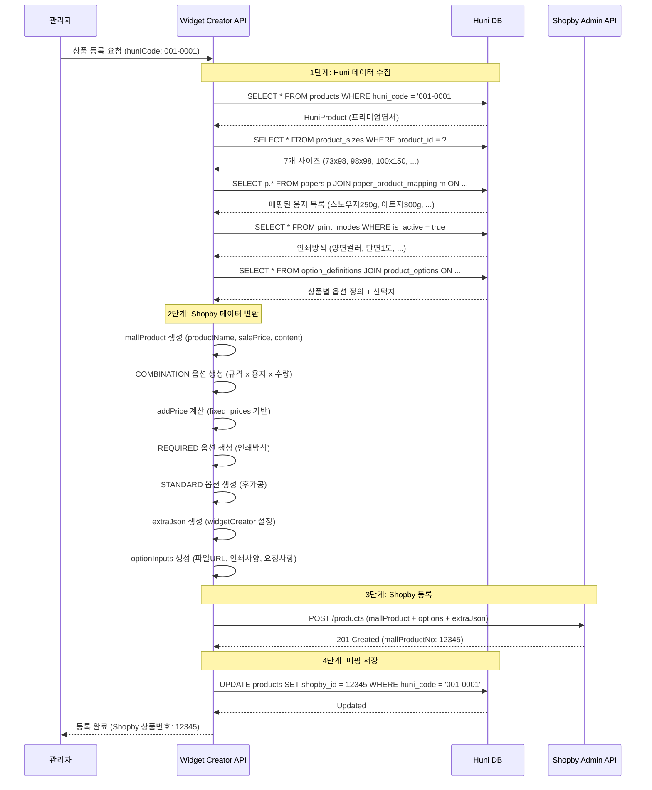
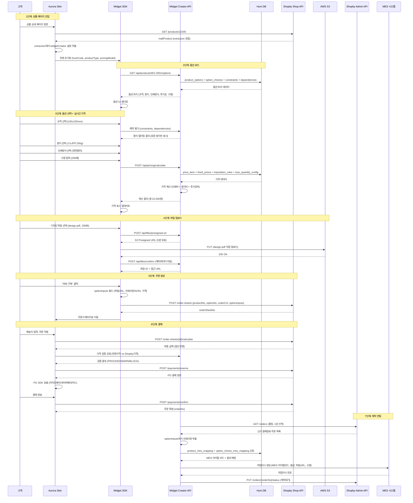
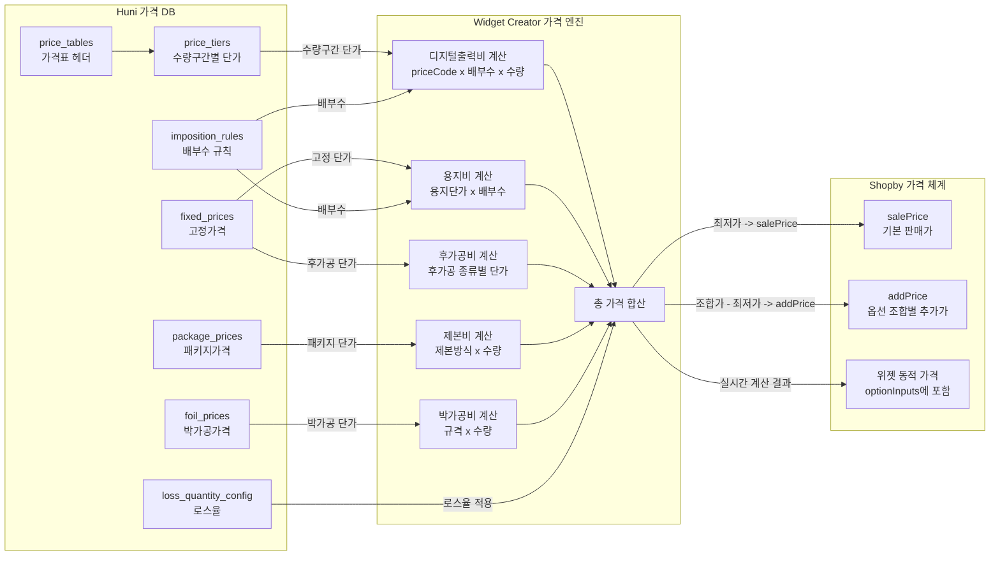
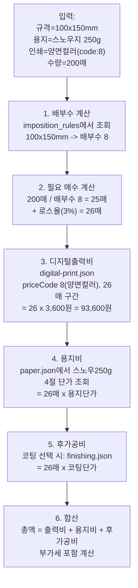
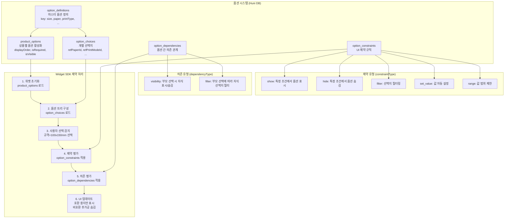
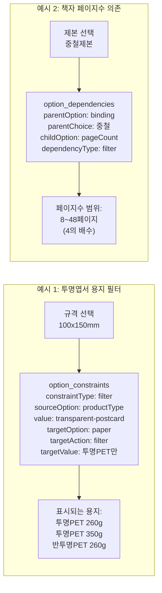
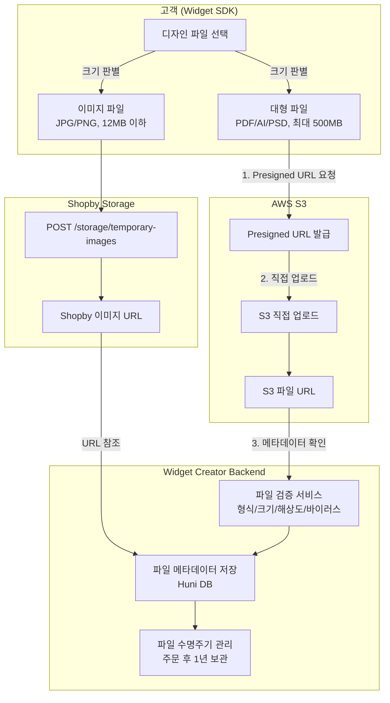

# Huni DB - Shopby 통합 설계 문서

---

| 항목 | 값 |
|------|------|
| 문서 ID | SPEC-SHOPBY-INTEGRATION-DESIGN |
| 제목 | Huni DB 26-Table 스키마와 Shopby 플랫폼 통합 설계 |
| 생성일 | 2026-02-22 |
| 버전 | 1.0.0 |
| 상태 | Active |
| 범위 | Huni DB -> Shopby 상품 동기화 -> Widget SDK -> 주문 플로우 |
| 참조 SPEC | SPEC-INFRA-001, SPEC-SHOPBY-001~006, SPEC-DATA-001~002 |

---

## 1. 개요 (Overview)

### 1.1 문서 목적

본 문서는 후니프린팅(Huni)의 인쇄 지식 데이터베이스(26개 테이블, SPEC-INFRA-001)와 Shopby(NHN Commerce) 플랫폼 간의 전체 통합 아키텍처를 설계한다. 데이터 매핑, 상품 등록, 고객 주문, 가격 계산, 파일 업로드, 주문 처리의 모든 플로우를 포괄하는 통합 참조 문서이다.

### 1.2 범위

- **데이터 원천**: Huni DB (PostgreSQL 16, Drizzle ORM, 26개 테이블)
- **대상 플랫폼**: Shopby (NHN Commerce) - Shop API / Admin API
- **중간 계층**: Widget Creator Backend API + Widget SDK
- **최종 소비자**: 쇼핑몰 고객 (Aurora Skin 프론트엔드)
- **후방 연동**: MES (제조실행시스템), AWS S3 (파일 스토리지)

### 1.3 상품 규모

| 카테고리 | 코드 | 상품 수 | 주요 상품 예시 |
|---------|------|---------|--------------|
| 엽서 | 01 | 약 15개 | 프리미엄엽서, 코팅엽서, 2단접지카드 |
| 스티커 | 02 | 약 14개 | 반칼자유형스티커, 규격스티커, 합판스티커 |
| 명함 | 03 | 약 15개 | 스탠다드명함, 코팅명함, 프리미엄명함 |
| 전단/리플렛 | 04 | 약 17개 | 소량전단지, 접지리플렛, 와이드접지리플렛 |
| 상품권/인쇄물 | 05 | 약 10개 | 스탠다드상품권, 프리미엄상품권, 봉투 |
| 책자 | 06 | 약 5개 | 중철책자, 무선책자, PUR책자, 트윈링책자 |
| 캘린더 | 07 | 약 5개 | 탁상형, 벽걸이, 미니캘린더 |
| 파우치 | 08 | 약 6개 | 파우치, 토트백 등 |
| 대형인쇄 | 09 | 약 13개 | 현수막, 배너, X배너 |
| 포스터 | 10 | 약 10개 | 포스터 |
| 아크릴 | 11 | 약 8개 | 아크릴키링, 아크릴스탠드 |
| 기타 | 12 | 약 16개 | 포토카드, 종이슬로건, 배경지 |
| **합계** | | **약 229개** | |

---

## 2. 데이터 매핑 (Data Mapping)

### 2.1 핵심 엔티티 매핑

| Huni DB 테이블 | SQL Table | 필드 | Shopby 대상 | Shopby 필드 | 변환 로직 |
|---------------|-----------|------|------------|------------|----------|
| HuniProduct | products | name | mallProduct | productName | 직접 매핑 |
| HuniProduct | products | shopbyId | mallProduct | mallProductNo | 등록 후 반환값 저장 |
| HuniProduct | products | description | mallProduct | content | HTML 변환 + 위젯 임베드 코드 삽입 |
| HuniProduct | products | productType | extraJson | widgetCreator.productType | 직접 매핑 (digital-print, sticker, booklet 등) |
| HuniProduct | products | pricingModel | extraJson | widgetCreator.pricingModel | 직접 매핑 (digital-print-calc, sticker-direct 등) |
| HuniProduct | products | huniCode | extraJson | widgetCreator.huniCode | 직접 매핑 (001-0001 형식) |
| HuniProduct | products | editorEnabled | extraJson | widgetCreator.features | editorEnabled=true -> "editor" 포함 |
| HuniProduct | products | orderMethod | extraJson | widgetCreator.orderMethod | upload/editor |
| HuniProduct | products | isActive | mallProduct | saleStatusType | isActive=true -> "ONSALE", false -> "STOP" |
| HuniCategory | categories | name | category | categoryNo | 카테고리 매핑 테이블 별도 관리 |
| HuniCategory | categories | code | category | categoryNo | "01" -> Shopby categoryNo 매핑 |
| HuniProductSize | product_sizes | displayName | optionData | optionValue (옵션1) | "규격" COMBINATION 옵션값 |
| HuniProductSize | product_sizes | cutWidth/cutHeight | extraJson | widgetCreator.sizeSpecs | mm 단위 사이즈 스펙 |
| HuniPaper | papers | name | optionData | optionValue (옵션2) | "용지" COMBINATION 옵션값 |
| HuniPaper | papers | weight | optionData | 옵션값 접미사 | "스노우지" + "250g" 형태 |
| HuniMaterial | materials | name | optionData | optionValue (옵션2) | 비종이 재질 (아크릴, PVC 등) |
| HuniPrintMode | print_modes | name | optionData | optionValue (REQUIRED) | "인쇄방식" 옵션값 (양면컬러, 단면1도 등) |
| HuniPrintMode | print_modes | priceCode | 가격 계산 | - | 디지털출력비 priceTable 키 |
| HuniPostProcess | post_processes | name | optionData | optionValue (STANDARD) | "후가공" 옵션값 (코팅, 오시, 미싱 등) |
| HuniBinding | bindings | name | optionData | optionValue (REQUIRED) | "제본방식" 옵션값 (중철, 무선, PUR 등) |
| HuniFixedPrice | fixed_prices | sellingPrice | optionData | addPrice | 옵션 조합별 추가가 계산 |
| HuniPackagePrice | package_prices | sellingPrice | optionData | addPrice | 책자 패키지 가격 |
| HuniPriceTable | price_tables | code | 가격 계산 | - | 가격표 참조 (Widget 측 동적 계산) |
| HuniPriceTier | price_tiers | unitPrice | 가격 계산 | - | 수량 구간별 단가 (Widget 측) |
| HuniFoilPrice | foil_prices | sellingPrice | 가격 계산 | - | 박가공 가격 (Widget 측) |
| HuniImpositionRule | imposition_rules | impositionCount | 가격 계산 | - | 배부수 계산에 사용 |
| HuniLossQuantityConfig | loss_quantity_config | lossRate | 가격 계산 | - | 로스율 적용 |
| HuniOptionDefinition | option_definitions | key/name | optionData | optionName | "size" -> "규격", "paper" -> "용지" |
| HuniProductOption | product_options | displayOrder | 위젯 UI | - | 옵션 표시 순서 |
| HuniOptionChoice | option_choices | name | optionData | optionValue | 개별 선택지 값 |
| HuniOptionChoice | option_choices | priceKey | 가격 계산 | - | 가격표 참조 키 |
| HuniOptionConstraint | option_constraints | constraintType | 위젯 로직 | - | show/hide/filter/set_value 등 |
| HuniOptionDependency | option_dependencies | dependencyType | 위젯 로직 | - | visibility/filter 의존 관계 |
| HuniMesItem | mes_items | itemCode | 주문 처리 | - | MES 작업지시 생성 시 참조 |
| HuniMesItemOption | mes_item_options | optionValue | 주문 처리 | - | MES 작업 옵션 |
| HuniProductMesMapping | product_mes_mapping | mesItemId | 주문 처리 | - | 상품->MES 아이템 매핑 |
| HuniProductEditorMapping | product_editor_mapping | templateId | 위젯 SDK | - | 에디커스 편집기 연동 |
| HuniOptionChoiceMesMapping | option_choice_mes_mapping | mesCode | 주문 처리 | - | 옵션 선택->MES 코드 변환 |

### 2.2 Shopby 옵션 유형별 매핑

| Shopby 옵션 유형 | Huni DB 원천 | 매핑 방식 | 예시 |
|----------------|------------|----------|------|
| COMBINATION (옵션1: 규격) | HuniProductSize.displayName | 상품별 사이즈 목록 -> optionValue1 | "90x50mm", "A4(210x297mm)" |
| COMBINATION (옵션2: 용지) | HuniPaper.name + weight 또는 HuniMaterial.name | 상품-용지 매핑(paper_product_mapping) -> optionValue2 | "스노우지 250g", "아트지 300g" |
| COMBINATION (옵션3: 수량) | HuniPriceTier.minQty/maxQty | 가격 테이블 수량 구간 -> optionValue3 | "100매", "200매", "500매" |
| REQUIRED (인쇄방식) | HuniPrintMode.name | print_modes 테이블 -> REQUIRED 옵션 | "양면컬러", "단면1도" |
| REQUIRED (제본) | HuniBinding.name | bindings 테이블 -> REQUIRED 옵션 (책자만) | "중철제본", "무선제본" |
| STANDARD (후가공) | HuniPostProcess.name | post_processes 테이블 -> STANDARD 옵션 | "양면코팅", "오시1줄", "미싱2줄" |
| optionInputs | Widget SDK 출력 | 주문 시 위젯이 생성 | 파일 URL, 인쇄 사양 JSON |

### 2.3 카테고리 매핑

| Huni 카테고리 (code) | Huni 카테고리명 | Shopby 1depth | Shopby 2depth | Shopby 3depth |
|---------------------|--------------|-------------|-------------|-------------|
| 01 | 엽서 | 인쇄물 | 엽서/카드 | 프리미엄엽서, 코팅엽서, 접지카드 |
| 02 | 스티커 | 인쇄물 | 스티커/라벨 | 자유형스티커, 규격스티커, 합판스티커 |
| 03 | 명함 | 인쇄물 | 명함 | 스탠다드, 코팅, 프리미엄, 수입지 |
| 04 | 전단/리플렛 | 인쇄물 | 전단/리플렛 | 소량전단, 접지리플렛 |
| 05 | 상품권/인쇄물 | 인쇄물 | 상품권/봉투 | 상품권, 봉투 |
| 06 | 책자 | 인쇄물 | 책자/카탈로그 | 중철, 무선, PUR, 트윈링, 하드커버 |
| 07 | 캘린더 | 인쇄물 | 캘린더 | 탁상형, 벽걸이 |
| 08 | 파우치 | 굿즈 | 파우치/가방 | 파우치, 토트백 |
| 09 | 대형인쇄 | 대형인쇄 | 현수막/배너 | 현수막, 배너, X배너 |
| 10 | 포스터 | 대형인쇄 | 포스터 | 포스터 |
| 11 | 아크릴 | 굿즈 | 아크릴 | 키링, 스탠드 |
| 12 | 기타 | 인쇄물 | 기타인쇄물 | 포토카드, 슬로건, 배경지 |

---

## 3. 아키텍처 다이어그램 (Mermaid)

### 3.1 시스템 전체 아키텍처

```mermaid
graph TB
    subgraph HuniDB["Huni DB (PostgreSQL 16)"]
        direction TB
        CAT[categories<br/>12 카테고리]
        PRD[products<br/>229 상품]
        SZ[product_sizes]
        PAP[papers]
        MAT[materials]
        PPM[paper_product_mapping]
        PM[print_modes]
        PP[post_processes]
        BND[bindings]
        PT[price_tables]
        PTR[price_tiers]
        FP[fixed_prices]
        PKP[package_prices]
        FLP[foil_prices]
        IR[imposition_rules]
        LQ[loss_quantity_config]
        OD[option_definitions]
        PO[product_options]
        OC[option_choices]
        OCN[option_constraints]
        ODEP[option_dependencies]
        MI[mes_items]
        MIO[mes_item_options]
        PMM[product_mes_mapping]
        PEM[product_editor_mapping]
        OCM[option_choice_mes_mapping]

        CAT --> PRD
        PRD --> SZ
        PRD --> FP
        PRD --> PKP
        PRD --> PPM
        PRD --> PO
        PRD --> OCN
        PRD --> ODEP
        PRD --> PMM
    end

    subgraph WCBackend["Widget Creator Backend"]
        SYNC[상품 동기화 서비스]
        MAPPER[옵션 매퍼]
        PRICE[가격 엔진]
        CONSTRAINT[제약 평가기]
        FILEAPI[파일 관리 API]
        ORDERAPI[주문 검증 API]
        MESBRIDGE[MES 브리지]
    end

    subgraph ShopbyPlatform["Shopby Platform (NHN Commerce)"]
        direction TB
        SADMIN[Admin API<br/>상품 등록/수정]
        SSHOP[Shop API<br/>상품 조회/주문]
        SPAY[결제 시스템<br/>KCP/카카오/네이버/토스]
        SORDER[주문 관리]
        SSTORAGE[Storage API<br/>이미지 12MB]
    end

    subgraph Client["Client (쇼핑몰)"]
        AURORA[Aurora Skin<br/>React 프론트엔드]
        WIDGET[Widget SDK<br/>인쇄 옵션 위젯]
        CDN[CDN<br/>위젯 번들]
    end

    subgraph External["외부 시스템"]
        S3[AWS S3<br/>디자인 파일]
        MES[MES 시스템<br/>제조실행]
        PG[PG사<br/>KCP/INICIS]
        NOTIFY[알림<br/>알림톡/이메일]
    end

    HuniDB --> |Drizzle ORM| WCBackend
    SYNC --> |POST /products| SADMIN
    MAPPER --> |옵션 변환| SYNC
    PRICE --> |addPrice 계산| SYNC

    CDN --> |script 로드| AURORA
    AURORA --> |DOM 삽입| WIDGET
    WIDGET --> |옵션/가격 API| WCBackend
    WIDGET --> |장바구니/주문| SSHOP
    AURORA --> |상품 조회| SSHOP

    SSHOP --> |결제 예약| SPAY
    SPAY --> |PG 호출| PG
    SORDER --> |주문 조회| SADMIN

    WIDGET --> |Presigned URL| S3
    WIDGET --> |이미지 업로드| SSTORAGE

    ORDERAPI --> |주문 상태 폴링| SADMIN
    MESBRIDGE --> |작업지시| MES
    ORDERAPI --> |알림 발송| NOTIFY
```



### 3.2 상품 등록 플로우 (Product Registration Flow)



### 3.3 고객 주문 플로우 (Customer Order Flow)



### 3.4 가격 계산 데이터 플로우 (Pricing Data Flow)



**가격 계산 상세 플로우 (디지털 인쇄 상품 예시: 프리미엄엽서)**:



### 3.5 옵션 제약 조건 플로우 (Option Constraints Flow)



**제약 조건 실제 예시**:



### 3.6 DB 엔티티 관계도 (ER Diagram - Huni 26 tables)

```mermaid
erDiagram
    categories ||--o{ products : "has many"
    categories ||--o{ categories : "parent-child"

    products ||--o{ product_sizes : "has many"
    products ||--o{ product_options : "has many"
    products ||--o{ fixed_prices : "has many"
    products ||--o{ package_prices : "has many"
    products ||--o{ paper_product_mapping : "has many"
    products ||--o{ product_mes_mapping : "has many"
    products ||--|| product_editor_mapping : "has one"
    products ||--o{ option_constraints : "has many"
    products ||--o{ option_dependencies : "has many"

    papers ||--o{ paper_product_mapping : "mapped to"
    papers ||--o{ option_choices : "referenced by"
    papers ||--o{ fixed_prices : "priced at"

    materials ||--o{ option_choices : "referenced by"
    materials ||--o{ fixed_prices : "priced at"

    print_modes ||--o{ option_choices : "referenced by"
    print_modes ||--o{ fixed_prices : "priced at"
    print_modes ||--o{ package_prices : "priced at"

    post_processes ||--o{ option_choices : "referenced by"

    bindings ||--o{ option_choices : "referenced by"

    option_definitions ||--o{ product_options : "configured for"
    option_definitions ||--o{ option_choices : "has choices"
    option_definitions ||--o{ option_constraints : "source/target"
    option_definitions ||--o{ option_dependencies : "parent/child"

    option_choices ||--o{ option_choice_mes_mapping : "mapped to MES"
    option_choices ||--o{ option_dependencies : "parent choice"

    product_sizes ||--o{ fixed_prices : "priced at"
    product_sizes ||--o{ package_prices : "priced at"

    price_tables ||--o{ price_tiers : "has tiers"

    mes_items ||--o{ mes_item_options : "has options"
    mes_items ||--o{ product_mes_mapping : "mapped from"
    mes_items ||--o{ option_choice_mes_mapping : "mapped from"

    categories {
        int id PK
        string code UK
        string name
        int parentId FK
        int depth
        int displayOrder
        boolean isActive
    }

    products {
        int id PK
        int categoryId FK
        string huniCode UK
        string edicusCode UK
        int shopbyId UK
        string name
        string productType
        string pricingModel
        string sheetStandard
        string orderMethod
        boolean editorEnabled
        boolean isActive
    }

    product_sizes {
        int id PK
        int productId FK
        string code
        string displayName
        decimal cutWidth
        decimal cutHeight
        int impositionCount
        boolean isCustom
    }

    papers {
        int id PK
        string code UK
        string name
        int weight
        decimal costPerRear
        decimal sellingPerRear
    }

    materials {
        int id PK
        string code UK
        string name
        string materialType
        string thickness
    }

    print_modes {
        int id PK
        string code UK
        string name
        string sides
        string colorType
        int priceCode
    }

    post_processes {
        int id PK
        string code UK
        string name
        string processType
        string priceBasis
    }

    bindings {
        int id PK
        string code UK
        string name
        int minPages
        int maxPages
        int pageStep
    }

    option_definitions {
        int id PK
        string key UK
        string name
        string optionClass
        string optionType
        string uiComponent
    }

    option_choices {
        int id PK
        int optionDefinitionId FK
        string code
        string name
        string priceKey
        int refPaperId FK
        int refPrintModeId FK
        int refPostProcessId FK
        int refBindingId FK
    }

    option_constraints {
        int id PK
        int productId FK
        string constraintType
        int sourceOptionId FK
        string operator
        string value
        int targetOptionId FK
        string targetAction
    }

    option_dependencies {
        int id PK
        int productId FK
        int parentOptionId FK
        int parentChoiceId FK
        int childOptionId FK
        string dependencyType
    }

    price_tables {
        int id PK
        string code UK
        string name
        string priceType
        string quantityBasis
    }

    price_tiers {
        int id PK
        int priceTableId FK
        string optionCode
        int minQty
        int maxQty
        decimal unitPrice
    }

    fixed_prices {
        int id PK
        int productId FK
        int sizeId FK
        int paperId FK
        int printModeId FK
        decimal sellingPrice
        decimal costPrice
    }

    package_prices {
        int id PK
        int productId FK
        int sizeId FK
        int printModeId FK
        int pageCount
        int minQty
        decimal sellingPrice
    }

    foil_prices {
        int id PK
        string foilType
        string foilColor
        decimal width
        decimal height
        decimal sellingPrice
    }

    imposition_rules {
        int id PK
        string cutSizeCode
        decimal cutWidth
        decimal cutHeight
        int impositionCount
        string sheetStandard
    }

    loss_quantity_config {
        int id PK
        string scopeType
        int scopeId
        decimal lossRate
        int minLossQty
    }

    mes_items {
        int id PK
        string itemCode UK
        string name
        string itemType
    }

    mes_item_options {
        int id PK
        int mesItemId FK
        int optionNumber
        string optionValue
    }

    product_mes_mapping {
        int id PK
        int productId FK
        int mesItemId FK
        string coverType
    }

    product_editor_mapping {
        int id PK
        int productId FK_UK
        string editorType
        string templateId
        json templateConfig
    }

    option_choice_mes_mapping {
        int id PK
        int optionChoiceId FK
        int mesItemId FK
        string mesCode
        string mappingType
        string mappingStatus
    }

    paper_product_mapping {
        int id PK
        int paperId FK
        int productId FK
        string coverType
        boolean isDefault
    }

    product_options {
        int id PK
        int productId FK
        int optionDefinitionId FK
        int displayOrder
        boolean isRequired
        boolean isVisible
        int defaultChoiceId FK
    }
```

---

## 4. 상품 등록 전략 (Product Registration Strategy)

### 4.1 Shopby 옵션 매핑 전략

229개 상품을 productType별로 분류하여 각각의 Shopby 옵션 매핑 전략을 수립한다.

#### 4.1.1 Digital Print 상품 (엽서, 명함, 전단 등 - 약 80개)

| 옵션 레벨 | Shopby 유형 | Huni 원천 | 예시 값 |
|----------|-----------|----------|--------|
| 옵션1: 규격 | COMBINATION | product_sizes.displayName | "100x150mm", "90x50mm" |
| 옵션2: 용지 | COMBINATION | papers.name (via paper_product_mapping) | "스노우지 250g", "아트지 300g" |
| 옵션3: 수량 | COMBINATION | price_tiers 수량 구간 | "100매", "200매", "500매" |
| 인쇄방식 | REQUIRED | print_modes.name | "양면컬러", "단면1도" |
| 후가공 | STANDARD | post_processes.name | "양면코팅", "오시1줄" |
| addPrice | 계산 | fixed_prices.sellingPrice | 조합별 차등 가격 |

**조합 수 추정**: 규격 7개 x 용지 10개 x 수량 8개 = 560개 조합 (대표 조합 선별 필요)

#### 4.1.2 Sticker 상품 (약 14개)

| 옵션 레벨 | Shopby 유형 | Huni 원천 | 예시 값 |
|----------|-----------|----------|--------|
| 옵션1: 규격 | COMBINATION | product_sizes.displayName | "105x148mm", "210x297mm" |
| 옵션2: 재질 | COMBINATION | materials.name | "모조지", "아트지", "투명PET" |
| 옵션3: 수량 | COMBINATION | price_tiers 수량 구간 | "100매", "500매", "1000매" |
| 재단방식 | REQUIRED | option_choices (cuttingType) | "반칼", "자유형", "규격" |
| addPrice | 계산 | fixed_prices.sellingPrice | sticker-direct 모델 |

#### 4.1.3 Booklet 상품 (책자 - 약 5개)

| 옵션 레벨 | Shopby 유형 | Huni 원천 | 예시 값 |
|----------|-----------|----------|--------|
| 옵션1: 규격 | COMBINATION | product_sizes.displayName | "A5(148x210mm)", "A4(210x297mm)" |
| 옵션2: 내지용지 | COMBINATION | papers.name (coverType=inner) | "백색모조지 100g", "아트지 150g" |
| 옵션3: 표지용지 | COMBINATION | papers.name (coverType=cover) | "스노우지 250g", "아트지 300g" |
| 인쇄방식 | REQUIRED | print_modes.name | "양면컬러" |
| 제본방식 | REQUIRED | bindings.name | "중철제본", "무선제본", "PUR제본" |
| 페이지수 | REQUIRED | 위젯 입력 (bindings.minPages~maxPages) | "16p", "32p", "64p" |
| 수량 | optionInputs | 위젯 동적 입력 | 1~1000부 |
| addPrice | 계산 | package_prices.sellingPrice | 패키지 가격 모델 |

**특이사항**: 책자는 COMBINATION 3개 옵션 한도를 초과하므로, 규격+내지+표지를 COMBINATION으로, 나머지(제본, 인쇄방식, 페이지수, 수량)는 위젯 전용 옵션으로 처리.

#### 4.1.4 Large Format 상품 (현수막, 배너 등 - 약 31개)

| 옵션 레벨 | Shopby 유형 | Huni 원천 | 예시 값 |
|----------|-----------|----------|--------|
| 옵션1: 규격 | COMBINATION | product_sizes.displayName | "900x1200mm", "600x1800mm" |
| 옵션2: 재질 | COMBINATION | materials.name | "시트지", "현수막천", "PP합성지" |
| 옵션3: 수량 | COMBINATION | - | "1개", "2개", "5개" |
| 마감처리 | STANDARD | post_processes.name | "열재단", "그로멧", "봉제" |
| addPrice | 계산 | fixed_prices.sellingPrice | 직접 매핑 |

#### 4.1.5 단순 상품 (굿즈/파우치 등 - 약 62개)

| 옵션 레벨 | Shopby 유형 | Huni 원천 | 예시 값 |
|----------|-----------|----------|--------|
| 옵션1: 규격/종류 | COMBINATION | product_sizes.displayName | "A형", "B형" |
| 옵션2: 수량 | COMBINATION | - | "1개", "5개", "10개" |
| addPrice | 계산 | fixed_prices.sellingPrice | 직접 매핑 |

### 4.2 가격 동기화 전략

#### 4.2.1 이중 가격 체계

```
                    Shopby 가격 (정적)              Widget 가격 (동적)
                    ──────────────                  ──────────────
salePrice:          최저 조합 가격                   -
addPrice:           조합별 (가격 - salePrice)        -
동적 계산:           지원하지 않음                    실시간 옵션별 가격 계산
수량별 가격:         고정된 수량 옵션만               연속 수량 입력 지원
후가공 가격:         STANDARD addPrice (대략값)       정밀 계산
최종 주문 가격:      -                               optionInputs.widgetPrice
```

#### 4.2.2 HuniFixedPrice -> Shopby addPrice 변환

```
변환 공식:
1. 전체 옵션 조합에 대해 fixed_prices 조회
2. salePrice = MIN(모든 조합의 sellingPrice)
3. 각 조합의 addPrice = sellingPrice - salePrice
4. VAT 포함 처리: sellingPrice에 vatIncluded 필드 확인

예시 (프리미엄엽서):
- 73x98mm + 스노우250g + 양면컬러 + 100매 = 15,000원 (최저가)
- salePrice = 15,000원
- 100x150mm + 아트300g + 양면컬러 + 200매 = 28,000원
- addPrice = 28,000 - 15,000 = 13,000원
```

#### 4.2.3 수량 기반 가격 (Shopby 미지원 대응)

Shopby는 수량별 동적 가격을 네이티브로 지원하지 않는다. 대응 전략:

- **Shopby 측**: 대표 수량(100, 200, 500, 1000매)을 COMBINATION 옵션3으로 등록, 각 수량별 addPrice 고정
- **Widget 측**: 고객이 임의 수량(예: 350매) 입력 시 price_tiers에서 실시간 가격 계산
- **주문 시**: Widget이 계산한 정확한 가격을 optionInputs.widgetPrice에 포함
- **검증**: Shopby 옵션 가격과 Widget 가격의 차이를 서버에서 검증 (100원 이내 허용)

### 4.3 extraJson 설계

Shopby mallProduct의 extraJson 필드에 저장되는 Widget Creator 연동 데이터:

```json
{
  "widgetCreator": {
    "version": "1.0.0",
    "huniProductId": 14529,
    "huniCode": "001-0001",
    "productType": "digital-print",
    "pricingModel": "digital-print-calc",
    "sheetStandard": "4x6",
    "orderMethod": "upload",
    "editorEnabled": false,
    "widgetConfig": {
      "options": [
        {
          "key": "size",
          "type": "select",
          "required": true,
          "shopbyMapping": "COMBINATION_1"
        },
        {
          "key": "paper",
          "type": "select",
          "required": true,
          "shopbyMapping": "COMBINATION_2"
        },
        {
          "key": "printType",
          "type": "select",
          "required": true,
          "shopbyMapping": "REQUIRED"
        },
        {
          "key": "quantity",
          "type": "number",
          "required": true,
          "shopbyMapping": "COMBINATION_3"
        },
        {
          "key": "finishing",
          "type": "multiselect",
          "required": false,
          "shopbyMapping": "STANDARD"
        }
      ],
      "constraints": [
        {
          "type": "filter",
          "source": "productType",
          "target": "paper",
          "description": "상품 유형에 따른 용지 필터링"
        }
      ],
      "dependencies": [
        {
          "parent": "size",
          "child": "paper",
          "type": "filter",
          "description": "규격에 따른 호환 용지 필터"
        }
      ],
      "pricing": {
        "source": "widget",
        "model": "digital-print-calc",
        "currency": "KRW",
        "vatIncluded": true
      }
    },
    "features": [
      "fileUpload",
      "dynamicPricing",
      "constraintEngine",
      "previewImage"
    ],
    "mesMapping": {
      "itemCode": "001-0001",
      "hasOptions": true
    }
  }
}
```

### 4.4 optionInputs 설계

Shopby 상품의 구매자작성형 입력 옵션 (모든 인쇄 상품 공통):

```json
[
  {
    "inputLabel": "디자인 파일 (PDF, AI, PSD)",
    "inputType": "TEXT",
    "required": true,
    "matchingType": "OPTION"
  },
  {
    "inputLabel": "인쇄 사양 (자동 입력)",
    "inputType": "TEXTAREA",
    "required": true,
    "matchingType": "OPTION"
  },
  {
    "inputLabel": "특수 요청사항",
    "inputType": "TEXTAREA",
    "required": false,
    "matchingType": "OPTION"
  }
]
```

**주문 시 optionInputs 실제 데이터**:

```json
{
  "optionInputs": [
    {
      "inputLabel": "디자인 파일 (PDF, AI, PSD)",
      "inputValue": "https://s3.ap-northeast-2.amazonaws.com/huni-files/orders/2026/02/design-abc123.pdf"
    },
    {
      "inputLabel": "인쇄 사양 (자동 입력)",
      "inputValue": "{\"huniCode\":\"001-0001\",\"size\":{\"code\":\"100x150\",\"name\":\"100x150mm\",\"cutWidth\":100,\"cutHeight\":150},\"paper\":{\"code\":\"snow250\",\"name\":\"스노우지 250g\"},\"printMode\":{\"code\":\"both-color\",\"name\":\"양면컬러\",\"priceCode\":8},\"quantity\":200,\"postProcess\":[{\"code\":\"both-coating\",\"name\":\"양면코팅\"}],\"widgetPrice\":{\"printCost\":93600,\"paperCost\":15600,\"finishingCost\":5200,\"totalBeforeVat\":114400,\"vat\":11440,\"total\":125840}}"
    },
    {
      "inputLabel": "특수 요청사항",
      "inputValue": "로고 색상 정확히 맞춰주세요"
    }
  ]
}
```

---

## 5. 파일 업로드 전략 (File Upload Strategy)

### 5.1 이중 스토리지 아키텍처



### 5.2 파일명 규칙

MES 시스템 연동을 위한 파일명 규칙:

```
{주문번호}_{상품코드}_{옵션코드}_{페이지}.{확장자}
예: ORD-20260222-001_001-0001_100x150_snow250_01.pdf
```

### 5.3 파일-주문 연결

| 단계 | 시스템 | 저장 위치 | 데이터 |
|------|-------|---------|-------|
| 업로드 시 | Widget SDK -> S3 | S3 bucket | 원본 디자인 파일 |
| 메타 저장 | WC Backend | Huni DB (별도 테이블) | 파일ID, S3 Key, 크기, 해상도, 상태 |
| 주문 시 | Widget SDK -> Shopby | optionInputs[0].inputValue | S3 파일 URL |
| 제작 시 | WC Backend -> MES | MES 작업지시 | S3 다운로드 URL (24시간 유효 Presigned) |

---

## 6. 주문 연동 플로우 (Order Integration Flow)

### 6.1 상세 단계별 플로우

**Step 1: Widget 가격 계산**
- Widget SDK가 고객의 옵션 선택을 Widget Creator API에 전송
- 가격 엔진이 Huni DB의 price_tiers, fixed_prices, imposition_rules, loss_quantity_config를 참조하여 정밀 계산
- 계산 결과: 인쇄비 + 용지비 + 후가공비 + 부가세 = 최종 가격

**Step 2: optionInputs 생성**
- Widget SDK가 선택된 옵션 정보를 JSON 문자열로 직렬화
- S3 업로드 파일의 URL 포함
- 계산된 가격 정보 포함 (widgetPrice 객체)

**Step 3: Shopby 주문서 생성**
- Widget SDK 또는 Aurora Skin이 Shopby Shop API 호출
- `POST /order-sheets` with: productNo, optionNo (COMBINATION 조합), orderCnt, optionInputs
- 즉시구매 모드: 장바구니를 거치지 않고 직접 주문서 생성

**Step 4: Shopby 가격 계산**
- `POST /order-sheets/{id}/calculate`: Shopby가 옵션 가격(addPrice) 기반으로 금액 계산
- 쿠폰, 적립금, 할인 적용

**Step 5: 가격 검증**
- Widget Creator Backend가 optionInputs의 widgetPrice와 Shopby 계산 가격을 비교
- 허용 오차: 100원 이내 -> PROCEED
- 100~1,000원 -> WARN (관리자 알림)
- 1,000원 초과 -> BLOCK (주문 차단)

**Step 6: PG 결제**
- `POST /payments/reserve`: 결제 수단 선택, 금액 확인
- PG SDK 호출 (카카오페이, 네이버페이, 카드 등)
- 결제 성공 시 `POST /payments/confirm`

**Step 7: 주문 확정 및 MES 연동**
- Widget Creator Backend가 Shopby Admin API를 1분 간격으로 폴링
- "결제완료" 상태 주문 감지
- optionInputs에서 인쇄 사양 JSON 추출 및 파싱
- product_mes_mapping 조회: HuniProduct -> MES 아이템 코드 매핑
- option_choice_mes_mapping 조회: 선택된 옵션 -> MES 옵션 코드 변환
- MES 시스템에 작업지시 생성 (REST API)
- Shopby 주문 상태 업데이트: "제작대기"

**Step 8: 제작 및 배송**
- MES에서 제작 상태 콜백 수신
- 단계별 Shopby 주문 상태 업데이트: 제작중 -> 검수완료 -> 출고준비 -> 출고완료
- 운송장 번호 등록: `PUT /orders/{orderNo}/delivery`
- 고객 알림 발송: 알림톡/이메일 (각 상태 변경 시)

### 6.2 주문 상태 매핑

| 순서 | Shopby 주문 상태 | Huni 제작 상태 | 트리거 |
|------|----------------|-------------|-------|
| 1 | PAY_DONE (결제완료) | - | 고객 결제 성공 |
| 2 | PRODUCT_PREPARE (상품준비중) | 주문확인 | 관리자 확인 또는 자동 확인 |
| 3 | PRODUCT_PREPARE | 제작대기 | MES 작업지시 생성 |
| 4 | PRODUCT_PREPARE | 제작중 | MES 제작 시작 콜백 |
| 5 | PRODUCT_PREPARE | 검수완료 | MES 검수 통과 콜백 |
| 6 | DELIVERY_PREPARE (배송준비중) | 출고준비 | 제작물 포장 완료 |
| 7 | DELIVERY_ING (배송중) | 출고완료 | 운송장 등록 |
| 8 | DELIVERY_DONE (배송완료) | 배송완료 | 배송 완료 확인 |

---

## 7. SPEC 통합 권고 (SPEC Integration Recommendation)

### 7.1 현황 분석

현재 Shopby 통합 관련 SPEC은 6개(SPEC-SHOPBY-001~006)로 기능 도메인별로 분리되어 있다:

| SPEC | 범위 | 상태 | 이 설계 문서와의 관계 |
|------|------|-----|---------------------|
| SPEC-SHOPBY-001 | API 매핑 분석 | Planned | 본 문서 2, 3장에서 상세화 |
| SPEC-SHOPBY-002 | 상품 등록/옵션 | Planned | 본 문서 4장에서 상세화 |
| SPEC-SHOPBY-003 | 위젯 SDK 임베딩 | Planned | 본 문서 3.3, 3.5장 참조 |
| SPEC-SHOPBY-004 | 주문/결제 연동 | Planned | 본 문서 6장에서 상세화 |
| SPEC-SHOPBY-005 | 파일 업로드 | Planned | 본 문서 5장에서 상세화 |
| SPEC-SHOPBY-006 | 주문 처리/Admin | Planned | 본 문서 6장에서 상세화 |

### 7.2 권고사항

**본 문서는 독립 참조 문서(Reference Document)로 유지하고, 기존 6개 SPEC 체계를 변경하지 않을 것을 권고한다.**

근거:

1. **역할 분리**: 본 문서는 "설계 참조"이고, 각 SPEC은 "구현 명세"이다. 설계 문서는 전체 그림을 보여주고, SPEC은 구체적인 구현 요구사항과 인수 기준을 정의한다.

2. **6개 SPEC 분리의 적절성**: 현재 분리가 기능 도메인(API 분석 -> 상품 등록 -> 위젯 -> 주문 -> 파일 -> 백오피스)별로 잘 나뉘어 있고, 의존성 관계도 명확하다(SHOPBY-MASTER-PLAN.md 참조).

3. **이 문서의 활용 방식**:
   - SPEC-SHOPBY-001 구현 시: 본 문서 2장(데이터 매핑), 3.1(전체 아키텍처) 참조
   - SPEC-SHOPBY-002 구현 시: 본 문서 4장(상품 등록 전략), 3.2(등록 플로우) 참조
   - SPEC-SHOPBY-003 구현 시: 본 문서 3.3(주문 플로우), 3.5(제약 조건) 참조
   - SPEC-SHOPBY-004 구현 시: 본 문서 6장(주문 연동), 3.4(가격 플로우) 참조
   - SPEC-SHOPBY-005 구현 시: 본 문서 5장(파일 업로드) 참조
   - SPEC-SHOPBY-006 구현 시: 본 문서 6.2(상태 매핑), 3.3(MES 연동) 참조

4. **갱신 전략**: 구현 과정에서 데이터 매핑이나 아키텍처에 변경이 생기면 본 문서를 우선 업데이트하고, 영향받는 SPEC에 변경 사항을 반영한다.

### 7.3 문서 계층 구조

```
SHOPBY-MASTER-PLAN.md (일정/리소스 관리)
    |
    +-- SPEC-SHOPBY-INTEGRATION-DESIGN.md (본 문서: 기술 설계 참조)
    |       |
    |       +-- 데이터 매핑 (2장)
    |       +-- 아키텍처 다이어그램 (3장)
    |       +-- 상품 등록 전략 (4장)
    |       +-- 파일 업로드 전략 (5장)
    |       +-- 주문 연동 플로우 (6장)
    |
    +-- SPEC-SHOPBY-001 (API 매핑 구현)
    +-- SPEC-SHOPBY-002 (상품 등록 구현)
    +-- SPEC-SHOPBY-003 (위젯 SDK 구현)
    +-- SPEC-SHOPBY-004 (주문/결제 구현)
    +-- SPEC-SHOPBY-005 (파일 업로드 구현)
    +-- SPEC-SHOPBY-006 (주문 처리 구현)
```

---

## 부록 A: Huni DB 도메인별 테이블 요약

### Domain 1: Product Catalog (3 tables)

| 테이블 | 역할 | 주요 필드 | Shopby 관련성 |
|-------|------|---------|-------------|
| categories | 상품 카테고리 (12개, 계층) | code, name, parentId, depth | Shopby 카테고리 매핑 |
| products | 마스터 상품 (229개) | huniCode, shopbyId, productType, pricingModel | mallProduct 1:1 매핑 |
| product_sizes | 상품별 사이즈 | displayName, cutWidth, cutHeight, impositionCount | COMBINATION 옵션1 |

### Domain 2: Materials (3 tables)

| 테이블 | 역할 | 주요 필드 | Shopby 관련성 |
|-------|------|---------|-------------|
| papers | 용지 마스터 | name, weight, sellingPerRear | COMBINATION 옵션2 |
| materials | 비종이 재질 | name, materialType, thickness | COMBINATION 옵션2 (스티커/대형) |
| paper_product_mapping | 상품-용지 연결 | paperId, productId, coverType | 상품별 사용 가능 용지 필터 |

### Domain 3: Processes (3 tables)

| 테이블 | 역할 | 주요 필드 | Shopby 관련성 |
|-------|------|---------|-------------|
| print_modes | 인쇄 방식 | name, sides, colorType, priceCode | REQUIRED 옵션 |
| post_processes | 후가공 | name, processType, priceBasis | STANDARD 옵션 |
| bindings | 제본 방식 | name, minPages, maxPages, pageStep | REQUIRED 옵션 (책자) |

### Domain 4: Pricing (6 tables)

| 테이블 | 역할 | 주요 필드 | Shopby 관련성 |
|-------|------|---------|-------------|
| price_tables | 가격표 헤더 | code, priceType, quantityBasis | Widget 가격 엔진 참조 |
| price_tiers | 수량 구간 단가 | optionCode, minQty, maxQty, unitPrice | Widget 동적 가격 계산 |
| fixed_prices | 고정 가격 | productId, sizeId, paperId, sellingPrice | addPrice 계산 원천 |
| package_prices | 패키지 가격 (책자) | pageCount, minQty, sellingPrice | 책자 addPrice 원천 |
| foil_prices | 박가공 가격 | foilType, width, height, sellingPrice | Widget 가격 계산 |
| imposition_rules | 배부수 규칙 | cutWidth, cutHeight, impositionCount | 용지비/출력비 계산 |
| loss_quantity_config | 로스율 | scopeType, lossRate | 필요 매수 계산 |

### Domain 5: Options & UI (5 tables)

| 테이블 | 역할 | 주요 필드 | Shopby 관련성 |
|-------|------|---------|-------------|
| option_definitions | 마스터 옵션 정의 | key, name, optionClass, uiComponent | Shopby optionName 매핑 |
| product_options | 상품별 옵션 설정 | displayOrder, isRequired, isVisible | 옵션 표시 제어 |
| option_choices | 개별 선택지 | name, priceKey, refPaperId, ... | Shopby optionValue 매핑 |
| option_constraints | 제약 규칙 | constraintType, sourceOption, targetAction | Widget 제약 엔진 |
| option_dependencies | 의존 관계 | parentOption, childOption, dependencyType | Widget 의존 엔진 |

### Domain 6: Integration (5 tables)

| 테이블 | 역할 | 주요 필드 | Shopby 관련성 |
|-------|------|---------|-------------|
| mes_items | MES 아이템 마스터 | itemCode, name, itemType | 주문 -> MES 작업지시 |
| mes_item_options | MES 아이템 옵션 | optionNumber, optionValue | MES 작업 옵션 값 |
| product_mes_mapping | 상품-MES 매핑 | productId, mesItemId, coverType | 상품별 MES 아이템 연결 |
| product_editor_mapping | 에디터 매핑 | editorType, templateId, templateConfig | Widget 편집기 연동 |
| option_choice_mes_mapping | 옵션-MES 매핑 | optionChoiceId, mesCode, mappingType | 옵션 선택 -> MES 코드 |

---

## 부록 B: 주요 API 엔드포인트 정리

### Shopby Shop API (고객 대면)

| 기능 | 메서드 | 엔드포인트 | 용도 |
|------|--------|----------|------|
| 상품 조회 | GET | /products/{productNo} | 상품 상세 + extraJson |
| 상품 옵션 | GET | /products/{productNo}/options | 옵션 목록 조회 |
| 장바구니 추가 | POST | /cart | optionInputs 포함 |
| 주문서 생성 | POST | /order-sheets | 즉시구매/장바구니 주문 |
| 금액 계산 | POST | /order-sheets/{id}/calculate | 쿠폰/할인 적용 |
| 결제 예약 | POST | /payments/reserve | PG 결제 준비 |
| 결제 확인 | POST | /payments/confirm | 결제 완료 처리 |
| 이미지 업로드 | POST | /storage/temporary-images | 12MB 제한 |
| 인증 | POST | /auth/token | OAuth 2.0 |

### Shopby Admin API (관리자)

| 기능 | 메서드 | 엔드포인트 | 용도 |
|------|--------|----------|------|
| 상품 등록 | POST | /products | mallProduct 생성 |
| 상품 수정 | PUT | /products/{productNo} | mallProduct 업데이트 |
| 주문 조회 | GET | /orders/{orderNo} | 주문 상세 + optionInputs |
| 주문 목록 | GET | /orders | 폴링용 (1분 간격) |
| 상태 변경 | PUT | /orders/{orderNo}/status | 제작 단계별 상태 업데이트 |
| 배송 등록 | PUT | /orders/{orderNo}/delivery | 운송장 번호 등록 |
| 클레임 | POST | /claims | 취소/교환/반품 |
| 배송 템플릿 | GET | /delivery-templates | 배송 정책 조회 |

### Widget Creator API (내부)

| 기능 | 메서드 | 엔드포인트 | 용도 |
|------|--------|----------|------|
| 옵션 트리 | GET | /api/products/{huniCode}/options | 옵션 + 제약 + 의존 |
| 가격 계산 | POST | /api/pricing/calculate | 실시간 동적 가격 |
| 제약 평가 | POST | /api/constraints/evaluate | 옵션 제약 검증 |
| 파일 URL | POST | /api/files/presigned-url | S3 Presigned URL 발급 |
| 파일 확인 | POST | /api/files/confirm | 업로드 완료 확인 |
| 가격 검증 | POST | /api/orders/verify-price | Widget vs Shopby 가격 비교 |

---

문서 버전: 1.0.0
최종 수정일: 2026-02-22
작성: MoAI manager-strategy
