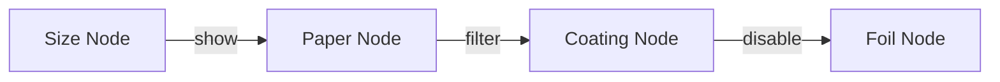

# Constraint Editor

3-tier constraint UX, node-based editor, and 14 pattern templates.

> **Core**: Manage complex option dependencies via visual node graph.

<Callout type="info">
**Vision**: Evolving toward N8N-like node-based visual product design tool.
</Callout>

## 1. Constraint Overview

### 1.1 What are Constraints?

Rules controlling option visibility, requirements, and filtering

### 1.2 6 Action Types

| Action | Korean Label | Description | Example |
|--------|--------------|-------------|---------|
| show | 보이기 | Show target when condition met | Binding=TwinRing → Show Ring Color |
| hide | 숨기기 | Hide target when condition met | Material=Transparent → Hide Coating |
| require | 필수로 변경 | Make target required | Foil=Yes → Require Foil Color |
| disable | 선택 불가 | Disable target | Saddle Stitch → Disable Spine Thickness |
| load_data | 입력필드 표시 | Load dynamic input field | Size=Custom → Show Width/Height |
| filter | 특정값만 표시 | Filter target choices | Size=A5 → Filter matching prices |

## 2. Decision Table Editor (DecisionTable)

Spreadsheet-style view of all constraints

### 2.1 Column Structure

| # | Pattern | Source Option | Source Value | Target | Action | Priority |
|---|---------|---------------|--------------|--------|--------|----------|
| 1 | P1 | binding | twin_ring | foil_color | show | 1 |
| 2 | P2 | paper | glossy | coating | filter | 1 |

### 2.2 Features

- **Filtering**: By pattern type, action type, keyword search
- **Inline editing**: Click cell to modify
- **Sorting**: By priority, pattern, source option
- **Bulk operations**: Multi-select rules, batch delete

### 2.3 Actions

- [+ Add Rule]: Add new rule
- [Template]: Apply pattern template
- [Excel Import]: Import from Excel

## 3. Simple Creator (SimpleConstraintForm) - 70% Coverage

3-step Korean sentence-form constraint creation

<Steps>
### Step 1: Condition

"[Option A] 에서 [Value X] 을(를) 선택하면"

### Step 2: Result

"[Option B] 을(를) [action]"

Action radio options:
- show (보이기)
- hide (숨기기)
- filter (필터)
- require (필수로 변경)
- disable (선택 불가)
- load_data (입력필드 표시)

For filter: Tag-style value selector

### Step 3: Memo and Priority

Memo (optional) and priority number

### 4. Natural Language Preview

Korean sentence preview of rule

### 5. Test Before Save

Simulate rule in preview mode
</Steps>

<Callout type="info">
**Usage**: Simple Creator handles most common single-condition rules.
</Callout>

## 4. Advanced Creator (AdvancedConstraintForm) - 30% Coverage

<Steps>
### Step 1: Create Condition Group

Select logic (AND: All conditions / OR: Any condition)

### Step 2: Add Multiple Conditions

Per row: Option + Operator + Value

### Step 3: Add Multiple Effects

Per row: Target + Action + Applied Values

### Step 4: Range Constraints

For number options: min/max/step with preview

### Step 5: Review Condition Summary

Natural language condition summary

### 6. Test then Save
</Steps>

<Callout type="warning">
**Usage**: Advanced mode is for compound conditions that Simple Creator cannot express.
</Callout>

## 5. Node-Based Constraint Editor (ConstraintNodeEditor)

### 5.1 Overview and Vision

**Current**: Visual graph showing option nodes and constraint edges

**Future direction**: N8N-like visual product design tool where administrators and AI collaboratively design product configurations

### 5.2 OptionNode Components

Each product option appears as a node on canvas

**Display**:
- Option key
- Display name
- Choice count
- Constraint connection count

**Operations**:
- Click: Select
- Drag: Reposition

**States**:
- normal: Default
- selected: Highlighted border
- error: Red border

### 5.3 ConstraintEdge Connections

**Edge types and visual styles**:

| Edge Type | Visual | Color | Meaning |
|-----------|--------|-------|---------|
| show/require | Solid arrow | Blue | Source activates/loads target |
| hide/disable | Dashed arrow | Red | Source restricts target |
| filter | Dotted arrow | Green | Source filters target choices |
| load_data | Dash-dot arrow | Orange | Source loads dynamic data |

**Creating edges**: Click source node port, drag to target node port

**Deleting edges**: Select edge, press Delete or use EdgeInspector [Delete] button

### 5.4 Toolbar

| Button | Action |
|--------|--------|
| [+ Add Node] | Add option nodes not yet on canvas |
| [Auto Layout] | Dagre algorithm arranges nodes optimally |
| [AI Suggest] | Analyze options and propose constraints (planned) |
| [Validate] | Check for circular dependencies, contradictions |
| [Minimap] | Toggle minimap for navigation |

Zoom controls: Mouse wheel, pinch, toolbar buttons

### 5.5 EdgeInspector (Bottom Panel)

Shows when an edge is selected

**Fields**:
- Source option
- Target option
- Constraint type (dropdown)
- Condition expression
- Pattern (P1-P14)
- Priority

**Actions**:
- [Save Edge]
- [Delete Edge]

### 5.6 ValidationPanel

Displays validation results after [Validate] click

**Error levels**:
- Error (red): Critical
- Warning (yellow): Caution
- Info (blue): Information

**Validation checks**:

| Check | Level | Description |
|-------|-------|-------------|
| Circular dependency | Error | A → B → C → A chain |
| Contradictory effects | Error | Same target has show AND hide |
| Orphan constraint | Error | References non-existent option |
| Unreachable target | Warning | Target always hidden by another rule |
| Redundant rule | Warning | Covered by higher-priority rule |
| Missing coverage | Info | Option combination has no rules |

<Callout type="info">
**Recommendation**: Use the Node Editor for visualizing complex constraint relationships. Use Decision Table for simple list management.
</Callout>

## 6. 14 Pattern Templates

| Pattern | Name | Products | Est. Rules | Description |
|---------|------|----------|------------|-------------|
| P1 | Foil Group Dependency | 7 | ~28 | Foil type cascades to color/size/position |
| P2 | Cover Paper-Coating Link | 5 | ~5 | Cover paper determines available coatings |
| P3 | Custom Size Input | 23 | ~46 | Non-standard size enables custom width/height |
| P4 | Variable Print Exclusion | 9 | ~18 | Variable text/image mutual exclusion |
| P5 | Binding-Page Range | 6 | ~6 | Binding type sets page count range |
| P6 | Binding-Sub-option | 2 | ~4 | Binding enables ring color/direction |
| P7 | Paper-Coating Compatibility | - | ~30 | Paper type restricts coating options |
| P8 | Size-Accessory Compatibility | - | ~15 | Size determines available accessories |
| P9 | Packaging Dependency | - | ~10 | Product type sets packaging config |
| P10 | Color/Type Pricing | - | ~20 | Color selection affects pricing tier |
| P11 | Special Print Exclusion | - | ~12 | Special print excludes paper/finishing |
| P12 | Cutting Type Dependency | - | ~8 | Cutting style determines size options |
| P13 | Calendar Binding | - | ~5 | Calendar type determines binding options |
| P14 | Folding Pattern | - | ~10 | Folding type sets size/page constraints |

<Callout type="info">
**Confirmed patterns**: P1-P6 are confirmed from production data analysis. P7-P14 are potential patterns for administrator configuration.
</Callout>

## 7. Test/Simulation Panel

Order screen simulation within constraint editor

- **Applied rule log**: Which rules fired, in what order
- Real-time constraint evaluation as options are changed

## 8. Future Direction: AI-Assisted Visual Product Design

<Callout type="warning">
**The following features are planned and not yet available.**
</Callout>

- **AI constraint suggestions**: Automatic rule generation from WowPress API data analysis
- **Confidence scoring**: Probabilistic scores for AI-suggested constraints
- **Evolution toward N8N-like workflow**: Nodes carry semantic meaning, AI co-creates product configurations

## Related Documentation

- [Product Management](./product-management) - Option tree structure
- [Option Management](./option-management) - Option types and dependencies
- [Price Rules](./price-rules) - Pricing-affecting constraints
