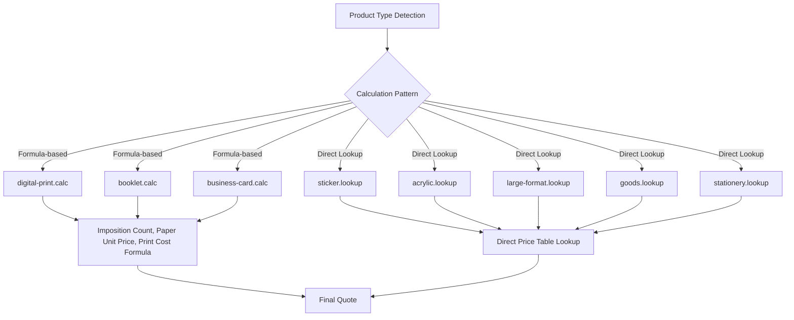
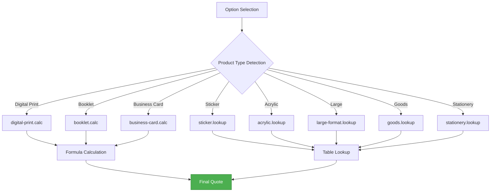
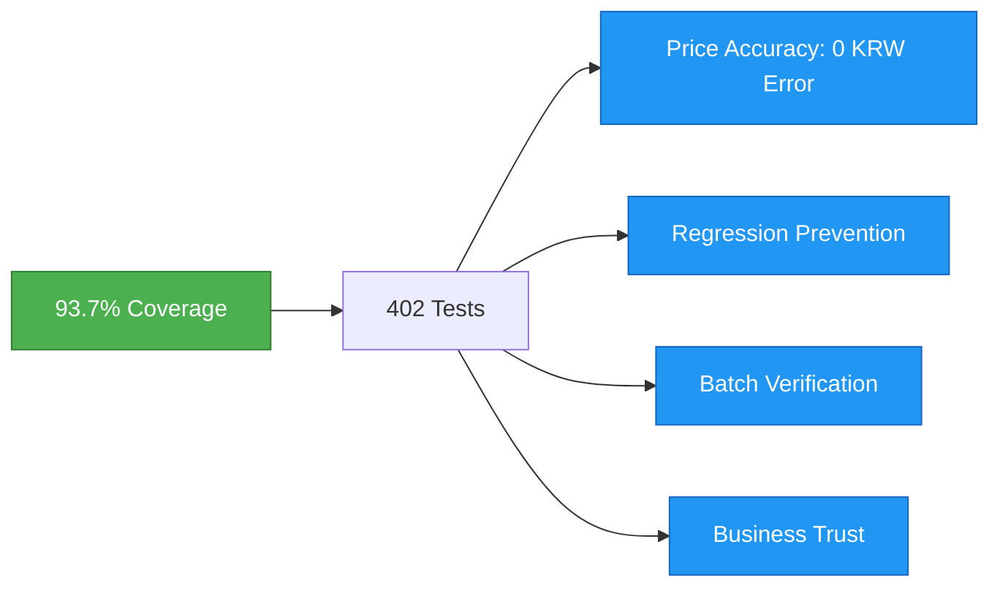
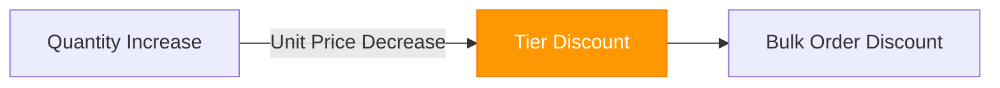

# Pricing Philosophy

Understand the importance of real-time quotes and design principles of 8 calculators.

## Importance of Real-time Quotes

### Traditional Print Quote Method


### Wowpress Method


### huni.builder Method


---

## 8 Calculators Design Principles

### Formula-based vs Direct Lookup



| Pattern | Calculator | Principle |
|---------|-----------|-----------|
| **Formula-based** | digital-print, booklet, business-card | Formula calculation with imposition count, paper unit price, print cost variables |
| **Direct Lookup** | sticker, acrylic, large-format, goods, stationery | Direct price table lookup by product/option/quantity combination |

### Formula-based Calculator Details

<div className="info-block">

**Digital Print Calculation (digital-print.calc)**

```
Price = (Imposition Count × Paper Unit Price) + Print Cost + Finishing Cost + Binding Cost
```

- **Imposition Count**: Quantity that can be placed on print sheet
- **Paper Unit Price**: Unit price by paper type
- **Print Cost**: Print cost by color mode
- **Finishing Cost**: Additional costs for coating, foil, emboss, etc.
- **Binding Cost**: Costs for splitting, full nail, storage, etc.

</div>

---

## Price Calculation Flow



### Calculator Features

| Calculator | Product Type | Coverage |
|------------|-------------|----------|
| digital-print.calc | Flyers, Leaflets, Catalogs | 96.81% |
| booklet.calc | Perfect bound, Saddle stitch booklets | 95.57% |
| business-card.calc | Business cards | 96.57% |
| sticker.lookup | Stickers | 87.97% |
| acrylic.lookup | Acrylic products | 87.93% |
| large-format.lookup | Posters, Banners | 92.72% |
| goods.lookup | Goods | 97.43% |
| stationery.lookup | Stationery | 95.48% |

---

## Meaning of Test Coverage

### Business Value of 93.7% Coverage



#### Price Accuracy

<div className="tip-block">

**Integer KRW Units (0 KRW Error)**

- Print prices must be accurate to the won unit
- Even 1 won error affects customer trust
- 402 tests verify all cases

</div>

#### Regression Prevention

- **Option Addition**: Guarantee existing prices
- **Modification**: Maintain pre-change prices
- **Deletion**: Record pre-deletion prices

#### Batch Verification

- **All Products × Option Combinations**: Automated verification
- **Quantity Tiers**: 18-sheet tier unit price table
- **Finishing Combinations**: Test all combinations

#### Business Trust

<div className="info-block">

**Reliability of Prices Displayed to Customers in Real-time**

- Accuracy of real-time quotes
- No price changes after order
- Reduced refund/exchange costs

</div>

---

## Quantity Tier Pricing

### Quantity Tier Table

| Tier | Quantity | Unit Discount |
|------|----------|---------------|
| Tier 1 | 1~100 | Base unit price |
| Tier 2 | 101~300 | 5% discount |
| Tier 3 | 301~500 | 10% discount |
| Tier 4 | 501~1000 | 15% discount |
| Tier 5 | 1001+ | 20% discount |



---

## Next Steps

- [Widget Guide](../widget-guide) - Detailed widget usage guide
- [Pricing System](../pricing-system) - Price management and configuration
