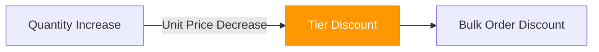

# Printing Domain Knowledge

Understand the core concepts, terminology, and option decision flow of the printing industry.

## Printing Basics

| Concept | Description | Widget Application |
|---------|-------------|-------------------|
| **Paper** | Snow, Art, Woodfree, Kraft, etc. | Paper option selection UI |
| **Size** | A4, A5, B5, Business card, Custom | Size option selection UI |
| **Color Mode** | Single/Double side, Color/B&W, 1/4 color | Color mode option UI |
| **Finishing** | Coating, Foil, Emboss, Die-cut, Folding, Stitching | Finishing option card UI |
| **Binding** | Perfect bound, Saddle stitch, Spiral, Glue binding | Binding option UI |
| **Imposition** | Quantity layout on print sheet | Internal price calculation |

### Paper Types

**Common Papers**
- **Snow Paper**: General flyers, leaflets
- **Art Paper**: High-quality printing, coating paper
- **Woodfree Paper**: Books, inner pages
- **Kraft Paper**: Sturdy packaging, business cards

**Special Papers**
- **Art Board**: Covers, thick cards
- **Emboss Paper**: Texture effects
- **Napi Paper**: Envelopes, packaging

### Size Specifications

| Size | mm (WxH) | Use |
|------|----------|-----|
| A4 | 210 x 297 | Documents, flyers |
| A5 | 148 x 210 | Leaflets, small booklets |
| B5 | 176 x 250 | Books |
| Business Card | 90 x 50 | Business cards |
| Poster (A0-A3) | Various | Posters, banners |

---

## Product Type Catalog

| Category | Representative Products | Features |
|----------|------------------------|----------|
| **Postcards** | Postcards, Business cards | Basic print materials |
| **Stickers** | Art paper stickers, Vinyl stickers | Direct lookup price |
| **Print Promotional** | Flyers, Leaflets, Catalogs | Digital print based |
| **Posters** | A0-A3 posters | Large format printing |
| **Signs** | Banners, Hanging banners | Large format printing |
| **Booklets** | Perfect bound, Saddle stitch booklets | Includes binding |
| **Calendars** | Desk, Wall calendars | Spiral binding |
| **Stationery** | Memo pads, Envelopes | Direct lookup |
| **Acrylic** | Acrylic keychains, Stands | Direct lookup |
| **Life** | Eco bags, Tumblers | Goods category |
| **Packaging** | Boxes, Shopping bags | Packaging |
| **Eco bags/Pouches** | Cotton eco bags, Pouches | Direct lookup |

---

## Option Decision Flow

### Detailed Flow

1. **Category Selection**: Choose from 12 categories
2. **Product Selection**: Select detailed product within category
3. **Size Selection**: Standard or custom size
4. **Paper Selection**: Paper type and thickness
5. **Quantity Input**: Apply tiered pricing by quantity
6. **Color Mode Selection**: Single/Double side, Color/B&W
7. **Finishing Selection**: Add coating, foil, binding, etc.
8. **Real-time Quote**: Immediate calculation by 8 calculators

---

## Finishing Types

**Common Finishing**
- **Coating**: Vinyl coating (gloss/matte)
- **Foil Stamping**: Gold/silver foil application
- **Embossing**: Press pattern with die
- **Die-cut**: Cut to shape
- **Folding**: Folding work (center, 3-fold, 4-fold)
- **Stitching**: Sewing process

**Binding Methods**
- **Perfect Bound**: Glue binding
- **Saddle Stitch**: Wire stitch at center
- **Spiral**: Spiral binding
- **Glue Binding**: Thick glue binding

---

## Color Mode

### Color Modes

| Mode | Description | Use |
|------|-------------|-----|
| **4-color** | CMYK 4-color printing | General color printing |
| **1-color (Monochrome)** | Single color printing | Text, simple logos |
| **B&W** | Black and white printing | Documents, inner pages |

### Print Sides

| Side | Description | Price Impact |
|------|-------------|--------------|
| **Single Side** | Print on one side only | Base price |
| **Double Side** | Print on both sides | ~1.5-2x price |
| **Curtain (Edge)** | Edge printing | Special printing |

---

## Price Determinants

### Tiered Quantity Pricing

### Finishing Costs

- **Per-finishing additional cost**: Coating, foil, emboss calculated separately
- **Binding cost**: Calculated by booklet page count
- **Imposition quantity**: Minimize print sheet waste

---

## Next Steps

- [Wowpress Benchmarking](./wowpress-benchmarking) - Competitor analysis and improvements
- [Pricing Philosophy](./pricing-philosophy) - Design principles of 8 calculators
