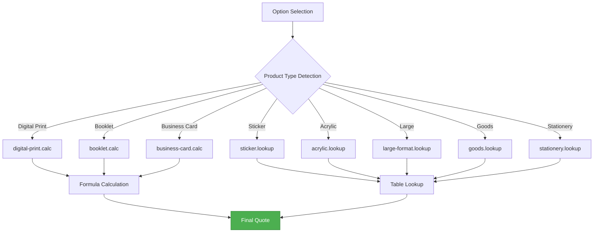
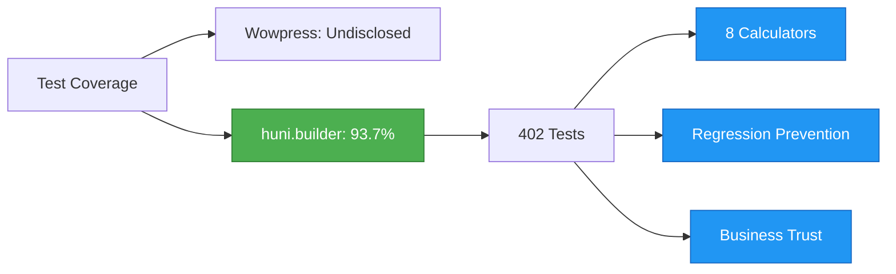

# Wowpress Benchmarking

Analyze competitor Wowpress (wowpress.co.kr) and summarize huni.builder's improvements.

## API Comparison

| Area | Wowpress Open API | huni.builder |
|------|-------------------|-------------|
| **Authentication** | Token-based (Bearer Token) | Typia/Nestia type-safe API |
| **Product Lookup** | Single endpoint (/api/products) | Module-separated (categories, products, options) |
| **Price Lookup** | Server-side (size+color+paper params) | Client embedded calculation engine |
| **Order** | REST API (sync) | REST API + CustomEvent (async option) |
| **File Upload** | 3 methods (direct/URL/async) | Edicus SDK integration |
| **Option Structure** | 7 areas (size, color, paper, finishing, supplies, delivery, quantity) | Decision table-based (14 pattern templates) |

---

## Price Structure Comparison

### Wowpress Price Structure

<div className="info-block">

**Wowpress Price Lookup Method**

```
GET /api/price
Parameters:
- sizeinfo: Size code
- colorinfo: Color mode code
- paperinfo: Material code
- quantity: Quantity
```

- **Size x Color Mode x Material combination**: Server-side price table lookup
- **Finishing (awkjobinfo)**: Additional cost calculated separately
- **Network dependent**: API call on every option change

</div>

### huni.builder 8 Calculators



| Pattern | Calculator | Principle |
|---------|-----------|-----------|
| **Formula-based** | digital-print, booklet, business-card | Formula calculation with imposition count, paper unit price, print cost variables |
| **Direct Lookup** | sticker, acrylic, large-format, goods, stationery | Direct price table lookup by product/option/quantity combination |

---

## Option Constraints Comparison

### Wowpress Constraint Patterns

<div className="warning-block">

**Wowpress Option Constraint Examples**

- Prepaid delivery impossible: Certain product combinations prohibit prepaid delivery
- Bundle shipping impossible: Bundle shipping restricted for some options
- Lotte delivery impossible: Lotte delivery restricted in some regions

These constraints are managed as hardcoded business logic.

</div>

### huni.builder Decision Table

| Feature | Wowpress | huni.builder |
|---------|----------|-------------|
| **Constraint Management** | Hardcoded logic | Decision table-based |
| **Pattern Templates** | None | 14 pattern templates |
| **Flexibility** | Low | High |
| **Admin UI** | None | Constraint editor provided |

#### 14 Pattern Templates

1. Size-paper dependency
2. Quantity-finishing dependency
3. Color mode-finishing dependency
4. Delivery region constraints
5. Payment method constraints
6. Option combination constraints
7. Min/max quantity
8. Finishing duplicate constraints
9. Binding method constraints
10. Paper-finishing compatibility
11. Time constraints (order deadline)
12. Region-specific additional costs
13. Bulk order constraints
14. Custom production constraints

---

## Improvement Summary

### 1. Real-time Client Price Calculation

| Metric | Wowpress | huni.builder |
|--------|----------|-------------|
| **Response Time** | Seconds (API roundtrip) | Milliseconds (embedded engine) |
| **Network Dependency** | Required | None |
| **Offline Support** | Not available | Available |

### 2. Shadow DOM CSS Isolation

<div className="tip-block">

**Wowpress Issues**
- Host-dependent CSS for self-site only
- Style conflict risk when embedding on other sites

**huni.builder Solution**
- Complete CSS isolation with Shadow DOM
- Embed on any site without conflicts
- Lightweight bundle at 48.71KB gzipped

</div>

### 3. Multi-channel Support

| Channel | Wowpress | huni.builder |
|---------|----------|-------------|
| **Self Site** | Supported | Supported |
| **Shopby** | Not supported | Supported (CustomEvent) |
| **Own Store** | Not supported | Supported (widget embed) |
| **Third-party Sites** | Not supported | Supported (IIFE/ESM) |

### 4. Test Coverage



### 5. TypeScript Type Safety

| Layer | Wowpress | huni.builder |
|-------|----------|-------------|
| **Frontend** | JavaScript | TypeScript + Zod |
| **API** | Undisclosed | Typia/Nestia |
| **Database** | Undisclosed | Drizzle ORM |

---

## Competitor References

### Wowpress

<div className="info-block">

**Notes**
- URL: https://wowpress.co.kr
- Features: Category dropdown, real-time price display
- Pros: Various products, complete order process
- Cons: Self-site only, limited API exposure

</div>

### Bizhows

<div className="info-block">

**Notes**
- URL: https://bizhows.com
- Features: Chip/button-based option selection UI
- Pros: Intuitive UI, conditional option activation
- Cons: Limited product range

</div>

---

## Next Steps

- [Pricing Philosophy](./pricing-philosophy) - Design principles of 8 calculators
- [API Reference](../api-reference) - REST API endpoints
