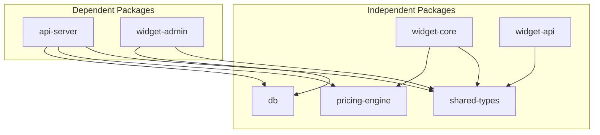

# Monorepo Structure

Understand the roles, dependencies, and build order of 7 packages.

## Package Overview

| Package | Role | Main Technologies |
|---------|------|-------------------|
| `@huni/db` | PostgreSQL schema, Drizzle ORM | Drizzle ORM 0.44, postgres 3.4 |
| `@huni/api-server` | NestJS 11 Admin REST API | NestJS 11, Fastify, Typia 7, Nestia 10 |
| `@huni/pricing-engine` | Pure TypeScript pricing calculation | Zod (no external deps) |
| `@huni/shared-types` | Common TypeScript types/Zod schemas | Zod |
| `@huni/widget-core` | React 19 embeddable widget | React 19, Zustand 5, Vite 6 |
| `@huni/widget-admin` | React 19 admin dashboard | React 19, TanStack, dnd-kit |
| `@huni/widget-api` | Widget REST API client | TypeScript |

---

## Dependency Graph



---

## Build Order

### 1. Build Independent Packages First

```bash
# Build in order (no dependencies)
pnpm -F @huni/shared-types build
pnpm -F @huni/db build
pnpm -F @huni/pricing-engine build
pnpm -F @huni/widget-core build
pnpm -F @huni/widget-api build
```

### 2. Build Dependent Packages

```bash
# Build packages with dependencies
pnpm -F @huni/api-server build
pnpm -F @huni/widget-admin build
```

---

## Common Type Usage Pattern

### Import @huni/shared-types

```typescript
// Import common types in package
import { ProductSchema, OptionSchema } from '@huni/shared-types';

// Use Zod schema
const product = ProductSchema.parse(data);
```

### Share Types Between Packages

```typescript
// Use pricing-engine types in widget-core
import type { PriceCalculationOptions, QuoteResult } from '@huni/pricing-engine';
```

---

## Package Scripts

### Root Scripts

```bash
# Project-wide scripts
pnpm test           # Run all tests
pnpm type-check     # Type check
pnpm lint           # Lint
pnpm build          # Build all
```

### Per-Package Scripts

| Package | dev | build | test |
|---------|-----|-------|------|
| @huni/widget-core | `pnpm -F @huni/widget-core dev` | `pnpm -F @huni/widget-core build` | `pnpm -F @huni/widget-core test` |
| @huni/api-server | `pnpm -F @huni/api-server dev` | `pnpm -F @huni/api-server build` | `pnpm -F @huni/api-server test` |
| @huni/widget-admin | `pnpm -F @huni/widget-admin dev` | `pnpm -F @huni/widget-admin build` | `pnpm -F @huni/widget-admin test` |
| @huni/pricing-engine | - | `pnpm -F @huni/pricing-engine build` | `pnpm -F @huni/pricing-engine test` |

---

## Directory Tree

```
packages/
├── api-server/
│   ├── src/
│   │   ├── modules/        # NestJS modules
│   │   │   ├── products/
│   │   │   ├── orders/
│   │   │   ├── pricing/
│   │   │   └── mes/
│   │   ├── common/         # Common decorators, guards
│   │   └── main.ts
│   └── test/
├── db/
│   ├── schema/             # Drizzle schemas
│   │   ├── core/
│   │   ├── channel/
│   │   ├── order/
│   │   └── mes/
│   └── seed/               # Seed data
├── pricing-engine/
│   ├── src/
│   │   ├── calculators/    # 8 calculators
│   │   ├── validators/     # Data validators
│   │   └── utils/          # Utilities
│   └── test/
├── shared-types/
│   ├── schema/             # Zod schemas
│   └── types/              # TypeScript types
├── widget-core/
│   ├── src/
│   │   ├── components/     # React components
│   │   ├── hooks/          # Custom hooks
│   │   ├── store/          # Zustand store
│   │   └── widget/         # Widget entry points
│   └── test/
├── widget-admin/
│   ├── src/
│   │   ├── pages/          # Page components
│   │   ├── features/       # Feature components
│   │   └── components/     # Common components
│   └── test/
└── widget-api/
    ├── src/                # API client
    └── test/
```

---

## pnpm Filter Usage

### Work on Single Package

```bash
# Work on specific package only
pnpm -F @huni/widget-core <command>

# Use wildcards
pnpm -F "@huni/*" test     # Test all huni packages
pnpm -F "*-core" build     # Build packages ending with -core
```

### Work Between Packages

```bash
# Include dependent packages
pnpm -F @huni/widget-core --with-deps build

# Exclude dependent packages
pnpm -F @huni/widget-core --no-deps test
```

---

## Next Steps

- [Testing Strategy](./testing) - Hybrid DDD/TDD methodology
- [Contributing Guide](./contributing) - SPEC-based development workflow
