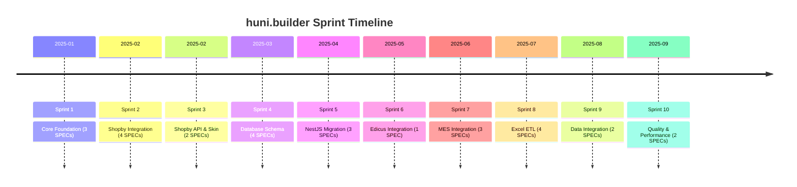
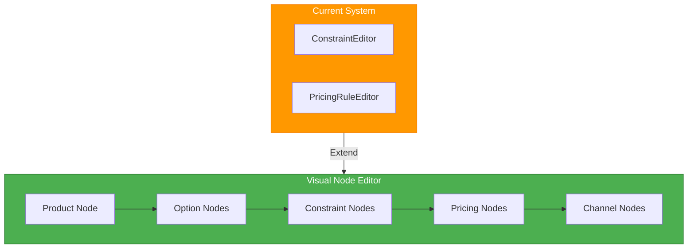
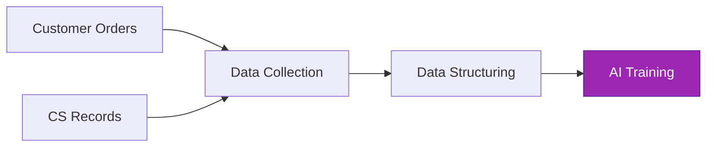
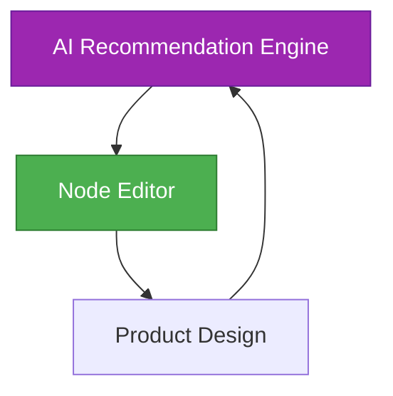
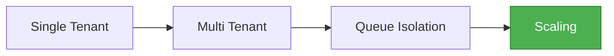
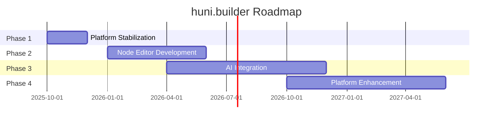

# Roadmap & Future Vision

Project current state, phased development direction, and Node-based product design editor vision.

## Current State

### Completed Core Systems

**Completed Items:**

- **Widget Core**: React 19 + Shadow DOM embeddable widget (48.71KB gzipped)
- **Admin Dashboard**: Product/option/constraint/price management
- **Pricing Engine**: 8 calculators, 93.7% coverage, 402 tests
- **Shopby Integration**: CustomEvent protocol, 95.67% coverage
- **MES Integration**: .NET 8 BackOffice API integration
- **Edicus Integration**: Online design editor SDK v2 integration
- **Excel ETL**: Product master/price table parsing pipeline
- **DB Schema**: 40+ tables, Drizzle ORM
- **API Server**: NestJS 11, 89 endpoints

### Metrics Summary

| Item | Count |
|------|-------|
| Completed SPECs | 30 (100% complete) |
| Tests | 1,214+ tests, 93.7% coverage |
| Packages | 7 packages |
| NestJS Modules | 24 modules |
| API Endpoints | 89 endpoints |

### Sprint History

---

## Phase 1: Platform Stabilization

### Goal

Build environment to operate completed systems stably

### Key Tasks

| Task | Description |
|------|-------------|
| **Complete API** | Widget API + External integration API enhancement |
| **Order Lifecycle Automation** | Quote → Order → Production → Delivery pipeline |
| **CS Integration** | Customer inquiries and file management system |
| **Multi-channel Product Sync** | Shopby + Own store + Third-party channels |
| **Operations Monitoring Dashboard** | Real-time monitoring and alerts |

---

## Phase 2: Node-based Product Design Editor

### Vision

> "The widget builder is difficult to express in UI/UX because diverse printing domain knowledge is combined and connected in complex ways. The goal is to evolve into a form where meaning is attached together in network topology or like N8N, BPS, and to design products together with AI."

### N8N/BPS Style Visual Node Editor

### Domain Node Types

| Node Type | Description | Examples |
|-----------|-------------|----------|
| **OptionNode** | Individual options like paper, size, color mode | A4 paper, Double side 4-color |
| **ConstraintNode** | Constraint rules between options | "A4 paper only allows double side" |
| **PricingNode** | Price calculation rules | Quantity tier unit price |
| **ProductNode** | Product definition | Postcard product |
| **ChannelNode** | Sales channel mapping | Shopby, Own store |

### Connection with Current System

| Current System | Future System |
|----------------|--------------|
| ConstraintEditor | ConstraintNodeEditor |
| PricingRuleEditor | PricingNodeEditor |
| Decision table UI | Node graph UI |

### Expected Benefits

**Solve UI/UX Expression Problem for Complex Printing Domain Knowledge**

- Improved visual understanding
- Non-experts can design products
- Connection with AI-based recommendations

---

## Phase 3: AI Integration

### AI Learning Data Accumulation

### AI-based Product Planning Proposals

| Area | Description |
|------|-------------|
| **Product Sales Pattern Analysis** | Popular option combination recommendations |
| **Customer Feedback & Reorder Patterns** | Improvement direction suggestions |
| **Price Strategy Simulation** | Competitiveness analysis and margin optimization |

### Automatic Manual/Guide Generation

**AI Automatically Generates Manuals by Analyzing Product Characteristics**

- Auto-generate customer printing guides
- Auto-generate and update FAQs
- Create production process guides

### AI + Node Editor Integration

> "Collaborative workflow of designing products together with AI"

---

## Phase 4: Platform Enhancement

### Multi-channel Widget Distribution Automation

| Feature | Description |
|---------|-------------|
| **One-click Deploy** | Copy widget code and use immediately |
| **Auto Update** | Automatic widget updates |
| **A/B Testing** | Widget variant testing |

### Partner Ecosystem

- **API Marketplace**: Provide API for developers
- **Widget Templates**: Industry-specific widget templates
- **Plugin System**: Extension feature ecosystem

### Global Expansion

| Item | Description |
|------|-------------|
| **Multi-language** | English, Japanese, Chinese support |
| **Multi-currency** | USD, EUR, JPY support |
| **Localization** | Regional printing standards support |

### SaaS Transition

---

## Technical Roadmap

---

## Next Steps

- [Contributing Guide](./contributing) - How to contribute to the project
- [API Reference](../api-reference) - REST API usage
