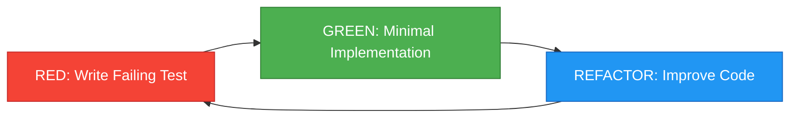
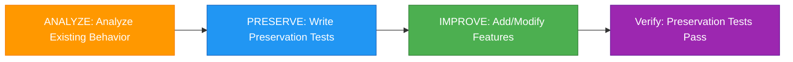

# Testing Strategy

Hybrid DDD/TDD methodology and how to achieve 93.7% test coverage.

## Testing Framework Overview

| Framework | Purpose | Version |
|-----------|---------|---------|
| **Vitest 3.0** | Unit and integration tests | 3.0+ |
| **@vitest/coverage-v8** | Code coverage measurement | 1.x |
| **Playwright** | E2E tests (widget-admin) | 1.40+ |
| **jsdom** | Browser environment simulation | 25.0+ |
| **@testing-library/react** | React component testing | 16.x |

---

## Coverage Goals

### Overall Goal: 85%+ (Currently Achieved: 93.7%)

| Package | Goal | Current Achievement |
|---------|------|---------------------|
| @huni/pricing-engine | 90%+ | 93.7% |
| @huni/widget-core | 90%+ | 95.67% |
| @huni/widget-admin | 85%+ | 88% |
| @huni/api-server | 85%+ | 87% |
| @huni/db | 80%+ | 82% |

---

## Running Tests

### Run All Tests

```bash
# Test entire workspace
pnpm test
```

### Per-Package Tests

```bash
# Test specific package
pnpm -F @huni/widget-core test
pnpm -F @huni/api-server test
pnpm -F @huni/widget-admin test
pnpm -F @huni/pricing-engine test
```

### With Coverage

```bash
# Test with coverage
pnpm -F @huni/widget-core test --coverage

# Generate coverage report
pnpm -F @huni/widget-core test --coverage --reporter=html
```

### Vitest UI Dashboard

```bash
# Run Vitest UI
pnpm test:ui

# Access http://localhost:51204
```

---

## Test File Organization

### Colocation Pattern

```
packages/widget-core/src/
├── components/
│   ├── OptionSelector.tsx
│   ├── OptionSelector.test.tsx       # Collocated
│   └── QuoteDisplay.tsx
│       └── QuoteDisplay.test.tsx     # Collocated
```

### Integration Tests

```
packages/widget-core/__tests__/
├── setup.ts                           # Test setup
├── integration/
│   ├── widget-flow.test.ts           # Widget integration flow
│   └── pricing-integration.test.ts   # Price calculation integration
```

### E2E Tests

```
packages/widget-admin/e2e/
├── admin-flow.spec.ts                # Admin dashboard E2E
└── product-management.spec.ts        # Product management E2E
```

---

## Writing Tests

### Unit Test Pattern

```typescript
import { describe, it, expect } from 'vitest';
import { sum } from './utils';

describe('sum', () => {
  it('should add two numbers', () => {
    expect(sum(1, 2)).toBe(3);
  });

  it('should handle negative numbers', () => {
    expect(sum(-1, 1)).toBe(0);
  });
});
```

### React Component Test

```typescript
import { render, screen } from '@testing-library/react';
import { describe, it, expect } from 'vitest';
import { QuoteDisplay } from './QuoteDisplay';

describe('QuoteDisplay', () => {
  it('should display quote amount', () => {
    render(<QuoteDisplay quote={{ totalPrice: 10000 }} />);
    expect(screen.getByText('10,000')).toBeInTheDocument();
  });

  it('should format number correctly', () => {
    render(<QuoteDisplay quote={{ totalPrice: 1234567 }} />);
    expect(screen.getByText('1,234,567')).toBeInTheDocument();
  });
});
```

### API Integration Test

```typescript
import { describe, it, expect, beforeAll } from 'vitest';
import { setupTestServer, closeTestServer } from './test-setup';

describe('Product API', () => {
  beforeAll(async () => {
    await setupTestServer();
  });

  it('should fetch products', async () => {
    const response = await fetch('/api/products');
    const products = await response.json();
    expect(products).toHaveLength(10);
  });
});
```

---

## Hybrid DDD/TDD Methodology

### New Code: TDD (RED-GREEN-REFACTOR)



#### TDD Example

```typescript
// 1. RED: Write failing test
it('should calculate sticker price', () => {
  const result = calculateStickerPrice('STK001', 100);
  expect(result).toBe(50000); // Not implemented yet
});

// 2. GREEN: Minimal implementation
function calculateStickerPrice(productId: string, quantity: number): number {
  return 50000; // Hardcode to pass
}

// 3. REFACTOR: Real implementation
function calculateStickerPrice(productId: string, quantity: number): number {
  const product = products.find(p => p.id === productId);
  return product.basePrice * quantity;
}
```

### Existing Code Modification: DDD (ANALYZE-PRESERVE-IMPROVE)



#### DDD Example (Characterization Test)

```typescript
// 1. ANALYZE: Analyze existing code
function legacyCalculatePrice(options: Options): number {
  // Complex logic...
}

// 2. PRESERVE: Preservation test for existing behavior
it('should preserve legacy price calculation', () => {
  const result = legacyCalculatePrice({ size: 'A4', quantity: 100 });
  expect(result).toMatchSnapshot(); // Preserve with snapshot
});

// 3. IMPROVE: Add features while preserving behavior
function legacyCalculatePrice(options: Options): number {
  // Add new features while preserving existing behavior
  const basePrice = calculateBasePrice(options);
  const discount = options.quantity > 100 ? 0.1 : 0;
  return basePrice * (1 - discount);
}

// 4. Verify: Confirm preservation tests pass
```

---

## E2E Testing (Playwright)

### Playwright Setup

```bash
# Install Playwright
pnpm -F @huni/widget-admin exec playwright install

# Install browsers
pnpm -F @huni/widget-admin exec playwright install chromium
```

### Run E2E Tests

```bash
# Run E2E tests
pnpm -F @huni/widget-admin test:e2e

# Run in headed mode
pnpm -F @huni/widget-admin test:e2e --headed

# Run in debug mode
pnpm -F @huni/widget-admin test:e2e --debug
```

### E2E Test Example

```typescript
import { test, expect } from '@playwright/test';

test('admin product management flow', async ({ page }) => {
  // Navigate to admin page
  await page.goto('/admin');

  // Login
  await page.fill('input[name="email"]', 'admin@example.com');
  await page.fill('input[name="password"]', 'password');
  await page.click('button[type="submit"]');

  // Navigate to product management
  await page.click('text=Product Management');

  // Create product
  await page.click('text=Add Product');
  await page.fill('input[name="name"]', 'Test Product');
  await page.click('button[type="submit"]');

  // Verify
  await expect(page.locator('text=Test Product')).toBeVisible();
});
```

---

## Next Steps

- [Contributing Guide](./contributing) - SPEC-based development workflow
- [Changelog](./changelog) - Version history
