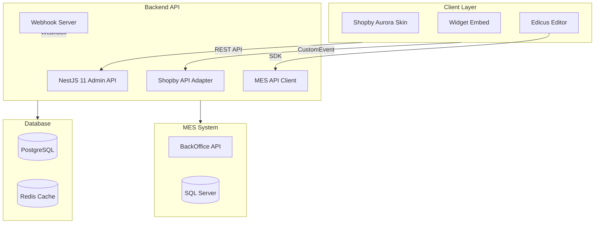
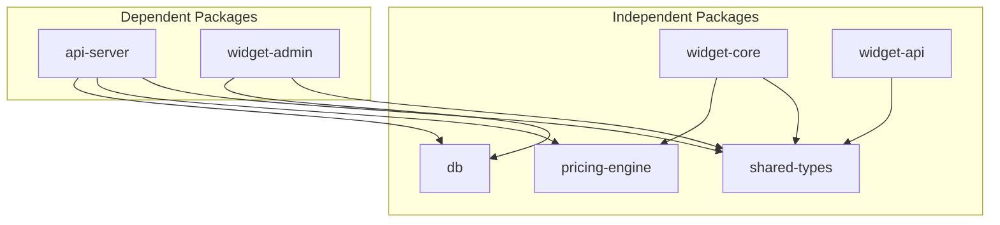
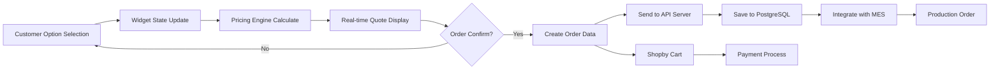
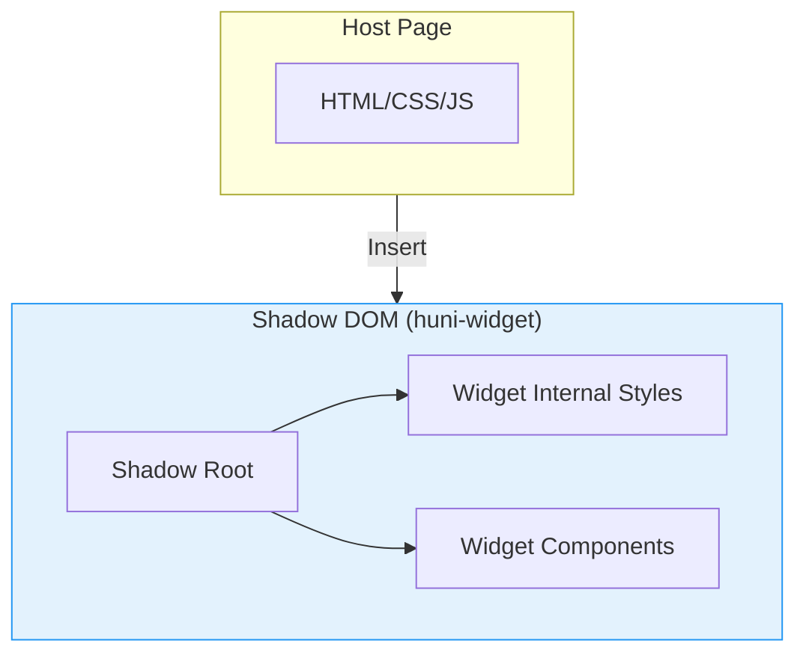

# Architecture Overview

Introduction to huni.builder's monorepo structure, system architecture, and data flow.

## System Architecture



---

## Monorepo Package Structure

```
packages/
├── api-server/          # NestJS 11 + Fastify Admin REST API
├── db/                  # PostgreSQL + Drizzle ORM schema
├── pricing-engine/      # Pure TypeScript pricing calculation engine
├── shared-types/        # Common TypeScript types/Zod schemas
├── widget-admin/        # React 19 admin dashboard
├── widget-core/         # React 19 embeddable widget
└── widget-api/          # Widget REST API
```

### Package Details

| Package | Role | Main Technologies |
|---------|------|-------------------|
| `@huni/db` | Database schema | PostgreSQL 14+, Drizzle ORM 0.44 |
| `@huni/api-server` | Admin API server | NestJS 11, Fastify, Typia 7, Nestia 10 |
| `@huni/pricing-engine` | Pricing engine | TypeScript, Zod (no external deps) |
| `@huni/shared-types` | Common types | Zod schemas |
| `@huni/widget-core` | Widget core | React 19, Zustand 5, Vite 6, Shadow DOM |
| `@huni/widget-admin` | Admin UI | React 19, TanStack, dnd-kit |
| `@huni/widget-api` | Widget API | TypeScript REST API client |

---

## Package Dependencies



### Build Order

1. **Build independent packages first**:
   ```bash
   pnpm -F @huni/shared-types build
   pnpm -F @huni/db build
   pnpm -F @huni/pricing-engine build
   pnpm -F @huni/widget-core build
   pnpm -F @huni/widget-api build
   ```

2. **Build dependent packages**:
   ```bash
   pnpm -F @huni/api-server build
   pnpm -F @huni/widget-admin build
   ```

---

## Data Flow



### Data Flow Details

1. **Option Selection**: Customer selects options in widget
2. **State Update**: Zustand store state changes
3. **Price Calculation**: 8 Pricing Engine calculators execute
4. **Quote Display**: Real-time price UI update
5. **Order Creation**: Serialize order data
6. **API Send**: Send order via REST API
7. **DB Save**: Save order/items to PostgreSQL
8. **MES Integration**: Automatically send production order
9. **Cart**: Sync with Shopby shopping cart

---

## Shadow DOM Architecture



### Shadow DOM Features

| Feature | Description |
|---------|-------------|
| **CSS Isolation** | No conflict with host page styles |
| **Encapsulation** | Protect widget internal DOM structure |
| **IIFE Bundle** | Optimized at 48.71KB gzipped |
| **ESM Export** | ESM version for React import |

---

## Tech Stack

### Frontend

- **React 19**: Latest React features
- **TypeScript 5.7**: Type-safe development
- **Zustand 5**: Lightweight state management
- **Tailwind CSS**: Utility CSS framework
- **Vite 6**: Fast build tool

### Backend

- **NestJS 11**: TypeScript-based framework
- **Fastify**: Fast and lightweight HTTP server
- **Typia/Nestia**: Type-safe API
- **Zod**: Schema validation
- **Redis**: Cache and session

### Database

- **PostgreSQL 14**: Relational database
- **Drizzle ORM**: Type-safe ORM
- **SQL Server**: MES system integration

---

## Next Steps

- [Core Concepts](../core-concepts) - Learn printing domain knowledge
- [Widget Guide](../widget-guide) - Detailed widget usage guide
- [API Reference](../api-reference) - REST API endpoints
