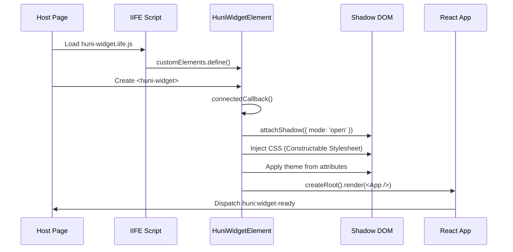

# Widget Embedding Guide

How to install and initialize the huni.builder widget on your website.

> **Quick Start**: Get the widget running in 30 seconds.

<Callout type="info">
**Goal**: Load the widget via script tag or ESM import, and display it using the `<huni-widget>` Custom Element.
</Callout>

## 1. Quick Start

The simplest form of widget embed:

```html
<!DOCTYPE html>
<html lang="en">
<head>
  <meta charset="UTF-8">
  <meta name="viewport" content="width=device-width, initial-scale=1.0">
  <title>huni.builder Widget Example</title>
</head>
<body>
  <!-- 1. Widget Container: Custom Element -->
  <huni-widget
    data-product-id="001-0001"
    shopby-api-url="https://api.shopby.com"
    shopby-token="your-token-here">
  </huni-widget>

  <!-- 2. Widget IIFE Bundle (48.71KB gzipped) -->
  <script src="https://cdn.huniprinting.com/widget/v1/huni-widget.iife.js"
          data-huni-widget-css
          async>
  </script>
</body>
</html>
```

**Loading sequence**:
1. `<huni-widget>` custom element added to DOM
2. Script tag loads IIFE bundle
3. Bundle registers Custom Element (`customElements.define('huni-widget', HuniWidgetElement)`)
4. `connectedCallback()` executes, creating Shadow DOM and mounting React
5. Widget renders

## 2. Script Tag Installation (IIFE Bundle)

### 2.1 CDN URLs

| Type | URL | Description |
|------|-----|-------------|
| Latest | `https://cdn.huniprinting.com/widget/latest/huni-widget.iife.js` | Always latest version |
| Version Pinned | `https://cdn.huniprinting.com/widget/v1/huni-widget.iife.js` | Specific version (recommended) |

<Callout type="warning">
**Recommendation**: Use version-pinned URL (`v1/...`) in production. Latest version may have breaking changes.
</Callout>

### 2.2 Loading Options

```html
<!-- async: Asynchronous load (recommended) -->
<script src="https://cdn.huniprinting.com/widget/v1/huni-widget.iife.js"
        data-huni-widget-css
        async>
</script>

<!-- defer: Load after DOM parsing -->
<script src="https://cdn.huniprinting.com/widget/v1/huni-widget.iife.js"
        data-huni-widget-css
        defer>
</script>

<!-- blocking: Blocks rendering -->
<script src="https://cdn.huniprinting.com/widget/v1/huni-widget.iife.js"
        data-huni-widget-css>
</script>
```

### 2.3 CSP (Content Security Policy) Configuration

```http
Content-Security-Policy:
  default-src 'self';
  script-src 'self' https://cdn.huniprinting.com;
  style-src 'self' 'unsafe-inline';
  connect-src 'self' https://api.shopby.com;
  img-src 'self' https://cdn.huniprinting.com;
```

<Callout type="info">
**Note**: The `data-huni-widget-css` attribute injects CSS via Constructable Stylesheets. No `style-src 'unsafe-inline'` needed.
</Callout>

## 3. Container Setup

### 3.1 HTML Attribute Approach (Recommended)

```html
<huni-widget
  data-product-id="001-0001"
  data-huni-code="POSTCARD_A4"
  data-shopby-client-id="your-client-id"
  data-template-code="default"
  shopby-api-url="https://api.shopby.com"
  shopby-token="your-token-here"
  theme="dark">
</huni-widget>
```

### 3.2 JavaScript API Approach

```javascript
// Initialize via JavaScript
const widget = document.querySelector('huni-widget');
widget.setAttribute('data-product-id', '001-0001');
widget.setAttribute('shopby-api-url', 'https://api.shopby.com');
widget.setAttribute('shopby-token', 'your-token-here');

// Or use window.HuniWidget.initHuniWidget()
window.HuniWidget.initHuniWidget({
  productId: '001-0001',
  huniCode: 'POSTCARD_A4',
  shopbyApiUrl: 'https://api.shopby.com',
  shopbyToken: 'your-token-here',
  theme: { primary: '#5538b6' }
});
```

### 3.3 Multiple Instances

Multiple widgets can be displayed on a single page:

```html
<huni-widget data-product-id="001-0001" id="widget-1"></huni-widget>
<huni-widget data-product-id="001-0002" id="widget-2"></huni-widget>

<script src="https://cdn.huniprinting.com/widget/v1/huni-widget.iife.js"
        data-huni-widget-css
        async>
</script>
```

## 4. Initialization Options Reference

### 4.1 HTML Attributes

| Attribute | Type | Required | Default | Description |
|-----------|------|----------|---------|-------------|
| `data-product-id` | string | ✅ | - | Product ID (MES code format: XXX-XXXX) |
| `data-huni-code` | string | ❌ | - | Huni product code |
| `data-shopby-client-id` | string | ❌ | - | Shopby client ID |
| `data-template-code` | string | ❌ | default | Template code |
| `shopby-api-url` | string | ❌ | - | Shopby API base URL |
| `shopby-token` | string | ❌ | - | Shopby auth token |
| `theme` | string | ❌ | light | Theme (`light` or `dark`) |

### 4.2 JavaScript API Options

```typescript
interface HuniWidgetConfig {
  // Required
  productId?: string;
  huniCode?: string;

  // Shopby integration
  shopbyApiUrl?: string;
  shopbyToken?: string;
  shopbyClientId?: string;

  // Theme
  theme?: {
    primary?: string;
    secondary?: string;
    background?: string;
    surface?: string;
    [key: string]: string | undefined;
  };

  // Other
  templateCode?: string;
  locale?: 'ko' | 'en';
}
```

```javascript
window.HuniWidget.initHuniWidget({
  // Product identification
  productId: '001-0001',
  huniCode: 'POSTCARD_A4',

  // Shopby API
  shopbyApiUrl: 'https://api.shopby.com',
  shopbyToken: 'your-token-here',
  shopbyClientId: 'your-client-id',

  // Theme
  theme: {
    primary: '#5538b6',
    secondary: '#4b3f96',
    background: '#f5f6f8'
  },

  // Other
  templateCode: 'default',
  locale: 'ko'
});
```

## 5. ESM Import Method

You can also install via npm:

You can also install via npm:

```bash npm
npm install @huni/widget-core
```

```bash pnpm
pnpm add @huni/widget-core
```

```bash yarn
yarn add @huni/widget-core
```

```typescript
import { initHuniWidget } from '@huni/widget-core';

// ESM import method
initHuniWidget({
  targetSelector: '#widget-root',
  productId: '001-0001',
  shopbyApiUrl: 'https://api.shopby.com',
  shopbyToken: 'your-token-here'
});
```

<Callout type="info">
**IIFE vs ESM Selection Guide**:
- **IIFE**: Direct CDN load, no build process
- **ESM**: npm managed, TypeScript support, bundler integration
</Callout>

## 6. Widget Loading Sequence



## 7. Responsive Container

The widget automatically adjusts to the container width:

```html
<!-- Fixed width -->
<div style="width: 465px; margin: 0 auto;">
  <huni-widget data-product-id="001-0001"></huni-widget>
</div>

<!-- Responsive (max 465px) -->
<div style="max-width: 100%; width: 465px; margin: 0 auto;">
  <huni-widget data-product-id="001-0001"></huni-widget>
</div>
```

## 8. Troubleshooting

| Symptom | Cause | Solution |
|---------|-------|----------|
| Widget not displayed | Script load failed | Check CDN URL, inspect network |
| Broken styles | CSS injection failed | Check `data-huni-widget-css` attribute |
| API errors | Token expired | Refresh `shopby-token` |
| Custom Element not defined | Script load order | Use `defer` or `async` |

## Related Documentation

- [Shadow DOM CSS Isolation](./shadow-dom) - CSS isolation mechanism details
- [Events & Communication](./events) - Widget initialization complete event
- [Style Customization](./styling) - Theme option details
