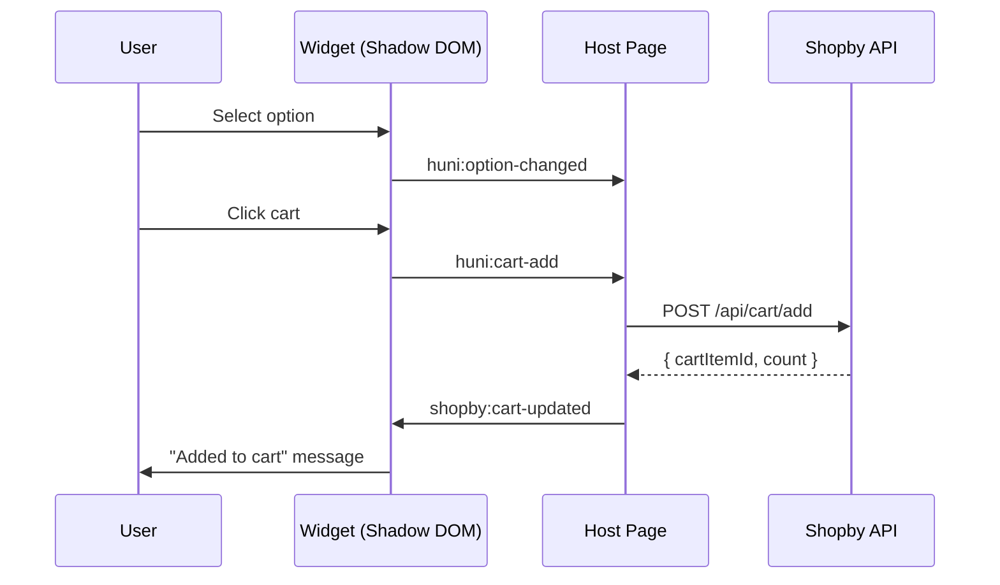

# Events & Communication

CustomEvent protocol for bidirectional communication between widget and host page.

> **Core**: Widget communicates with host via CustomEvents, crossing Shadow DOM boundary with `composed: true`.

<Callout type="info">
**Communication Direction**: Widget → Host (event dispatch), Host → Widget (attribute change or event dispatch)
</Callout>

## 1. CustomEvent Protocol Reference

### 1.1 Event List

| Event Name | Direction | Description | `detail` Type |
|------------|-----------|-------------|--------------|
| `huni:widget-ready` | Widget → Host | Widget initialization complete | `WidgetReadyEvent` |
| `huni:option-changed` | Widget → Host | Option selection changed | `OptionChangedEvent` |
| `huni:price-update` | Widget → Host | Price recalculated | `PriceUpdateEvent` |
| `huni:cart-add` | Widget → Host | Cart add request | `CartAddEvent` |
| `shopby:cart-updated` | Host → Widget | Cart state updated | `CartUpdatedEvent` |
| `shopby:auth-changed` | Host → Widget | Auth state changed | `AuthChangedEvent` |
| `huni:error` | Widget → Host | Error occurred | `ErrorEvent` |

## 2. TypeScript Event Interfaces

### 2.1 WidgetReadyEvent

```typescript
interface WidgetReadyEvent {
  /** Widget ID */
  widgetId: string;
  /** Initialized product ID */
  productId: string;
  /** Widget version */
  version: string;
}
```

**JSON Example**:
```json
{
  "widgetId": "huni-widget-1",
  "productId": "001-0001",
  "version": "1.0.0"
}
```

### 2.2 OptionChangedEvent

```typescript
interface OptionChangedEvent {
  /** Product ID */
  productId: string;
  /** Changed option key */
  optionKey: string;
  /** Previous value */
  previousValue: string | null;
  /** New value */
  newValue: string;
  /** All currently selected options */
  allOptions: Record<string, string | string[]>;
}
```

**JSON Example**:
```json
{
  "productId": "001-0001",
  "optionKey": "paper",
  "previousValue": null,
  "newValue": "Art Paper",
  "allOptions": {
    "size": "A4",
    "paper": "Art Paper",
    "color": "4+4"
  }
}
```

### 2.3 PriceUpdateEvent

```typescript
interface PriceUpdateEvent {
  /** Product ID */
  productId: string;
  /** Previous price */
  previousPrice: number;
  /** New price */
  newPrice: number;
  /** Price change reason */
  reason?: string;
  /** Price breakdown details */
  breakdown?: {
    paperCost: number;
    printCost: number;
    finishingCost: number;
    bindingCost: number;
    total: number;
  };
}
```

**JSON Example**:
```json
{
  "productId": "001-0001",
  "previousPrice": 50000,
  "newPrice": 55000,
  "reason": "Added finishing: Coating",
  "breakdown": {
    "paperCost": 20000,
    "printCost": 15000,
    "finishingCost": 5000,
    "bindingCost": 0,
    "total": 55000
  }
}
```

### 2.4 CartAddEvent

```typescript
interface CartAddEvent {
  /** Product ID */
  productId: string;
  /** Quantity */
  quantity: number;
  /** Selected option info */
  options: {
    /** Paper type */
    paper: string;
    /** Size (specification) */
    size: string;
    /** Print method */
    printMethod: string;
    /** Finishing list */
    postProcessing?: string[];
    /** Design file URL (Edicus) */
    designFileUrl?: string;
  };
  /** Final price */
  price: number;
}
```

**JSON Example**:
```json
{
  "productId": "001-0001",
  "quantity": 500,
  "options": {
    "paper": "Art Paper",
    "size": "A4",
    "printMethod": "4+4",
    "postProcessing": ["Coating"]
  },
  "price": 55000
}
```

### 2.5 CartUpdatedEvent (Host → Widget)

```typescript
interface CartUpdatedEvent {
  /** Total cart item count */
  cartCount: number;
  /** Request success */
  success: boolean;
  /** Added cart item ID (on success) */
  cartItemId?: string;
  /** Error message (on failure) */
  errorMessage?: string;
}
```

### 2.6 AuthChangedEvent (Host → Widget)

```typescript
interface AuthChangedEvent {
  /** Authenticated user ID */
  userId?: string;
  /** Shopby access token */
  accessToken?: string;
  /** Auth state */
  authenticated: boolean;
}
```

## 3. Event Listening Guide

### 3.1 Basic Pattern (Vanilla JS)

```javascript
const widget = document.querySelector('huni-widget');

// Widget ready event
widget.addEventListener('huni:widget-ready', (event) => {
  const detail = event.detail;
  console.log('Widget ready:', detail.widgetId);
});

// Option changed event
widget.addEventListener('huni:option-changed', (event) => {
  const detail = event.detail;
  console.log(`Option ${detail.optionKey} changed to ${detail.newValue}`);
});

// Price update event
widget.addEventListener('huni:price-update', (event) => {
  const detail = event.detail;
  console.log(`Price: ${detail.previousPrice} → ${detail.newPrice}`);
});

// Cart add request event
widget.addEventListener('huni:cart-add', async (event) => {
  const detail = event.detail;

  // Call Shopby API
  const response = await fetch('/api/cart/add', {
    method: 'POST',
    headers: { 'Content-Type': 'application/json' },
    body: JSON.stringify(detail)
  });

  const result = await response.json();

  // Notify widget of result
  widget.dispatchEvent(new CustomEvent('shopby:cart-updated', {
    composed: true,
    bubbles: true,
    detail: {
      cartCount: result.cartCount,
      success: response.ok,
      cartItemId: result.cartItemId,
      errorMessage: result.error
    }
  }));
});
```

### 3.2 Crossing Shadow DOM Boundary

Events need `composed: true` and `bubbles: true` to cross Shadow DOM boundary.

```javascript
// Inside widget (Shadow DOM)
this.dispatchEvent(new CustomEvent('huni:cart-add', {
  composed: true,  // Cross Shadow DOM boundary
  bubbles: true,   // Event bubbling
  detail: cartData
}));

// Receive on host page
document.addEventListener('huni:cart-add', (event) => {
  console.log('Received from Shadow DOM:', event.detail);
});
```

### 3.3 TypeScript Type-Safe Reception

```typescript
// Type guard
function isCartAddEvent(event: Event): event is CustomEvent<CartAddEvent> {
  return event.type === 'huni:cart-add';
}

// Type-safe listener
widget.addEventListener('huni:cart-add', (event: Event) => {
  if (!isCartAddEvent(event)) return;

  const detail = event.detail; // CartAddEvent type
  console.log('Product:', detail.productId);
  console.log('Price:', detail.price);
});
```

### 3.4 React Integration Pattern

```tsx
import { useEffect, useRef } from 'react';

function WidgetContainer() {
  const widgetRef = useRef<HTMLDivElement>(null);

  useEffect(() => {
    const widget = widgetRef.current?.querySelector('huni-widget');
    if (!widget) return;

    const handleCartAdd = async (event: Event) => {
      const customEvent = event as CustomEvent<CartAddEvent>;
      const { productId, options, price } = customEvent.detail;

      // API call
      const result = await addToCart({ productId, options, price });

      // Send result to widget
      widget.dispatchEvent(new CustomEvent('shopby:cart-updated', {
        composed: true,
        bubbles: true,
        detail: {
          cartCount: result.count,
          success: true,
          cartItemId: result.itemId
        }
      }));
    };

    widget.addEventListener('huni:cart-add', handleCartAdd);

    return () => {
      widget.removeEventListener('huni:cart-add', handleCartAdd);
    };
  }, []);

  return (
    <div ref={widgetRef}>
      <huni-widget data-product-id="001-0001" />
    </div>
  );
}
```

## 4. Host-to-Widget Communication

### 4.1 Attribute Changes

```javascript
const widget = document.querySelector('huni-widget');

// Refresh token
widget.setAttribute('shopby-token', newToken);

// Change product
widget.setAttribute('data-product-id', '001-0002');

// Change theme
widget.setAttribute('theme', 'dark');
```

### 4.2 Event Dispatch

```javascript
// Cart state update notification
widget.dispatchEvent(new CustomEvent('shopby:cart-updated', {
  composed: true,
  bubbles: true,
  detail: {
    cartCount: 5,
    success: true,
    cartItemId: 'cart-123'
  }
}));

// Auth state change notification
widget.dispatchEvent(new CustomEvent('shopby:auth-changed', {
  composed: true,
  bubbles: true,
  detail: {
    userId: 'user-123',
    accessToken: newToken,
    authenticated: true
  }
}));
```

## 5. Event Sequence Diagram



## 6. Platform-Specific Integration Patterns

### 6.1 Shopby Aurora Skin

```javascript
// Using widget in Shopby context
function initHuniWidgetInShopby() {
  const shopbyToken = getShopbyAccessToken();
  const shopbyApiUrl = 'https://api.shopby.com';

  const widget = document.querySelector('huni-widget');
  widget.setAttribute('shopby-token', shopbyToken);
  widget.setAttribute('shopby-api-url', shopbyApiUrl);

  // Cart integration
  widget.addEventListener('huni:cart-add', async (event) => {
    const cartData = event.detail;

    // Call Shopby Headless API
    const result = await ShopbyAPI.cart.add({
      productNo: cartData.productId,
      options: cartData.options,
      quantity: cartData.quantity
    });

    // Send result to widget
    widget.dispatchEvent(new CustomEvent('shopby:cart-updated', {
      composed: true,
      bubbles: true,
      detail: {
        cartCount: result.data.cartCount,
        success: true,
        cartItemId: result.data.cartItemId
      }
    }));
  });
}
```

### 6.2 React Application

(See section 3.4 above)

### 6.3 Vue / Angular

```javascript
// Vue 3 Composition API
import { ref, onMounted, onUnmounted } from 'vue';

export default {
  setup() {
    const widgetRef = ref(null);
    let cartAddHandler = null;

    onMounted(() => {
      const widget = widgetRef.value;
      cartAddHandler = async (event) => {
        // Cart logic
      };
      widget.addEventListener('huni:cart-add', cartAddHandler);
    });

    onUnmounted(() => {
      widgetRef.value.removeEventListener('huni:cart-add', cartAddHandler);
    });

    return { widgetRef };
  }
};
```

## Related Documentation

- [Shadow DOM CSS Isolation](./shadow-dom) - Event boundary crossing details
- [Widget Embedding](./embedding) - Initialization and configuration
- [Integration Guide](../integration) - Shopby integration details
