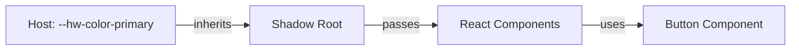

# Shadow DOM CSS Isolation

Widget's Shadow DOM CSS isolation mechanism and troubleshooting methods.

> **Core**: Widget uses Shadow DOM and Constructable Stylesheets for complete CSS isolation from host page.

<Callout type="info">
**Benefit**: Host page CSS doesn't affect widget, and widget CSS doesn't affect host page.
</Callout>

## 1. Shadow DOM Overview

### 1.1 DOM Tree Isolation

```mermaid
graph LR
    Host[Host Page DOM]
    Shadow[Shadow Root]
    Widget[Widget DOM]

    Host -->|attachesShadow| Shadow
    Shadow -->|contains| Widget

    style[Host Styles] -.|blocked| Widget
    style2[Widget Styles] -.|blocked| Host
```

**Shadow DOM Characteristics**:
- **DOM Isolation**: Shadow DOM internal elements can't be found with `querySelector()`
- **Style Isolation**: Host CSS cannot penetrate into Shadow DOM
- **Event Boundary**: Only `composed: true` events cross boundary

### 1.2 `<huni-widget>` Custom Element Structure

```html
<!-- Host Page -->
<huni-widget shopby-token="xxx">
  #shadow-root (open)
    ├── <style> (Constructable Stylesheet)
    ├── <div id="huni-widget-root">
    │   ├── ConfiguratorWizard
    │   ├── StepIndicator
    │   ├── OptionCard
    │   └── ...
</huni-widget>
```

### 1.3 Lifecycle Callbacks

```typescript
class HuniWidgetElement extends HTMLElement {
  connectedCallback() {
    // Called when Custom Element is added to DOM
    this.shadow = this.attachShadow({ mode: 'open' });
    this.injectStyles();
    this.mountReact();
  }

  disconnectedCallback() {
    // Called when removed from DOM
    this.unmountReact();
  }

  attributeChangedCallback(name, oldValue, newValue) {
    // Called when attribute changes
    // Detects theme, shopby-token, etc.
  }
}
```

## 2. CSS @layer Isolation Strategy

### 2.1 @layer Overview

```css
/* widget-core/src/index.css */
@layer hw-widget {
  /* Widget-specific Tailwind */
  @tailwind base;
  @tailwind components;
  @tailwind utilities;
}

/* Host page - no impact */
@layer host {
  @tailwind base;  /* No widget impact */
}
```

### 2.2 Layer Precedence

```
Host Styles (host page)
  ↓ (blocked by Shadow DOM boundary)
Shadow Root Boundary
  ↓
@layer hw-widget (widget internal)
  ├── @tailwind base
  ├── @tailwind components
  └── @tailwind utilities
  ↓
Widget Components (React)
```

### 2.3 Tailwind Integration

| Configuration | Widget Internal | Host Page |
|---------------|----------------|-----------|
| `@layer` name | `hw-widget` | `host` or none |
| Class prefix | None | Varies by site |
| `preflight` | Widget only | Host only |

<Callout type="warning">
**Removed Prefix**: `hw-` prefix removed because Shopby Aurora Skin doesn't use Tailwind. @layer isolation is sufficient.
</Callout>

## 3. Constructable Stylesheets

### 3.1 CSS Injection Method

```typescript
// iife-entry.tsx
class HuniWidgetElement extends HTMLElement {
  private stylesheet: CSSStyleSheet | null = null;

  private async injectStyles(): Promise<void> {
    // Create empty stylesheet
    this.stylesheet = new CSSStyleSheet();

    // Load CSS injected at build time
    const css = typeof __huni_widget_css__ !== 'undefined'
      ? __huni_widget_css__
      : '';

    // Add CSS to stylesheet
    await this.stylesheet.replace(css);

    // Adopt into Shadow Root
    this.shadow.adoptedStyleSheets = [this.stylesheet];
  }
}
```

### 3.2 Advantages

- **Memory efficient**: Multiple Shadow Roots share one stylesheet
- **Dynamic updates**: Swap stylesheet for complete theme change
- **Encapsulation**: CSS scope limited to Shadow Root

## 4. Style Conflict Troubleshooting

### 4.1 Symptom-Based Causes & Solutions

| Symptom | Cause | Solution |
|---------|-------|----------|
| Widget affects host CSS | Style leak | Verify Shadow DOM boundary |
| Host CSS penetrates widget | Style penetration | Check `::slotted()` usage |
| Global font not applied | Font inheritance failure | Set font via CSS variable |
| z-index conflicts | Modal/dropdown broken | Check stacking context |
| Focus management failure | Tab key cycle broken | Use `delegatesFocus: true` |
| `!important` priority | Specificity issue | CSS variable override |
| Third-party CSS library | Global styles | Isolate stylesheets |

### 4.2 Case 1: Widget Affects Host CSS

**Symptom**: Host page styles break after widget loads

**Cause**: Style injection to global scope

**Solution**:
```javascript
// Wrong method
document.head.appendChild(styleTag); // Global injection

// Correct method
shadowRoot.adoptedStyleSheets = [stylesheet]; // Inside Shadow DOM
```

### 4.3 Case 2: Host CSS Penetrates Widget

**Symptom**: Host page button styles apply to widget buttons

**Cause**: `::slotted()` usage or inherited properties

**Solution**:
```css
/* Widget internal: reset inherited properties */
:host {
  all: initial;
  font-family: var(--hw-font-family);
}
```

### 4.4 Case 3: Global Font Not Applied

**Symptom**: Host page font doesn't apply inside widget

**Cause**: Shadow DOM only inherits some properties

**Solution**:
```css
/* Host page */
huni-widget {
  --hw-font-family: 'Pretendard', sans-serif;
}

/* Widget uses CSS variable */
:host {
  font-family: var(--hw-font-family);
}
```

### 4.5 Case 4: z-index Conflicts

**Symptom**: Widget modal hidden behind host page or vice versa

**Cause**: Shadow DOM creates separate stacking context

**Solution**:
```javascript
// Inside widget: use minimum z-index
const MODAL_Z_INDEX = 1000;
const DROPDOWN_Z_INDEX = 500;

// Host page: avoid z-index above widget
.header { z-index: 999; } /* Dangerous */
.header { z-index: 2000; } /* Safe */
```

### 4.6 Case 5: Focus Management

**Symptom**: Tab key doesn't cycle inside widget

**Solution**:
```javascript
// Use delegatesFocus option
this.attachShadow({
  mode: 'open',
  delegatesFocus: true  // Focus delegation
});
```

### 4.7 Case 6: !important Priority

**Symptom**: CSS variable override doesn't work

**Cause**: Specificity issue

**Solution**:
```css
/* Low specificity */
:host {
  --hw-color-primary: blue;
}

/* High specificity */
huni-widget[theme="custom"] {
  --hw-color-primary: red !important;
}
```

### 4.8 Case 7: Third-Party CSS Library

**Symptom**: Bootstrap/Tailwind affects widget

**Solution**:
```html
<!-- Load third-party CSS before widget -->
<link href="bootstrap.css" rel="stylesheet" />
<huni-widget></huni-widget>
<script src="widget.js"></script>
```

## 5. Isolation Architecture Diagram

```mermaid
graph TB
    subgraph "Host Page"
        HostCSS[Host CSS]
        HostDOM[Host DOM]
    end

    subgraph "Shadow DOM Boundary"
        direction TB
        ShadowRoot[Shadow Root]
        Constructed[Constructable Stylesheet]
        ReactRoot[React Root]

        Constructed -->|contains| WidgetCSS[Widget CSS]
        ReactRoot -->|renders| WidgetDOM[Widget DOM]
    end

    HostCSS -.|blocked by Shadow DOM| WidgetDOM
    WidgetCSS -.|blocked by Shadow DOM| HostDOM

    Events[CustomEvent]
    Events -->|composed: true passes| ShadowRoot
```

## 6. CSS Variables Inheritance Path



**Inheritance Rules**:
- CSS variables cross Shadow DOM boundary
- Only Custom Properties can inherit
- Use `@property` rule for type specification

## Related Documentation

- [Style Customization](./styling) - CSS Variables usage
- [Events & Communication](./events) - Event boundary crossing
- [Widget Embedding](./embedding) - Initialization configuration
