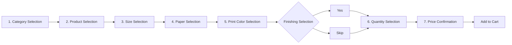
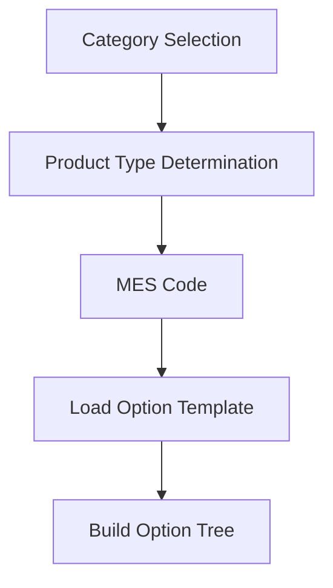
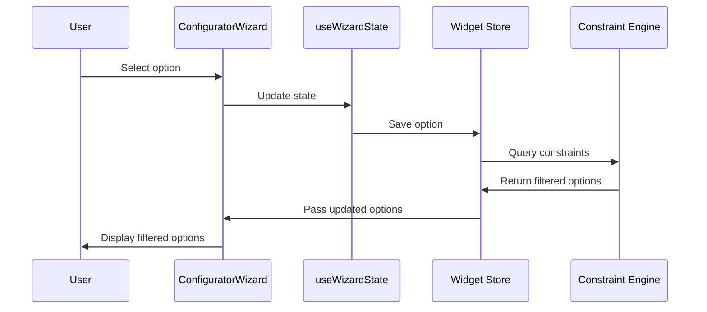
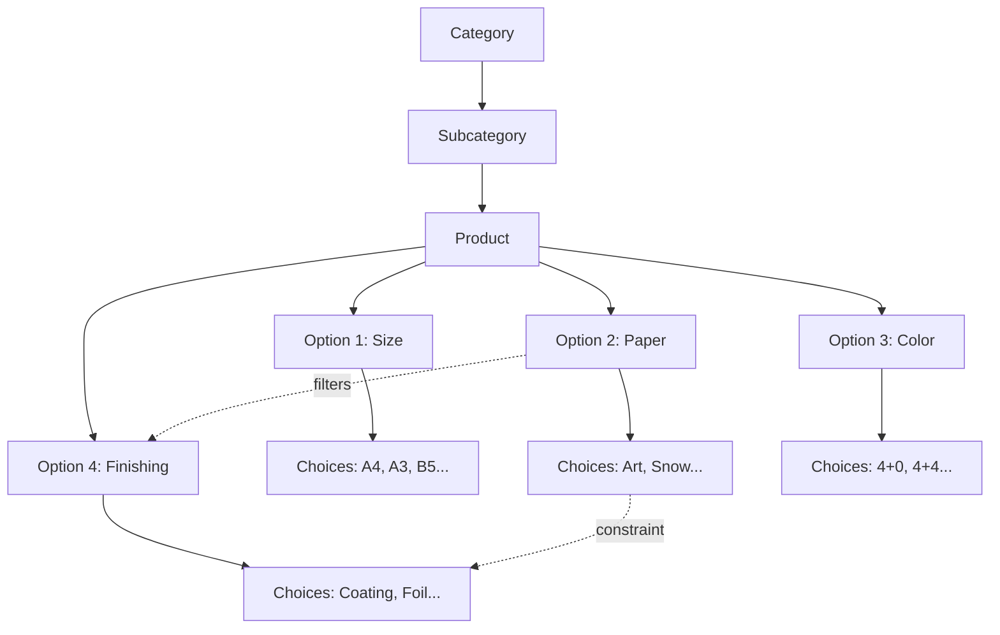

# Option Selection Workflow

The 7-step option selection wizard (ConfiguratorWizard) behavior in the widget.

> **Key**: Automatically handles complex option dependencies in printing domain knowledge.

<Callout type="info">
**Printing Domain Complexity**: Paper, size, print method, and finishing options are intricately connected. Example: "Glossy paper" selection disables "foil stamping" finishing.
</Callout>

## 1. Workflow Overview



## 2. Step-by-Step Details

### 2.1 Step 1: Category Selection

**User View**: Select one of 12 categories

**Behind the scenes**:
- `CategoryTabs` component renders category list
- Loads products within selected category
- Activates next step (product selection)

**Category Examples**:
- Postcard (엽서)
- Sticker (스티커)
- Poster (포스터)
- Flyer (전단지)
- Business Card (명함)
- ... 12 categories total

### 2.2 Step 2: Product Selection

**User View**: Product list within selected category

**Behind the scenes**:
- `ProductSection` renders product list
- MES code format (`001-0001`) identifies product
- Loads option template for selected product



### 2.3 Step 3: Size Selection

**User View**: Select size (A4, A3, B5, A5, etc.)

**Behind the scenes**:
- Filters available paper options based on selected size
- Reflects size in price calculation
- Custom size input (some products)

### 2.4 Step 4: Paper Selection

**User View**: Select paper (Art paper, Snow paper, etc.)

**Behind the scenes**:
- Filters finishing options based on paper type (e.g., glossy paper → foil disabled)
- Filters print method options
- Calculates price (paper cost)

<Callout type="warning">
**Constraint Example**: Selecting "glossy art paper" disables "foil stamping" finishing. This is a technical constraint in the printing domain.
</Callout>

### 2.5 Step 5: Print Color Selection

**User View**: Select print method (4+0, 4+4, 1+0, etc.)

**Behind the scenes**:
- Shows only print methods compatible with selected paper
- Determines front/back printing
- Calculates price (printing cost)

### 2.6 Step 6: Finishing Selection (Post-Processing)

**User View**: Select finishing (coating, foil, embossing, UV, etc.)

**Behind the scenes**:
- `PostProcessingType` renders finishing option groups
- Enable/disable based on paper (constraints)
- Specify finishing order (some products)
- Calculate price (finishing cost)

**Finishing Types**:
| Type | Description | Paper Constraint |
|------|-------------|------------------|
| Coating | Film coating | All papers |
| Foil | Gold/silver foil | Non-glossy papers only |
| Emboss | 3D effect | Thick papers only |
| UV | UV coating | Specific papers only |

### 2.7 Step 7: Quantity & Price Confirmation

**User View**: Select quantity, display unit price/total

**Behind the scenes**:
- `QuantitySelector` renders quantity tier options
- `PriceDisplay` calculates real-time price
- Price = paper cost + print cost + finishing cost + binding cost
- Applies quantity discount

## 3. Option Dependency Resolution

### 3.1 Dependency Resolution Flow



### 3.2 Constraint Patterns

| Pattern | Description | Example |
|---------|-------------|---------|
| P1 | Foil Group Dependency | Foil type → color/size/position |
| P2 | Cover-Coating Link | Cover paper → coating options |
| P3 | Custom Size Input | Non-standard size → enable width/height input |
| P4 | Variable Print Exclusion | Text vs image selection mutual exclusion |
| P5 | Binding-Page Range | Binding type → page count range limit |

## 4. Option Tree Structure



## 5. Programmatic Option Setting

```javascript
// Pre-select options via JavaScript
const widget = document.querySelector('huni-widget');

// Wait for widget initialization
widget.addEventListener('huni:widget-ready', () => {
  // Dispatch option setting event
  widget.dispatchEvent(new CustomEvent('huni:set-options', {
    detail: {
      size: 'A4',
      paper: 'Art Paper',
      color: '4+4',
      quantity: 500
    }
  }));
});
```

## 6. Widget State Management

The widget uses **Zustand** store for state management.

```typescript
interface WidgetState {
  // Selected options
  selectedOptions: Record<string, string | string[]>;

  // Current step
  currentStep: string;

  // Completed steps
  completedSteps: Set<string>;

  // Price information
  price: {
    base: number;
    total: number;
    breakdown: PriceBreakdown;
  };

  // Actions
  setOption: (key: string, value: string | string[]) => void;
  goToStep: (stepId: string) => void;
  reset: () => void;
}
```

## Related Documentation

- [Events & Communication](./events) - Option change events (`huni:option-changed`)
- [Admin Guide](../admin-guide/constraints) - Constraint configuration
- [Style Customization](./styling) - Step indicator customization
