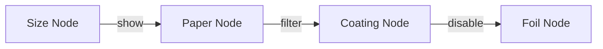

# 제약조건 에디터

3단계 제약조건 UX, 노드 기반 에디터, 14개 패턴 템플릿을 설명합니다.

> **핵심**: 복잡한 옵션 의존성을 시각적 노드 그래프로 관리할 수 있습니다.

<Callout type="info">
**비전**: N8N 같은 노드 기반 시각적 상품 설치 도구로 발전 중입니다.
</Callout>

## 1. 제약조건 개요

### 1.1 제약조건이란?

옵션 표시, 요구사항, 필터링을 제어하는 규칙

### 1.2 6개 액션 타입

| 액션 | 한글 라벨 | 설명 | 예시 |
|------|-----------|------|------|
| show | 보이기 | 조건 충족시 타겟 표시 | Binding=TwinRing → Show Ring Color |
| hide | 숨기기 | 조건 충족시 타겟 숨김 | Material=Transparent → Hide Coating |
| require | 필수로 변경 | 타겟을 필수로 | Foil=Yes → Require Foil Color |
| disable | 선택 불가 | 타겟 비활성화 | Saddle Stitch → Disable Spine Thickness |
| load_data | 입력필드 표시 | 동적 입력 필드 로드 | Size=Custom → Show Width/Height |
| filter | 특정값만 표시 | 타겟 선택지 필터링 | Size=A5 → Filter matching prices |

## 2. Decision Table 에디터 (DecisionTable)

스프레드시트 스타일의 모든 제약조건 뷰

### 2.1 컬럼 구조

| # | Pattern | Source Option | Source Value | Target | Action | Priority |
|---|---------|---------------|--------------|--------|--------|----------|
| 1 | P1 | binding | twin_ring | foil_color | show | 1 |
| 2 | P2 | paper | glossy | coating | filter | 1 |

### 2.2 기능

- **필터링**: 패턴 타입, 액션 타입, 키워드 검색
- **인라인 편집**: 셀 클릭으로 수정
- **정렬**: 우선순위, 패턴, 소스 옵션
- **일괄 작업**: 다중 선택 규칙, 일괄 삭제

### 2.3 작업

- [+ Add Rule]: 새 규칙 추가
- [Template]: 패턴 템플릿 적용
- [Excel Import]: Excel에서 가져오기

## 3. Simple Creator (SimpleConstraintForm) - 70% 커버리지

3단계 한국어 문장 형식 제약조건 생성

<Steps>
### Step 1: 조건

"[Option A] 에서 [Value X] 을(를) 선택하면"

### Step 2: 결과

"[Option B] 을(를) [action]"

액션 라디오 옵션:
- show (보이기)
- hide (숨기기)
- filter (필터)
- require (필수로 변경)
- disable (선택 불가)
- load_data (입력필드 표시)

filter의 경우: 태그 스타일 값 선택기

### Step 3: 메모 및 우선순위

메모 (선택사항) 및 우선순서 번호

### 4. 자연어 미리보기

한국어 문장으로 규칙 미리보기

### 5. 저장 전 테스트

미리보기 모드에서 규칙 시뮬레이션
</Steps>

<Callout type="info">
**용도**: Simple Creator는 대부분의 일반적인 단일 조건 규칙을 처리합니다.
</Callout>

## 4. Advanced Creator (AdvancedConstraintForm) - 30% 커버리지

<Steps>
### Step 1: 조건 그룹 생성

논리 선택 (AND: 모든 조건 / OR:任意 조건)

### Step 2: 다중 조건 추가

행별: Option + Operator + Value

### Step 3: 다중 효과 추가

행별: Target + Action + Applied Values

### Step 4: 범위 제약조건

숫자 옵션용 min/max/step (미리보기 포함)

### Step 5: 조건 요약 검토

자연어 조건 요약

### 6. 테스트 후 저장
</Steps>

<Callout type="warning">
**용도**: Advanced 모드는 Simple Creator로 표현할 수 없는 복합 조건용입니다.
</Callout>

## 5. 노드 기반 제약조건 에디터 (ConstraintNodeEditor)

### 5.1 개요 및 비전

**현재**: 옵션 노드와 제약조건 엣지를 보여주는 시각적 그래프

**미래 방향**: N8N 같은 시각적 상품 설치 도구로, 관리자와 AI가 협력하여 상품 구성 설계

### 5.2 OptionNode 컴포넌트

각 상품 옵션이 캔버스의 노드로 표시

**표시**:
- 옵션 키
- 표시 이름
- 선택지 수
- 제약조건 연결 수

**동작**:
- 클릭: 선택
- 드래그: 위치 재조정

**상태**:
- normal: 기본
- selected: 강조 테두리
- error: 빨간 테두리

### 5.3 ConstraintEdge 연결

**엣지 타입 및 스타일**:

| 엣지 타입 | 시각적 | 색상 | 의미 |
|-----------|--------|-------|---------|
| show/require | 실선 화살표 | 파랑 | 소스가 타겟 활성화/로드 |
| hide/disable | 점선 화살표 | 빨강 | 소스가 타겟 제한 |
| filter | 점선 화살표 | 녹색 | 소스가 타겟 선택지 필터링 |
| load_data | 대시-점선 화살표 | 주황 | 소스가 동적 데이터 로드 |

**엣지 생성**: 소스 노드 포트 클릭 → 타겟 노드 포트로 드래그

**엣지 삭제**: 엣지 선택 → Delete 또는 EdgeInspector [Delete] 버튼

### 5.4 Toolbar

| 버튼 | 동작 |
|------|------|
| [+ Add Node] | 캔버스에 없는 옵션 노드 추가 |
| [Auto Layout] | Dagre 알고리즘으로 최적 배치 |
| [AI Suggest] | 제약조건 연결 제안 (계획된 기능) |
| [Validate] | 순환 의존성, 모순 검사 |
| [Minimap] | 미니맵 토글 |

줌 컨트롤:
- 마우스 휠
- 핀치
- 툴바 버튼

### 5.5 EdgeInspector (하단 패널)

엣지 선택 시 표시

**필드**:
- Source option
- Target option
- Constraint type (드롭다운)
- Condition expression
- Pattern (P1-P14)
- Priority

**작업**:
- [Save Edge]
- [Delete Edge]

### 5.6 ValidationPanel

[Validate] 클릭 후 검증 결과 표시

**에러 레벨**:
- Error (빨강): 치명적
- Warning (노랑): 주의
- Info (파랑): 정보

**검사 항목**:

| 검사 | 레벨 | 설명 |
|------|-------|------|
| Circular dependency | Error | A → B → C → A 체인 |
| Contradictory effects | Error | 동일 타겟에 show AND hide |
| Orphan constraint | Error | 존재하지 않는 옵션 참조 |
| Unreachable target | Warning | 다른 규칙으로 항상 숨겨짐 |
| Redundant rule | Warning | 더 높은 우선순위 규칙으로 덮어짐 |
| Missing coverage | Info | 옵션 조합에 규칙 없음 |

<Callout type="info">
**권장**: 복잡한 제약조건 관계를 시각화하려면 노드 에디터를 사용하세요. 단순 목록 관리는 Decision Table을 사용하세요.
</Callout>

## 6. 14개 패턴 템플릿

| 패턴 | 이름 | 상품 | 추천 규칙 | 설명 |
|------|------|----------|------------|------|
| P1 | Foil Group Dependency | 7 | ~28 | 박 타입이 색상/크기/위치로 계단식 |
| P2 | Cover Paper-Coating Link | 5 | ~5 | 표지 용지가 코팅 결정 |
| P3 | Custom Size Input | 23 | ~46 | 비표준 규격이 커스텀 가로/세로 활성화 |
| P4 | Variable Print Exclusion | 9 | ~18 | 가변 텍스트/이미지 상호 배제 |
| P5 | Binding-Page Range | 6 | ~6 | 제본 타입이 페이지 수 범위 설정 |
| P6 | Binding-Sub-option | 2 | ~4 | 제본이 링 색상/방향 활성화 |
| P7 | Paper-Coating Compatibility | - | ~30 | 용지 타입이 코팅 옵션 제한 |
| P8 | Size-Accessory Compatibility | - | ~15 | 규격이 사용 가능 액세서리 결정 |
| P9 | Packaging Dependency | - | ~10 | 상품 타입이 포장 구성 설정 |
| P10 | Color/Type Pricing | - | ~20 | 색상 선택이 가격 등급에 영향 |
| P11 | Special Print Exclusion | - | ~12 | 특수 인쇄가 용지/후가공 배제 |
| P12 | Cutting Type Dependency | - | ~8 | 커팅 스타일이 규격 옵션 결정 |
| P13 | Calendar Binding | - | ~5 | 달력 타입이 제본 옵션 결정 |
| P14 | Folding Pattern | - | ~10 | 접기 타입이 규격/페이지 제약조건 설정 |

<Callout type="info">
**확인된 패턴**: P1-P6는 프로덕션 데이터 분석으로 확인됨. P7-P14는 관리자 구성용 잠재적 패턴입니다.
</Callout>

## 7. 테스트/시뮬레이션 패널

제약조건 에디터 내 주문 화면 시뮬레이션

- **적용된 규칙 로그**: 어떤 규칙이 발동했는지, 어떤 순서로
- 옵션 변경에 따른 실시간 제약조건 평가

## 8. 미래 방향: AI 지원 시각적 상품 설계

<Callout type="warning">
**다음 기능은 계획 중이며, 출시 시 "예정 기능"으로 표시됩니다.
</Callout>

- **AI 제약조건 제안**: WowPress API 데이터 분석으로 자동 규칙 생성
- **신뢰도 점수**: AI 제안 제약조건의 확률적 점수
- **N8N 같은 워크플로우로 진화**: 노드가 시맨틱 의미를 carry, AI가 상품 구성 co-creation

## 관련 문서

- [상품 관리](./product-management) - 옵션 트리 구조
- [옵션 관리](./option-management) - 옵션 타입 및 의존성
- [가격 규칙](./price-rules) - 가격 영향 제약조건
