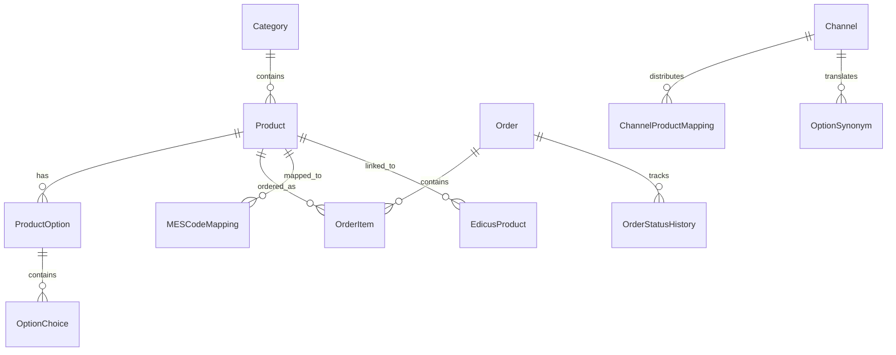

# Database Schema

Drizzle ORM으로 관리되는 PostgreSQL 데이터베이스 스키마입니다.

## 개요

| 항목 | 값 |
|------|-----|
| ORM | Drizzle ORM |
| 데이터베이스 | PostgreSQL |
| 테이블 수 | 50+ |
| 스키마 파일 | 14개 |

## 도메인별 테이블

### Core Product (6개)

| 테이블 | 설명 | SPEC 참조 |
|--------|------|-----------|
| categories | 카테고리 | SPEC-DB-001 |
| subcategories | 하위 카테고리 | SPEC-DB-001 |
| products | 상품 | SPEC-DB-001 |
| productImages | 상품 이미지 | SPEC-DB-001 |
| optionTemplates | 옵션 템플릿 | SPEC-DB-001 |
| productOptions | 상품 옵션 | SPEC-DB-001 |
| optionChoices | 옵션 선택지 | SPEC-DB-001 |

### Constraints (2개)

| 테이블 | 설명 | SPEC 참조 |
|--------|------|-----------|
| optionConstraints | 옵션 제약 조건 | SPEC-DB-002 |
| constraintGroups | 제약 조건 그룹 | SPEC-DB-002 |

### Pricing Components (8개)

| 테이블 | 설명 | SPEC 참조 |
|--------|------|-----------|
| pricingTables | 가격표 | SPEC-DB-001 |
| paperPrices | 용지 가격 | SPEC-DB-PRICING-001 |
| printPrices | 인쇄 가격 | SPEC-DB-PRICING-001 |
| finishingPrices | 후가공 가격 | SPEC-DB-PRICING-001 |
| bindingPrices | 제본 가격 | SPEC-DB-PRICING-001 |
| foilPrices | 박 가격 | SPEC-DB-PRICING-001 |
| impositionRules | imposition 규칙 | SPEC-DB-PRICING-001 |
| productPrices | 상품 가격 | SPEC-DB-PRICING-001 |
| mesChoiceMappings | MES 선택지 매핑 | SPEC-DB-PRICING-001 |

### Pricing Rules (3개)

| 테이블 | 설명 | SPEC 참조 |
|--------|------|-----------|
| pricingRules | 가격 규칙 | SPEC-DB-004 |
| quantityRanges | 수량 구간 | SPEC-DB-004 |
| customQuotes | 커스텀 견적 | SPEC-DB-004 |

### Orders/Delivery (6개)

| 테이블 | 설명 | SPEC 참조 |
|--------|------|-----------|
| orders | 주문 | SPEC-DB-004 |
| orderItems | 주문 항목 | SPEC-DB-004 |
| orderStatusHistory | 주문 상태 이력 | SPEC-DB-004 |
| deliveryTiers | 배송 등급 | SPEC-DB-004 |
| deliveryGroups | 배송 그룹 | SPEC-DB-004 |
| shippingInfo | 배송 정보 | SPEC-DB-004 |

### Integration (4개)

| 테이블 | 설명 | SPEC 참조 |
|--------|------|-----------|
| mesCodeMappings | MES 코드 매핑 | SPEC-DB-001 |
| edicusProducts | Edicus 상품 | SPEC-DB-001 |
| edicusMappings | Edicus 매핑 | SPEC-DB-001 |
| shopbyMappings | Shopby 매핑 | SPEC-DB-001 |

### Channels (8개)

| 테이블 | 설명 | SPEC 참조 |
|--------|------|-----------|
| channels | 판매 채널 | SPEC-DB-003 |
| channelProductMappings | 채널 상품 매핑 | SPEC-DB-003 |
| optionSynonyms | 옵션 동의어 | SPEC-DB-003 |
| optionRouteRules | 옵션 라우팅 규칙 | SPEC-DB-003 |
| optionRouteConditions | 옵션 라우팅 조건 | SPEC-DB-003 |
| unknownCodeQueue | 알 수 없는 코드 큐 | SPEC-DB-003 |
| channelMappingLogs | 채널 매핑 로그 | SPEC-DB-003 |
| webhookEvents | 웹훅 이벤트 | SPEC-DB-003 |

### MES Sync (10개)

| 테이블 | 설명 | SPEC 참조 |
|--------|------|-----------|
| mesSyncLogs | MES 동기화 로그 | SPEC-DB-005 |
| mesProductCache | MES 상품 캐시 | SPEC-DB-005 |
| mesCustomerCache | MES 고객 캐시 | SPEC-DB-005 |
| mesEstimationRequests | MES 견적 요청 | SPEC-DB-005 |
| mesOrderRequests | MES 주문 요청 | SPEC-DB-005 |
| mesProductionStatus | MES 생산 상태 | SPEC-DB-005 |
| mesStatusChangeHistory | MES 상태 변경 이력 | SPEC-DB-005 |
| mesRetryQueue | MES 재시도 큐 | SPEC-DB-005 |
| mesDeadLetterQueue | MES 데드레터 큐 | SPEC-DB-005 |
| mesDataConflicts | MES 데이터 충돌 | SPEC-DB-005 |

### Integration Arch (7개)

| 테이블 | 설명 | SPEC 참조 |
|--------|------|-----------|
| integrationEventLog | 통합 이벤트 로그 | SPEC-INTEGRATION-ARCH-001 |
| syncConflictRules | 동기화 충돌 규칙 | SPEC-INTEGRATION-ARCH-001 |
| apiRateLimits | API 속도 제한 | SPEC-INTEGRATION-ARCH-001 |
| productBom | 제품 BOM | SPEC-INTEGRATION-ARCH-001 |
| productCrossReference | 제품 교차 참조 | SPEC-INTEGRATION-ARCH-001 |
| dataSyncRuns | 데이터 동기화 실행 | SPEC-INTEGRATION-ARCH-001 |
| dataQualityResults | 데이터 품질 결과 | SPEC-INTEGRATION-ARCH-001 |

### System (3개)

| 테이블 | 설명 |
|--------|------|
| auditLogs | 감사 로그 |
| logs | 시스템 로그 |
| fileUploads | 파일 업로드 |

## Multi-ID 시스템

huni.builder는 여러 ID 시스템을 사용합니다.

| ID 타입 | 설명 | 예시 |
|---------|------|------|
| `huniCode` | 내부 상품 코드 | `POSTCARD-001` |
| `mesItemCd` | MES 상품 코드 | `001` |
| `HU_Code` | Edicus 상품 코드 | `HUNI_CARD_001` |
| `id` | Database PK (시리얼) | `1`, `2`, `3` |
| `shopbyProductNo` | Shopby 상품 번호 | `1000001` |

## ER 다이어그램

## 관련 문서

- [Admin REST API](./admin-api) - API 엔드포인트
- [Type Definitions](./type-definitions) - TypeScript 타입
- [MES 연동](../integration/mes) - MES 통합 상세
