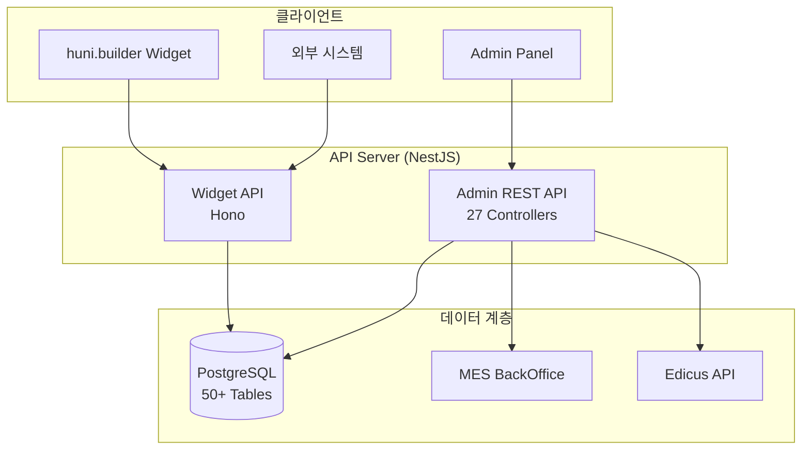

# API 레퍼런스

huni.builder의 모든 API 엔드포인트와 데이터 구조를 문서화합니다.

## API 개요



## API 목록

| API | 설명 | 엔드포인트 수 |
|-----|------|--------------|
| [Admin REST API](./admin-api) | 관리자 백엔드 API | 50+ |
| [Widget API](./widget-api) | 위젯 공개 API | 6+ |
| [Widget Events](./widget-events) | CustomEvent 프로토콜 | 6 이벤트 |
| [Type Definitions](./type-definitions) | TypeScript 타입 정의 | - |
| [Database Schema](./database-schema) | 데이터베이스 스키마 | 50+ 테이블 |

## 인증 방식

### JWT (JSON Web Token)

Admin API에서 사용합니다.

```
Authorization: Bearer {jwt_token}
```

### API Key

Widget API에서 사용합니다.

```
X-API-Key: {api_key}
```

### HMAC-SHA256

Edicus B2B API에서 사용합니다.

```
X-API-Key: {api_key}
X-Signature: {hmac_signature}
X-Timestamp: {unix_timestamp}
```

## 표준 응답 형식

### 성공 응답

```json
{
  "success": true,
  "data": { /* 실제 데이터 */ },
  "error": null,
  "meta": {
    "timestamp": "2025-12-19T10:00:00Z"
  }
}
```

### 에러 응답

```json
{
  "success": false,
  "data": null,
  "error": {
    "code": "ERR_VAL_001",
    "message": "검증 오류",
    "details": [
      {
        "field": "quantity",
        "message": "수량은 100 이상이어야 합니다"
      }
    ]
  },
  "meta": {
    "timestamp": "2025-12-19T10:00:00Z"
  }
}
```

## Rate Limiting

| API | 제한 | 기간 |
|-----|------|------|
| Widget API | 100 req/min | 1분 |
| Admin API | 1000 req/min | 1분 |
| Edicus Proxy | 60 req/min | 1분 |

## 관련 문서

- [Widget Events](./widget-events) - CustomEvent 프로토콜 상세
- [Type Definitions](./type-definitions) - TypeScript 타입 정의
- [Database Schema](./database-schema) - 데이터베이스 구조
