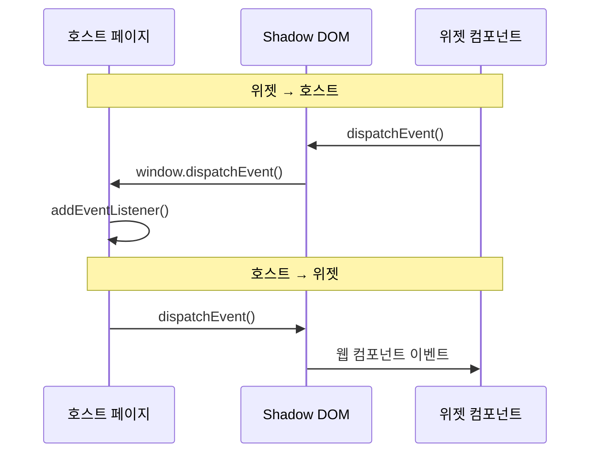

# Widget Events

위젯과 호스트 페이지 간의 양방향 통신을 위한 CustomEvent 프로토콜입니다.

## 개요

CustomEvent 프로토콜은 Shadow DOM 경계를 넘어 위젯과 호스트가 통신할 수 있게 합니다.



## 이벤트 목록

### 위젯 → 호스트 (3개)

| 이벤트 | 설명 | 타입 |
|--------|------|------|
| `huni:cart-add` | 장바구니 추가 요청 | CartAddEvent |
| `huni:price-update` | 가격 변경 알림 | PriceUpdateEvent |
| `huni:editor-open` | 에디터 실행 요청 | EditorOpenEvent |

### 호스트 → 위젯 (3개)

| 이벤트 | 설명 | 타입 |
|--------|------|------|
| `shopby:cart-updated` | 장바구니 갱신 알림 | CartUpdatedEvent |
| `shopby:product-loaded` | 상품 정보 로드 완료 | ProductLoadedEvent |
| `shopby:auth-changed` | 인증 상태 변경 | AuthChangedEvent |

## 이벤트 상세

### huni:cart-add

장바구니 추가 요청 이벤트입니다.

#### CartAddEvent

```typescript
interface CartAddEvent {
  productId: string
  quantity: number
  options: {
    paper: string
    size: string
    printMethod: string
    postProcessing?: string[]
    designFileUrl?: string
  }
  price: number
}
```

#### 발송 예시

```typescript
const event = new CustomEvent('huni:cart-add', {
  detail: {
    productId: 'postcard-001',
    quantity: 100,
    options: {
      paper: '아트지',
      size: 'A4',
      printMethod: '양면 컬러',
      postProcessing: ['코팅']
    },
    price: 10000
  }
})
window.dispatchEvent(event)
```

### huni:price-update

가격 변경 알림 이벤트입니다.

#### PriceUpdateEvent

```typescript
interface PriceUpdateEvent {
  productId: string
  previousPrice: number
  newPrice: number
  reason?: string
}
```

#### 발송 예시

```typescript
const event = new CustomEvent('huni:price-update', {
  detail: {
    productId: 'postcard-001',
    previousPrice: 10000,
    newPrice: 11000,
    reason: '옵션 변경'
  }
})
window.dispatchEvent(event)
```

### huni:editor-open

에디터 실행 요청 이벤트입니다.

#### EditorOpenEvent

```typescript
interface EditorOpenEvent {
  productId: string
  productType: string
  callbackData?: Record<string, unknown>
}
```

#### 발송 예시

```typescript
const event = new CustomEvent('huni:editor-open', {
  detail: {
    productId: 'postcard-001',
    productType: 'postcard'
  }
})
window.dispatchEvent(event)
```

### shopby:cart-updated

장바구니 갱신 알림 이벤트입니다.

#### CartUpdatedEvent

```typescript
interface CartUpdatedEvent {
  cartCount: number
  success: boolean
  cartItemId?: string
  errorMessage?: string
}
```

#### 수신 예시

```typescript
window.addEventListener('shopby:cart-updated', (event) => {
  const { cartCount, success, cartItemId, errorMessage } = event.detail

  if (success) {
    console.log(`장바구니 추가 완료: ${cartItemId}`)
    updateCartBadge(cartCount)
  } else {
    console.error(`장바구니 추가 실패: ${errorMessage}`)
    showErrorToast(errorMessage)
  }
})
```

### shopby:product-loaded

상품 정보 로드 완료 이벤트입니다.

#### ProductLoadedEvent

```typescript
interface ProductLoadedEvent {
  productId: string
  name: string
  price: number
  options?: Option[]
}
```

#### 수신 예시

```typescript
window.addEventListener('shopby:product-loaded', (event) => {
  const { productId, name, price, options } = event.detail
  console.log(`상품 로드 완료: ${name}`)
  updateProductDisplay({ productId, name, price, options })
})
```

### shopby:auth-changed

인증 상태 변경 이벤트입니다.

#### AuthChangedEvent

```typescript
interface AuthChangedEvent {
  authenticated: boolean
  token?: string
  user?: {
    id: string
    name: string
    email: string
  }
}
```

#### 수신 예시

```typescript
window.addEventListener('shopby:auth-changed', (event) => {
  const { authenticated, token, user } = event.detail

  if (authenticated) {
    console.log(`로그인: ${user?.name}`)
    updateAuthUI(true, user)
  } else {
    console.log('로그아웃')
    updateAuthUI(false)
  }
})
```

## 재시도 설정

이벤트 전송 실패 시 재시도를 지원합니다.

### RetryConfig

```typescript
interface RetryConfig {
  maxAttempts: number
  delayMs: number
  exponentialBackoff?: boolean
}

const DEFAULT_RETRY_CONFIG: RetryConfig = {
  maxAttempts: 3,
  delayMs: 1000,
  exponentialBackoff: true
}
```

### 이벤트 발송 with 재시도

```typescript
async function dispatchEventWithRetry(
  eventType: string,
  detail: any,
  config: RetryConfig = DEFAULT_RETRY_CONFIG
): Promise<boolean> {
  let attempt = 0

  while (attempt < config.maxAttempts) {
    try {
      const event = new CustomEvent(eventType, { detail })
      window.dispatchEvent(event)
      return true
    } catch (error) {
      attempt++

      if (attempt >= config.maxAttempts) {
        console.error(`이벤트 발송 실패: ${eventType}`)
        return false
      }

      const delay = config.exponentialBackoff
        ? config.delayMs * Math.pow(2, attempt - 1)
        : config.delayMs

      await new Promise(resolve => setTimeout(resolve, delay))
    }
  }

  return false
}
```

## 관련 문서

- [Shopby 연동](../integration/shopby) - Shopby 통합 상세
- [Custom Platform](../integration/custom-platform) - 위젯 임베딩
