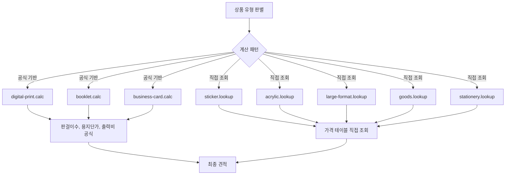
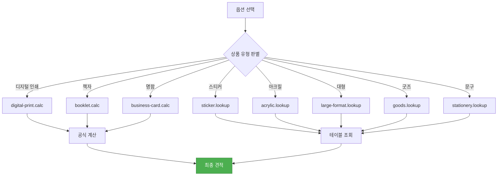
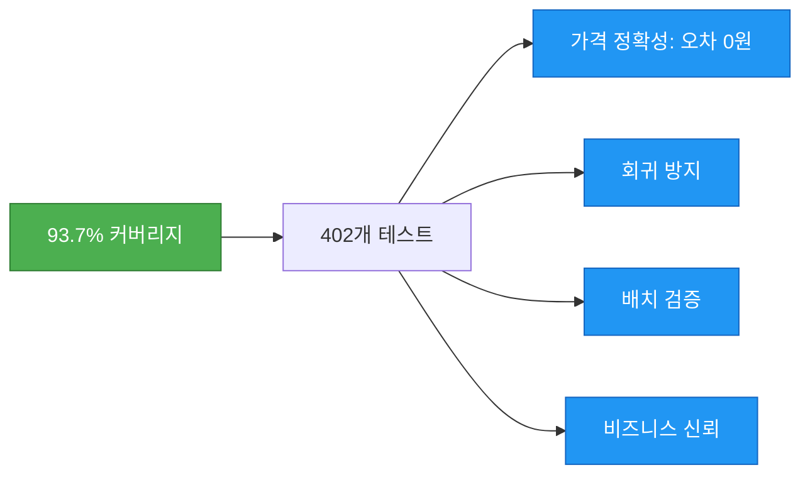

# 가격 계산 철학

실시간 견적의 중요성과 8개 계산기의 설계 원리를 이해합니다.

## 실시간 견적의 중요성

### 전통 인쇄 견적 방식


### 와우프레스 방식


### huni.builder 방식


---

## 8개 계산기 설계 원리

### 공식 기반 (Formula) vs 직접 조회 (Lookup)



| 패턴 | 계산기 | 원리 |
|------|--------|------|
| **공식 기반** | digital-print, booklet, business-card | 판걸이수, 용지단가, 출력비 등 변수로 공식 계산 |
| **직접 조회** | sticker, acrylic, large-format, goods, stationery | 상품/옵션/수량 조합으로 가격 테이블 직접 조회 |

### 공식 기반 계산기 상세

<div className="info-block">

**디지털 인쇄 계산 (digital-print.calc)**

```
가격 = (판걸이수 × 용지단가) + 출력비 + 후가공비 + 제본비
```

- **판걸이수**: 인쇄 원지에 배치할 수 있는 수량
- **용지단가**: 용지 종류별 단가
- **输出비**: 인쇄 도수별 출력 비용
- **후가공비**: 코팅, 박, 형압 등 추가 비용
- **제본비**: 분철, 풀네일, 보관용 등 비용

</div>

---

## 가격 계산 흐름



### 계산기별 특징

| 계산기 | 상품 유형 | 커버리지 |
|--------|----------|---------|
| digital-print.calc | 전단지, 리플릿, 카탈로그 | 96.81% |
| booklet.calc | 무선철, 중철 책자 | 95.57% |
| business-card.calc | 명함 | 96.57% |
| sticker.lookup | 스티커 | 87.97% |
| acrylic.lookup | 아크릴 제품 | 87.93% |
| large-format.lookup | 포스터, 현수막 | 92.72% |
| goods.lookup | 굿즈 | 97.43% |
| stationery.lookup | 문구류 | 95.48% |

---

## 테스트 커버리지의 의미

### 93.7% 커버리지의 비즈니스 가치



#### 가격 정확성

<div className="tip-block">

**정수 단위 KRW (오차 0원)**

- 인쇄물 가격은 원 단위로 정확해야 합니다
- 1원 오차도 고객 신뢰에 영향을 미칩니다
- 402개 테스트로 모든 케이스 검증

</div>

#### 회귀 방지

- **옵션 추가**: 기존 가격 보장
- **수정**: 변경 전 가격 유지
- **삭제**: 삭제 전 가격 기록

#### 배치 검증

- **전체 상품 x 옵션 조합**: 자동 검증
- **수량 구간별**: 18시트 구간 단가표
- **후가공 조합**: 모든 조합 테스트

#### 비즈니스 신뢰

<div className="info-block">

**고객에게 즉시 표시되는 가격의 신뢰도**

- 실시간 견적의 정확성
- 주문 후 가격 변동 없음
- 환불/교환 비용 절감

</div>

---

## 수량 구간별 단가

### 수량 구간 테이블

| 구간 | 수량 | 단가 할인 |
|------|------|----------|
| 1구간 | 1~100 | 기본 단가 |
| 2구간 | 101~300 | 5% 할인 |
| 3구간 | 301~500 | 10% 할인 |
| 4구간 | 501~1000 | 15% 할인 |
| 5구간 | 1001+ | 20% 할인 |


---

## 다음 단계

- [위젯 가이드](../widget-guide) - 위젯 사용법 상세 가이드
- [가격 시스템](../pricing-system) - 가격 관리 및 설정
