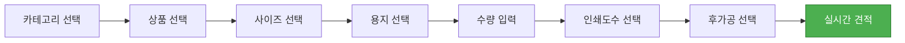
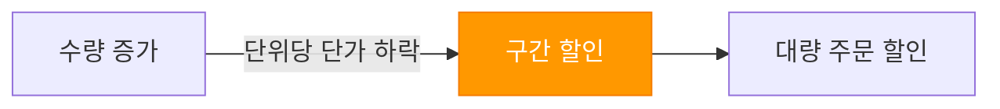

# 인쇄 도메인 지식

인쇄 산업의 핵심 개념과 용어, 옵션 결정 흐름을 이해합니다.

## 인쇄 기본 개념

| 개념 | 설명 | 위젯 내 적용 |
|------|------|-------------|
| **용지 (Paper)** | 스노우지, 아트지, 모조지, 크라프트 등 | 용지 옵션 선택 UI |
| **사이즈 (Size)** | A4, A5, B5, 명함 규격, 커스텀 등 | 사이즈 옵션 선택 UI |
| **인쇄도수 (Color Mode)** | 단면/양면, 컬러/흑백, 1도/4도 | 인쇄도수 옵션 UI |
| **후가공 (Finishing)** | 코팅, 박, 형압, 오시, 접지, 미싱 | 후가공 옵션 카드 UI |
| **제본 (Binding)** | 무선철, 중철, 스프링, 떡제본 | 제본 옵션 UI |
| **판걸이 (Imposition)** | 인쇄 원지에 배치하는 수량 | 가격 계산 내부 |

### 용지 종류

**일반 용지**
- **스노우지**: 일반 전단지, 리플릿
- **아트지**: 고화질 인쇄, 코팅 용지
- **모조지**: 서적, 내지
- **크라프트**: 튼튼한 포장재, 명함

**특수 용지**
- **아트판**: 표지, 두꺼운 카드
- **엠보지**: 질감 효과
- **나피합지**: 봉투, 포장재

### 사이즈 규격

| 규격 | mm (가로x세로) | 용도 |
|------|---------------|------|
| A4 | 210 x 297 | 문서, 전단지 |
| A5 | 148 x 210 | 리플릿, 소책자 |
| B5 | 176 x 250 | 서적 |
| 명함 | 90 x 50 | 명함 |
| 포스터 (A0~A3) | 다양 | 포스터, 배너 |

---

## 상품 유형 카탈로그

| 카테고리 | 대표 상품 | 특징 |
|----------|----------|------|
| **엽서** | 엽서, 명함 | 기본 인쇄물 |
| **스티커** | 아트지 스티커, 유포지 스티커 | 직접 조회 가격 |
| **인쇄홍보물** | 전단지, 리플릿, 카탈로그 | 디지털 인쇄 기반 |
| **포스터** | A0~A3 포스터 | 대형 인쇄 |
| **사인** | 현수막, 배너 | 대형 인쇄 |
| **책자** | 무선철, 중철 책자 | 제본 포함 |
| **캘린더** | 탁상, 벽걸이 | 스프링 제본 |
| **문구** | 메모지, 봉투 | 직접 조회 |
| **아크릴** | 아크릴 키링, 스탠드 | 직접 조회 |
| **라이프** | 에코백, 텀블러 | 굿즈 카테고리 |
| **포장** | 박스, 쇼핑백 | 패키징 |
| **에코백/파우치** | 면 에코백, 파우치 | 직접 조회 |

---

## 옵션 결정 흐름

### 상세 흐름 설명

1. **카테고리 선택**: 12개 카테고리 중 선택
2. **상품 선택**: 카테고리 내 세부 상품 선택
3. **사이즈 선택**: 규격 또는 커스텀 사이즈
4. **용지 선택**: 종이 종류와 두께
5. **수량 입력**: 수량 구간별 단가 적용
6. **인쇄도수 선택**: 단면/양면, 컬러/흑백
7. **후가공 선택**: 코팅, 박, 제본 등 추가
8. **실시간 견적**: 8개 계산기로 즉시 계산

---

## 후가공 종류

**일반 후가공**
- **코팅**: 비닐 코팅 (광/무광)
- **박**: 금박/은박 입히기
- **형압**: 도장으로 눌러 무늬 내기
- **오시**: 오려서 모양 만들기
- **접지**: 접는 작업 (중앙, 3단, 4단)
- **미싱**: 재봉 처리

**제본 방식**
- **무선철**: 접착제로 제본
- **중철**: 철사로 중앙 제본
- **스프링**: 스프링 제본
- **떡제본**: 접착제로 두꺼운 제본

---

## 인쇄도수 (Color Mode)

### 컬러 모드

| 모드 | 설명 | 용도 |
|------|------|------|
| **4도 컬러** | CMYK 4색 인쇄 | 일반 컬러 인쇄 |
| **1도 (단색)** | 단색 인쇄 | 텍스트, 간단한 로고 |
| **흑백** | 흑백 인쇄 | 문서, 내지 |

### 인쇄 면

| 면 | 설명 | 가격 영향 |
|------|------|----------|
| **단면** | 한 면만 인쇄 | 기본 가격 |
| **양면** | 양쪽 모두 인쇄 | 약 1.5~2배 |
| **커튼 (망막)** | 가장자리 인쇄 | 특수 인쇄 |

---

## 가격 결정 요소

### 수량 구간별 단가

### 후가공비

- **후가공별 추가 비용**: 코팅, 박, 형압 등 개별 계산
- **제본비**: 책자 페이지 수에 따른 계산
- **판걸이 수량**: 원지 낭비 최소화 배치

---

## 다음 단계

- [와우프레스 벤치마킹](./wowpress-benchmarking) - 경쟁사 분석과 개선점
- [가격 계산 철학](./pricing-philosophy) - 8개 계산기의 설계 원리
