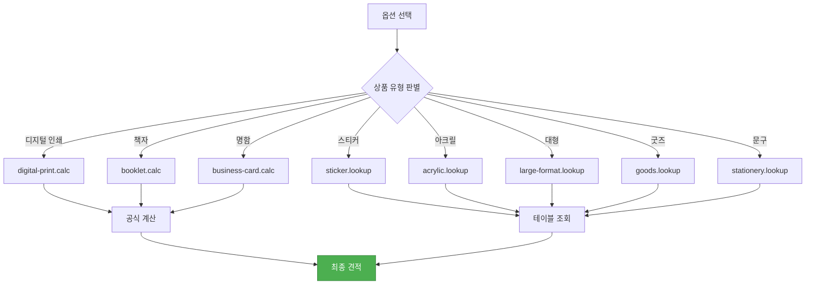
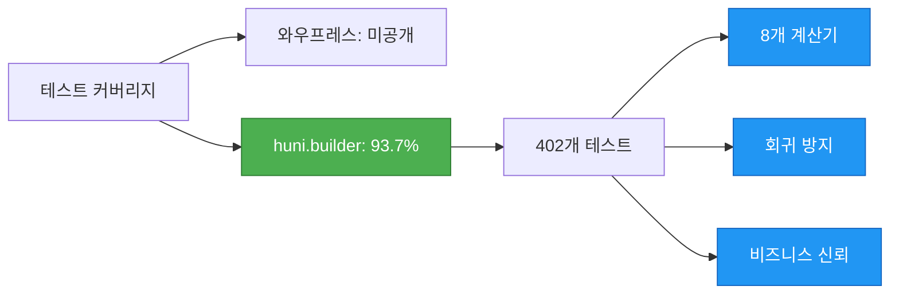

# 와우프레스 벤치마킹

경쟁사 와우프레스(wowpress.co.kr)를 분석하고 huni.builder의 개선점을 정리합니다.

## API 비교 분석

| 영역 | 와우프레스 Open API | huni.builder |
|------|-------------------|-------------|
| **인증** | 토큰 기반 (Bearer Token) | Typia/Nestia 타입 안전 API |
| **제품 조회** | 단일 엔드포인트 (/api/products) | 모듈별 분리 (categories, products, options) |
| **가격 조회** | 서버 사이드 (규격+도수+재질 파라미터) | 클라이언트 내장 계산 엔진 |
| **주문** | REST API (동기) | REST API + CustomEvent (비동기 옵션) |
| **파일 업로드** | 3가지 방식 (직접/URL/비동기) | Edicus SDK 통합 |
| **옵션 구조** | 7개 영역 (규격,도수,재질,후가공,부자재,배송,수량) | 결정 테이블 기반 (14개 패턴 템플릿) |

---

## 가격 체계 비교

### 와우프레스 가격 구조

<div className="info-block">

**와우프레스 가격 조회 방식**

```
GET /api/price
Parameters:
- sizeinfo: 규격 코드
- colorinfo: 도수 코드
- paperinfo: 재질 코드
- quantity: 수량
```

- **규격 x 도수 x 재질 조합**: 서버 사이드 가격 테이블 조회
- **후가공(awkjobinfo)**: 추가 비용 별도 계산
- **네트워크 의존**: 옵션 변경 시마다 API 호출

</div>

### huni.builder 8개 계산기



| 패턴 | 계산기 | 원리 |
|------|--------|------|
| **공식 기반** | digital-print, booklet, business-card | 판걸이수, 용지단가, 출력비 등 변수로 공식 계산 |
| **직접 조회** | sticker, acrylic, large-format, goods, stationery | 상품/옵션/수량 조합으로 가격 테이블 직접 조회 |

---

## 옵션 제약 조건 비교

### 와우프레스 제약 패턴

<div className="warning-block">

**와우프레스 옵션 제약 예시**

- 선불택배불가: 특정 상품 조합에서 선불 배송 불가
- 묶음배송불가: 특정 옵션에서 묶음 배송 제한
- 롯데택배불가: 일부 지역에서 롯데 택배 사용 불가

이러한 제약은 하드코딩된 비즈니스 로직으로 관리됩니다.

</div>

### huni.builder 결정 테이블

| 특징 | 와우프레스 | huni.builder |
|------|-----------|-------------|
| **제약 관리** | 하드코딩된 로직 | 결정 테이블 기반 |
| **패턴 템플릿** | 없음 | 14개 패턴 템플릿 |
| **유연성** | 낮음 | 높음 |
| **관리자 UI** | 없음 | 제약조건 편집기 제공 |

#### 14개 패턴 템플릿

1. 사이즈-용지 종속
2. 수량-후가공 종속
3. 인쇄도수-후가공 종속
4. 배송 지역 제약
5. 결제 방법 제약
6. 옵션 조합 제약
7. 최소/최대 수량
8. 후가공 중복 제약
9. 제본 방법 제약
10. 용지-후가공 호환성
11. 시간 제약 (주문 마감)
12. 지역별 추가 비용
13. 대량 주문 제약
14. 맞춤 제작 제약

---

## 개선점 요약

### 1. 실시간 클라이언트 가격 계산

| 측정 | 와우프레스 | huni.builder |
|------|-----------|-------------|
| **응답 시간** | 수초 (API 왕복) | 밀리초 (내장 엔진) |
| **네트워크 의존** | 필수 | 없음 |
| **오프라인 지원** | 불가 | 가능 |

### 2. Shadow DOM CSS 격리

<div className="tip-block">

**와우프레스 문제점**
- 자체 사이트 전용으로 CSS 호스트 의존
- 다른 사이트에 임베드 시 스타일 충돌 위험

**huni.builder 해결책**
- Shadow DOM으로 완전한 CSS 격리
- 어떤 사이트에도 충돌 없이 임베드
- 48.71KB gzipped로 경량 번들

</div>

### 3. 다채널 지원

| 채널 | 와우프레스 | huni.builder |
|------|-----------|-------------|
| **자체 사이트** | 지원 | 지원 |
| **Shopby** | 미지원 | 지원 (CustomEvent) |
| **자사몰** | 미지원 | 지원 (위젯 임베드) |
| **제3자 사이트** | 미지원 | 지원 (IIFE/ESM) |

### 4. 테스트 커버리지



### 5. TypeScript 타입 안전

| 계층 | 와우프레스 | huni.builder |
|------|-----------|-------------|
| **프론트엔드** | JavaScript | TypeScript + Zod |
| **API** | 미공개 | Typia/Nestia |
| **데이터베이스** | 미공개 | Drizzle ORM |

---

## 경쟁사 참조

### 와우프레스

<div className="info-block">

**참고 사항**
- URL: https://wowpress.co.kr
- 특징: 카테고리 드롭다운 방식, 실시간 가격 표시
- 장점: 다양한 상품, 완성된 주문 프로세스
- 단점: 자체 사이트 전용, API 공개 제한적

</div>

### 비즈하우스

<div className="info-block">

**참고 사항**
- URL: https://bizhows.com
- 특징: 칩/버튼 기반 옵션 선택 UI
- 장점: 직관적인 UI, 조건부 옵션 활성화
- 단점: 제한된 상품 범위

</div>

---

## 다음 단계

- [가격 계산 철학](./pricing-philosophy) - 8개 계산기의 설계 원리
- [API 레퍼런스](../api-reference) - REST API 엔드포인트
