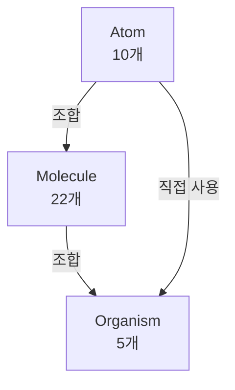

# Molecule & Organism 컴포넌트

Molecule 컴포넌트는 Atom 컴포넌트들을 조합하여 형성되며, Organism 컴포넌트는 Molecule과 Atom을 조합하여 완전한 UI 섹션을 구성합니다.

## 컴포넌트 구조 다이어그램



## Molecule 컴포넌트 (22개)

### 옵션 선택 관련

| 컴포넌트 | 설명 | 구성 Atom |
|---------|------|-----------|
| **OptionCard** | 옵션 선택 카드 (라디오/체크박스) | Card, Radio, Checkbox, Text, PriceDisplay |
| **OptionGroup** | 옵션 그룹 컨테이너 | - |
| **ButtonType** | 버튼 타입 선택 | Button |
| **SelectBoxType** | 셀렉트 박스 타입 선택 | - |
| **FinishOptionCard** | 마무리 옵션 카드 | OptionCard |
| **FinishButtonType** | 마무리 버튼 타입 선택 | ButtonType |
| **FinishColorChipType** | 마무리 컬러칩 타입 선택 | - |
| **FinishInputType** | 마무리 입력 타입 | Input |
| **FinishSelectBoxType** | 마무리 셀렉트 박스 타입 | - |
| **FinishTitleBar** | 마무리 타이틀 바 | Text |

### 후가공 관련

| 컴포넌트 | 설명 | 구성 Atom |
|---------|------|-----------|
| **FoilEmbossType** | 박/엠보 타입 선택 | - |
| **EmbossType** | 엠보 타입 선택 | - |
| **PostProcessingType** | 후가공 타입 선택 | - |
| **SpecialColorPrintType** | 특수 인쇄 타입 선택 | - |

### 수량 및 업로드

| 컴포넌트 | 설명 | 구성 Atom |
|---------|------|-----------|
| **QuantitySelector** | 수량 선택기 | Button, Input |
| **CountInputType** | 카운트 입력 타입 | Input, Button |
| **UploadType** | 파일 업로드 타입 | Button, Input |

### 위자드 내비게이션

| 컴포넌트 | 설명 | 구성 Atom |
|---------|------|-----------|
| **StepIndicator** | 단계 표시기 | Text, Badge |
| **WizardNavigation** | 위자드 내비게이션 | Button, StepIndicator |
| **CategoryTabs** | 카테고리 탭 | CategoryTab |
| **SummaryType** | 요약 타입 | Card, Text, PriceDisplay |
| **EnvelopeSelectType** | 봉투 선택 타입 | OptionCard |

## 주요 Molecule 컴포넌트 상세

### OptionCard

가장 자주 사용되는 Molecule 컴포넌트로, 옵션 선택을 위한 카드 형태 UI를 제공합니다.

```tsx
export interface OptionCardProps {
  type: 'radio' | 'checkbox'
  name: string
  value: string
  label: string
  description?: string
  price?: number
  priceDescription?: string
  image?: string
  checked?: boolean
  disabled?: boolean
  onChange?: (checked: boolean) => void
  className?: string
  'aria-label'?: string
}
```

**사용 예시:**

```tsx
<OptionCard
  type="radio"
  name="paper"
  value="art"
  label="아트지"
  description="일반적인 용지"
  price={100}
  priceDescription="매수별 추가"
  checked={selectedPaper === 'art'}
  onChange={(checked) => checked && setSelectedPaper('art')}
/>
```

### QuantitySelector

수량을 선택하는 컴포넌트입니다.

```tsx
export interface QuantitySelectorProps {
  value: number
  min?: number
  max?: number
  onChange: (value: number) => void
  size?: 'sm' | 'md' | 'lg'
  disabled?: boolean
}
```

**사용 예시:**

```tsx
<QuantitySelector
  value={quantity}
  min={100}
  max={10000}
  onChange={setQuantity}
/>
```

### StepIndicator

위자드 진행 상태를 표시합니다.

```tsx
export interface StepIndicatorProps {
  steps: Array<{
    id: string
    label: string
    status: 'pending' | 'active' | 'completed'
  }>
  currentStep: string
}
```

**사용 예시:**

```tsx
<StepIndicator
  steps={[
    { id: '1', label: '용지', status: 'completed' },
    { id: '2', label: '규격', status: 'active' },
    { id: '3', label: '인쇄', status: 'pending' }
  ]}
  currentStep="2"
/>
```

## Organism 컴포넌트 (5개)

Organism 컴포넌트는 완전한 UI 섹션으로, 독립적으로 기능합니다.

### ConfiguratorWizard

상품 설정 위자드의 메인 컴포넌트입니다.

```tsx
export interface ConfiguratorWizardProps {
  productId: string
  onOptionsChange: (options: HuniOptions) => void
  onPriceChange: (price: number) => void
  onDataAvailable: (available: boolean) => void
  initialOptions?: Partial<HuniOptions>
}
```

### ProductSection

MES 코드 기반 상품 섹션입니다.

```tsx
export interface ProductSectionProps {
  product: Product
  huniOptions: HuniOptions
  onOptionsChange: (options: HuniOptions) => void
  onPriceChange: (price: number) => void
  onDataLoaded: (dataAvailable: boolean) => void
}
```

### PostcardSection

엽서 전용 섹션입니다 (MES 코드: 001).

### StickerSection

스티커 전용 섹션입니다 (MES 코드: 002).

### PosterSection

포스터 전용 섹션입니다 (MES 코드: 003).

## MES 코드 매핑

| 상품 유형 | MES 코드 | 섹션 컴포넌트 |
|-----------|----------|---------------|
| 엽서 | 001 | PostcardSection |
| 스티커 | 002 | StickerSection |
| 포스터 | 003 | PosterSection |
| 그 외 | default | ProductSection |

## 컴포넌트 조합 예시

다음은 OptionCard와 QuantitySelector를 조합하여 완전한 옵션 선택 UI를 구성하는 예시입니다:

```tsx
// Molecule 조합
function PaperOptionGroup() {
  return (
    <OptionGroup title="용지 선택">
      <OptionCard
        type="radio"
        name="paper"
        value="art"
        label="아트지"
        price={100}
        checked={selectedPaper === 'art'}
        onChange={(checked) => checked && setSelectedPaper('art')}
      />
      <OptionCard
        type="radio"
        name="paper"
        value="matte"
        label="모조지"
        price={150}
        checked={selectedPaper === 'matte'}
        onChange={(checked) => checked && setSelectedPaper('matte')}
      />
    </OptionGroup>
  )
}

// Organism 조합
function ConfiguratorSection() {
  return (
    <>
      <StepIndicator steps={steps} currentStep={currentStep} />
      <PaperOptionGroup />
      <QuantitySelector value={quantity} onChange={setQuantity} />
      <WizardNavigation
        onBack={handleBack}
        onNext={handleNext}
        canGoNext={canProceed}
      />
    </>
  )
}
```

## 관련 파일

- `packages/widget-core/src/components/molecules/` - Molecule 컴포넌트 소스
- `packages/widget-core/src/components/organisms/` - Organism 컴포넌트 소스
- `packages/widget-core/src/types/molecules.ts` - Molecule 타입 정의
