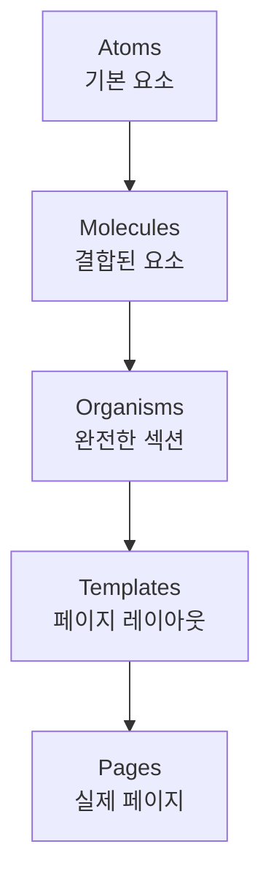
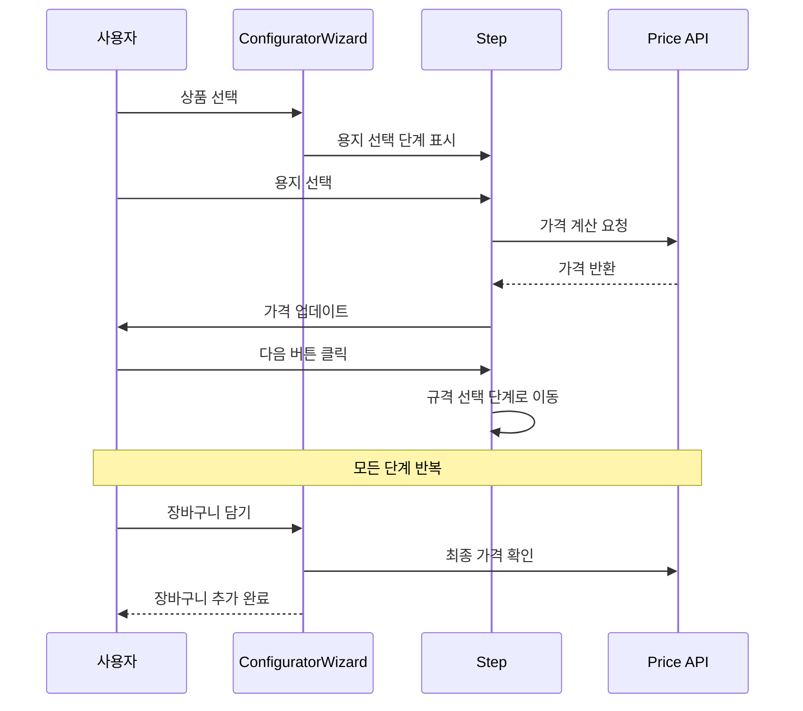

# UI/UX 패턴

huni.builder의 디자인 아키텍처와 일관된 사용자 경험을 위한 패턴 가이드입니다.

## Atomic Design 아키텍처

huni.builder는 Atomic Design 패턴을 기반으로 컴포넌트를 구성합니다.



### 계층별 특징

| 계층 | 정의 | 예시 |
|------|------|------|
| **Atoms** | 더 이상 분해할 수 없는 기본 요소 | Button, Input, Text |
| **Molecules** | 2개 이상의 Atom 조합 | OptionCard, QuantitySelector |
| **Organisms** | Molecule와 Atom의 복잡한 조합 | ConfiguratorWizard, ProductSection |
| **Templates** | 컴포넌트 배치 구조 | 위자드 페이지 레이아웃 |
| **Pages** | 실제 데이터가 주입된 인스턴스 | 상품 상세 페이지 |

## 옵션 선택 플로우 패턴

위자드 방식의 단계별 옵션 선택 패턴입니다.



### 단계 정의

| 단계 | 필수 여부 | 설명 |
|------|-----------|------|
| 카테고리 선택 | 필수 | 상품 카테고리 (엽서/스티커/포스터 등) |
| 용지 선택 | 필수 | 종이 종류 |
| 규격 선택 | 필수 | 크기, 형태 |
| 인쇄 방식 | 필수 | 컬러/흑백, 단면/양면 |
| 후가공 | 선택 | 코팅, 박, 엠보 등 |
| 수량 선택 | 필수 | 주문 수량 |
| 디자인 | 선택 | Edicus 디자인 편집기 |

## 반응형 디자인

huni.builder 위젯은 모든 화면 크기에서 최적화됩니다.

### 브레이크포인트

| 이름 | 최소 너비 | 타겟 |
|------|-----------|-------|
| `xs` | 0px | 모바일 (세로) |
| `sm` | 640px | 모바일 (가로) |
| `md` | 768px | 태블릿 |
| `lg` | 1024px | 데스크톱 |
| `xl` | 1280px | 와이드 데스크톱 |

### 레이아웃 패턴

```css
/* 모바일: 단열 */
@media (max-width: 767px) {
  .option-grid {
    grid-template-columns: 1fr;
  }
}

/* 태블릿: 2열 */
@media (min-width: 768px) {
  .option-grid {
    grid-template-columns: repeat(2, 1fr);
  }
}

/* 데스크톱: 3열 */
@media (min-width: 1024px) {
  .option-grid {
    grid-template-columns: repeat(3, 1fr);
  }
}
```

## Shadow DOM 스타일링 패턴

위젯이 호스트 페이지의 스타일과 독립적으로 동작하도록 Shadow DOM을 사용합니다.

### Constructable Stylesheets

```typescript
// 위젯 초기화 시 스타일시트 주입
class HuniWidget extends HTMLElement {
  constructor() {
    super()
    const shadow = this.attachShadow({ mode: 'open' })

    // CSS Variables 스타일시트
    const tokenSheet = new CSSStyleSheet()
    tokenSheet.replaceSync(`
      :host {
        --hw-color-primary: #5538b6;
        --hw-color-accent: #f0831e;
        /* ... */
      }
    `)

    // 컴포넌트 스타일시트
    const componentSheet = new CSSStyleSheet()
    componentSheet.replaceSync(`
      .button { background: var(--hw-color-primary); }
      /* ... */
    `)

    // 스타일시트 적용
    shadow.adoptedStyleSheets = [tokenSheet, componentSheet]
  }
}
```

### CSS Variables 주입

호스트 페이지에서 위젯 테마를 커스터마이징할 수 있습니다:

```css
/* 호스트 페이지 */
huni-widget {
  --hw-color-primary: #ff0000;
  --hw-radius-md: 10px;
  --hw-font-family: 'Your Font', sans-serif;
}
```

## 다크/라이트 모드

CSS Variables를 기반으로 테마 전환을 지원합니다.

### 테마 구현

```css
/* 라이트 모드 (기본) */
:host {
  --hw-color-surface: #ffffff;
  --hw-color-background: #f5f6f8;
  --hw-color-text-primary: #181818;
  --hw-color-border: #dddddd;
}

/* 다크 모드 */
:host([data-theme="dark"]) {
  --hw-color-surface: #1a1a1a;
  --hw-color-background: #0f0f0f;
  --hw-color-text-primary: #f5f6f8;
  --hw-color-border: #333333;
}
```

### 테마 전환

```typescript
// 위젯 테마 변경
function setTheme(theme: 'light' | 'dark') {
  const widget = document.querySelector('huni-widget')
  widget?.setAttribute('data-theme', theme)
}
```

## 에러 처리 패턴

사용자 친화적인 에러 메시지와 복구 경로를 제공합니다.

### 에러 상태

| 상태 | UI 표현 | 복구 방법 |
|------|----------|-----------|
| `validation-error` | 필드 아래 에러 메시지 | 입력 수정 |
| `api-error` | 토스트 알림 | 재시도 버튼 |
| `network-error` | 오프라인 메시지 | 연결 확인 |
| `timeout-error` | 시간 초과 메시지 | 재시도 |

### 에러 컴포넌트 예시

```tsx
function ErrorMessage({ error, onRetry }: ErrorProps) {
  return (
    <Card variant="bordered" padding="md">
      <Text variant="error" size="md">
        {error.message}
      </Text>
      {onRetry && (
        <Button size="sm" variant="outline" onClick={onRetry}>
          재시도
        </Button>
      )}
    </Card>
  )
}
```

## 로딩 상태 패턴

비동기 작업 중 사용자 피드백을 제공합니다.

### 로딩 타입

| 타입 | 용도 | 컴포넌트 |
|------|------|----------|
| `skeleton` | 콘텐츠 로딩 | SkeletonCard |
| `spinner` | 작업 진행 중 | Spinner |
| `progress` | 진행률 표시 | ProgressBar |

### 스피너 컴포넌트

```tsx
export function Spinner({ size = 'md' }: SpinnerProps) {
  return (
    <div className={`hw-spinner hw-spinner-${size}`}>
      <svg viewBox="0 0 24 24">
        <circle
          cx="12"
          cy="12"
          r="10"
          stroke="currentColor"
          strokeWidth="4"
          fill="none"
          strokeDasharray="32"
          strokeDashoffset="32"
        />
      </svg>
    </div>
  )
}
```

## 접근성 패턴

WCAG 2.1 AA 표준을 준수합니다.

### 포커스 관리

```typescript
// 포커스 트랩
function useFocusTrap(containerRef: RefObject<HTMLElement>) {
  useEffect(() => {
    const container = containerRef.current
    if (!container) return

    const focusableElements = container.querySelectorAll(
      'button, [href], input, select, textarea, [tabindex]:not([tabindex="-1"])'
    )

    const firstElement = focusableElements[0] as HTMLElement
    const lastElement = focusableElements[
      focusableElements.length - 1
    ] as HTMLElement

    const handleTab = (e: KeyboardEvent) => {
      if (e.key !== 'Tab') return

      if (e.shiftKey) {
        if (document.activeElement === firstElement) {
          lastElement.focus()
          e.preventDefault()
        }
      } else {
        if (document.activeElement === lastElement) {
          firstElement.focus()
          e.preventDefault()
        }
      }
    }

    container.addEventListener('keydown', handleTab)
    firstElement?.focus()

    return () => container.removeEventListener('keydown', handleTab)
  }, [containerRef])
}
```

### 키보드 내비게이션

| 키 | 동작 |
|----|------|
| `Tab` | 다음 포커스 가능 요소로 이동 |
| `Shift + Tab` | 이전 포커스 가능 요소로 이동 |
| `Enter` | 버튼/링크 활성화 |
| `Space` | 체크박스/라디오 토글 |
| `Escape` | 모달/드롭다운 닫기 |

## 관련 문서

- [디자인 토큰](./tokens) - 테마 시스템
- [Atom 컴포넌트](./atoms) - 기본 요소
- [Molecule & Organism](./molecules-organisms) - 복합 컴포넌트
