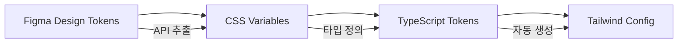

# 디자인 토큰

디자인 토큰은 시스템 전반에서 일관성을 유지하기 위한 재사용 가능한 설계 값들입니다. 모든 토큰은 CSS Variables (`--hw-*` 접두사)로 정의되어 Shadow DOM 내부에서도 사용 가능합니다.

## 색상 (Colors)

### 브랜드 색상

| 토큰 | 값 | 용도 |
|------|-----|------|
| `--hw-color-primary` | `#5538b6` | 주요 브랜드 색상 |
| `--hw-color-primary-hover` | `#231815` | 호버 상태 |
| `--hw-color-accent` | `#f0831e` | 강조 색상 |
| `--hw-color-secondary` | `#4b3f96` | 보조 브랜드 색상 |

### 표면 색상

| 토큰 | 값 | 용도 |
|------|-----|------|
| `--hw-color-surface` | `#ffffff` | 카드, 패널 배경 |
| `--hw-color-background` | `#f5f6f8` | 페이지 배경 |

### 텍스트 색상

| 토큰 | 값 | 용도 |
|------|-----|------|
| `--hw-color-text-primary` | `#181818` | 주요 텍스트 |
| `--hw-color-text-secondary` | `#828282` | 보조 텍스트 |
| `--hw-color-text-muted` | `#999999` | 흐릿한 텍스트 |

### UI 색상

| 토큰 | 값 | 용도 |
|------|-----|------|
| `--hw-color-border` | `#dddddd` | 테두리 |
| `--hw-color-disabled` | `#f5f6f8` | 비활성 상태 |
| `--hw-color-selected` | `#2869f7` | 선택 상태 |
| `--hw-color-selected-bg` | `rgba(40, 105, 247, 0.08)` | 선택 배경 |

## 타이포그래피 (Typography)

### 폰트 패밀리

```css
--hw-font-family: 'Noto Sans', -apple-system, BlinkMacSystemFont, 'Segoe UI', sans-serif;
```

### 폰트 크기

| 토큰 | 값 | 용도 |
|------|-----|------|
| `--hw-font-size-xs` | `12px` | 작은 라벨 |
| `--hw-font-size-sm` | `13px` | 보조 텍스트 |
| `--hw-font-size-md` | `14px` | 본문 |
| `--hw-font-size-lg` | `16px` | 제목 |
| `--hw-font-size-xl` | `24px` | 큰 제목 |

### 폰트 웨이트

| 값 | 용도 |
|----|------|
| 400 | Regular |
| 500 | Medium |
| 600 | SemiBold |
| 700 | Bold |

## 스페이싱 (Spacing)

4px 기본 단위 시스템:

| 토큰 | 값 | 용도 |
|------|-----|------|
| `--hw-space-xs` | `4px` | 아주 작은 간격 |
| `--hw-space-sm` | `8px` | 작은 간격 |
| `--hw-space-md` | `16px` | 기본 간격 |
| `--hw-space-lg` | `24px` | 큰 간격 |
| `--hw-space-xl` | `32px` | 아주 큰 간격 |

## 보더 레디우스 (Border Radius)

| 토큰 | 값 | 용도 |
|------|-----|------|
| `--hw-radius-xs` | `3px` | 아주 작은 둥근 모서리 |
| `--hw-radius-sm` | `4px` | 작은 둥근 모서리 |
| `--hw-radius-md` | `5px` | 기본 둥근 모서리 |
| `--hw-radius-lg` | `12px` | 큰 둥근 모서리 |
| `--hw-radius-xl` | `20px` | 아주 큰 둥근 모서리 |
| `--hw-radius-full` | `9999px` | 완전 둥근 (원형) |

## Figma에서 코드로 매핑

디자인 토큰은 Figma 디자인 파일(gEJhQRtmKI66BPhOpqoW3j)에서 코드로 변환되는 3단계 파이프라인을 따릅니다:



### 1단계: CSS Variables

`packages/widget-core/src/tokens/variables.css`에 정의된 31개 CSS 변수:

```css
:root {
  --hw-color-primary: #5538b6;
  --hw-color-accent: ##f0831e;
  --hw-font-size-md: 14px;
  --hw-space-md: 16px;
  /* ... 27개 추가 토큰 */
}
```

### 2단계: TypeScript Tokens

`packages/widget-core/src/design-tokens/`에서 타입 안전한 토큰 제공:

```typescript
// colors.ts
export const colors = {
  primary: '#5538b6',
  accent: '#f0831e',
  // ...
} as const

// types/tokens.ts
export interface HuniDesignTokens {
  colors: typeof colors
  typography: typeof typography
  spacing: typeof spacing
  borderRadius: typeof borderRadius
}
```

### 3단계: Tailwind Config

`packages/widget-core/tailwind.config.js`에서 Tailwind 클래스 자동 생성:

```javascript
module.exports = {
  theme: {
    extend: {
      colors: {
        primary: 'var(--hw-color-primary)',
        accent: 'var(--hw-color-accent)',
      },
      spacing: {
        xs: 'var(--hw-space-xs)',
        sm: 'var(--hw-space-sm)',
        // ...
      }
    }
  }
}
```

## Figma-Code 불일치 사항

일부 디자인 토큰은 Figma 원본과 코드 구현 간에 의도적인 불일치가 있습니다:

| 토큰 | Figma 값 | 코드 값 | 사유 |
|------|----------|---------|------|
| Typography xs | 11px | 12px | 브라우저 최소 가독성 |
| Border radius md | 4px | 5px | 시각적 구분 강화 |
| Border radius lg | 8px | 12px | 더 부드러운 느낌 |

## 테마 커스터마이징

CSS Variables를 사용하여 위젯 테마를 동적으로 변경할 수 있습니다:

```typescript
// 위젯 테마 업데이트
function updateWidgetTheme(theme: Partial<HuniDesignTokens>) {
  const widget = document.querySelector('huni-widget')
  if (!widget) return

  const root = widget.shadowRoot?.querySelector(':host')
  if (root) {
    Object.entries(theme).forEach(([key, value]) => {
      root.style.setProperty(`--hw-${key}`, value)
    })
  }
}

// 사용 예시
updateWidgetTheme({
  'color-primary': '#ff0000',
  'radius-md': '10px'
})
```

## 다크/라이트 모드

CSS Variables를 기반으로 다크 모드를 구현할 수 있습니다:

```css
/* 라이트 모드 (기본) */
:root {
  --hw-color-surface: #ffffff;
  --hw-color-text-primary: #181818;
}

/* 다크 모드 */
:root[data-theme="dark"] {
  --hw-color-surface: #1a1a1a;
  --hw-color-text-primary: #f5f6f8;
}
```

## 관련 파일

- `packages/widget-core/src/tokens/variables.css` - CSS Variables 정의
- `packages/widget-core/src/design-tokens/` - TypeScript 토큰
- `packages/widget-core/tailwind.config.js` - Tailwind 설정
- `packages/widget-core/src/types/tokens.ts` - 토큰 타입 정의
