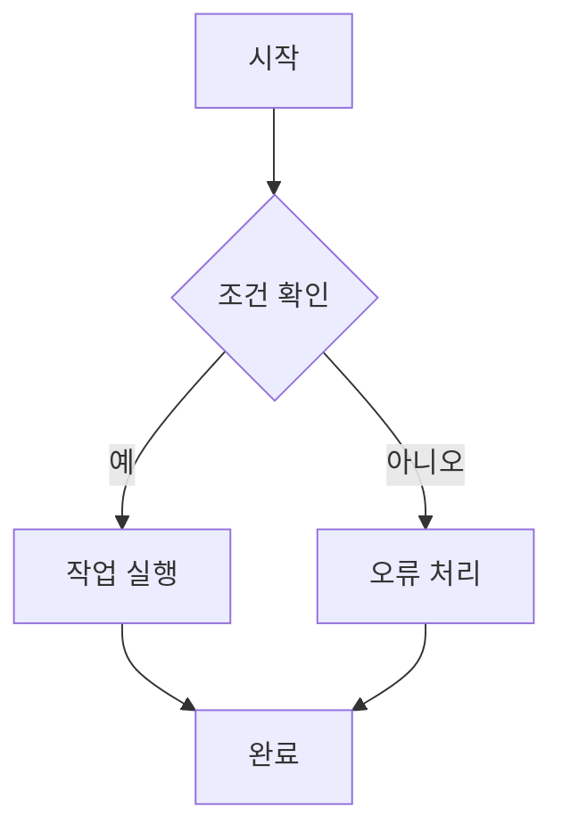
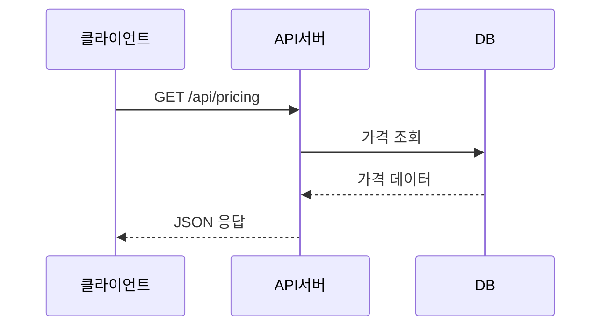
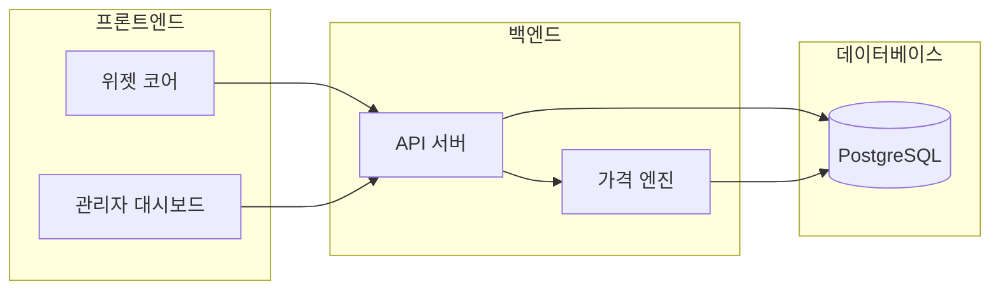

# Mermaid 다이어그램 테스트

이 페이지는 Mermaid 다이어그램 렌더링을 검증합니다.

## 플로우차트

```mermaid
flowchart TD
    A[시작] --> B{조건 확인}
    B -->|예| C[작업 실행]
    B -->|아니오| D[오류 처리]
    C --> E[완료]
    D --> E
```

## 시퀀스 다이어그램

```mermaid
sequenceDiagram
    participant 클라이언트
    participant API서버
    participant DB

    클라이언트->>API서버: GET /api/pricing
    API서버->>DB: 가격 조회
    DB-->>API서버: 가격 데이터
    API서버-->>클라이언트: JSON 응답
```

## 시스템 아키텍처

```mermaid
graph LR
    subgraph 프론트엔드
        A[위젯 코어]
        B[관리자 대시보드]
    end

    subgraph 백엔드
        C[API 서버]
        D[가격 엔진]
    end

    subgraph 데이터베이스
        E[(PostgreSQL)]
    end

    A --> C
    B --> C
    C --> D
    C --> E
    D --> E
```
