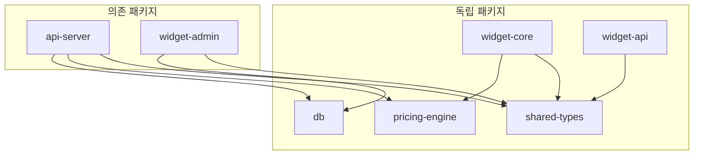

# 모노레포 구조

7개 패키지의 역할, 의존 관계, 빌드 순서를 이해합니다.

## 패키지 개요

| 패키지 | 역할 | 주요 기술 |
|--------|------|----------|
| `@huni/db` | PostgreSQL 스키마, Drizzle ORM | Drizzle ORM 0.44, postgres 3.4 |
| `@huni/api-server` | NestJS 11 Admin REST API | NestJS 11, Fastify, Typia 7, Nestia 10 |
| `@huni/pricing-engine` | 순수 TypeScript 가격 계산 | Zod (외부 의존성 없음) |
| `@huni/shared-types` | 공통 TypeScript 타입/Zod 스키마 | Zod |
| `@huni/widget-core` | React 19 임베더블 위젯 | React 19, Zustand 5, Vite 6 |
| `@huni/widget-admin` | React 19 관리자 대시보드 | React 19, TanStack, dnd-kit |
| `@huni/widget-api` | 위젯용 REST API 클라이언트 | TypeScript |

---

## 의존 관계 그래프



---

## 빌드 순서

### 1. 독립 패키지 우선 빌드

```bash
# 순서대로 빌드 (의존성 없는 순서)
pnpm -F @huni/shared-types build
pnpm -F @huni/db build
pnpm -F @huni/pricing-engine build
pnpm -F @huni/widget-core build
pnpm -F @huni/widget-api build
```

### 2. 의존 패키지 후순위 빌드

```bash
# 의존성 있는 패키지 빌드
pnpm -F @huni/api-server build
pnpm -F @huni/widget-admin build
```

---

## 공통 타입 사용 패턴

### @huni/shared-types 참조

```typescript
// 패키지에서 공통 타입 import
import { ProductSchema, OptionSchema } from '@huni/shared-types';

// Zod 스키마 사용
const product = ProductSchema.parse(data);
```

### 패키지 간 타입 공유

```typescript
// widget-core에서 pricing-engine 타입 사용
import type { PriceCalculationOptions, QuoteResult } from '@huni/pricing-engine';
```

---

## 패키지별 스크립트

### 루트 스크립트

```bash
# 전체 프로젝트 스크립트
pnpm test           # 전체 테스트
pnpm type-check     # 타입 체크
pnpm lint           # 린트
pnpm build          # 전체 빌드
```

### 패키지별 스크립트

| 패키지 | dev | build | test |
|--------|-----|-------|------|
| @huni/widget-core | `pnpm -F @huni/widget-core dev` | `pnpm -F @huni/widget-core build` | `pnpm -F @huni/widget-core test` |
| @huni/api-server | `pnpm -F @huni/api-server dev` | `pnpm -F @huni/api-server build` | `pnpm -F @huni/api-server test` |
| @huni/widget-admin | `pnpm -F @huni/widget-admin dev` | `pnpm -F @huni/widget-admin build` | `pnpm -F @huni/widget-admin test` |
| @huni/pricing-engine | - | `pnpm -F @huni/pricing-engine build` | `pnpm -F @huni/pricing-engine test` |

---

## 디렉토리 트리

```
packages/
├── api-server/
│   ├── src/
│   │   ├── modules/        # NestJS 모듈
│   │   │   ├── products/
│   │   │   ├── orders/
│   │   │   ├── pricing/
│   │   │   └── mes/
│   │   ├── common/         # 공통 데코레이터, 가드
│   │   └── main.ts
│   └── test/
├── db/
│   ├── schema/             # Drizzle 스키마
│   │   ├── core/
│   │   ├── channel/
│   │   ├── order/
│   │   └── mes/
│   └── seed/               # 시드 데이터
├── pricing-engine/
│   ├── src/
│   │   ├── calculators/    # 8개 계산기
│   │   ├── validators/     # 데이터 검증
│   │   └── utils/          # 유틸리티
│   └── test/
├── shared-types/
│   ├── schema/             # Zod 스키마
│   └── types/              # TypeScript 타입
├── widget-core/
│   ├── src/
│   │   ├── components/     # React 컴포넌트
│   │   ├── hooks/          # Custom hooks
│   │   ├── store/          # Zustand store
│   │   └── widget/         # 위젯 진입점
│   └── test/
├── widget-admin/
│   ├── src/
│   │   ├── pages/          # 페이지 컴포넌트
│   │   ├── features/       # 기능별 컴포넌트
│   │   └── components/     # 공통 컴포넌트
│   └── test/
└── widget-api/
    ├── src/                # API 클라이언트
    └── test/
```

---

## pnpm 필터 사용법

### 단일 패키지 작업

```bash
# 특정 패키지만 작업
pnpm -F @huni/widget-core <command>

# 와일드카드 사용
pnpm -F "@huni/*" test     # 모든 huni 패키지 테스트
pnpm -F "*-core" build     # -core로 끝나는 패키지 빌드
```

### 패키지 간 작업

```bash
# 의존하는 패키지 포함
pnpm -F @huni/widget-core --with-deps build

# 의존되는 패키지 제외
pnpm -F @huni/widget-core --no-deps test
```

---

## 다음 단계

- [테스트 전략](./testing) - Hybrid DDD/TDD 방법론
- [기여 가이드](./contributing) - SPEC 기반 개발 워크플로우
