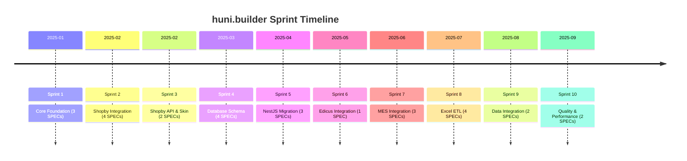
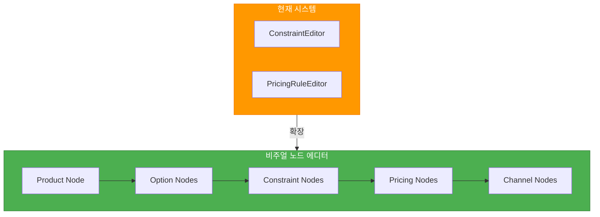
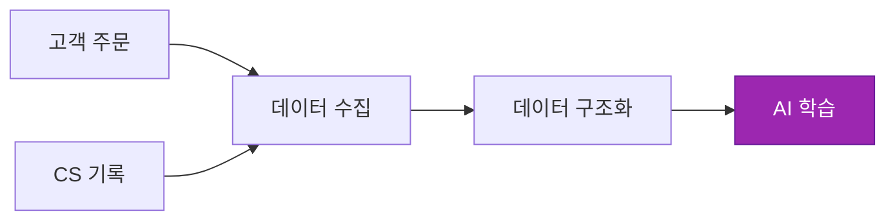
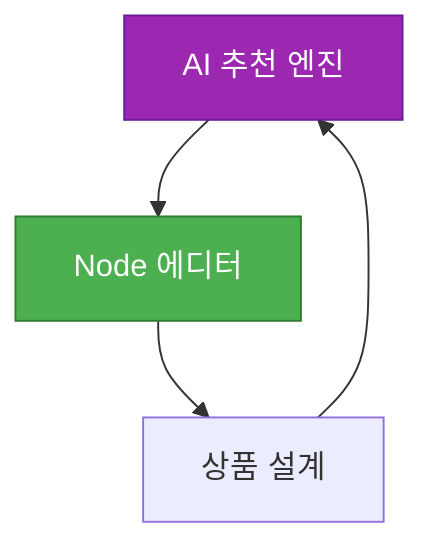
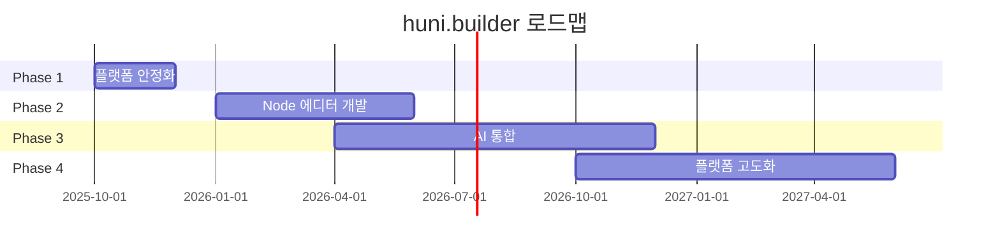

# 로드맵 & 미래 비전

프로젝트의 현재 상태, 단계별 발전 방향, Node 기반 상품 설계 에디터 비전을 안내합니다.

## 현재 상태 (Current State)

### 완료된 핵심 시스템

**완료 항목:**

- **위젯 코어**: React 19 + Shadow DOM 임베더블 위젯 (48.71KB gzipped)
- **관리자 대시보드**: 상품/옵션/제약조건/가격 관리
- **가격 엔진**: 8개 계산기, 93.7% 커버리지, 402개 테스트
- **Shopby 연동**: CustomEvent 프로토콜, 95.67% 커버리지
- **MES 연동**: .NET 8 BackOffice API 통합
- **Edicus 연동**: 온라인 디자인 편집기 SDK v2 통합
- **Excel ETL**: 상품 마스터/가격표 파싱 파이프라인
- **DB 스키마**: 40+ 테이블, Drizzle ORM
- **API 서버**: NestJS 11, 89개 엔드포인트

### 수치 요약

| 항목 | 수치 |
|------|------|
| 완료된 SPEC | 30개 (전수 완료) |
| 테스트 | 1,214+ tests, 93.7% 커버리지 |
| 패키지 | 7개 패키지 |
| NestJS 모듈 | 24개 모듈 |
| API 엔드포인트 | 89개 엔드포인트 |

### Sprint 히스토리

---

## Phase 1: 플랫폼 안정화

### 목표

완성된 시스템을 안정적으로 운영할 수 있는 환경 구축

### 주요 과제

| 과제 | 설명 |
|------|------|
| **전체 API 완성** | 위젯 API + 외부 연동 API 고도화 |
| **주문 라이프사이클 자동화** | 견적 → 주문 → 생산 → 배송 파이프라인 |
| **CS 연동** | 고객 문의 및 파일 관리 시스템 |
| **멀티채널 상품 동기화** | Shopby + 자사몰 + 제3자 채널 |
| **운영 모니터링 대시보드** | 실시간 모니터링 및 알림 |

---

## Phase 2: Node 기반 상품 설계 에디터

### 비전

> "위젯빌더는 다양한 인쇄 도메인 지식이 결합되어 복잡하게 연결되기 때문에 이를 UI/UX로 표현하는 것이 어렵다. 네트워크 토폴로지나 N8N, BPS와 같이 Node형태로 의미를 함께 부여하고, AI와 함께 상품을 설계해 나가는 형태까지 발전하려는 것이 목적이다."

### N8N/BPS 스타일 비주얼 노드 에디터

### 도메인 노드 타입

| 노드 타입 | 설명 | 예시 |
|-----------|------|------|
| **OptionNode** | 용지, 사이즈, 인쇄도수 등 개별 옵션 | A4용지, 양면4도 |
| **ConstraintNode** | 옵션 간 제약조건 규칙 | "A4용지는 양면만 가능" |
| **PricingNode** | 가격 계산 규칙 | 수량 구간별 단가 |
| **ProductNode** | 상품 정의 | 엽서 상품 |
| **ChannelNode** | 판매 채널 매핑 | Shopby, 자사몰 |

### 기존 시스템과의 연결

| 기존 시스템 | 미래 시스템 |
|-----------|-----------|
| ConstraintEditor | ConstraintNodeEditor |
| PricingRuleEditor | PricingNodeEditor |
| 결정 테이블 UI | Node 그래프 UI |

### 기대 효과

**복잡한 인쇄 도메인 지식의 UI/UX 표현 문제 해결**

- 시각적 이해도 향상
- 비전문가도 상품 설계 가능
- AI 기반 추천과의 연계

---

## Phase 3: AI 통합

### AI 학습 데이터 축적

### AI 기반 상품 기획 제안

| 영역 | 설명 |
|------|------|
| **상품별 판매 패턴 분석** | 인기 옵션 조합 추천 |
| **고객 피드백 및 재주문 패턴** | 개선 방향 제시 |
| **가격 전략 시뮬레이션** | 경쟁력 분석 및 마진 최적화 |

### 자동 매뉴얼/가이드 생성

**AI가 상품 특성을 분석하여 자동으로 매뉴얼 작성**

- 고객용 인쇄 가이드 자동 생성
- FAQ 자동 생성 및 업데이트
- 제작 공정 가이드 생성

### AI + Node 에디터 통합

> "AI와 함께 상품을 설계해 나가는" 협업 워크플로우

---

## Phase 4: 플랫폼 고도화

### 멀티 채널 위젯 배포 자동화

| 기능 | 설명 |
|------|------|
| **원클릭 배포** | 위젯 코드 복사하여 바로 사용 |
| **자동 업데이트** | 위젯 자동 업데이트 |
| **A/B 테스트** | 위젯 변형 테스트 |

### 파트너 생태계

- **API 마켓플레이스**: 개발자를 위한 API 제공
- **위젯 템플릿**: 산업별 위젯 템플릿
- **플러그인 시스템**: 확장 기능 생태계

### 글로벌 확장

| 항목 | 설명 |
|------|------|
| **다국어** | 영어, 일본어, 중국어 지원 |
| **다통화** | USD, EUR, JPY 지원 |
| **현지화** | 지역별 인쇄 표준 지원 |

### SaaS 전환

---

## 기술 로드맵

---

## 다음 단계

- [기여 가이드](./contributing) - 프로젝트에 기여하는 방법
- [API 레퍼런스](../api-reference) - REST API 사용법
