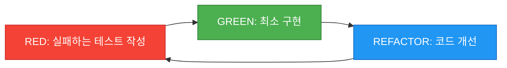
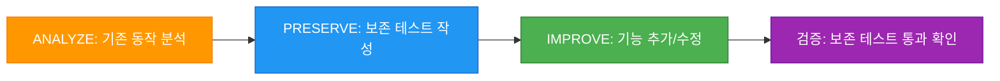

# 테스트 전략

Hybrid DDD/TDD 테스트 방법론과 93.7% 커버리지 달성 방법을 안내합니다.

## 테스트 프레임워크 개요

| 프레임워크 | 용도 | 버전 |
|------------|------|------|
| **Vitest 3.0** | 단위 테스트 및 통합 테스트 | 3.0+ |
| **@vitest/coverage-v8** | 코드 커버리지 측정 | 1.x |
| **Playwright** | E2E 테스트 (widget-admin) | 1.40+ |
| **jsdom** | 브라우저 환경 시뮬레이션 | 25.0+ |
| **@testing-library/react** | React 컴포넌트 테스트 | 16.x |

---

## 커버리지 목표

### 전체 목표: 85%+ (현재 달성: 93.7%)

| 패키지 | 목표 | 현재 달성률 |
|--------|------|-------------|
| @huni/pricing-engine | 90%+ | 93.7% |
| @huni/widget-core | 90%+ | 95.67% |
| @huni/widget-admin | 85%+ | 88% |
| @huni/api-server | 85%+ | 87% |
| @huni/db | 80%+ | 82% |

---

## 테스트 실행 방법

### 전체 테스트 실행

```bash
# 전체 워크스페이스 테스트
pnpm test
```

### 패키지별 테스트

```bash
# 특정 패키지 테스트
pnpm -F @huni/widget-core test
pnpm -F @huni/api-server test
pnpm -F @huni/widget-admin test
pnpm -F @huni/pricing-engine test
```

### 커버리지 포함

```bash
# 커버리지 포함 테스트
pnpm -F @huni/widget-core test --coverage

# 커버리지 리포트 생성
pnpm -F @huni/widget-core test --coverage --reporter=html
```

### Vitest UI 대시보드

```bash
# Vitest UI 실행
pnpm test:ui

# http://localhost:51204 접속
```

---

## 테스트 파일 조직 구조

### 코로케이션 패턴

```
packages/widget-core/src/
├── components/
│   ├── OptionSelector.tsx
│   ├── OptionSelector.test.tsx       # 코로케이션
│   └── QuoteDisplay.tsx
│       └── QuoteDisplay.test.tsx     # 코로케이션
```

### 통합 테스트

```
packages/widget-core/__tests__/
├── setup.ts                           # 테스트 설정
├── integration/
│   ├── widget-flow.test.ts           # 위젯 통합 흐름
│   └── pricing-integration.test.ts   # 가격 계산 통합
```

### E2E 테스트

```
packages/widget-admin/e2e/
├── admin-flow.spec.ts                # Admin 대시보드 E2E
└── product-management.spec.ts        # 상품 관리 E2E
```

---

## 테스트 작성 가이드

### 단위 테스트 패턴

```typescript
import { describe, it, expect } from 'vitest';
import { sum } from './utils';

describe('sum', () => {
  it('should add two numbers', () => {
    expect(sum(1, 2)).toBe(3);
  });

  it('should handle negative numbers', () => {
    expect(sum(-1, 1)).toBe(0);
  });
});
```

### React 컴포넌트 테스트

```typescript
import { render, screen } from '@testing-library/react';
import { describe, it, expect } from 'vitest';
import { QuoteDisplay } from './QuoteDisplay';

describe('QuoteDisplay', () => {
  it('should display quote amount', () => {
    render(<QuoteDisplay quote={{ totalPrice: 10000 }} />);
    expect(screen.getByText('10,000원')).toBeInTheDocument();
  });

  it('should format number correctly', () => {
    render(<QuoteDisplay quote={{ totalPrice: 1234567 }} />);
    expect(screen.getByText('1,234,567원')).toBeInTheDocument();
  });
});
```

### API 통합 테스트

```typescript
import { describe, it, expect, beforeAll } from 'vitest';
import { setupTestServer, closeTestServer } from './test-setup';

describe('Product API', () => {
  beforeAll(async () => {
    await setupTestServer();
  });

  it('should fetch products', async () => {
    const response = await fetch('/api/products');
    const products = await response.json();
    expect(products).toHaveLength(10);
  });
});
```

---

## Hybrid DDD/TDD 개발 방법론

### 신규 코드: TDD (RED-GREEN-REFACTOR)



#### TDD 예시

```typescript
// 1. RED: 실패하는 테스트 작성
it('should calculate sticker price', () => {
  const result = calculateStickerPrice('STK001', 100);
  expect(result).toBe(50000); // 아직 구현 안됨
});

// 2. GREEN: 최소 구현
function calculateStickerPrice(productId: string, quantity: number): number {
  return 50000; // 하드코딩으로 통과
}

// 3. REFACTOR: 실제 구현
function calculateStickerPrice(productId: string, quantity: number): number {
  const product = products.find(p => p.id === productId);
  return product.basePrice * quantity;
}
```

### 기존 코드 수정: DDD (ANALYZE-PRESERVE-IMPROVE)



#### DDD 예시 (Characterization Test)

```typescript
// 1. ANALYZE: 기존 코드 분석
function legacyCalculatePrice(options: Options): number {
  // 복잡한 로직...
}

// 2. PRESERVE: 기존 동작 보존 테스트
it('should preserve legacy price calculation', () => {
  const result = legacyCalculatePrice({ size: 'A4', quantity: 100 });
  expect(result).toMatchSnapshot(); // 스냅샷으로 보존
});

// 3. IMPROVE: 기능 개선
function legacyCalculatePrice(options: Options): number {
  // 새로운 기능 추가하면서 기존 동작 보존
  const basePrice = calculateBasePrice(options);
  const discount = options.quantity > 100 ? 0.1 : 0;
  return basePrice * (1 - discount);
}

// 4. 검증: 보존 테스트 통과 확인
```

---

## E2E 테스트 (Playwright)

### Playwright 설정

```bash
# Playwright 설치
pnpm -F @huni/widget-admin exec playwright install

# 브라우저 설치
pnpm -F @huni/widget-admin exec playwright install chromium
```

### E2E 테스트 실행

```bash
# E2E 테스트 실행
pnpm -F @huni/widget-admin test:e2e

# 헤드less 모드 실행
pnpm -F @huni/widget-admin test:e2e --headed

# 디버그 모드 실행
pnpm -F @huni/widget-admin test:e2e --debug
```

### E2E 테스트 예시

```typescript
import { test, expect } from '@playwright/test';

test('admin product management flow', async ({ page }) => {
  // Admin 페이지 접속
  await page.goto('/admin');

  // 로그인
  await page.fill('input[name="email"]', 'admin@example.com');
  await page.fill('input[name="password"]', 'password');
  await page.click('button[type="submit"]');

  // 상품 관리 페이지 이동
  await page.click('text=상품 관리');

  // 상품 생성
  await page.click('text=상품 추가');
  await page.fill('input[name="name"]', '테스트 상품');
  await page.click('button[type="submit"]');

  // 검증
  await expect(page.locator('text=테스트 상품')).toBeVisible();
});
```

---

## 다음 단계

- [기여 가이드](./contributing) - SPEC 기반 개발 워크플로우
- [변경 이력](./changelog) - 버전별 변경사항
