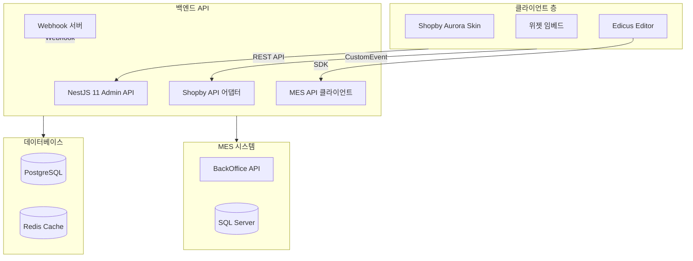
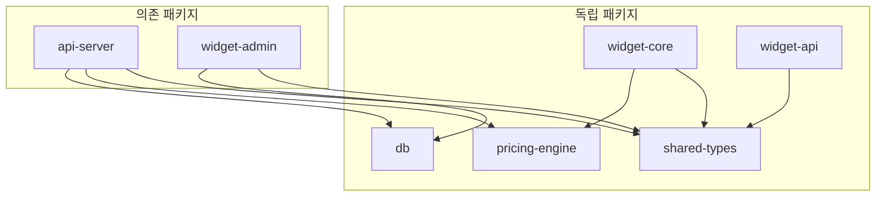
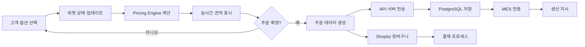
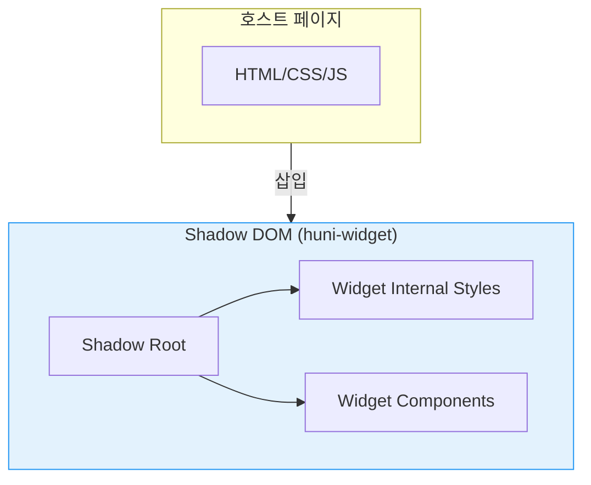

# 아키텍처 개요

huni.builder의 모노레포 구조, 시스템 아키텍처, 데이터 흐름을 소개합니다.

## 시스템 아키텍처



---

## 모노레포 패키지 구조

```
packages/
├── api-server/          # NestJS 11 + Fastify Admin REST API
├── db/                  # PostgreSQL + Drizzle ORM 스키마
├── pricing-engine/      # 순수 TypeScript 가격 계산 엔진
├── shared-types/        # 공통 TypeScript 타입/Zod 스키마
├── widget-admin/        # React 19 관리자 대시보드
├── widget-core/         # React 19 임베더블 위젯
└── widget-api/          # 위젯용 REST API
```

### 패키지 상세 역할

| 패키지 | 역할 | 주요 기술 |
|--------|------|----------|
| `@huni/db` | 데이터베이스 스키마 | PostgreSQL 14+, Drizzle ORM 0.44 |
| `@huni/api-server` | Admin API 서버 | NestJS 11, Fastify, Typia 7, Nestia 10 |
| `@huni/pricing-engine` | 가격 계산 엔진 | TypeScript, Zod (외부 의존성 없음) |
| `@huni/shared-types` | 공통 타입 | Zod 스키마 |
| `@huni/widget-core` | 위젯 코어 | React 19, Zustand 5, Vite 6, Shadow DOM |
| `@huni/widget-admin` | 관리자 UI | React 19, TanStack, dnd-kit |
| `@huni/widget-api` | 위젯 API | TypeScript REST API 클라이언트 |

---

## 패키지 의존 관계



### 빌드 순서

1. **독립 패키지 우선 빌드**:
   ```bash
   pnpm -F @huni/shared-types build
   pnpm -F @huni/db build
   pnpm -F @huni/pricing-engine build
   pnpm -F @huni/widget-core build
   pnpm -F @huni/widget-api build
   ```

2. **의존 패키지 후순위 빌드**:
   ```bash
   pnpm -F @huni/api-server build
   pnpm -F @huni/widget-admin build
   ```

---

## 데이터 흐름



### 데이터 흐름 상세

1. **옵션 선택**: 고객이 위젯에서 옵션 선택
2. **상태 업데이트**: Zustand store 상태 변경
3. **가격 계산**: Pricing Engine 8개 계산기 실행
4. **견적 표시**: 실시간 가격 UI 갱신
5. **주문 생성**: 주문 데이터 직렬화
6. **API 전송**: REST API로 주문 전송
7. **DB 저장**: PostgreSQL에 주문/아이템 저장
8. **MES 연동**: 생산 지시 자동 전달
9. **장바구니**: Shopby 장바구니와 동기화

---

## Shadow DOM 아키텍처



### Shadow DOM 특징

| 특징 | 설명 |
|------|------|
| **CSS 격리** | 호스트 페이지 스타일과 충돌 없음 |
| **캡슐화** | 위젯 내부 DOM 구조 보호 |
| **IIFE 번들** | 48.71KB gzipped로 최적화 |
| **ESM 익스포트** | React import용 ESM 버전 |

---

## 기술 스택

### 프론트엔드

- **React 19**: 최신 React 기능
- **TypeScript 5.7**: 타입 안전 개발
- **Zustand 5**: 가벼운 상태 관리
- **Tailwind CSS**: 유틸리티 CSS 프레임워크
- **Vite 6**: 빠른 빌드 도구

### 백엔드

- **NestJS 11**: TypeScript 기반 프레임워크
- **Fastify**: 빠르고 가벼운 HTTP 서버
- **Typia/Nestia**: 타입 안전 API
- **Zod**: 스키마 검증
- **Redis**: 캐시 및 세션

### 데이터베이스

- **PostgreSQL 14**: 관계형 데이터베이스
- **Drizzle ORM**: 타입 안전 ORM
- **SQL Server**: MES 시스템 연동

---

## 다음 단계

- [핵심 개념](../core-concepts) - 인쇄 도메인 지식 학습
- [위젯 가이드](../widget-guide) - 위젯 사용법 상세 가이드
- [API 레퍼런스](../api-reference) - REST API 엔드포인트
