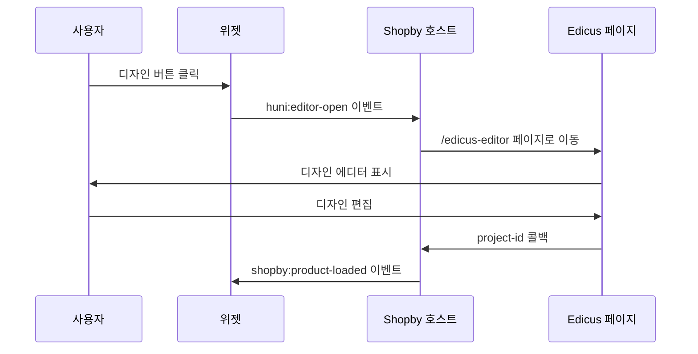
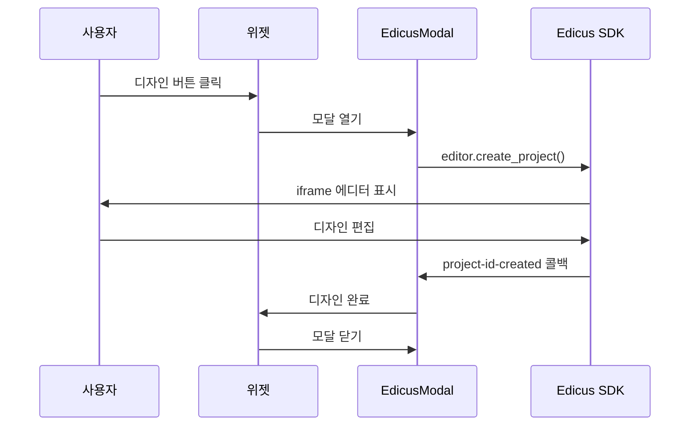
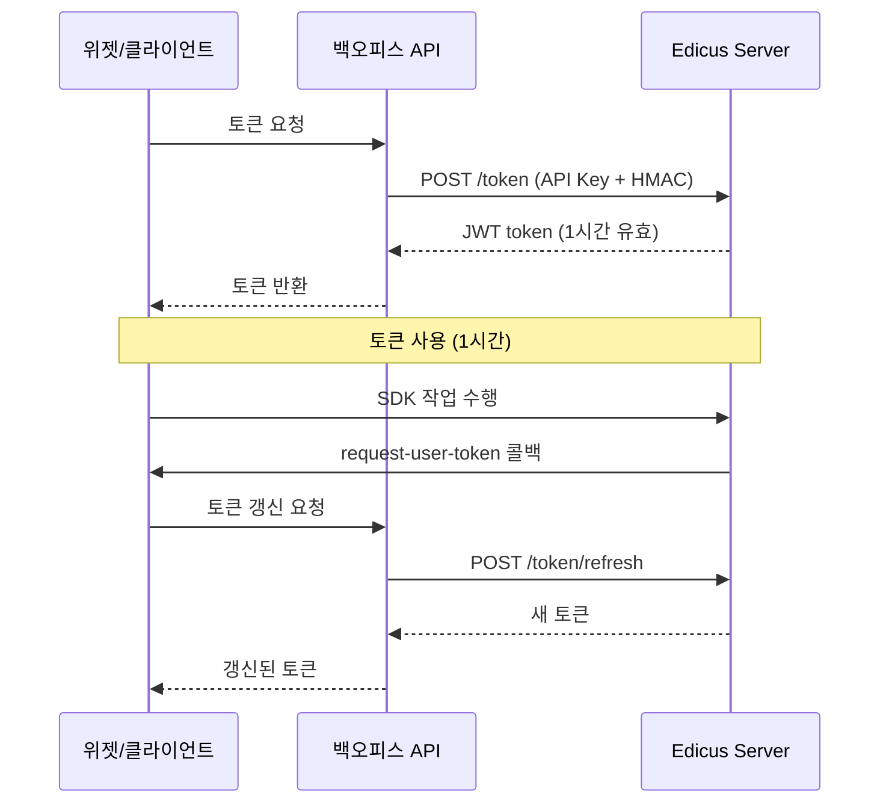

# Edicus 연동

Edicus는 MotionOne에서 제공하는 온라인 디자인 에디터로, huni.builder 위젯에서 디자인 편집 기능을 제공합니다.

## 개요

Edicus 연동은 다음과 같은 방식으로 제공됩니다:

- **JS SDK v2**: 브라우저 기반 디자인 에디터 (iframe + postMessage)
- **Server API**: 백엔드 프록시를 통한 API Key 보호
- **이중 모드**: Shopby 모드 (페이지 이동) / Standalone 모드 (모달)

## 운영 모드

### Shopby 모드

Edicus 전용 페이지로 이동하여 디자인을 편집합니다.



### Standalone 모드

위젯 내 모달로 Edicus를 표시합니다.



## JS SDK 초기화

### 스크립트 로딩

```typescript
function loadEdicusSDK(): Promise<void> {
  return new Promise((resolve, reject) => {
    if (window.EdicusEditor) {
      resolve()
      return
    }

    const script = document.createElement('script')
    script.src = 'https://edicus.motionone.com/sdk/v2/edicus.js'
    script.async = true
    script.onload = () => resolve()
    script.onerror = () => reject(new Error('Edicus SDK 로드 실패'))
    document.head.appendChild(script)
  })
}
```

### 에디터 초기화

```typescript
import { useEffect, useRef } from 'react'

export function EdicusEditor() {
  const containerRef = useRef<HTMLDivElement>(null)
  const editorRef = useRef<any>(null)

  useEffect(() => {
    loadEdicusSDK().then(() => {
      if (!containerRef.current) return

      // 에디터 생성
      const editor = new window.EdicusEditor(containerRef.current, {
        apiKey: process.env.EDICUS_API_KEY,
        mode: 'standalone',
        productCode: 'postcard-001',
        canvas: {
          width: 210,
          height: 297,
          unit: 'mm'
        },
        callbacks: {
          'project-id-created': handleProjectCreated,
          'close': handleClose,
          'goto-cart': handleGotoCart,
          'request-user-token': handleTokenRequest
        }
      })

      editorRef.current = editor

      return () => {
        editor.destroy()
      }
    })
  }, [])

  const handleProjectCreated = (data: { projectId: string }) => {
    console.log('프로젝트 생성:', data.projectId)
    // 디자인 완료 처리
  }

  const handleClose = () => {
    // 에디터 닫기
  }

  const handleGotoCart = () => {
    // 장바구니로 이동
  }

  const handleTokenRequest = async () => {
    // 백엔드에서 토큰 요청
    const response = await fetch('/edicus/token', {
      method: 'POST',
      headers: { 'Content-Type': 'application/json' },
      body: JSON.stringify({ action: 'request-user-token' })
    })
    const { token } = await response.json()
    return token
  }

  return <div ref={containerRef} className="edicus-container" />
}
```

## SDK 콜백

### project-id-created

프로젝트 생성 완료 시 호출됩니다.

```typescript
interface ProjectIdCreatedData {
  projectId: string
  projectCode: string
  thumbnailUrl: string
}

function handleProjectCreated(data: ProjectIdCreatedData) {
  const { projectId, thumbnailUrl } = data
  // 프로젝트 ID와 썸네일 저장
  saveDesign(projectId, thumbnailUrl)
}
```

### close

에디터가 닫힐 때 호출됩니다.

```typescript
function handleClose() {
  // 모달 닫기 또는 페이지 이동
  closeEditor()
}
```

### goto-cart

장바구니로 이동 요청 시 호출됩니다.

```typescript
function handleGotoCart() {
  // 디자인 완료 후 장바구니 이동
  router.push('/cart')
}
```

### request-user-token

토큰 갱신이 필요할 때 호출됩니다.

```typescript
async function handleTokenRequest(): Promise<string> {
  const response = await fetch('/api/edicus/token', {
    method: 'POST'
  })
  const { token } = await response.json()
  return token
}
```

## 토큰 관리

### 토큰 수명 주기



### 토큰 발급 API

```typescript
// 백엔드 프록시 API
app.post('/api/edicus/token', async (req, res) => {
  const { action } = req.body

  if (action === 'request-user-token') {
    // Edicus Server에 토큰 요청
    const response = await fetch('https://api.edicus.com/v2/token', {
      method: 'POST',
      headers: {
        'X-API-Key': process.env.EDICUS_API_KEY,
        'X-Signature': generateSignature(...),
        'X-Timestamp': Math.floor(Date.now() / 1000).toString()
      }
    })

    const { token } = await response.json()
    res.json({ token })
  }
})
```

## SDK 메서드 레퍼런스

### init()

에디터 SDK 초기화 메서드입니다.

```typescript
const editor = window.edicusSDK.init(config)
```

**Parameters:**

| 파라미터 | 타입 | 필수 | 설명 |
|---------|------|------|------|
| `base_url` | string | false | 기본 URL (기본값: "https://edicusbase.firebaseapp.com") |
| `landing_path` | string | false | 랜딩 페이지 경로 |
| `tnview_path` | string | false | 미리보기 페이지 경로 |
| `preview_path` | string | false | 프리뷰 페이지 경로 |
| `lite_path` | string | false | Lite 모드 페이지 경로 |
| `test_path` | string | false | 테스트 페이지 경로 |

**Returns:** 에디터 컨텍스트 객체

**Example:**

```typescript
const editor = window.edicusSDK.init({
  base_url: 'https://edicusbase.firebaseapp.com'
})
```

---

### open_project()

기존 프로젝트를 엽니다.

```typescript
editor.open_project(params, callback)
```

**Parameters:**

| 파라미터 | 타입 | 필수 | 설명 |
|---------|------|------|------|
| `partner` | string | 아니오 | 파트너 코드 |
| `mobile` | boolean | 아니오 | 모바일 모드 여부 |
| `parent_element` | HTMLElement | 아니오 | 부모 요소 |
| `token` | string | 예 | 사용자 토큰 |
| `prjid` | string | 예 | 프로젝트 ID |
| `ui_locale` | string | 아니오 | UI 언어 (ko/en/ja) |
| `ui_style` | string | 아니오 | UI 스타일 (tab-less/tab-top-less) |
| `lang` | string | 아니오 | 템플릿 언어 (ko/en/ja) |
| `editor_type` | string | 아니오 | 에디터 타입 (template/print) |
| `env_mode` | string | 아니오 | 환경 모드 (dev/demo) |
| `run_mode` | string | 아니오 | 실행 모드 (passive) |
| `master_mode` | string | 아니오 | 마스터 모드 (view/edit) |
| `div` | string | 아니오 | 분할 설정 |

**Returns:** void

**Example:**

```typescript
editor.open_project({
  partner: 'huni.builder',
  mobile: false,
  parent_element: document.getElementById('editor-container'),
  token: userToken,
  prjid: '12345',
  ui_locale: 'ko',
  env_mode: 'demo'
}, (err, data) => {
  console.log('Callback:', data)
})
```

---

### create_project()

새 프로젝트를 생성합니다.

```typescript
editor.create_project(params, callback)
```

**Parameters:**

| 파라미터 | 타입 | 필수 | 설명 |
|---------|------|------|------|
| `parent_element` | HTMLElement | 아니오 | 부모 요소 |
| `partner` | string | 아니오 | 파트너 코드 |
| `mobile` | boolean | 아니오 | 모바일 모드 여부 |
| `ps_code` | string | 예 | 제품 코드 |
| `template_uri` | string | 아니오 | 템플릿 URI |
| `title` | string | 아니오 | 프로젝트 제목 |
| `token` | string | 예 | 사용자 토큰 |
| `edit_mode` | string | 아니오 | 편집 모드 |

**Returns:** void

**Example:**

```typescript
editor.create_project({
  parent_element: container,
  partner: 'huni.builder',
  mobile: false,
  ps_code: 'postcard-001',
  template_uri: '/templates/postcard-001',
  title: '명함 디자인',
  token: userToken
}, (err, data) => {
  if (data.action === 'project-id-created') {
    console.log('Project ID:', data.project_id)
  }
})
```

---

### open_preview()

프리뷰 모드를 엽니다.

```typescript
editor.open_preview(params, callback)
```

**Parameters:**

| 파라미터 | 타입 | 필수 | 설명 |
|---------|------|------|------|
| `token` | string | 예 | 사용자 토큰 |
| `partner` | string | 예 | 파트너 코드 |
| `uid` | string | 아니오 | 사용자 ID |
| `prjid` | string | 예 | 프로젝트 ID |
| `div` | string | 아니오 | 분할 설정 (기본값: 'host') |
| `lang` | string | 아니오 | 언어 (기본값: 'ko') |
| `npage` | number | 아니오 | 페이지 번호 |
| `flow` | string | 아니오 | 흐름 방향 (horizontal/vertical) |
| `mode` | string | 아니오 | 모드 (기본값: 'default') |
| `options` | object | 아니오 | 옵션 객체 |

**Returns:** void

**Example:**

```typescript
editor.open_preview({
  token: userToken,
  partner: 'huni.builder',
  uid: userId,
  prjid: '12345',
  lang: 'ko',
  npage: 1,
  flow: 'horizontal',
  mode: 'default'
}, (err, data) => {
  // 프리뷰 콜백 처리
})
```

---

### open_portal()

디버깅 포털을 엽니다.

```typescript
editor.open_portal(params, callback)
```

**Parameters:**

| 파라미터 | 타입 | 필수 | 설명 |
|---------|------|------|------|
| `token` | string | 예 | 사용자 토큰 |
| `parent_element` | HTMLElement | 아니오 | 부모 요소 (기본값: document.body) |

**Returns:** void

**Example:**

```typescript
editor.open_portal({
  token: userToken
}, (err, data) => {
  // 디버깅 포털 콜백 처리
})
```

---

### close() / destroy()

에디터를 닫거나 완전히 종료합니다.

```typescript
// 에디터만 닫기
editor.close(params)

// SDK 완전 종료
editor.destroy(params)
```

**Parameters:**

| 파라미터 | 타입 | 필수 | 설명 |
|---------|------|------|------|
| `parent_element` | HTMLElement | 아니오 | 부모 요소 |

**Returns:** void

**Example:**

```typescript
// 에디터 닫기
editor.close({ parent_element: container })

// SDK 완전 종료
editor.destroy({ parent_element: container })
```

---

### change_project()

에디터 내에서 프로젝트를 변경합니다.

```typescript
editor.change_project(projectID)
```

**Parameters:**

| 파라미터 | 타입 | 필수 | 설명 |
|---------|------|------|------|
| `project_id` | string | 예 | 프로젝트 ID |

**Returns:** void

**Example:**

```typescript
editor.change_project('67890')
```

---

### change_template()

템플릿을 변경합니다.

```typescript
editor.change_template(psCode, templateUri)
```

**Parameters:**

| 파라미터 | 타입 | 필수 | 설명 |
|---------|------|------|------|
| `psCode` | string | 예 | 제품 코드 |
| `template_uri` | string | 예 | 템플릿 URI |

**Returns:** void

**Example:**

```typescript
editor.change_template('businesscard-001', '/templates/businesscard-001')
```

---

### execute_ddp_block()

DDP 블록을 실행합니다.

```typescript
editor.execute_ddp_block(ddpBlock, historyLabel)
```

**Parameters:**

| 파라미터 | 타입 | 필수 | 설명 |
|---------|------|------|------|
| `ddp_block` | string | 아니오 | DDP 블록 내용 |
| `history_label` | string | 아니오 | 이력 라벨 |

**Returns:** void

**Example:**

```typescript
editor.execute_ddp_block(
  '<ddp_block>...</ddp_block>',
  'Initial Design'
)
```

---

### post_to_editor()

에디터 내부에 메시지를 전송합니다.

```typescript
editor.post_to_editor(action, info)
```

**Parameters:**

| 파라미터 | 타입 | 필수 | 설명 |
|---------|------|------|------|
| `action` | string | 예 | 액션 타입 |
| `info` | object | 아니오 | 액션 정보 |

**Returns:** void

**Example:**

```typescript
editor.post_to_editor('send-user-token', {
  token: 'new-token-value'
})
```

---

## 파라미터 가이드

### 기본 파라미터

| 파라미터 | 타입 | 기본값 | 설명 |
|---------|------|--------|------|
| `partner` | string | - | 파트너 코드 (운영용) |
| `token` | string | - | Edicus 사용자 토큰 (필수) |
| `mobile` | boolean | false | 모바일 모드 여부 |
| `parent_element` | HTMLElement | - | 부모 요소 (필수) |

### UI 파라미터

| 파라미터 | 타입 | 기본값 | 설명 |
|---------|------|--------|------|
| `lang` | string | 'ko' | 템플릿 언어 (ko/en/ja) |
| `ui_locale` | string | 'ko' | UI 언어 (ko/en/ja) |
| `editor_type` | string | 'template' | 에디터 타입 (template/print) |
| `ui_style` | string | - | UI 스타일 (tab-less/tab-top-less) |
| `parent_type` | string | - | 부모 타입 (.. / web_in_app) |

### 환경 파라미터

| 파라미터 | 타입 | 기본값 | 설명 |
|---------|------|--------|------|
| `env_mode` | string | 'prod' | 환경 모드 (prod/dev/demo) |
| `run_mode` | string | 'active' | 실행 모드 (active/passive) |
| `master_mode` | string | 'edit' | 마스터 모드 (view/edit) |

### 데이터 파라미터

| 파라미터 | 타입 | 기본값 | 설명 |
|---------|------|--------|------|
| `data_row` | object | - | 초기 데이터 행 |
| `data_feed` | string | - | 데이터 피드 URI |
| `data_content` | string | - | 데이터 내용 (VDP) |

### 고급 파라미터

| 파라미터 | 타입 | 기본값 | 설명 |
|---------|------|--------|------|
| `ddp_block` | string | null | DDP 블록 |
| `private_css` | string | null | 프라이빗 CSS |
| `i18n` | object | null | 국제화 설정 |
| `prod_info` | object | null | 제품 정보 |
| `options` | object | null | 옵션 설정 |
| `zoom` | number | null | 줌 레벨 |
| `template_list` | array | null | 템플릿 목록 |

---

## Resource API

SDK 내부적으로 사용하는 Resource API는 다음과 같습니다.

### 템플릿 쿼리

```http
POST /resapi/query
```

**Headers:**

```
edicus-api-key: {API_KEY}
```

**Body:**

```json
{
  "cmd": "get_template_list",
  "partner": "{partner_code}",
  "lang": "{language}"
}
```

**Response:**

```json
{
  "result": {
    "templates": [
      {
        "ps_code": "postcard-001",
        "title": "명함",
        "thumbnail_url": "/thumbs/postcard-001.jpg"
      }
    ]
  }
}
```

---

### 제품 목록 조회

```http
GET /resapi/product/list
```

**Headers:**

```
edicus-api-key: {API_KEY}
```

**Response:**

```json
{
  "result": {
    "products": [
      {
        "ps_code": "postcard-001",
        "title": "명함",
        "category": "카드류",
        "category_code": "1999"
      }
    ]
  }
}
```

---

## SDK 콜백

### project-id-created

프로젝트 ID가 생성되면 호출됩니다.

```typescript
function handleProjectCreated(data) {
  const { project_id, project_code, thumbnail_url } = data
  // 프로젝트 ID 저장
  saveProjectId(project_id)
}
```

---

### close

에디터가 닫힐 때 호출됩니다.

```typescript
function handleClose() {
  // 에디터 종료 처리
  closeEditor()
}
```

---

### goto-cart

장바구니로 이동 요청 시 호출됩니다.

```typescript
function handleGotoCart() {
  // 장바구니 페이지로 이동
  router.push('/cart')
}
```

---

### request-user-token

토큰 갱신이 필요할 때 호출됩니다.

```typescript
async function handleTokenRequest(): Promise<string> {
  // 백엔드에서 토큰 요청
  const response = await fetch('/api/edicus/token', {
    method: 'POST'
  })
  const { token } = await response.json()
  return token
}
```

---

### save-doc-report

문서 저장 완료 보고 시 호출됩니다.

```typescript
function handleSaveDocReport(data) {
  const { docInfo } = data.info
  // 저장 결과 처리
  console.log('Saved:', docInfo)
}
```

---

### request-help-message

도움말 버튼 클릭 시 호출됩니다.

```typescript
function handleRequestHelpMessage(data) {
  const { case_type } = data.info

  if (case_type === 'photo-import') {
    // 사진 가져오기 도움말
    alert('사진 가져오기 도움말')
  }
}
```

---

## Preview Mode

### 프리뷰 모드 시작

```typescript
editor.open_preview({
  token: userToken,
  partner: 'huni.builder',
  uid: userId,
  prjid: projectId,
  lang: 'ko',
  npage: 1,
  flow: 'horizontal'
})
```

### 페이지 탐색 콜백

프리뷰 모드에서 페이지 탐색 콜백이 지원됩니다.

```typescript
// 프리뷰 이전 페이지
function onPreviewPrev() {
  editor.post_to_editor('preview-prev', {})
}

// 프리뷰 다음 페이지
function onPreviewNext() {
  editor.post_to_editor('preview-next', {})
}
```

### 줌 컨트롤

```typescript
// 줌인
function onZoomIn() {
  editor.post_to_editor('zoom-in', { level: 1.2 })
}

// 줌아웃
function onZoomOut() {
  editor.post_to_editor('zoom-out', { level: 0.8 })
}
```

---

## 정리 및 리소스 관리

### 에디터 파괴

```typescript
useEffect(() => {
  return () => {
    // 컴포넌트 언마운트 시 에디터 정리
    if (editorRef.current) {
      editorRef.current.destroy()
      editorRef.current = null
    }
  }
}, [])
```

### 스크립트 태그 제거

```typescript
function removeEdicusScript() {
  const script = document.querySelector('script[src*="edicus.js"]')
  if (script) {
    script.remove()
  }
}
```

## 제품-에디터 매핑

### 제품 카탈로그

Edicus는 99개 제품 / 27개 카테고리를 지원합니다.

| 카테고리 코드 | 카테고리명 | 대표 제품 |
|-------------|-----------|-----------|
| 1999 | 고주파 | 고주파 명함 |
| 1904 | 기념품 | 기념품 굿즈 |
| 1702 | 노트 | 노트북 |
| 1704 | 데스크소품 | 데스크 калンダ |
| 1604 | 디자인캘린더 | 벽걸이 달력 |
| ... | ... | ... |

### 캔버스 설정

제품별 캔버스 크기와 블리드(여유분) 설정이 다릅니다.

```typescript
const PRODUCT_CANVAS: Record<string, CanvasConfig> = {
  'postcard-001': {
    width: 210,
    height: 297,
    unit: 'mm',
    bleed: 3
  },
  'businesscard-001': {
    width: 90,
    height: 50,
    unit: 'mm',
    bleed: 2
  },
  'sticker-001': {
    width: 100,
    height: 100,
    unit: 'mm',
    bleed: 0
  }
}
```

## Server API 프록시

보안을 위해 모든 Edicus Server API는 백엔드를 통해 프록시합니다.

### 보안 콜아웃

> ⚠️ **보안 경고**: Edicus API Key는 클라이언트에 노출되어서는 안 됩니다. 모든 API 호출은 백엔드를 통해서만 이루어져야 합니다.

### 프록시 엔드포인트

| 클라이언트 요청 | 백엔드 프록시 | Edicus API |
|----------------|---------------|------------|
| `POST /api/edicus/token` | `POST /edicus/token` | `POST /v2/token` |
| `POST /api/edicus/projects` | `POST /edicus/projects` | `POST /v2/projects` |
| `GET /api/edicus/projects/:id` | `GET /edicus/projects/:id` | `GET /v2/projects/:id` |
| `POST /api/edicus/render` | `POST /edicus/render` | `POST /v2/render` |

### B2B 인증 구현

```typescript
import { createHmac } from 'crypto'

function generateEdicusSignature(
  body: string,
  timestamp: number
): string {
  const payload = `${body}.${timestamp}`
  const hmac = createHmac('sha256', process.env.EDICUS_SECRET_KEY!)
  hmac.update(payload)
  return hmac.digest('hex')
}

async function callEdicusAPI(endpoint: string, data: any) {
  const timestamp = Math.floor(Date.now() / 1000)
  const body = JSON.stringify(data)
  const signature = generateEdicusSignature(body, timestamp)

  const response = await fetch(`https://api.edicus.com${endpoint}`, {
    method: 'POST',
    headers: {
      'X-API-Key': process.env.EDICUS_API_KEY!,
      'X-Signature': signature,
      'X-Timestamp': timestamp.toString(),
      'Content-Type': 'application/json'
    },
    body
  })

  return response.json()
}
```

## 정리 및 리소스 관리

### 에디터 파괴

```typescript
useEffect(() => {
  return () => {
    // 컴포넌트 언마운트 시 에디터 정리
    if (editorRef.current) {
      editorRef.current.destroy()
      editorRef.current = null
    }
  }
}, [])
```

### 스크립트 태그 제거

```typescript
function removeEdicusScript() {
  const script = document.querySelector('script[src*="edicus.js"]')
  if (script) {
    script.remove()
  }
}
```

## 관련 문서

- [Shopby 연동](./shopby) - Shopby 스킨 연동
- [MES 연동](./mes) - MES BackOffice 연동
- [파일/디자인 주문](./file-design-ordering) - 디자인 파일 처리
