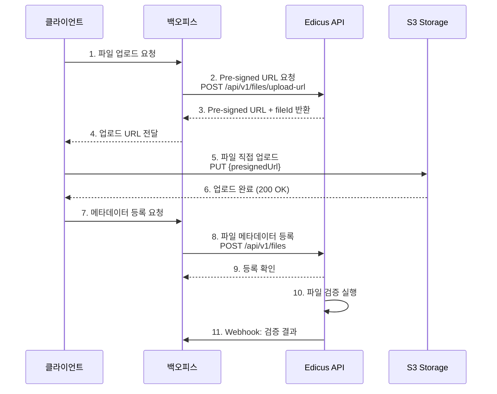
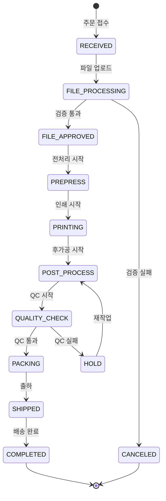
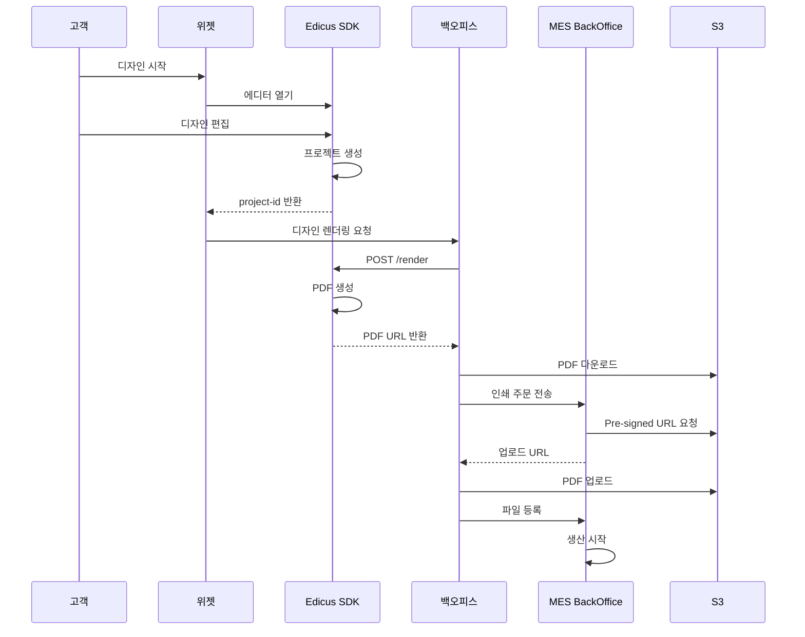

# 파일/디자인 주문

고객이 디자인 파일을 업로드하고 Edicus를 통해 인쇄 주문이 처리되는 전체 흐름입니다.

## 개요

파일/디자인 주문은 다음 단계로 구성됩니다:

1. **디자인 생성**: Edicus 에디터에서 디자인 생성
2. **파일 전송**: S3 Pre-signed URL로 업로드
3. **파일 검증**: PDF 유효성, 해상도 확인
4. **인쇄 주문**: Edicus에 인쇄 작업 전송
5. **생산 추적**: 12단계 생산 상태 추적
6. **품질 검사**: QC 수행 및 결과 전송
7. **완료**: 최종 산물 출하

## 인쇄 주문 요청 스키마

```json
{
  "orderReference": "ORD-2025-001234",
  "priority": "NORMAL",
  "dueDate": "2025-12-30",
  "customer": {
    "code": "CUST-001",
    "name": "고객사명",
    "contact": "010-1234-5678"
  },
  "items": [
    {
      "itemReference": "ORD-2025-001234-01",
      "productCode": "NAMECARD-001",
      "productName": "명함 (양면 컬러)",
      "quantity": 1000,
      "specification": {
        "paperType": "아트지",
        "paperWeight": 350,
        "size": {
          "width": 90,
          "height": 50,
          "unit": "mm"
        },
        "printSide": "BOTH",
        "colorMode": {
          "front": "CMYK",
          "back": "CMYK"
        },
        "coating": "GLOSSY",
        "finishing": ["ROUND_CORNER"]
      },
      "files": [
        {
          "fileId": "FILE-001",
          "type": "FRONT",
          "url": "https://storage.example.com/files/front.pdf"
        },
        {
          "fileId": "FILE-002",
          "type": "BACK",
          "url": "https://storage.example.com/files/back.pdf"
        }
      ]
    }
  ],
  "delivery": {
    "method": "COURIER",
    "recipientName": "수령인",
    "phone": "010-9876-5432",
    "address": "서울시 강남구 테헤란로 123",
    "zipCode": "06234",
    "memo": "부재시 경비실"
  }
}
```

## 파일 전송 프로세스

Edicus는 S3 Pre-signed URL 방식으로 파일을 수신합니다.



### 파일 업로드 URL 요청

```typescript
async function requestUploadUrl(fileName: string, fileSize: number) {
  const response = await fetch('/api/edicus/upload-url', {
    method: 'POST',
    headers: { 'Content-Type': 'application/json' },
    body: JSON.stringify({ fileName, fileSize })
  })

  const { uploadUrl, fileId } = await response.json()
  return { uploadUrl, fileId }
}
```

### 파일 직접 업로드

```typescript
async function uploadFile(file: File, uploadUrl: string) {
  const response = await fetch(uploadUrl, {
    method: 'PUT',
    body: file,
    headers: {
      'Content-Type': file.type
    }
  })

  if (!response.ok) {
    throw new Error('파일 업로드 실패')
  }

  return response.ok
}
```

## 생산 상태 추적

### 생산 상태 코드

| Edicus 상태 | 백오피스 매핑 | 설명 |
|-------------|---------------|------|
| `RECEIVED` | `PRCS_STAT_10` | 접수완료 |
| `FILE_PROCESSING` | `PRCS_STAT_15` | 파일 처리중 |
| `FILE_APPROVED` | `PRCS_STAT_20` | 파일 승인 |
| `PREPRESS` | `PRCS_STAT_30` | 전처리 |
| `PRINTING` | `PRCS_STAT_40` | 인쇄중 |
| `POST_PROCESS` | `PRCS_STAT_50` | 후가공 |
| `QUALITY_CHECK` | `PRCS_STAT_55` | 품질검사 |
| `PACKING` | `PRCS_STAT_60` | 포장 |
| `SHIPPED` | `PRCS_STAT_70` | 출하완료 |
| `COMPLETED` | `PRCS_STAT_90` | 완료 |
| `HOLD` | `PRCS_STAT_95` | 보류 |
| `CANCELED` | `PRCS_STAT_99` | 취소 |

### 상태 추적 API

```typescript
// 현재 상태 조회
async function getProductionStatus(orderId: string) {
  const response = await fetch(`/api/edicus/production/${orderId}/status`)
  const { status, updatedAt } = await response.json()
  return { status, updatedAt }
}

// 상태 이력 조회
async function getProductionHistory(orderId: string) {
  const response = await fetch(`/api/edicus/production/${orderId}/history`)
  const history = await response.json()
  return history
}
```

### 상태 변경 다이어그램



## Webhook 이벤트

### 파일 관련 이벤트

| 이벤트 | 설명 | 데이터 |
|--------|------|--------|
| `file.processed` | 파일 처리 완료 | fileId, status |
| `file.rejected` | 파일 거부 | fileId, reason |

### 생산 관련 이벤트

| 이벤트 | 설명 | 데이터 |
|--------|------|--------|
| `order.status.changed` | 주문 상태 변경 | orderId, newStatus |
| `quality.checked` | 품질 검사 완료 | orderId, qcResult |
| `production.completed` | 생산 완료 | orderId, completionData |
| `shipment.created` | 출하 정보 생성 | orderId, shipmentInfo |

### Webhook 처리

```typescript
app.post('/api/v1/webhooks/edicus', (req, res) => {
  const { event, data } = req.body
  const signature = req.headers['x-edicus-signature']

  // 서명 검증
  if (!verifySignature(event, data, signature)) {
    return res.status(401).json({ error: 'Invalid signature' })
  }

  // 이벤트 처리
  switch (event) {
    case 'file.processed':
      handleFileProcessed(data)
      break
    case 'file.rejected':
      handleFileRejected(data)
      break
    case 'order.status.changed':
      handleStatusChanged(data)
      break
    case 'quality.checked':
      handleQualityChecked(data)
      break
  }

  res.json({ received: true })
})
```

## 품질 검사

### QC 결과 조회

```typescript
interface QCResult {
  orderId: string
  passed: boolean
  score: number
  issues: QCIssue[]
  inspector: string
  checkedAt: string
}

interface QCIssue {
  type: 'color' | 'resolution' | 'bleed' | 'font'
  severity: 'low' | 'medium' | 'high'
  description: string
  location?: string
}

async function getQCResult(orderId: string): Promise<QCResult> {
  const response = await fetch(`/api/edicus/production/${orderId}/quality`)
  return response.json()
}
```

### QC 통과/실패 처리

```typescript
async function handleQCResult(orderId: string) {
  const qc = await getQCResult(orderId)

  if (qc.passed) {
    // QC 통과: 다음 단계 진행
    await updateOrderStatus(orderId, 'PACKING')
    notifyCustomer(orderId, '품질 검사 통과, 포장 진행 중')
  } else {
    // QC 실패: 보류 및 재작업 결정
    await updateOrderStatus(orderId, 'HOLD')
    notifyCustomer(orderId, '품질 검사 실패', qc.issues)

    // 재작업 여부 결정
    if (await shouldRework(qc.issues)) {
      await requestRework(orderId)
    } else {
      await requestCancel(orderId)
    }
  }
}
```

## Edicus 디자인 통합

### 디자인에서 생산까지



### 디자인 파일 처리

```typescript
async function processDesignFile(projectId: string): Promise<string> {
  // 1. Edicus에서 PDF 렌더링
  const renderResponse = await fetch('/api/edicus/render', {
    method: 'POST',
    headers: { 'Content-Type': 'application/json' },
    body: JSON.stringify({
      projectId,
      format: 'PDF',
      quality: 'print'
    })
  })

  const { downloadUrl } = await renderResponse.json()

  // 2. 파일 다운로드
  const pdfResponse = await fetch(downloadUrl)
  const pdfBlob = await pdfResponse.blob()
  const pdfFile = new File([pdfBlob], 'design.pdf', { type: 'application/pdf' })

  // 3. MES에 파일 업로드
  const { fileId } = await uploadToMES(pdfFile)

  return fileId
}
```

## 오류 처리

### 파일 관련 오류 코드

| 코드 | 설명 | 해결 방법 |
|------|------|-----------|
| `ERR_FILE_001` | 파일 형식 오류 | PDF로 재변환 |
| `ERR_FILE_002` | 해상도 부족 | 고해상도 파일 재업로드 |
| `ERR_FILE_003` | 용량 초과 | 파일 압축 또는 분할 |
| `ERR_FILE_004` | 페이지 수 초과 | 페이지 분할 |
| `ERR_FILE_005` | 색상 프로필 오류 | CMYK로 변환 |

### 주문 관련 오류 코드

| 코드 | 설명 | 해결 방법 |
|------|------|-----------|
| `ERR_ORDER_001` | 필수 필드 누락 | 모든 필수 정보 입력 |
| `ERR_ORDER_002` | 중복 주문 | 주문번호 확인 |
| `ERR_ORDER_003` | 재고 부족 | 다른 날짜 또는 수량 조정 |
| `ERR_ORDER_004` | 납기 불가 | 납기일 조정 |

## 관련 문서

- [MES 연동](./mes) - MES BackOffice 연동
- [Edicus 연동](./edicus) - Edicus SDK 연동
- [주문 라이프사이클](./order-lifecycle) - 전체 주문 흐름
