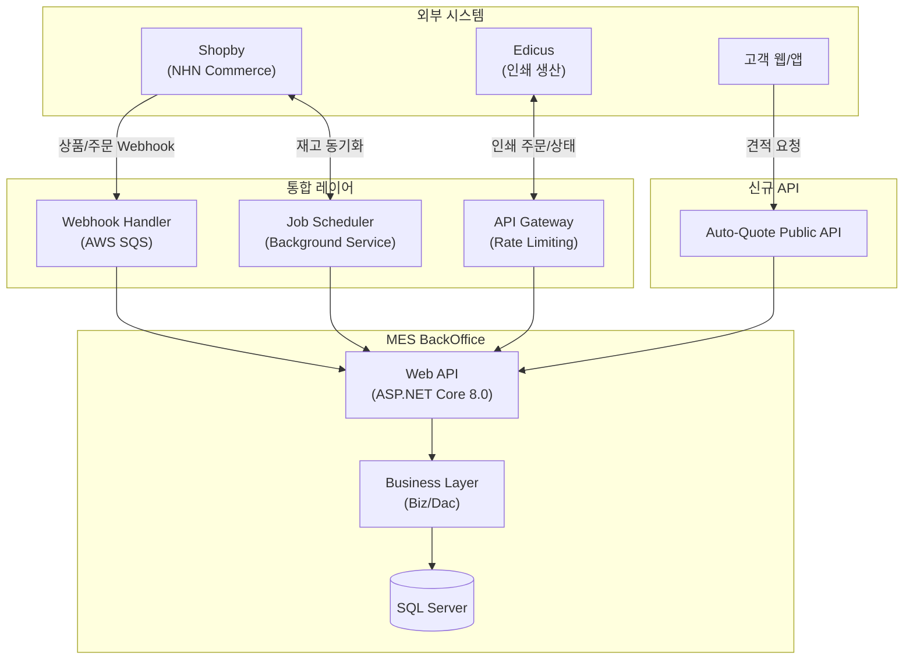
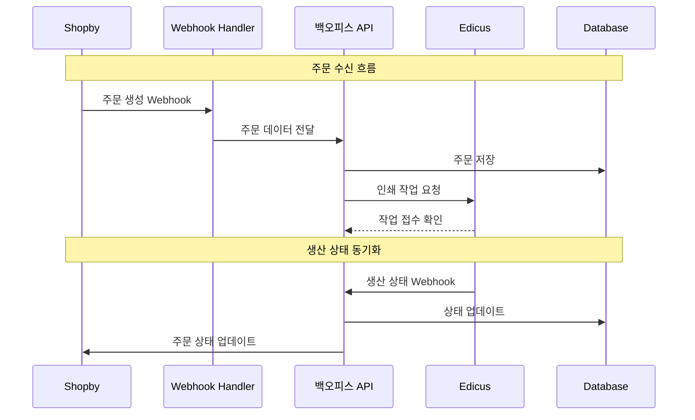
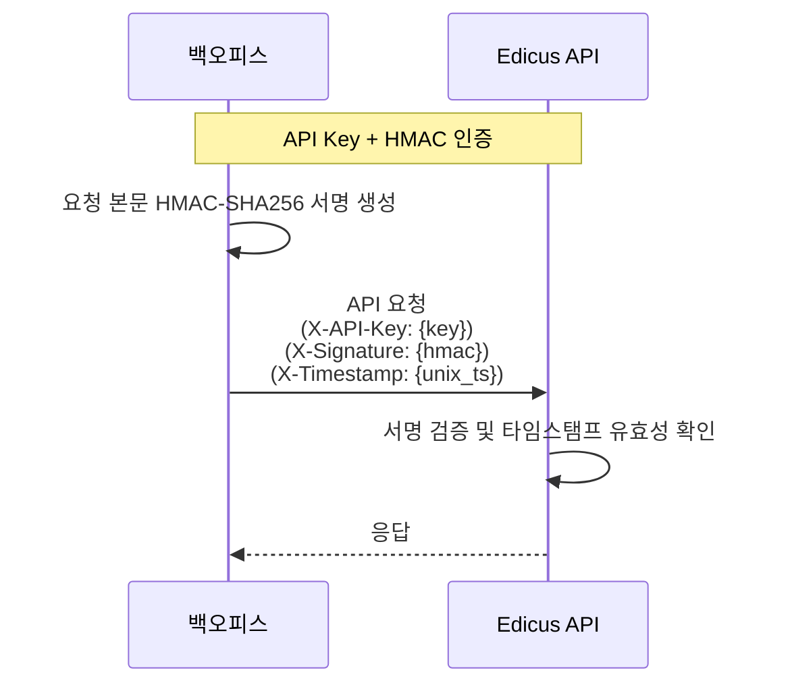
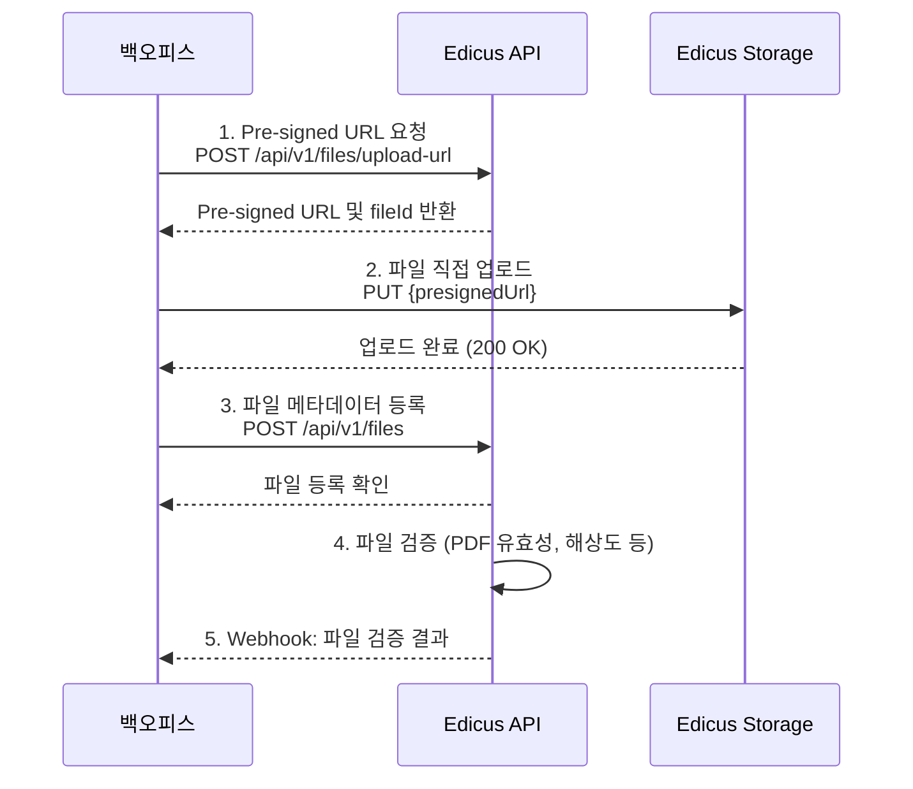

# MES 연동

MES BackOffice(TS.BackOffice.Huni)는 인쇄 주문 관리 시스템으로, huni.builder와의 연동을 위한 가이드입니다.

## 개요

MES BackOffice는 ASP.NET Core 8.0 기반의 백오피스 시스템으로 다음과 같은 특징을 가집니다:

- **90+ 엔드포인트**: Shopby, Edicus, Auto-Quote API 연동
- **Circuit Breaker**: Polly 기반 장애 격리
- **Error Code System**: 5개 범위(1000-5999) 체계적 오류 관리
- **Webhook**: AWS SQS 기반 비동기 이벤트 처리

## 시스템 아키텍처



## 데이터 흐름



## Edicus B2B API 연동

### 인증 방식

Edicus B2B API는 API Key + HMAC-SHA256 서명을 사용합니다.



### 인증 헤더 구조

| 헤더 | 설명 | 예시 |
|------|------|------|
| `X-API-Key` | 발급받은 API 키 | `edicus_api_key_xxxx` |
| `X-Signature` | HMAC-SHA256 서명 | `base64_encoded_signature` |
| `X-Timestamp` | Unix 타임스탬프 (초) | `1703318400` |
| `Content-Type` | 요청 형식 | `application/json` |

### 서명 생성 예시

```typescript
import { createHmac } from 'crypto'

function generateSignature(
  method: string,
  path: string,
  body: string,
  timestamp: number,
  secretKey: string
): string {
  const payload = `${method}\n${path}\n${body}\n${timestamp}`
  const hmac = createHmac('sha256', secretKey)
  hmac.update(payload)
  return hmac.digest('base64')
}

// 사용 예시
const signature = generateSignature(
  'POST',
  '/api/v1/print-orders',
  JSON.stringify(orderData),
  Math.floor(Date.now() / 1000),
  process.env.EDICUS_SECRET_KEY
)
```

## API 엔드포인트

### 인쇄 주문 API

| 메서드 | 경로 | 설명 |
|--------|------|------|
| POST | `/api/v1/print-orders` | 인쇄 작업 주문 |
| GET | `/api/v1/print-orders/{orderId}` | 주문 상태 조회 |
| POST | `/api/v1/print-orders/{orderId}/cancel` | 주문 취소 요청 |
| GET | `/api/v1/print-orders` | 주문 목록 조회 |

### 파일 전송 API

| 메서드 | 경로 | 설명 |
|--------|------|------|
| POST | `/api/v1/files/upload-url` | Pre-signed URL 발급 |
| POST | `/api/v1/files` | 파일 메타데이터 등록 |
| GET | `/api/v1/files/{fileId}` | 파일 처리 상태 조회 |

### 생산 상태 API

| 메서드 | 경로 | 설명 |
|--------|------|------|
| GET | `/api/v1/production/{orderId}/status` | 현재 생산 상태 |
| GET | `/api/v1/production/{orderId}/history` | 상태 변경 이력 |
| GET | `/api/v1/production/{orderId}/quality` | QC 결과 조회 |

## 인쇄 주문 요청 스키마

```json
{
  "orderReference": "ORD-2025-001234",
  "priority": "NORMAL",
  "dueDate": "2025-12-30",
  "customer": {
    "code": "CUST-001",
    "name": "고객사명",
    "contact": "010-1234-5678"
  },
  "items": [
    {
      "itemReference": "ORD-2025-001234-01",
      "productCode": "NAMECARD-001",
      "productName": "명함 (양면 컬러)",
      "quantity": 1000,
      "specification": {
        "paperType": "아트지",
        "paperWeight": 350,
        "size": {
          "width": 90,
          "height": 50,
          "unit": "mm"
        },
        "printSide": "BOTH",
        "colorMode": {
          "front": "CMYK",
          "back": "CMYK"
        },
        "coating": "GLOSSY",
        "finishing": ["ROUND_CORNER"]
      },
      "files": [
        {
          "fileId": "FILE-001",
          "type": "FRONT",
          "url": "https://storage.example.com/files/front.pdf"
        }
      ]
    }
  ],
  "delivery": {
    "method": "COURIER",
    "recipientName": "수령인",
    "phone": "010-9876-5432",
    "address": "서울시 강남구 테헤란로 123",
    "zipCode": "06234",
    "memo": "부재시 경비실"
  }
}
```

## 생산 상태 코드

| Edicus 상태 | 백오피스 매핑 | 설명 |
|-------------|---------------|------|
| `RECEIVED` | `PRCS_STAT_10` | 접수완료 |
| `FILE_PROCESSING` | `PRCS_STAT_15` | 파일 처리중 |
| `FILE_APPROVED` | `PRCS_STAT_20` | 파일 승인 |
| `PREPRESS` | `PRCS_STAT_30` | 전처리 |
| `PRINTING` | `PRCS_STAT_40` | 인쇄중 |
| `POST_PROCESS` | `PRCS_STAT_50` | 후가공 |
| `QUALITY_CHECK` | `PRCS_STAT_55` | 품질검사 |
| `PACKING` | `PRCS_STAT_60` | 포장 |
| `SHIPPED` | `PRCS_STAT_70` | 출하완료 |
| `COMPLETED` | `PRCS_STAT_90` | 완료 |
| `HOLD` | `PRCS_STAT_95` | 보류 |
| `CANCELED` | `PRCS_STAT_99` | 취소 |

## 파일 전송 프로세스

Edicus는 Pre-signed URL 방식으로 파일을 수신합니다.



## Webhook 처리

### Edicus Webhook 이벤트

| 이벤트 | 설명 |
|--------|------|
| `order.status.changed` | 주문 상태 변경 |
| `file.processed` | 파일 처리 완료 |
| `file.rejected` | 파일 거부 (오류) |
| `quality.checked` | 품질 검사 완료 |
| `production.completed` | 생산 완료 |
| `shipment.created` | 출하 정보 생성 |

### Webhook 엔드포인트

```
POST /api/v1/webhooks/edicus
Content-Type: application/json
X-Edicus-Signature: {signature}
X-Edicus-Event: {event_type}
```

## 오류 처리

### API 오류 코드

| 코드 | 설명 | 처리 방법 |
|------|------|-----------|
| `ERR_AUTH_001` | 인증 실패 | API 키 확인 |
| `ERR_AUTH_002` | 서명 불일치 | 서명 로직 확인 |
| `ERR_AUTH_003` | 타임스탬프 만료 | 시간 동기화 |
| `ERR_FILE_001` | 파일 형식 오류 | PDF 재생성 |
| `ERR_FILE_002` | 해상도 부족 | 파일 재검토 |
| `ERR_ORDER_001` | 필수 필드 누락 | 요청 데이터 확인 |
| `ERR_ORDER_002` | 중복 주문 | 주문번호 확인 |

## Circuit Breaker & 재시도

### Circuit Breaker 설정

| 시스템 | 실패 임계값 | 지속 시간 | 재시도 정책 |
|--------|-------------|-----------|------------|
| Shopby | 5회 / 30초 | 60초 | 지수 백오프 (1s, 2s, 4s) |
| Edicus | 3회 / 60초 | 90초 | 지수 백오프 (1s, 2s, 4s) |
| Auto-Quote | 5회 / 30초 | 60초 | 지수 백오프 (1s, 2s, 4s) |

### 재시도 정책

```
초기 대기: 1초
최대 재시도: 3회
백오프 계수: 2
최대 대기: 30초
```

## Error Code System

MES는 5개 범위의 오류 코드를 사용합니다:

| 범위 | 카테고리 | 예시 |
|------|----------|------|
| 1000-1999 | 인증 오류 | `ERR_AUTH_001`, `ERR_AUTH_002` |
| 2000-2999 | 검증 오류 | `ERR_VAL_001`, `ERR_VAL_002` |
| 3000-3999 | 비즈니스 로직 | `ERR_BIZ_001`, `ERR_BIZ_002` |
| 4000-4999 | 외부 시스템 | `ERR_EXT_001`, `ERR_EXT_002` |
| 5000-5999 | 내부 오류 | `ERR_INT_001`, `ERR_INT_002` |

## 관련 문서

- [Shopby 연동](./shopby) - Shopby 연동 가이드
- [Edicus 연동](./edicus) - Edicus SDK 연동
- [주문 라이프사이클](./order-lifecycle) - 주문 처리 흐름
