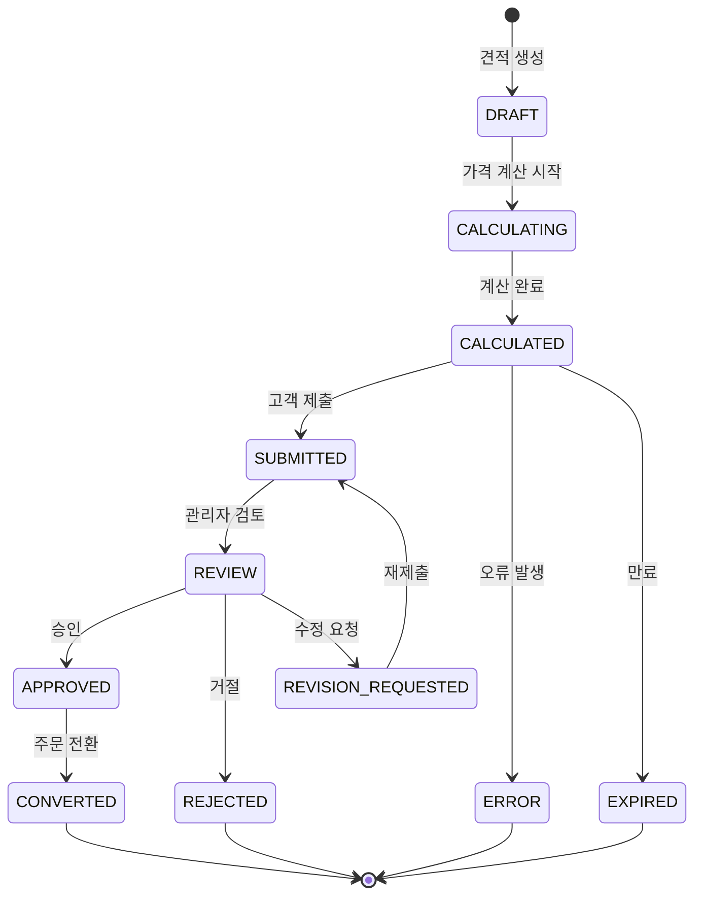
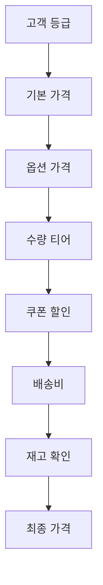
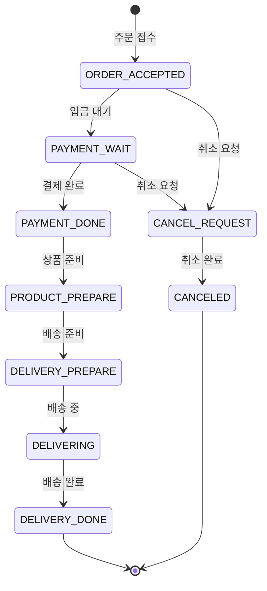
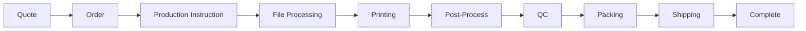

# 주문 라이프사이클

고객이 견적을 요청하고 생산이 완료될 때까지의 전체 주문 처리 흐름입니다.

## 개요

주문 라이프사이클은 다음 단계로 구성됩니다:

1. **견적 요청**: 고객이 가격 견적 요청
2. **가격 계산**: 자동 가격 계산 엔진
3. **견적 승인**: 관리자 검토 및 승인
4. **주문 전환**: 견적을 실제 주문으로 변환
5. **생산 지시**: Edicus에 인쇄 작업 전송
6. **생산 진행**: 파일 처리, 인쇄, 후가공
7. **품질 검사**: QC 수행
8. **출하**: 배송 처리
9. **완료**: 주문 완료

## Quote 상태 머신



## Auto-Quote API

### API 엔드포인트

#### Quote API (6개)

| 메서드 | 경로 | 설명 | 인증 |
|--------|------|------|------|
| POST | `/api/v1/quotes` | 견적 요청 생성 | API Key |
| GET | `/api/v1/quotes/{quoteId}` | 견적 상세 조회 | API Key |
| PUT | `/api/v1/quotes/{quoteId}` | 견적 수정 | API Key |
| POST | `/api/v1/quotes/{quoteId}/calculate` | 가격 재계산 | API Key |
| POST | `/api/v1/quotes/{quoteId}/submit` | 견적 제출 | API Key |
| POST | `/api/v1/quotes/{quoteId}/cancel` | 견적 취소 | API Key |

#### Product Catalog API (5개)

| 메서드 | 경로 | 설명 | 인증 |
|--------|------|------|------|
| GET | `/api/v1/products/categories` | 카테고리 목록 | Public |
| GET | `/api/v1/products` | 상품 목록 | Public |
| GET | `/api/v1/products/{productCode}` | 상품 상세 | Public |
| GET | `/api/v1/products/{productCode}/options` | 상품 옵션 | Public |
| GET | `/api/v1/products/{productCode}/pricing` | 가격 정보 | API Key |

#### Price Calculation API (2개)

| 메서드 | 경로 | 설명 | 인증 |
|--------|------|------|------|
| POST | `/api/v1/pricing/calculate` | 가격 계산 | API Key |
| POST | `/api/v1/pricing/calculate-bulk` | 대량 가격 계산 | API Key |

#### Availability API (2개)

| 메서드 | 경로 | 설명 | 인증 |
|--------|------|------|------|
| GET | `/api/v1/availability/stock` | 재고 확인 | Public |
| GET | `/api/v1/availability/delivery` | 납기 확인 | Public |

#### Admin Quote API (4개)

| 메서드 | 경로 | 설명 | 인증 |
|--------|------|------|------|
| GET | `/api/v1/admin/quotes` | 견적 목록 | Admin |
| POST | `/api/v1/admin/quotes/{quoteId}/approve` | 견적 승인 | Admin |
| POST | `/api/v1/admin/quotes/{quoteId}/reject` | 견적 거절 | Admin |
| POST | `/api/v1/admin/quotes/{quoteId}/convert` | 주문 전환 | Admin |

## 가격 계산 엔진

### 비즈니스 로직



### 가격 계산 요청

```json
{
  "customerInfo": {
    "grade": "regular",
    "code": "CUST-001"
  },
  "items": [
    {
      "productCode": "postcard-001",
      "quantity": 1000,
      "options": {
        "paper": "아트지",
        "size": "A4",
        "printMethod": "양면 컬러",
        "coating": "코팅"
      }
    }
  ],
  "deliveryInfo": {
    "method": "택배",
    "zipCode": "06234"
  }
}
```

### 가격 계산 응답

```json
{
  "quoteId": "QUOTE-2025-001234",
  "status": "CALCULATED",
  "pricing": {
    "subtotal": 100000,
    "discount": 0,
    "deliveryFee": 3000,
    "tax": 10000,
    "total": 113000
  },
  "quantityTiers": [
    { "minQty": 100, "unitPrice": 120, "total": 12000 },
    { "minQty": 500, "unitPrice": 110, "total": 55000 },
    { "minQty": 1000, "unitPrice": 100, "total": 100000 }
  ],
  "deliveryEstimate": "2025-12-25"
}
```

## 주문 상태 흐름

### Shopby 주문 상태



### 상태 코드 매핑

| Shopby 상태 | 코드 | 설명 |
|-------------|------|------|
| `ORDER_ACCEPTED` | 10 | 주문접수 |
| `PAYMENT_WAIT` | 15 | 입금대기 |
| `PAYMENT_DONE` | 20 | 결제완료 |
| `PRODUCT_PREPARE` | 30 | 상품준비 |
| `DELIVERY_PREPARE` | 40 | 배송준비 |
| `DELIVERING` | 50 | 배송중 |
| `DELIVERY_DONE` | 60 | 배송완료 |
| `CANCEL_REQUEST` | 90 | 취소요청 |
| `CANCELED` | 99 | 취소완료 |

## 생산 파이프라인



### Edicus 생산 상태 매핑

| Edicus 상태 | 백오피스 코드 | 설명 |
|-------------|---------------|------|
| `RECEIVED` | `PRCS_STAT_10` | 접수완료 |
| `FILE_PROCESSING` | `PRCS_STAT_15` | 파일 처리중 |
| `FILE_APPROVED` | `PRCS_STAT_20` | 파일 승인 |
| `PREPRESS` | `PRCS_STAT_30` | 전처리 |
| `PRINTING` | `PRCS_STAT_40` | 인쇄중 |
| `POST_PROCESS` | `PRCS_STAT_50` | 후가공 |
| `QUALITY_CHECK` | `PRCS_STAT_55` | 품질검사 |
| `PACKING` | `PRCS_STAT_60` | 포장 |
| `SHIPPED` | `PRCS_STAT_70` | 출하완료 |
| `COMPLETED` | `PRCS_STAT_90` | 완료 |

## Error Code System

### Error Code 범위

| 범위 | 카테고리 | 설명 |
|------|----------|------|
| 1000-1999 | 인증 오류 | API Key, JWT, 서명 검증 실패 |
| 2000-2999 | 검증 오류 | 요청 데이터 검증 실패 |
| 3000-3999 | 비즈니스 로직 | 재고 부족, 주문 불가 등 |
| 4000-4999 | 외부 시스템 | Shopby, Edicus 연동 오류 |
| 5000-5999 | 내부 오류 | 서버 내부 오류 |

### 표준 에러 응답

```json
{
  "success": false,
  "data": null,
  "error": {
    "code": "ERR_VAL_001",
    "message": "검증 오류",
    "details": [
      {
        "field": "quantity",
        "message": "수량은 100 이상이어야 합니다"
      }
    ]
  },
  "meta": {
    "timestamp": "2025-12-19T10:00:00Z"
  }
}
```

## 관련 문서

- [MES 연동](./mes) - MES BackOffice 연동
- [Edicus 연동](./edicus) - Edicus 디자인 에디터 연동
- [파일/디자인 주문](./file-design-ordering) - 파일 전송 및 디자인
