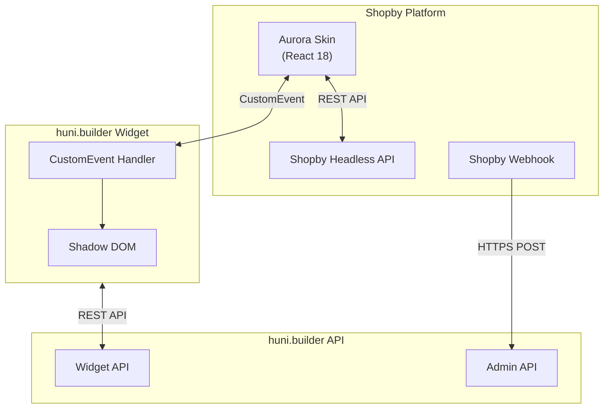
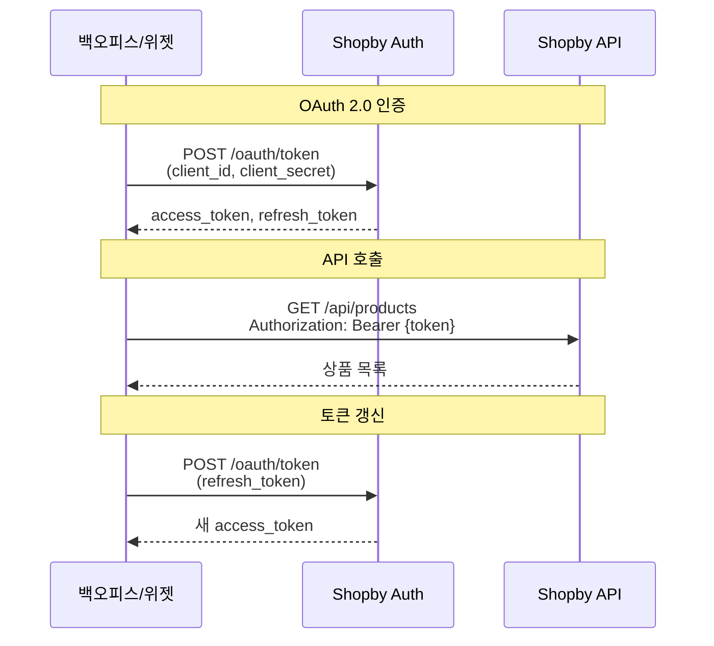

# Shopby 연동

Shopby는 NHN Commerce에서 제공하는 이커머스 플랫폼으로, huni.builder 위젯과 Shopby 스킨(Aurora) 간의 통합을 위한 가이드입니다.

## 개요

Shopby 연동은 다음과 같은 통신 방식을 사용합니다:

- **CustomEvent 프로토콜**: 위젯과 호스트(Shopby 스킨) 간 양방향 통신
- **Headless API**: REST API를 통한 상품/주문/재고 동기화
- **Webhook**: Shopby에서 발생한 이벤트 수신

## 시스템 아키텍처



## 인증 흐름

Shopby OAuth 2.0 인증을 사용합니다.



### 인증 헤더

```
Authorization: Bearer {access_token}
Content-Type: application/json
```

## CustomEvent 프로토콜

위젯과 Shopby 스킨 간의 통신은 CustomEvent를 사용합니다.

### 위젯 → 호스트 이벤트

| 이벤트 이름 | 설명 | 타입 |
|-------------|------|------|
| `huni:cart-add` | 장바구니 추가 요청 | CartAddEvent |
| `huni:price-update` | 가격 변경 알림 | PriceUpdateEvent |
| `huni:editor-open` | 에디터 실행 요청 | EditorOpenEvent |

### 호스트 → 위젯 이벤트

| 이벤트 이름 | 설명 | 타입 |
|-------------|------|------|
| `shopby:cart-updated` | 장바구니 갱신 알림 | CartUpdatedEvent |
| `shopby:product-loaded` | 상품 정보 로드 완료 | ProductLoadedEvent |
| `shopby:auth-changed` | 인증 상태 변경 | AuthChangedEvent |

### CartAddEvent

```typescript
interface CartAddEvent {
  productId: string
  quantity: number
  options: {
    paper: string
    size: string
    printMethod: string
    postProcessing?: string[]
    designFileUrl?: string
  }
  price: number
}
```

### 이벤트 발송 예시

```typescript
// 위젯에서 장바구니 추가 요청
const event = new CustomEvent('huni:cart-add', {
  detail: {
    productId: 'postcard-001',
    quantity: 100,
    options: {
      paper: '아트지',
      size: 'A4',
      printMethod: '양면 컬러',
      postProcessing: ['코팅']
    },
    price: 10000
  }
})
window.dispatchEvent(event)
```

### 이벤트 수신 예시

```typescript
// 호스트에서 장바구니 업데이트 수신
window.addEventListener('shopby:cart-updated', (event) => {
  const { cartCount, success, cartItemId, errorMessage } = event.detail

  if (success) {
    console.log(`장바구니 추가 완료: ${cartItemId}`)
    updateCartCount(cartCount)
  } else {
    console.error(`장바구니 추가 실패: ${errorMessage}`)
  }
})
```

## API 엔드포인트

### 상품 동기화 API

| 메서드 | 경로 | 설명 |
|--------|------|------|
| GET | `/api/products` | 상품 목록 조회 |
| GET | `/api/products/{productNo}` | 상품 상세 조회 |
| POST | `/api/products` | 상품 등록 |
| PUT | `/api/products/{productNo}` | 상품 수정 |
| DELETE | `/api/products/{productNo}` | 상품 삭제 |
| GET | `/api/products/{productNo}/options` | 상품 옵션 조회 |

### 주문 수신 API

| 메서드 | 경로 | 설명 |
|--------|------|------|
| GET | `/api/orders` | 주문 목록 조회 |
| GET | `/api/orders/{orderNo}` | 주문 상세 조회 |
| PUT | `/api/orders/{orderNo}/status` | 주문 상태 변경 |
| POST | `/api/orders/{orderNo}/delivery` | 배송 정보 등록 |

### 재고 연동 API

| 메서드 | 경로 | 설명 |
|--------|------|------|
| GET | `/api/stocks` | 재고 현황 조회 |
| PUT | `/api/stocks/{stockNo}` | 재고 수량 변경 |
| POST | `/api/stocks/batch` | 다건 재고 일괄 수정 |

## 데이터 매핑

### 상품 데이터 매핑

| Shopby 필드 | 백오피스 필드 | 변환 규칙 |
|-------------|---------------|-----------|
| `productNo` | `ITEM_CD` | 문자열 변환 (prefix: "SB-") |
| `productName` | `ITEM_NM` | 직접 매핑 |
| `salePrice` | `UNIT_PRICE` | decimal 변환 |
| `stockQuantity` | `QTY` | int 변환 |
| `categoryNo` | `ITEM_GROUP_CD` | 카테고리 매핑 테이블 참조 |
| `brandName` | `BRAND_NM` | 직접 매핑 |
| `optionUsed` | `OPTION_YN` | boolean to "Y"/"N" |
| `options[].optionNo` | `OPTION_CD` | 문자열 변환 |
| `options[].optionName` | `OPTION_NM` | 직접 매핑 |
| `options[].optionPrice` | `OPTION_PRICE` | decimal 변환 |

### 주문 데이터 매핑

| Shopby 필드 | 백오피스 필드 | 변환 규칙 |
|-------------|---------------|-----------|
| `orderNo` | `USR_ORD_CD` | 문자열 직접 매핑 |
| `orderedAt` | `ORD_YMD` | DateTime to "yyyy-MM-dd" |
| `ordererName` | `CUST_NM` | 직접 매핑 |
| `ordererPhone` | `CUST_TEL` | 하이픈 제거 |
| `ordererEmail` | `CUST_EMAIL` | 직접 매핑 |
| `receiverName` | `DLVR_NM` | 직접 매핑 |
| `receiverPhone` | `DLVR_TEL` | 하이픈 제거 |
| `receiverAddress` | `DLVR_ADDR` | 주소 조합 |
| `receiverZipCode` | `DLVR_ZIP` | 직접 매핑 |
| `orderStatus` | `ORD_STAT_CD` | 상태 코드 매핑 |
| `totalPrice` | `TOT_AMT` | decimal 변환 |
| `paymentType` | `PAY_WAY_TYP` | 결제 유형 매핑 |

### 주문 상태 코드 매핑

| Shopby 상태 | 백오피스 상태코드 | 설명 |
|-------------|------------------|------|
| `ORDER_ACCEPTED` | `10` | 주문접수 |
| `PAYMENT_WAIT` | `15` | 입금대기 |
| `PAYMENT_DONE` | `20` | 결제완료 |
| `PRODUCT_PREPARE` | `30` | 상품준비 |
| `DELIVERY_PREPARE` | `40` | 배송준비 |
| `DELIVERING` | `50` | 배송중 |
| `DELIVERY_DONE` | `60` | 배송완료 |
| `CANCEL_REQUEST` | `90` | 취소요청 |
| `CANCELED` | `99` | 취소완료 |

## Webhook 처리

### Webhook 이벤트 유형

| 이벤트 | 설명 | 처리 우선순위 |
|--------|------|---------------|
| `order.created` | 신규 주문 생성 | 높음 |
| `order.status.changed` | 주문 상태 변경 | 높음 |
| `order.canceled` | 주문 취소 | 높음 |
| `product.created` | 상품 등록 | 중간 |
| `product.updated` | 상품 수정 | 중간 |
| `product.deleted` | 상품 삭제 | 중간 |
| `stock.changed` | 재고 변경 | 중간 |

### Webhook 수신 엔드포인트

```
POST /api/v1/webhooks/shopby
Content-Type: application/json
X-Shopby-Signature: {HMAC-SHA256 서명}
```

### Webhook 검증 로직

```typescript
import { createHmac } from 'crypto'

function verifyWebhookSignature(
  payload: string,
  signature: string,
  secretKey: string
): boolean {
  const hmac = createHmac('sha256', secretKey)
  hmac.update(payload)
  const expectedSignature = hmac.digest('base64')
  return signature === expectedSignature
}
```

## 오류 처리 및 재시도

### HTTP 상태 코드별 처리

| 상태 코드 | 처리 방법 | 재시도 |
|-----------|-----------|--------|
| 200, 201 | 정상 처리 | - |
| 400 | 요청 데이터 검증 후 로깅 | 아니오 |
| 401, 403 | 토큰 갱신 후 재시도 | 예 (1회) |
| 404 | 리소스 없음 로깅 | 아니오 |
| 429 | Rate Limit 대기 후 재시도 | 예 (지수 백오프) |
| 500, 502, 503 | 재시도 후 알림 | 예 (최대 3회) |

### 재시도 전략

```
초기 대기: 1초
최대 재시도: 3회
백오프 계수: 2 (1초, 2초, 4초)
최대 대기: 30초
```

## Rate Limiting 처리

| API 유형 | 제한 | 처리 방법 |
|----------|------|-----------|
| 조회 API | 100 req/min | 요청 큐 관리 |
| 수정 API | 30 req/min | 배치 처리 |
| Webhook | 무제한 | SQS 버퍼링 |

## 위젯 임베딩

### Aurora Skin에 위젯 추가

```tsx
// Shopby Aurora Skin React 컴포넌트
import { useEffect, useRef } from 'react'

export function ProductPage() {
  const widgetRef = useRef<HTMLHuniWidgetElement>(null)

  useEffect(() => {
    // 위젯 로드
    const script = document.createElement('script')
    script.src = 'https://cdn.huni.builder/widget.iife.js'
    script.async = true
    document.body.appendChild(script)

    // 이벤트 리스너 등록
    const handleCartAdd = (event: CustomEvent) => {
      const { productId, quantity, options, price } = event.detail
      // Shopby 장바구니 API 호출
      addToShopbyCart({ productId, quantity, options, price })
    }

    window.addEventListener('huni:cart-add', handleCartAdd as EventListener)

    return () => {
      window.removeEventListener('huni:cart-add', handleCartAdd as EventListener)
    }
  }, [])

  return (
    <div>
      <huni-widget
        ref={widgetRef}
        data-product-id="postcard-001"
        data-theme="light"
      />
    </div>
  )
}
```

## 관련 문서

- [MES 연동](./mes) - MES BackOffice 연동 가이드
- [Edicus 연동](./edicus) - Edicus 디자인 에디터 연동
- [Widget Events](../api-reference/widget-events) - CustomEvent 상세
