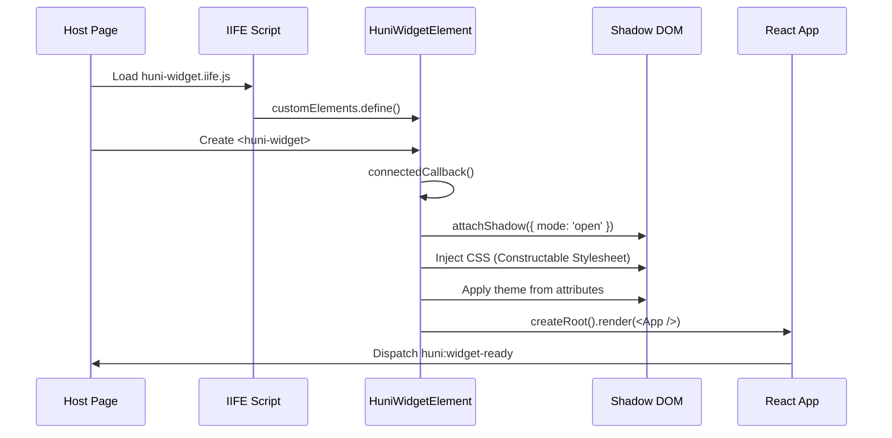

# 위젯 임베드 가이드

huni.builder 위젯을 웹사이트에 설치하고 초기화하는 방법을 설명합니다.

> **빠른 시작**: 30초 만에 위젯을 실행해보세요.

<Callout type="info">
**목표**: Script 태그 또는 ESM import로 위젯을 로드하고, `<huni-widget>` Custom Element를 사용하여 위젯을 표시합니다.
</Callout>

## 1. 빠른 시작 (Quick Start)

가장 간단한 형태의 위젯 임베드 예제입니다.

```html
<!DOCTYPE html>
<html lang="ko">
<head>
  <meta charset="UTF-8">
  <meta name="viewport" content="width=device-width, initial-scale=1.0">
  <title>huni.builder Widget Example</title>
</head>
<body>
  <!-- 1. 위젯 컨테이너: Custom Element -->
  <huni-widget
    data-product-id="001-0001"
    shopby-api-url="https://api.shopby.com"
    shopby-token="your-token-here">
  </huni-widget>

  <!-- 2. 위젯 IIFE 번들 로드 (48.71KB gzipped) -->
  <script src="https://cdn.huniprinting.com/widget/v1/huni-widget.iife.js"
          data-huni-widget-css
          async>
  </script>
</body>
</html>
```

**동작 순서**:
1. `<huni-widget>` 커스텀 엘리먼트가 DOM에 추가됨
2. Script 태그가 IIFE 번들을 로드
3. 번들이 Custom Element를 등록 (`customElements.define('huni-widget', HuniWidgetElement)`)
4. `connectedCallback()`이 실행되어 Shadow DOM 생성 및 React 마운트
5. 위젯이 렌더링됨

## 2. Script 태그 설치 (IIFE Bundle)

### 2.1 CDN URL

| 유형 | URL | 설명 |
|------|-----|------|
| Latest (최신) | `https://cdn.huniprinting.com/widget/latest/huni-widget.iife.js` | 항상 최신 버전 |
| Version Pinned (버전 고정) | `https://cdn.huniprinting.com/widget/v1/huni-widget.iife.js` | 특정 버전 (권장) |

<Callout type="warning">
**권장**: 프로덕션 환경에서는 버전 고정 URL (`v1/...`)을 사용하세요. 최신 버전 (latest)은 breaking change가 있을 수 있습니다.
</Callout>

### 2.2 로딩 옵션

```html
<!-- async: 비동기 로드 (권장) -->
<script src="https://cdn.huniprinting.com/widget/v1/huni-widget.iife.js"
        data-huni-widget-css
        async>
</script>

<!-- defer: DOM 파싱 후 로드 -->
<script src="https://cdn.huniprinting.com/widget/v1/huni-widget.iife.js"
        data-huni-widget-css
        defer>
</script>

<!-- 일반 로드: 렌더링 차단 -->
<script src="https://cdn.huniprinting.com/widget/v1/huni-widget.iife.js"
        data-huni-widget-css>
</script>
```

### 2.3 CSP (Content Security Policy) 설정

```http
Content-Security-Policy:
  default-src 'self';
  script-src 'self' https://cdn.huniprinting.com;
  style-src 'self' 'unsafe-inline';
  connect-src 'self' https://api.shopby.com;
  img-src 'self' https://cdn.huniprinting.com;
```

<Callout type="info">
**참고**: `data-huni-widget-css` 속성은 CSS를 Constructable Stylesheet로 주입합니다. `style-src 'unsafe-inline'`이 필요하지 않습니다.
</Callout>

## 3. 컨테이너 설정

### 3.1 HTML 속성 방식 (권장)

```html
<huni-widget
  data-product-id="001-0001"
  data-huni-code="POSTCARD_A4"
  data-shopby-client-id="your-client-id"
  data-template-code="default"
  shopby-api-url="https://api.shopby.com"
  shopby-token="your-token-here"
  theme="dark">
</huni-widget>
```

### 3.2 JavaScript API 방식

```javascript
// JavaScript로 초기화
const widget = document.querySelector('huni-widget');
widget.setAttribute('data-product-id', '001-0001');
widget.setAttribute('shopby-api-url', 'https://api.shopby.com');
widget.setAttribute('shopby-token', 'your-token-here');

// 또는 window.HuniWidget.initHuniWidget() 사용
window.HuniWidget.initHuniWidget({
  productId: '001-0001',
  huniCode: 'POSTCARD_A4',
  shopbyApiUrl: 'https://api.shopby.com',
  shopbyToken: 'your-token-here',
  theme: { primary: '#5538b6' }
});
```

### 3.3 다중 인스턴스

한 페이지에 여러 위젯을 표시할 수 있습니다.

```html
<huni-widget data-product-id="001-0001" id="widget-1"></huni-widget>
<huni-widget data-product-id="001-0002" id="widget-2"></huni-widget>

<script src="https://cdn.huniprinting.com/widget/v1/huni-widget.iife.js"
        data-huni-widget-css
        async>
</script>
```

## 4. 초기화 옵션 레퍼런스

### 4.1 HTML 속성

| 속성 | 타입 | 필수 | 기본값 | 설명 |
|------|------|------|--------|------|
| `data-product-id` | string | ✅ | - | 상품 ID (MES 코드 형식: XXX-XXXX) |
| `data-huni-code` | string | ❌ | - | Huni 상품 코드 |
| `data-shopby-client-id` | string | ❌ | - | Shopby 클라이언트 ID |
| `data-template-code` | string | ❌ | default | 템플릿 코드 |
| `shopby-api-url` | string | ❌ | - | Shopby API 기본 URL |
| `shopby-token` | string | ❌ | - | Shopby 인증 토큰 |
| `theme` | string | ❌ | light | 테마 (`light` 또는 `dark`) |

### 4.2 JavaScript API 옵션

```typescript
interface HuniWidgetConfig {
  // 필수 옵션
  productId?: string;
  huniCode?: string;

  // Shopby 통합
  shopbyApiUrl?: string;
  shopbyToken?: string;
  shopbyClientId?: string;

  // 테마
  theme?: {
    primary?: string;
    secondary?: string;
    background?: string;
    surface?: string;
    [key: string]: string | undefined;
  };

  // 기타
  templateCode?: string;
  locale?: 'ko' | 'en';
}
```

```javascript
window.HuniWidget.initHuniWidget({
  // 상품 식별
  productId: '001-0001',
  huniCode: 'POSTCARD_A4',

  // Shopby API
  shopbyApiUrl: 'https://api.shopby.com',
  shopbyToken: 'your-token-here',
  shopbyClientId: 'your-client-id',

  // 테마
  theme: {
    primary: '#5538b6',
    secondary: '#4b3f96',
    background: '#f5f6f8'
  },

  // 기타
  templateCode: 'default',
  locale: 'ko'
});
```

## 5. ESM Import 방식

npm으로 설치하여 사용할 수도 있습니다.

npm으로 설치할 수 있습니다:

```bash npm
npm install @huni/widget-core
```

```bash pnpm
pnpm add @huni/widget-core
```

```bash yarn
yarn add @huni/widget-core
```

```typescript
import { initHuniWidget } from '@huni/widget-core';

// ESM import 방식
initHuniWidget({
  targetSelector: '#widget-root',
  productId: '001-0001',
  shopbyApiUrl: 'https://api.shopby.com',
  shopbyToken: 'your-token-here'
});
```

<Callout type="info">
**IIFE vs ESM 선택 기준**:
- **IIFE**: CDN에서 바로 로드, 빌드 과정 없음
- **ESM**: npm으로 관리, 타입스크립트 지원, 번들러 통합
</Callout>

## 6. 위젯 로딩 시퀀스



## 7. 반응형 컨테이너

위젯은 자동으로 컨테이너 너비에 맞춰 조정됩니다.

```html
<!-- 고정 너비 -->
<div style="width: 465px; margin: 0 auto;">
  <huni-widget data-product-id="001-0001"></huni-widget>
</div>

<!-- 반응형 (최대 465px) -->
<div style="max-width: 100%; width: 465px; margin: 0 auto;">
  <huni-widget data-product-id="001-0001"></huni-widget>
</div>
```

## 8. 트러블슈팅

| 증상 | 원인 | 해결책 |
|------|------|--------|
| 위젯이 표시되지 않음 | Script 로드 실패 | CDN URL 확인, 네트워크 검사 |
| 스타일이 깨짐 | CSS 주입 실패 | `data-huni-widget-css` 속성 확인 |
| API 에러 | 토큰 만료 | `shopby-token` 갱신 |
| Custom Element not defined | Script 로드 순서 | `defer` 또는 `async` 사용 |

## 관련 문서

- [Shadow DOM CSS 격리](./shadow-dom) - CSS 격리 메커니즘 상세
- [이벤트 & 통신](./events) - 위젯 초기화 완료 이벤트
- [스타일 커스터마이징](./styling) - 테마 옵션 상세
