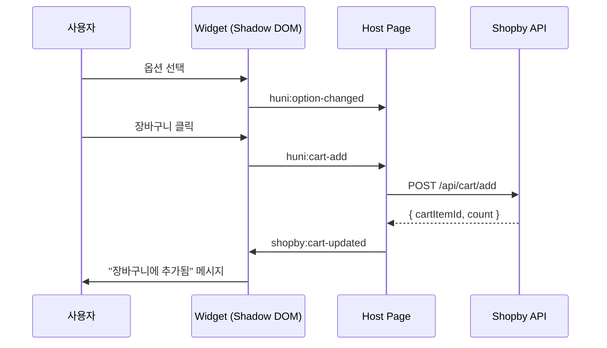

# 이벤트 & 통신

위젯과 호스트 페이지 간의 양방향 통신을 위한 CustomEvent 프로토콜을 설명합니다.

> **핵심**: 위젯은 CustomEvent를 통해 호스트 페이지와 통신하며, `composed: true`로 Shadow DOM 경계를 넘습니다.

<Callout type="info">
**통신 방향**: Widget → Host (이벤트 디스패치), Host → Widget (속성 변경 또는 이벤트 디스패치)
</Callout>

## 1. CustomEvent Protocol Reference

### 1.1 이벤트 목록

| 이벤트 이름 | 방향 | 설명 | `detail` 타입 |
|-------------|------|------|---------------|
| `huni:widget-ready` | Widget → Host | 위젯 초기화 완료 | `WidgetReadyEvent` |
| `huni:option-changed` | Widget → Host | 옵션 선택 변경 | `OptionChangedEvent` |
| `huni:price-update` | Widget → Host | 가격 재계산 | `PriceUpdateEvent` |
| `huni:cart-add` | Widget → Host | 장바구니 추가 요청 | `CartAddEvent` |
| `shopby:cart-updated` | Host → Widget | 장바구니 상태 갱신 | `CartUpdatedEvent` |
| `shopby:auth-changed` | Host → Widget | 인증 상태 변경 | `AuthChangedEvent` |
| `huni:error` | Widget → Host | 에러 발생 | `ErrorEvent` |

## 2. TypeScript Event Interfaces

### 2.1 WidgetReadyEvent

```typescript
interface WidgetReadyEvent {
  /** 위젯 ID */
  widgetId: string;
  /** 초기화된 상품 ID */
  productId: string;
  /** 위젯 버전 */
  version: string;
}
```

**JSON 예시**:
```json
{
  "widgetId": "huni-widget-1",
  "productId": "001-0001",
  "version": "1.0.0"
}
```

### 2.2 OptionChangedEvent

```typescript
interface OptionChangedEvent {
  /** 상품 ID */
  productId: string;
  /** 변경된 옵션 키 */
  optionKey: string;
  /** 이전 값 */
  previousValue: string | null;
  /** 새 값 */
  newValue: string;
  /** 현재 선택된 모든 옵션 */
  allOptions: Record<string, string | string[]>;
}
```

**JSON 예시**:
```json
{
  "productId": "001-0001",
  "optionKey": "paper",
  "previousValue": null,
  "newValue": "아트지",
  "allOptions": {
    "size": "A4",
    "paper": "아트지",
    "color": "4+4"
  }
}
```

### 2.3 PriceUpdateEvent

```typescript
interface PriceUpdateEvent {
  /** 상품 ID */
  productId: string;
  /** 이전 가격 */
  previousPrice: number;
  /** 새 가격 */
  newPrice: number;
  /** 가격 변경 사유 */
  reason?: string;
  /** 가격 세부 정보 */
  breakdown?: {
    paperCost: number;
    printCost: number;
    finishingCost: number;
    bindingCost: number;
    total: number;
  };
}
```

**JSON 예시**:
```json
{
  "productId": "001-0001",
  "previousPrice": 50000,
  "newPrice": 55000,
  "reason": "후가공 추가: 코팅",
  "breakdown": {
    "paperCost": 20000,
    "printCost": 15000,
    "finishingCost": 5000,
    "bindingCost": 0,
    "total": 55000
  }
}
```

### 2.4 CartAddEvent

```typescript
interface CartAddEvent {
  /** 상품 ID */
  productId: string;
  /** 수량 */
  quantity: number;
  /** 선택한 옵션 정보 */
  options: {
    /** 용지 종류 */
    paper: string;
    /** 규격 (크기) */
    size: string;
    /** 인쇄 방식 */
    printMethod: string;
    /** 후가공 목록 */
    postProcessing?: string[];
    /** 디자인 파일 URL (Edicus) */
    designFileUrl?: string;
  };
  /** 최종 가격 */
  price: number;
}
```

**JSON 예시**:
```json
{
  "productId": "001-0001",
  "quantity": 500,
  "options": {
    "paper": "아트지",
    "size": "A4",
    "printMethod": "4+4",
    "postProcessing": ["코팅"]
  },
  "price": 55000
}
```

### 2.5 CartUpdatedEvent (Host → Widget)

```typescript
interface CartUpdatedEvent {
  /** 장바구니 총 아이템 수 */
  cartCount: number;
  /** 요청 성공 여부 */
  success: boolean;
  /** 추가된 장바구니 아이템 ID (성공시) */
  cartItemId?: string;
  /** 에러 메시지 (실패시) */
  errorMessage?: string;
}
```

### 2.6 AuthChangedEvent (Host → Widget)

```typescript
interface AuthChangedEvent {
  /** 인증된 사용자 ID */
  userId?: string;
  /** Shopby 액세스 토큰 */
  accessToken?: string;
  /** 인증 상태 */
  authenticated: boolean;
}
```

## 3. Event Listening Guide

### 3.1 기본 패턴 (Vanilla JS)

```javascript
const widget = document.querySelector('huni-widget');

// 위젯 준비 완료 이벤트
widget.addEventListener('huni:widget-ready', (event) => {
  const detail = event.detail;
  console.log('Widget ready:', detail.widgetId);
});

// 옵션 변경 이벤트
widget.addEventListener('huni:option-changed', (event) => {
  const detail = event.detail;
  console.log(`Option ${detail.optionKey} changed to ${detail.newValue}`);
});

// 가격 업데이트 이벤트
widget.addEventListener('huni:price-update', (event) => {
  const detail = event.detail;
  console.log(`Price: ${detail.previousPrice} → ${detail.newPrice}`);
});

// 장바구니 추가 요청 이벤트
widget.addEventListener('huni:cart-add', async (event) => {
  const detail = event.detail;

  // Shopby API 호출
  const response = await fetch('/api/cart/add', {
    method: 'POST',
    headers: { 'Content-Type': 'application/json' },
    body: JSON.stringify(detail)
  });

  const result = await response.json();

  // 위젯에 결과 알림
  widget.dispatchEvent(new CustomEvent('shopby:cart-updated', {
    composed: true,
    bubbles: true,
    detail: {
      cartCount: result.cartCount,
      success: response.ok,
      cartItemId: result.cartItemId,
      errorMessage: result.error
    }
  }));
});
```

### 3.2 Shadow DOM 경계 넘기

이벤트가 Shadow DOM 경계를 넘으려면 `composed: true`와 `bubbles: true`가 필요합니다.

```javascript
// 위젯 내부 (Shadow DOM)
this.dispatchEvent(new CustomEvent('huni:cart-add', {
  composed: true,  // Shadow DOM 경계 넘기
  bubbles: true,   // 이벤트 버블링
  detail: cartData
}));

// 호스트 페이지에서 수신
document.addEventListener('huni:cart-add', (event) => {
  console.log('Received from Shadow DOM:', event.detail);
});
```

### 3.3 TypeScript 타입 안전 수신

```typescript
// 타입 가드
function isCartAddEvent(event: Event): event is CustomEvent<CartAddEvent> {
  return event.type === 'huni:cart-add';
}

// 타입 안전 리스너
widget.addEventListener('huni:cart-add', (event: Event) => {
  if (!isCartAddEvent(event)) return;

  const detail = event.detail; // CartAddEvent 타입
  console.log('Product:', detail.productId);
  console.log('Price:', detail.price);
});
```

### 3.4 React 통합 패턴

```tsx
import { useEffect, useRef } from 'react';

function WidgetContainer() {
  const widgetRef = useRef<HTMLDivElement>(null);

  useEffect(() => {
    const widget = widgetRef.current?.querySelector('huni-widget');
    if (!widget) return;

    const handleCartAdd = async (event: Event) => {
      const customEvent = event as CustomEvent<CartAddEvent>;
      const { productId, options, price } = customEvent.detail;

      // API 호출
      const result = await addToCart({ productId, options, price });

      // 위젯에 결과 전송
      widget.dispatchEvent(new CustomEvent('shopby:cart-updated', {
        composed: true,
        bubbles: true,
        detail: {
          cartCount: result.count,
          success: true,
          cartItemId: result.itemId
        }
      }));
    };

    widget.addEventListener('huni:cart-add', handleCartAdd);

    return () => {
      widget.removeEventListener('huni:cart-add', handleCartAdd);
    };
  }, []);

  return (
    <div ref={widgetRef}>
      <huni-widget data-product-id="001-0001" />
    </div>
  );
}
```

## 4. Host-to-Widget Communication

### 4.1 속성 변경

```javascript
const widget = document.querySelector('huni-widget');

// 토큰 갱신
widget.setAttribute('shopby-token', newToken);

// 상품 변경
widget.setAttribute('data-product-id', '001-0002');

// 테마 변경
widget.setAttribute('theme', 'dark');
```

### 4.2 이벤트 디스패치

```javascript
// 장바구니 상태 갱신 알림
widget.dispatchEvent(new CustomEvent('shopby:cart-updated', {
  composed: true,
  bubbles: true,
  detail: {
    cartCount: 5,
    success: true,
    cartItemId: 'cart-123'
  }
}));

// 인증 상태 변경 알림
widget.dispatchEvent(new CustomEvent('shopby:auth-changed', {
  composed: true,
  bubbles: true,
  detail: {
    userId: 'user-123',
    accessToken: newToken,
    authenticated: true
  }
}));
```

## 5. Event Sequence Diagram



## 6. 플랫폼별 통합 패턴

### 6.1 Shopby Aurora Skin

```javascript
// Shopby 컨텍스트에서 위젯 사용
function initHuniWidgetInShopby() {
  const shopbyToken = getShopbyAccessToken();
  const shopbyApiUrl = 'https://api.shopby.com';

  const widget = document.querySelector('huni-widget');
  widget.setAttribute('shopby-token', shopbyToken);
  widget.setAttribute('shopby-api-url', shopbyApiUrl);

  // 장바구니 연동
  widget.addEventListener('huni:cart-add', async (event) => {
    const cartData = event.detail;

    // Shopby Headless API 호출
    const result = await ShopbyAPI.cart.add({
      productNo: cartData.productId,
      options: cartData.options,
      quantity: cartData.quantity
    });

    // 위젯에 결과 전송
    widget.dispatchEvent(new CustomEvent('shopby:cart-updated', {
      composed: true,
      bubbles: true,
      detail: {
        cartCount: result.data.cartCount,
        success: true,
        cartItemId: result.data.cartItemId
      }
    }));
  });
}
```

### 6.2 React 애플리케이션

(위 3.4절 참조)

### 6.3 Vue / Angular

```javascript
// Vue 3 Composition API
import { ref, onMounted, onUnmounted } from 'vue';

export default {
  setup() {
    const widgetRef = ref(null);
    let cartAddHandler = null;

    onMounted(() => {
      const widget = widgetRef.value;
      cartAddHandler = async (event) => {
        // 장바구니 로직
      };
      widget.addEventListener('huni:cart-add', cartAddHandler);
    });

    onUnmounted(() => {
      widgetRef.value.removeEventListener('huni:cart-add', cartAddHandler);
    });

    return { widgetRef };
  }
};
```

## 관련 문서

- [Shadow DOM CSS 격리](./shadow-dom) - 이벤트 경계 넘기 상세
- [위젯 임베드 가이드](./embedding) - 초기화 및 설정
- [통합 가이드](../integration) - Shopby 통합 상세
