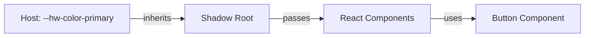

# Shadow DOM CSS 격리

위젯의 Shadow DOM CSS 격리 메커니즘과 트러블슈팅 방법을 설명합니다.

> **핵심**: 위젯은 Shadow DOM과 Constructable Stylesheets를 사용하여 호스트 페이지와 완전한 CSS 격리를 달성합니다.

<Callout type="info">
**이점**: 호스트 페이지의 CSS가 위젯에 영향을 주지 않고, 위젯의 CSS가 호스트 페이지에 영향을 주지 않습니다.
</Callout>

## 1. Shadow DOM 개요

### 1.1 DOM 트리 격리

```mermaid
graph LR
    Host[Host Page DOM]
    Shadow[Shadow Root]
    Widget[Widget DOM]

    Host -->|attachesShadow| Shadow
    Shadow -->|contains| Widget

    style[Host Styles] -.|blocked| Widget
    style2[Widget Styles] -.|blocked| Host
```

**Shadow DOM의 특징**:
- **DOM 격리**: Shadow DOM 내부 요소는 `querySelector()`로 찾을 수 없음
- **스타일 격리**: 호스트 CSS가 Shadow DOM 내부로 침투 불가
- **이벤트 경계**: `composed: true`로만 이벤트가 경계를 넘음

### 1.2 `<huni-widget>` Custom Element 구조

```html
<!-- Host Page -->
<huni-widget shopby-token="xxx">
  #shadow-root (open)
    ├── <style> (Constructable Stylesheet)
    ├── <div id="huni-widget-root">
    │   ├── ConfiguratorWizard
    │   ├── StepIndicator
    │   ├── OptionCard
    │   └── ...
</huni-widget>
```

### 1.3 Lifecycle Callbacks

```typescript
class HuniWidgetElement extends HTMLElement {
  connectedCallback() {
    // Custom Element가 DOM에 추가될 때 호출
    this.shadow = this.attachShadow({ mode: 'open' });
    this.injectStyles();
    this.mountReact();
  }

  disconnectedCallback() {
    // DOM에서 제거될 때 호출
    this.unmountReact();
  }

  attributeChangedCallback(name, oldValue, newValue) {
    // 속성이 변경될 때 호출
    // theme, shopby-token 등 감지
  }
}
```

## 2. CSS @layer 격리 전략

### 2.1 @layer 개요

```css
/* widget-core/src/index.css */
@layer hw-widget {
  /* 위젯 전용 Tailwind */
  @tailwind base;
  @tailwind components;
  @tailwind utilities;
}

/* 호스트 페이지 - 영향 없음 */
@layer host {
  @tailwind base;  /* 위젯에 영향 없음 */
}
```

### 2.2 Layer 우선순위

```
Host Styles (호스트 페이지)
  ↓ (blocked by Shadow DOM boundary)
Shadow Root Boundary
  ↓
@layer hw-widget (위젯 내부)
  ├── @tailwind base
  ├── @tailwind components
  └── @tailwind utilities
  ↓
Widget Components (React)
```

### 2.3 Tailwind 통합

| 구성 | 위젯 내부 | 호스트 페이지 |
|------|-----------|---------------|
| `@layer` 이름 | `hw-widget` | `host` 또는 없음 |
| 클래스 접두사 | 없음 | 사이트마다 다름 |
| `preflight` | 위젯만 적용 | 호스트만 적용 |

<Callout type="warning">
**삭제된 접두사**: `hw-` 접두사는 Shopby Aurora Skin이 Tailwind를 사용하지 않으므로 제거되었습니다. @layer 격리로 충분합니다.
</Callout>

## 3. Constructable Stylesheets

### 3.1 CSS 주입 방법

```typescript
// iife-entry.tsx
class HuniWidgetElement extends HTMLElement {
  private stylesheet: CSSStyleSheet | null = null;

  private async injectStyles(): Promise<void> {
    // 빈 스타일시트 생성
    this.stylesheet = new CSSStyleSheet();

    // 빌드 시 인젝션된 CSS 로드
    const css = typeof __huni_widget_css__ !== 'undefined'
      ? __huni_widget_css__
      : '';

    // 스타일시트에 CSS 추가
    await this.stylesheet.replace(css);

    // Shadow Root에 채택
    this.shadow.adoptedStyleSheets = [this.stylesheet];
  }
}
```

### 3.2 장점

- **메모리 효율**: 여러 Shadow Root가 하나의 스타일시트 공유
- **동적 업데이트**: 스타일시트 교체로 전체 스타일 변경
- **캡슐화**: CSS 스코프가 Shadow Root로 제한

## 4. 스타일 충돌 트러블슈팅

### 4.1 증상별 원인 및 해결책

| 증상 | 원인 | 해결책 |
|------|------|--------|
| 위젯이 호스트 CSS에 영향 | 스타일 릭 (leak) | Shadow DOM 경계 확인 |
| 호스트 CSS가 위젯 내부 침투 | 스타일 침투 (penetration) | `::slotted()` 확인 |
| 글로벌 폰트 적용 안됨 | 폰트 상속 실패 | CSS 변수로 폰트 설정 |
| z-index 충돌 | 모달/드롭다운 깨짐 | stacking context 확인 |
| 포커스 관리 실패 | 탭 키 순환 깨짐 | `delegatesFocus: true` |
| `!important` 우선순위 | 특정도 문제 | CSS 변수 오버라이드 |
| 서드파티 CSS 라이브러리 | 전역 스타일 | 스타일시트 격리 |

### 4.2 Case 1: 위젯이 호스트 CSS에 영향

**증상**: 위젯이 로드된 후 호스트 페이지 스타일이 깨짐

**원인**: Shadow DOM이 아닌 전역에 스타일 주입

**해결책**:
```javascript
// 잘못된 방법
document.head.appendChild(styleTag); // 전역 주입

// 올바른 방법
shadowRoot.adoptedStyleSheets = [stylesheet]; // Shadow DOM 내
```

### 4.3 Case 2: 호스트 CSS가 위젯 내부 침투

**증상**: 호스트 페이지 버튼 스타일이 위젯 버튼에 적용됨

**원인**: `::slotted()` 사용 또는 상속된 프로퍼티

**해결책**:
```css
/* 위젯 내부: 상속된 프로퍼티 재설정 */
:host {
  all: initial;
  font-family: var(--hw-font-family);
}
```

### 4.4 Case 3: 글로벌 폰트 적용 안됨

**증상**: 호스트 페이지 폰트가 위젯 내부에 적용되지 않음

**원인**: Shadow DOM은 일부 프로퍼티만 상속

**해결책**:
```css
/* 호스트 페이지 */
huni-widget {
  --hw-font-family: 'Pretendard', sans-serif;
}

/* 위젯이 CSS 변수 사용 */
:host {
  font-family: var(--hw-font-family);
}
```

### 4.5 Case 4: z-index 충돌

**증상**: 위젯 모달이 호스트 페이지 뒤로 숨거나 반대로

**원인**: Shadow DOM은 별도 stacking context 생성

**해결책**:
```javascript
// 위젯 내부: 최소 z-index 사용
const MODAL_Z_INDEX = 1000;
const DROPDOWN_Z_INDEX = 500;

// 호스트 페이지: 위젯보다 높은 z-index 피하기
.header { z-index: 999; } /* 위험 */
.header { z-index: 2000; } /* 안전 */
```

### 4.6 Case 5: 포커스 관리

**증상**: 탭 키가 위젯 내부에서 순환하지 않음

**해결책**:
```javascript
// delegatesFocus 옵션 사용
this.attachShadow({
  mode: 'open',
  delegatesFocus: true  // 포커스 위임
});
```

### 4.7 Case 6: !important 우선순위

**증상**: CSS 변수 오버라이드가 작동하지 않음

**원인**: 특정도(specificty) 문제

**해결책**:
```css
/* 낮은 특정도 */
:host {
  --hw-color-primary: blue;
}

/* 높은 특정도 */
huni-widget[theme="custom"] {
  --hw-color-primary: red !important;
}
```

### 4.8 Case 7: 서드파티 CSS 라이브러리

**증상**: Bootstrap/Tailwind가 위젯에 영향

**해결책**:
```html
<!-- 위젯 로드 전에 서드파티 CSS 로드 -->
<link href="bootstrap.css" rel="stylesheet" />
<huni-widget></huni-widget>
<script src="widget.js"></script>
```

## 5. 격리 아키텍처 다이어그램

```mermaid
graph TB
    subgraph "Host Page"
        HostCSS[Host CSS]
        HostDOM[Host DOM]
    end

    subgraph "Shadow DOM Boundary"
        direction TB
        ShadowRoot[Shadow Root]
        Constructed[Constructable Stylesheet]
        ReactRoot[React Root]

        Constructed -->|contains| WidgetCSS[Widget CSS]
        ReactRoot -->|renders| WidgetDOM[Widget DOM]
    end

    HostCSS -.|blocked by Shadow DOM| WidgetDOM
    WidgetCSS -.|blocked by Shadow DOM| HostDOM

    Events[CustomEvent]
    Events -->|composed: true passes| ShadowRoot
```

## 6. CSS Variables 상속 경로



**상속 규칙**:
- CSS 변수는 Shadow DOM 경계를 넘어 상속됨
- Custom Properties만 상속 가능
- `@property` 규칙으로 타입 지정 가능

## 관련 문서

- [스타일 커스터마이징](./styling) - CSS Variables 사용법
- [이벤트 & 통신](./events) - 이벤트 경계 넘기
- [위젯 임베드 가이드](./embedding) - 초기화 설정
