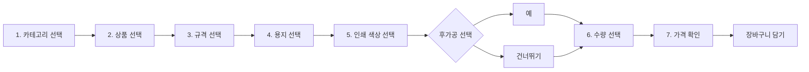
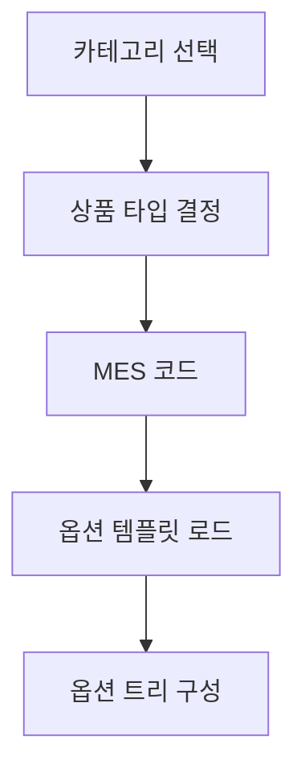
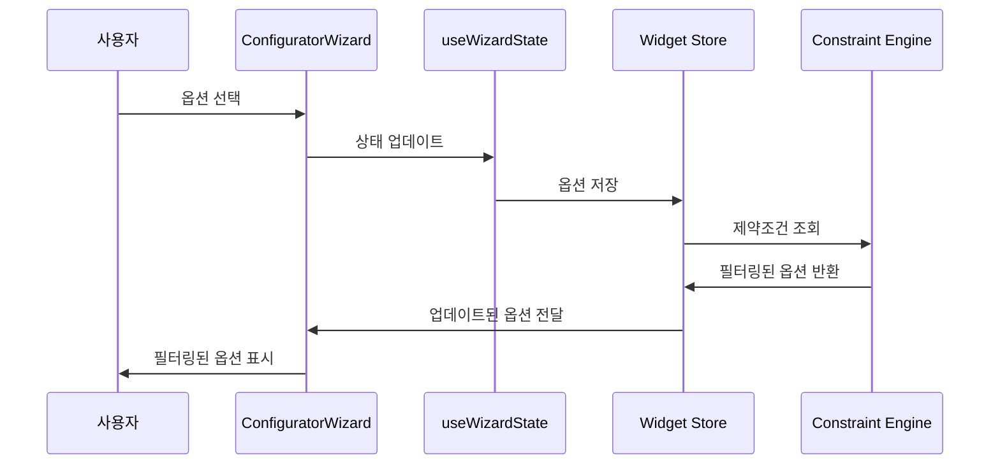
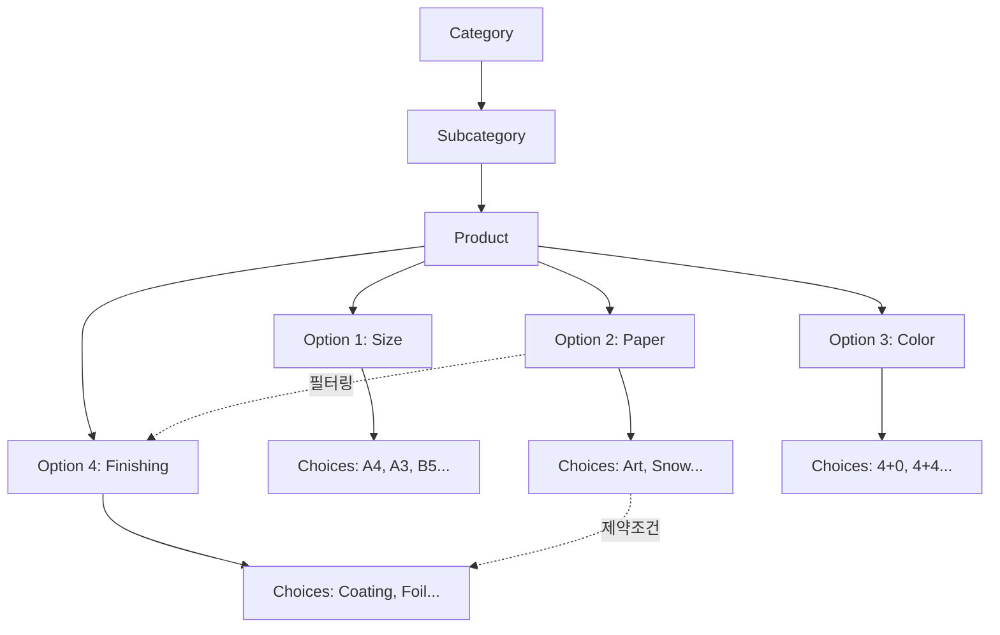

# 옵션 선택 워크플로우

위젯의 7단계 옵션 선택 마법사(ConfiguratorWizard) 동작을 설명합니다.

> **핵심**: 인쇄 도메인 지식이 복잡하게 얽혀 있는 옵션 의존성을 자동으로 처리합니다.

<Callout type="info">
**인쇄 도메인의 복잡성**: 용지, 규격, 인쇄 방식, 후가공 옵션은 서로 긴밀하게 연결되어 있습니다. 예: "광택지"를 선택하면 "박(foil)" 후가공이 비활성화됩니다.
</Callout>

## 1. 워크플로우 개요



## 2. 단계별 상세

### 2.1 단계 1: 카테고리 선택

**사용자 화면**: 12개 카테고리 중 하나를 선택

**뒤에서 일어나는 일**:
- `CategoryTabs` 컴포넌트가 카테고리 목록 렌더링
- 선택된 카테고리에 속한 상품 목록 로드
- 다음 단계(상품 선택) 활성화

**카테고리 예시**:
- 엽서 (Postcard)
- 스티커 (Sticker)
- 포스터 (Poster)
- 전단지 (Flyer)
- 명함 (Business Card)
- ... 총 12개 카테고리

### 2.2 단계 2: 상품 선택

**사용자 화면**: 선택된 카테고리 내 상품 목록 표시

**뒤에서 일어나는 일**:
- `ProductSection` 컴포넌트가 상품 목록 렌더링
- MES 코드 (`001-0001` 형식)로 상품 식별
- 선택된 상품의 옵션 템플릿 로드



### 2.3 단계 3: 규격 선택

**사용자 화면**: A4, A3, B5, A5 등 규격 선택

**뒤에서 일어나는 일**:
- 규격 선택에 따라 사용 가능한 용지 옵션 필터링
- 가격 계산에 규격 반영
- 커스텀 규격 입력 (일부 상품)

### 2.4 단계 4: 용지 선택

**사용자 화면**: 아트지, 모조지, 스노우지 등 용지 선택

**뒤에서 일어나는 일**:
- 용지 타입에 따라 후가공 옵션 필터링 (예: 광택지 → 박 비활성화)
- 인쇄 방식 옵션 필터링
- 가격 계산 (용지 가격)

<Callout type="warning">
**제약조건 예시**: "광택 아트지"를 선택하면 "박(foil)" 후가공이 비활성화됩니다. 이는 인쇄 도메인의 기술적 제약입니다.
</Callout>

### 2.5 단계 5: 인쇄 색상 선택

**사용자 화면**: 4+0, 4+4, 1+0 등 인쇄 방식 선택

**뒤에서 일어나는 일**:
- 선택한 용지에 맞는 인쇄 방식만 표시
- 앞면/뒷면 인쇄 여부 결정
- 가격 계산 (인쇄 비용)

### 2.6 단계 6: 후가공 선택 (Post-Processing)

**사용자 화면**: 코팅, 박, 엠보, UV 등 후가공 선택

**뒤에서 일어나는 일**:
- `PostProcessingType` 컴포넌트가 후가공 옵션 그룹 렌더링
- 용지에 따라 활성화/비활성화 (제약조건)
- 후가공 순서 지정 (일부 상품)
- 가격 계산 (후가공 비용)

**후가공 타입**:
| 타입 | 설명 | 용지 제약 |
|------|------|-----------|
| 코팅 (Coating) | 필름 코팅 | 모든 용지 |
| 박 (Foil) | 금박/은박 | 비광택지만 |
| 엠보 (Emboss) | 입체 효과 | 두꺼운 용지만 |
| UV | UV 코팅 | 특정 용지만 |

### 2.7 단계 7: 수량 선택 및 가격 확인

**사용자 화면**: 수량 선택, 단가/총액 표시

**뒤에서 일어나는 일**:
- `QuantitySelector`가 수량 계단 옵션 렌더링
- `PriceDisplay`가 실시간 가격 계산
- 가격 = 용지비 + 인쇄비 + 후가공비 + 제본비
- 수량 할인 적용

## 3. 옵션 의존성 해석

### 3.1 의존성 해석 흐름



### 3.2 제약조건 패턴 (Constraints)

| 패턴 | 설명 | 예시 |
|------|------|------|
| P1 | 호박 그룹 의존성 | 박 타입 → 색상/크기/위치 |
| P2 | 표지-코팅 링크 | 표지 용지 → 코팅 옵션 |
| P3 | 커스텀 사이즈 입력 | 비표준 규격 → 가로/세로 입력 활성화 |
| P4 | 가변 인쇄 상호 배제 | 텍스트 vs 이미지 선택 상호 배제 |
| P5 | 제본-페이지 범위 | 제본 타입 → 페이지 수 범위 제한 |

## 4. 옵션 트리 구조



## 5. 프로그래매틱 옵션 설정

```javascript
// JavaScript로 옵션 미리 선택
const widget = document.querySelector('huni-widget');

// 위젯 초기화 완료 대기
widget.addEventListener('huni:widget-ready', () => {
  // 옵션 설정 이벤트 디스패치
  widget.dispatchEvent(new CustomEvent('huni:set-options', {
    detail: {
      size: 'A4',
      paper: '아트지',
      color: '4+4',
      quantity: 500
    }
  }));
});
```

## 6. 위젯 상태 관리

위젯은 **Zustand** store를 사용하여 상태를 관리합니다.

```typescript
interface WidgetState {
  // 선택된 옵션
  selectedOptions: Record<string, string | string[]>;

  // 현재 단계
  currentStep: string;

  // 완료된 단계
  completedSteps: Set<string>;

  // 가격 정보
  price: {
    base: number;
    total: number;
    breakdown: PriceBreakdown;
  };

  // 액션
  setOption: (key: string, value: string | string[]) => void;
  goToStep: (stepId: string) => void;
  reset: () => void;
}
```

## 관련 문서

- [이벤트 & 통신](./events) - 옵션 변경 이벤트 (`huni:option-changed`)
- [관리자 가이드](../admin-guide/constraints) - 제약조건 설정 방법
- [스타일 커스터마이징](./styling) - 단계 표시器 커스터마이징
